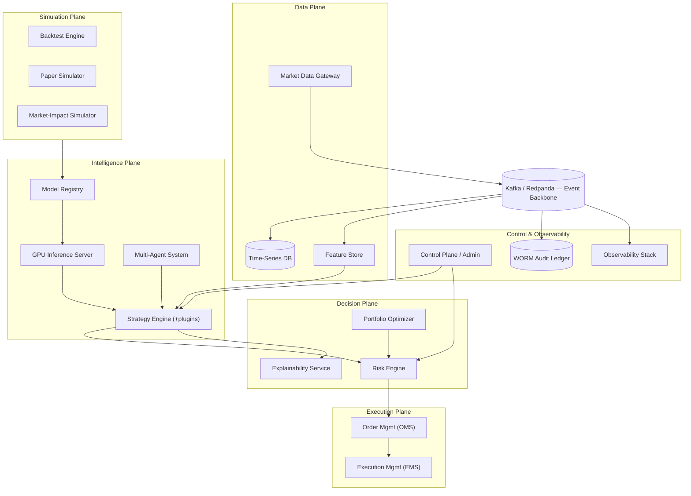
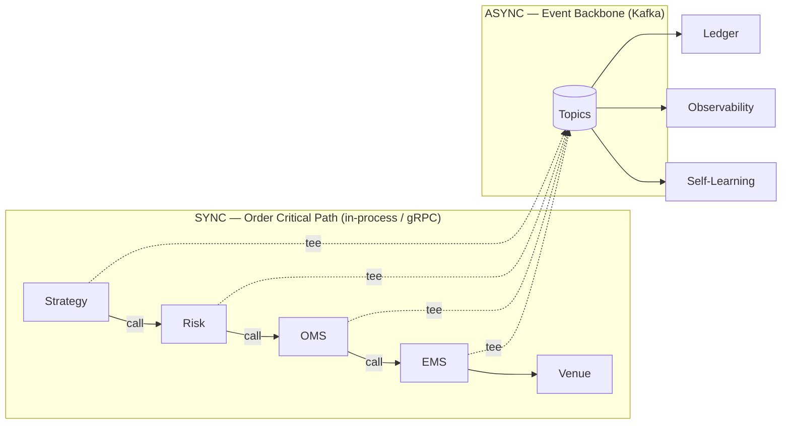
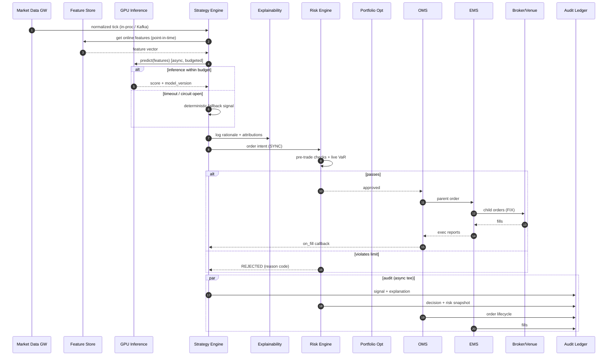
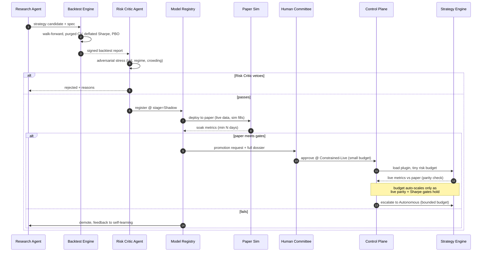
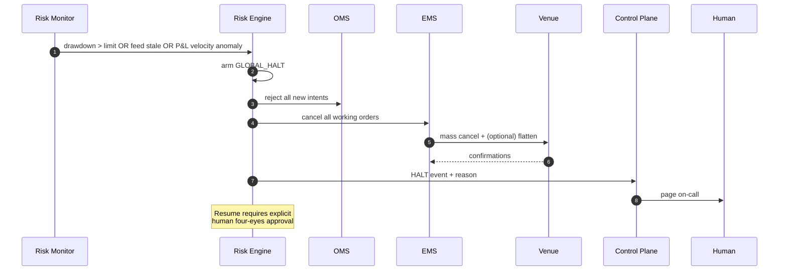
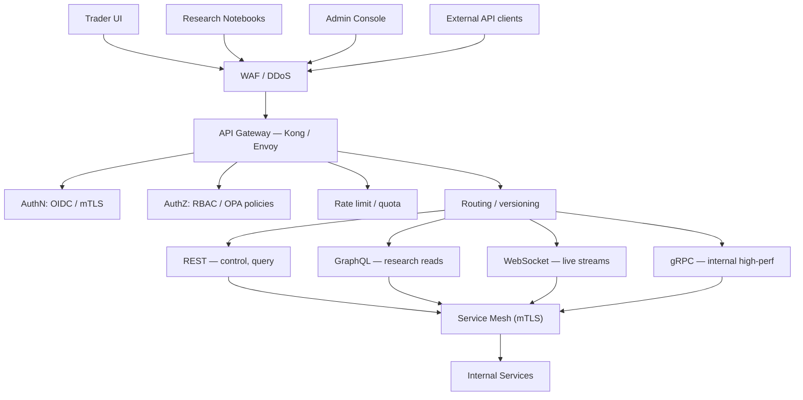
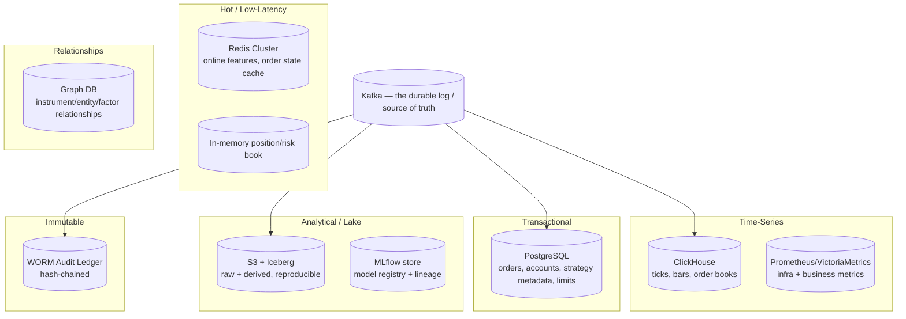
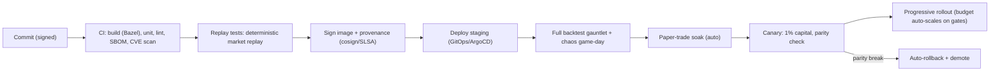

# AI Quant Research Platform — Production Engineering Blueprint

> A complete architecture for a research platform that earns its way, rung by rung, to autonomous stock trading. Designed for the endgame from day one; trust is spent only as fast as it is earned.

---

## 0. Design Philosophy (read this first)

Five load-bearing ideas govern every decision below:

1. **The event log is the source of truth.** Every database is a rebuildable materialized view of the Kafka log. This gives us replay, audit, and recovery for free.
2. **One codebase for backtest, paper, and live.** Only the data source and the fill simulator change. This eliminates the deadliest class of quant bug: "it worked in backtest."
3. **Fail-closed on the money path, fail-open on the alpha path.** Losing alpha is a bad Tuesday; a runaway order is an existential event.
4. **The AI proposes; the risk kernel disposes.** Hard, human-owned ceilings no agent can raise. Autonomy is granted in rungs, each gated by measured trust.
5. **Everything is explainable and audited.** No decision reaches capital without a rationale written to a tamper-evident ledger — for regulators, for post-mortems, and for the self-learning loop that reads its own history.

---

## 1. System at a Glance

The platform is organized into **planes**, each a bounded context with its own scaling and failure profile:

- **Data Plane** — ingest, normalize, store, and serve market data and features.
- **Intelligence Plane** — models, inference, strategies, and the multi-agent research system.
- **Decision Plane** — risk, portfolio optimization, and explainability.
- **Execution Plane** — order and execution management, venue connectivity.
- **Simulation Plane** — backtest, paper, and the shared fill/impact simulator (the Validation Gauntlet's engine).
- **Control & Observability Plane** — human control surface, metrics/logs/traces, and the immutable audit ledger.



---

## 2. Every Service — What It Is and Why It Exists

### 2.1 Data Plane

#### `market-data-gateway`
- **What:** Terminates venue/vendor feeds (FIX, ITCH, WebSocket, REST), normalizes to a canonical instrument/tick schema, timestamps at ingest (hardware clock), dedupes, sequences, and publishes to Kafka partitioned by symbol.
- **Why separate:** It is the single, hardened boundary between the messy outside world and our clean internal schema. Isolating it means feed-vendor quirks never leak into strategy code, and it can scale/shard independently of everything downstream.

#### `time-series-database` (ClickHouse)
- **What:** Durable columnar store of ticks, bars, order-book snapshots, and derived series, materialized from the Kafka log.
- **Why:** Research, backtest replay, and drift detection all need years of high-resolution history with fast vectorized scans. Columnar compression makes "keep everything forever" affordable.

#### `feature-store`
- **What:** Two coordinated paths — an **online** low-latency path (Redis) for live serving and an **offline** point-in-time-correct path (batch) for training and backtest. Shared feature definitions guarantee train/serve parity.
- **Why:** Point-in-time correctness is the difference between real and fantasy research. Centralizing feature logic eliminates training/serving skew (the second-deadliest quant bug) and lets features be reused, versioned, and governed.

### 2.2 Intelligence Plane

#### `model-registry` (MLflow-backed)
- **What:** Versioned, signed store of every model with lineage (data → features → code → metrics), promotion stages (`Shadow → Constrained → Autonomous`), and the signed backtest dossier attached.
- **Why separate:** Governance. It is the single gate through which a model must pass to touch capital, and the single place regulators/post-mortems look to answer "what exactly was running, and why was it trusted?"

#### `inference-server` (Triton, GPU)
- **What:** Serves models with dynamic batching, multi-framework support, MIG partitioning, and a strict latency budget. Refuses unsigned artifacts.
- **Why:** Decouples model execution from strategy logic, lets GPU capacity scale on queue depth independently, and enforces the signing boundary at load time.

#### `strategy-engine` (+ plugin SDK)
- **What:** Hosts strategies as sandboxed plugins implementing a fixed lifecycle (`on_data`, `generate_signal`, `on_fill`). Reads features, calls inference (with a deterministic fallback), emits order intents through the synchronous risk path.
- **Why:** The **plugin architecture** is the whole point — new alpha is added without touching the core, each strategy isolated so one can't harm another, and every strategy runs identical code across backtest/paper/live.

#### `agents/` — the AI Multi-Agent System
- **`research-agent`** — proposes strategy candidates and features from data and prior results.
- **`risk-critic-agent`** — adversarially stresses every candidate (tail, regime, crowding) and can veto.
- **`execution-agent`** — reasons about routing/timing within EMS constraints.
- **`narrator-agent`** — produces human-readable rationales (the XAI voice).
- **`orchestrator`** — coordinates the agents and enforces guardrails; agents can only *propose*, never *arm* capital.
- **Why:** Separation of powers. A proposing agent and a critiquing agent with opposed incentives catch each other's failures; the orchestrator ensures no agent can escalate its own authority.

### 2.3 Decision Plane

#### `risk-engine` (with a hard **kernel**)
- **What:** In-memory position/exposure book giving sub-microsecond pre-trade checks; live VaR/stress; and a **kernel** of hard, human-owned ceilings (max notional, order rate, drawdown) that no AI can raise.
- **Why separate & sacred:** It is the last line between intent and capital. It must be fast, always-on, fail-closed, and formally reviewed. The kernel/models split isolates the un-overridable safety limits from the evolving risk analytics.

#### `portfolio-optimizer`
- **What:** Turns raw signals + risk constraints into target positions (mean-variance / risk-parity / convex allocation), accounting for costs, capacity, and crowding.
- **Why:** A signal is not a position. Sizing and cross-strategy netting are a distinct optimization problem that must respect firm-wide risk, not per-strategy greed.

#### `explainability-service` (XAI)
- **What:** Captures attributions (feature importances, counterfactuals, model version, decision path) for every signal and renders them for humans and the ledger.
- **Why:** In autonomy, an unexplainable trade is a blocked trade. Explainability is a regulatory requirement, a debugging tool, and training data for the self-learning loop.

### 2.4 Execution Plane

#### `oms` (Order Management System)
- **What:** The transactional core of order lifecycle — parent orders, state machine, idempotency, reconciliation against the broker. Strongly consistent (Postgres-backed).
- **Why separate:** Money-adjacent state demands ACID guarantees and a single authoritative lifecycle owner, distinct from the routing concerns of the EMS.

#### `ems` (Execution Management System)
- **What:** Smart order routing, child-order slicing (VWAP/TWAP/POV), venue FIX adapters, cancel-on-disconnect. Consumes the shared impact model.
- **Why separate:** Execution tactics evolve fast and are venue-specific; isolating them keeps the OMS's transactional core stable while routing logic iterates. It also arms broker-side dead-man switches at session start.

### 2.5 Simulation Plane — the Validation Gauntlet's engine

#### `backtest-engine`
- **What:** Deterministic historical replay driving the **same** Strategy Engine + Risk Engine + a simulated EMS. Point-in-time-correct feature serving (offline path), realistic fills.
- **Why separate but code-shared:** The core insight — **backtest, paper, and live share the identical strategy/risk/OMS code.** Only the data source and the execution simulator differ. This kills the "worked in backtest" class of bug. The backtest engine is the *harness*, not a reimplementation.
- **Anti-overfitting built in:** Walk-forward analysis, combinatorial purged cross-validation, deflated Sharpe ratio, probability of backtest overfitting (PBO), and transaction-cost stress. A strategy's backtest report is a first-class, signed artifact in the registry.
- **Scale:** Embarrassingly parallel across parameter sets / time slices on a batch cluster (Ray/K8s Jobs).

#### `paper-trading-simulator`
- **What:** Consumes **live** market data but routes orders to a simulated matching engine instead of a real broker. Realistic latency and queue-position modeling.
- **Why:** The rung between backtest and real capital. Same code, live data, fake money. Catches issues backtests can't (real-time data quirks, latency, operational bugs).

#### `market-impact / matching-simulator`
- **What:** Models fills: fee schedules, latency, partial fills, slippage, and **market impact** (our order moves the price). Shared by backtest and paper.
- **Why separate:** Fill realism is the difference between a believable and a fantasy backtest. Centralizing it means backtest and paper use the *same* impact model, so results are comparable.

### 2.6 Control & Observability Plane

#### `control-plane` / `admin-service`
- **What:** Human command surface: promote/demote strategies, adjust limits (four-eyes), trigger kill switches, view live risk, approve autonomy escalations. RBAC-gated. Every action is a signed audit event.
- **Why separate:** Humans must have a clean, always-available control surface even when trading is chaotic. It's the cockpit.

#### `observability-stack` (Prometheus, Grafana, Loki, Tempo, OpenTelemetry)
- **What:** Metrics, logs, distributed traces across every service. Business dashboards (P&L, exposure, slippage) *and* infra (latency, queue depth, GPU util). Alerting via Alertmanager → PagerDuty.
- **Why:** You cannot run capital on systems you can't see. Traces let us reconstruct a single decision's full path (data → feature → inference → signal → risk → fill) in one view.

#### `audit-ledger` (append-only; WORM storage + hash chaining)
- **What:** Immutable, tamper-evident record of every decision, explanation, order, fill, limit change, and human action. Hash-chained (each record commits to the previous) for tamper evidence; optionally externally anchored.
- **Why separate & inviolable:** Regulatory requirement and the foundation of trust. Post-mortems, compliance, and the self-learning loop all read from it. It is **write-once**; no service, including admins, can mutate history.

---

## 3. Communication Between Services

**Two planes of communication, deliberately separated:**

### 3.1 Asynchronous — Event Backbone (Kafka / Redpanda)
The nervous system. Used for facts and fan-out.

| Topic | Producer(s) | Consumer(s) | Semantics |
|---|---|---|---|
| `market.ticks.{shard}` | Market Data GW | TSDB, Feature Store, Strategy Engine | At-least-once, keyed by symbol, partitioned for ordering per symbol |
| `signals.raw` | Strategy Engine | Risk, Optimizer, XAI | Ordered per strategy |
| `orders.intent` | OMS | Risk (in-line), Ledger | Exactly-once (transactional) |
| `orders.exec` | EMS | OMS, Ledger, Self-Learning | Exactly-once |
| `risk.events` | Risk Engine | Control Plane, Strategy Engine, Obs | At-least-once |
| `audit.ledger` | All | Audit Ledger | Exactly-once, immutable |
| `features.updates` | Feature Store | Inference, Strategy | Compacted |

**Why event-driven:** Decoupling (producers don't know consumers), replayability (Kafka is the durable log — services rebuild state by replaying), back-pressure handling, and horizontal fan-out to millions of events/sec via partitioning. **The event log is the source of truth**; databases are materialized views of it.

**Ordering guarantee:** Per-symbol ordering via partition keying. Cross-symbol ordering is *not* assumed anywhere (would be a scalability killer).

### 3.2 Synchronous — the Order Critical Path
For the sacred path (signal → risk → order), async pub/sub adds latency and non-determinism we won't tolerate. Here we use **in-process calls** (co-located modules in one binary) for latency-critical strategies, or **gRPC** for the slower tier. The flow is:

`Strategy.generate_signal()` → `RiskEngine.check()` (in-process, sub-microsecond) → `OMS.submit()` → `EMS.route()` → FIX to venue.

The event bus receives *copies* (async tees) of each step for the ledger, observability, and slower consumers — but the decision itself doesn't wait on the bus.

### 3.3 Request/Response — Control & Query
- **North-south:** Clients → API Gateway → services via REST/GraphQL (control plane) and gRPC (internal).
- **Streaming to UIs:** WebSocket fanout for live dashboards (positions, P&L, risk).
- **Service mesh (Istio/Linkerd):** mTLS, retries, timeouts, circuit breaking between services.



---

## 4. Sequence Diagrams

### 4.1 Live Trade — Signal to Fill (the happy path)



### 4.2 Strategy Promotion — Backtest to Autonomous (the gauntlet)



### 4.3 Kill-Switch / Circuit Breaker



---

## 5. API Gateway Design



**Design decisions:**
- **Single ingress, many protocols.** REST for control/CRUD, GraphQL for flexible research reads (avoids over-fetching across TSDB/registry/ledger), WebSocket for live push, gRPC for internal service-to-service.
- **Auth:** OIDC (Okta/Auth0) for humans, mTLS + short-lived SPIFFE identities for services. **The gateway never touches the order critical path** — trading is internal-only; the gateway is for control, research, and monitoring.
- **AuthZ via OPA:** Policy-as-code. "Only risk-officers can change limits," "only committee role can approve autonomy," enforced centrally and audited.
- **Rate limiting & quotas** per client/role. Idempotency keys required on all mutating endpoints.
- **Versioning:** `/v1/`, `/v2/` with deprecation windows; internal gRPC uses protobuf backward-compat rules.
- **API surface examples (control plane):**
  - `POST /v1/strategies/{id}/promote` (RBAC: committee, four-eyes)
  - `POST /v1/risk/limits` (RBAC: risk-officer, four-eyes)
  - `POST /v1/kill-switch/global` (RBAC: risk-officer/trader, single-action)
  - `GET /v1/portfolio/risk` (streamed via WS)
  - `GET /v1/audit/decisions/{orderId}` (full explainability trace)

---

## 6. Database Architecture

**Polyglot persistence — right store for each job. There is no single DB.**



| Store | Purpose | Why this one |
|---|---|---|
| **Kafka/Redpanda** | Event log = **source of truth** | Everything else is a materialized view; enables replay & event sourcing |
| **ClickHouse** | Tick/bar time-series | Columnar, massive compression, vectorized scans over years |
| **PostgreSQL** | Orders, accounts, limits, strategy metadata | ACID for money-adjacent transactional state |
| **Redis Cluster** | Online feature serving, hot caches | Sub-ms reads on the near-critical path |
| **S3 + Iceberg** | Data lake, reproducible research | Cheap, immutable, time-travel snapshots |
| **MLflow backend** | Model registry + lineage | Governance, promotion stages, artifact signing |
| **VictoriaMetrics/Prometheus** | Metrics | Purpose-built TSDB for ops |
| **WORM ledger** (S3 Object Lock + hash chain) | Audit | Regulatory tamper-evidence |
| **Graph DB (Neo4j)** | Instrument/factor/entity relationships | Correlation clusters, supply-chain links, crowding analysis |

**Consistency model:** The transactional order state (Postgres/OMS) is strongly consistent. Everything analytical is eventually consistent, rebuilt from Kafka. Position book is held in-memory by the risk engine (authoritative for pre-trade) and continuously reconciled against Postgres + broker.

**Data lifecycle:** Hot (NVMe, days) → warm (ClickHouse, months) → cold (S3/Iceberg, forever). Automated tiering.

---

## 7. Failure Recovery — Detailed

The philosophy: **fail-closed on the money path, fail-open on the alpha path.** Losing alpha is a bad day; an uncontrolled order is an existential event.

| Failure | Detection | Recovery | Trading impact |
|---|---|---|---|
| Market data feed down | Heartbeat gap, seq gap | Dual-feed arbitration; if both dead → Risk defensive mode | No new risk; manage existing |
| GPU inference down/slow | Latency SLO breach, circuit breaker | Deterministic fallback signal | Alpha degraded, path unaffected |
| Strategy plugin crash/hang | Callback timeout, sandbox OOM | Kill + isolate; flatten its positions per manifest | One strategy only |
| Risk engine down | Health check, heartbeat | Active-active failover; OMS rejects all new orders until healthy | Fail-closed: no new orders |
| OMS crash | Health check | Event-sourced replay + broker reconciliation before resume | Pause new orders during rebuild |
| EMS/venue disconnect | FIX session drop | Cancel-on-disconnect (broker dead-man switch) + reroute | Orders safe, rerouted |
| Kafka broker loss | ISR shrink | Replication factor ≥3, min ISR 2; producers block on money topics | Durable, no data loss |
| Region outage | Multi-AZ/region health | Active-passive DR region; replay from replicated log | Failover, minutes RTO |
| Model drift / decay | PSI/KL, live-vs-expected | Auto-demote to shadow, self-learning retrains candidate | Strategy sidelined |
| Reconciliation break (our book ≠ broker) | Continuous recon | **Halt affected strategy**, alert, manual reconcile | Fail-closed on discrepancy |
| Explanation generation fails | XAI error | Autonomous: block trade. Supervised: allow-with-flag | Fail-closed in autonomy |

**Cross-cutting mechanisms:**
- **Event sourcing everywhere:** No stateful service holds truth it can't rebuild by replaying Kafka. Recovery = replay to last offset + reconcile external state.
- **Idempotency:** Every order carries a client-generated idempotent ID; retries never duplicate.
- **Reconciliation loops:** Continuous 3-way recon (our OMS ↔ Postgres ↔ broker). Any mismatch halts the affected scope, never guesses.
- **Chaos engineering:** Scheduled game-days killing services, injecting latency, and dropping feeds in staging *and* controlled prod windows. A recovery path that isn't tested doesn't exist.
- **Dead-man switches:** Broker-side cancel-on-disconnect armed at every session; internal watchdog flattens if the platform stops heartbeating.

---

## 8. Scaling

**Scale target: millions of market events/sec, thousands of strategies, sub-millisecond risk checks.**

| Dimension | Strategy |
|---|---|
| **Market data ingest** | Shard by symbol range across gateway instances; kernel-bypass NIC (Solarflare/DPDK); per-partition Kafka ordering. Linear horizontal scale — add shards, not bigger boxes. |
| **Feature computation** | Stateless stream processors (Flink/Faust) autoscaled by partition lag. Online store (Redis) sharded by feature key. |
| **GPU inference** | Triton Inference Server with dynamic batching; HPA on GPU utilization + queue depth; model-parallel for large models; MIG partitioning to pack small models. KEDA scales on Kafka lag, not CPU. |
| **Strategy engine** | Each strategy is an independently schedulable unit; hot strategies get dedicated co-located (NUMA-pinned) nodes, cold ones bin-pack. Sharded by strategy → symbol universe. |
| **Risk engine** | Sharded by portfolio/account for pre-trade; a global aggregator maintains firm-wide VaR asynchronously. In-memory book → sub-µs checks. Active-active with deterministic sequencing per account. |
| **Kafka backbone** | Partition count sized for peak fan-out; tiered storage offloads cold segments to S3 so retention ≠ disk cost. |
| **State stores** | ClickHouse scales by sharding + replication; Postgres by read-replicas + partitioning (Citus if needed); Redis Cluster by hash slots. |
| **Control plane / APIs** | Stateless, HPA on RPS/latency. Never on the trading hot path, so it scales independently. |

**Scaling philosophy:** The hot path (tick → signal → risk → order) scales by **sharding the universe**, not by adding queue hops — every added hop is latency and a failure mode. The cold path (research, backtest, analytics) scales elastically on spot/batch infrastructure because it's latency-tolerant and interruptible.

**Multi-tenancy of compute:** Research/backtest workloads run on spot instances with checkpointing; trading workloads run on reserved, isolated, tainted nodes that research jobs can never be scheduled onto (K8s taints/tolerations + separate node pools). Alpha research must never contend with live trading for a core.

---

## 9. Security

Security here is not a feature — it's the license to manage capital. Threat model spans market manipulation, insider misuse, credential theft, model exfiltration, and supply-chain compromise.

### 9.1 Identity & Access
- **Humans:** OIDC SSO (Okta), phishing-resistant MFA (WebAuthn/FIDO2), no shared accounts.
- **Services:** SPIFFE/SPIRE workload identities, short-lived (minutes) x509 certs, mutual TLS everywhere via the service mesh. No static service passwords.
- **AuthZ:** OPA policy-as-code, least privilege by role (`trader`, `risk-officer`, `researcher`, `committee`, `sre`). **Four-eyes** enforced on limit changes, promotions, and autonomy escalation — no single human can arm live capital.
- **Secrets:** HashiCorp Vault / cloud KMS, dynamic short-lived DB and broker credentials, automatic rotation. Broker API keys never touch application memory longer than needed; signed at an HSM boundary where the venue supports it.

### 9.2 Network
- **Segmentation:** Three isolated security zones — **Trading** (venue connectivity, OMS/EMS, risk), **Research** (data lake, backtest, notebooks), **Control** (APIs, admin). Default-deny between zones; explicit, audited crossings only.
- **Egress control:** Trading zone can talk *only* to whitelisted venue endpoints. No general internet. Data exfil paths are closed.
- **DDoS/WAF** at the edge; the trading zone has no public ingress at all.

### 9.3 Data & Model Protection
- **Encryption:** TLS 1.3 in transit, AES-256 at rest on every store, field-level encryption for PII/account data.
- **Model security:** The registry signs every model artifact (Sigstore/cosign); the inference server refuses unsigned models. Models are IP — access-controlled and watermarked; egress-monitored to detect exfiltration.
- **Data governance:** Vendor market-data license boundaries enforced technically (a strategy can't use data it isn't licensed for); MNPI/insider-data segregation with hard walls.

### 9.4 Supply Chain & Runtime
- **Build:** Signed commits, SLSA-provenance builds, SBOM per image, CVE scanning (Trivy/Grype) gating deploys, base-image pinning by digest.
- **Runtime:** Read-only containers, non-root, seccomp/AppArmor, distroless images, admission control (Kyverno/OPA Gatekeeper) rejecting non-compliant workloads. **Strategy plugins run sandboxed** (gVisor/Firecracker microVMs) with CPU/mem/syscall/network quotas — a hostile or buggy plugin cannot touch the venue, other strategies, or the network.
- **Audit:** Every privileged action, every data access, every model load flows into the WORM ledger. Tamper-evident, externally anchored.

### 9.5 Trading-Specific Controls
- **Pre-trade compliance:** Restricted lists, wash-trade prevention, self-match prevention, position/spoofing surveillance built into the risk path — *before* an order leaves.
- **Autonomy guardrails:** Hard-coded, un-overridable-by-AI ceilings (max notional, max order rate, max drawdown) enforced in the risk engine's kernel. The AI proposes; the risk kernel disposes. No agent can raise its own limits — only the human committee via four-eyes through the control plane.

---

## 10. Folder Structure (Monorepo)

A monorepo with strict module boundaries — one place to reason about the whole system, enforced ownership via CODEOWNERS, hermetic builds via Bazel.

```
quant-platform/
├── WORKSPACE.bazel                 # hermetic, reproducible builds
├── CODEOWNERS                      # per-service ownership boundaries
├── docs/
│   ├── architecture/               # this blueprint, ADRs, diagrams
│   ├── runbooks/                   # incident + recovery procedures
│   └── compliance/                 # regulatory mappings, model risk docs
│
├── platform/                       # cross-cutting libraries (shared, versioned)
│   ├── event-schemas/              # Avro/Protobuf topic contracts (source of truth)
│   ├── common-types/               # money, instrument, time (point-in-time correct)
│   ├── observability/              # tracing, metrics, logging wrappers
│   ├── security/                   # auth, mTLS, OPA client, vault client
│   └── testing/                    # replay harness, market simulators
│
├── services/
│   ├── market-data-gateway/
│   ├── feature-store/
│   │   ├── online/                 # Redis serving path
│   │   └── offline/                # point-in-time batch path
│   ├── inference-server/           # Triton config, model runners
│   ├── strategy-engine/
│   │   └── plugins/                # SDK + registered strategy plugins
│   ├── risk-engine/
│   │   ├── kernel/                 # hard limits — highest scrutiny, formal review
│   │   └── models/                 # VaR, stress, exposure
│   ├── portfolio-optimizer/
│   ├── oms/                        # order management (transactional core)
│   ├── ems/                        # execution, FIX adapters, smart routing
│   ├── backtest-engine/
│   ├── paper-trading-simulator/
│   ├── market-impact-simulator/    # shared fill model
│   ├── control-plane/
│   ├── api-gateway/
│   ├── model-registry/
│   ├── audit-ledger/
│   └── agents/                     # AI multi-agent system
│       ├── research-agent/
│       ├── risk-critic-agent/
│       ├── execution-agent/
│       ├── narrator-agent/         # explainability / XAI
│       └── orchestrator/           # agent coordination + guardrails
│
├── ml/
│   ├── pipelines/                  # training DAGs (Kubeflow/Flyte)
│   ├── features/                   # feature definitions (registered)
│   ├── models/                     # model code, versioned
│   └── evaluation/                 # backtest scoring, drift, PBO/DSR
│
├── deploy/
│   ├── docker/                     # per-service Dockerfiles (distroless)
│   ├── helm/                       # charts per service
│   ├── k8s/
│   │   ├── base/                   # kustomize base
│   │   └── overlays/{dev,staging,prod}/
│   ├── terraform/                  # cloud infra as code (VPCs, node pools, KMS)
│   └── policy/                     # OPA/Kyverno admission policies
│
├── ci/
│   ├── pipelines/                  # build, test, scan, sign, promote
│   └── chaos/                      # game-day scenarios
│
└── environments/                   # env config, secrets refs (never secrets themselves)
```

**Boundary rules:** `services/*` may depend on `platform/*` but never on each other's internals — only through `event-schemas` (async) or published gRPC contracts (sync). The `risk-engine/kernel` and `oms` are **money-path critical**: highest review bar, mandatory formal-methods review on changes, and no AI-generated code merges without two human approvers.

---

## 11. CI/CD & Progressive Delivery



- **GitOps:** ArgoCD reconciles cluster state from git; the repo is the single source of deployment truth. Rollback = git revert.
- **Deterministic replay in CI:** Every change to the money path must reproduce a golden set of historical sessions bit-for-bit. Non-determinism fails the build.
- **Progressive delivery for *code* and *capital*:** New service versions canary by traffic; new strategies canary by **capital budget** that only auto-scales while live-vs-paper parity and Sharpe gates hold. Both auto-rollback.
- **Environment parity:** Same images dev→prod; only config differs. The backtest/paper/live code-sharing principle extends to infra.

---

## 12. Future Expansion Plan

Sequenced by trust earned, not features desired. Each phase gates the next.

**Phase 0 — Foundation (research-only, no capital).** Event backbone, TSDB, feature store, backtest gauntlet, model registry, observability. Deliverable: reproducible research + signed backtest reports. Trust earned: *our numbers are real.*

**Phase 1 — Paper at scale.** Live data, simulated fills, full risk engine in-line, XAI narration, human control plane. Deliverable: strategies soak on live data with zero capital. Trust earned: *the system behaves in real time.*

**Phase 2 — Supervised live (human-in-the-loop).** Constrained-live with tiny budgets; every order human-approvable; four-eyes on limits; full reconciliation. Trust earned: *live parity with paper.*

**Phase 3 — Bounded autonomy.** AI executes within hard risk-kernel ceilings; humans supervise by exception; auto-demotion on drift. Trust earned: *safe under autonomy for a defined regime.*

**Phase 4 — Self-learning loop closed.** Agents propose strategies → gauntlet → paper → committee → constrained-live, continuously. Humans set objectives and guardrails; the system generates and retires alpha. Trust earned: *the factory works.*

**Phase 5 — Asset-class & venue expansion.** Options/futures/FX/crypto, multi-prime, cross-asset risk, portfolio margin. Same spine, new adapters — the plugin/adapter architecture pays off.

**Phase 6 — Advanced frontier (optioned, not committed).** Alt-data fusion (satellite, NLP news, supply-chain graph), RL execution agents, cross-venue liquidity optimization, and — only if genuinely advantageous — latency-tier colocation. Each is a plugin behind the same governance.

**Non-negotiable invariant across all phases:** the risk kernel's hard ceilings and the WORM audit trail expand in scope but never weaken. Autonomy grows only as validated trust grows — capital-at-risk is always a function of demonstrated, measured reliability, never of ambition.

---

## 13. Closing Architectural Principles

The whole design reduces to a few load-bearing ideas:

1. **The event log is the source of truth.** Every database is a rebuildable view. This gives replay, audit, and recovery for free.
2. **One codebase for backtest, paper, and live.** Only data source and fill simulator change. This eliminates the deadliest class of quant bugs.
3. **Fail-closed on the money path, fail-open on the alpha path.** Losing alpha is Tuesday; a runaway order is the end.
4. **The AI proposes; the risk kernel disposes.** Hard, human-owned ceilings no agent can raise. Autonomy is earned in rungs, each gated by measured trust.
5. **Everything is explainable and audited.** No decision reaches capital without a rationale in the tamper-evident ledger — for regulators, for post-mortems, and for the self-learning loop that reads its own history to improve.

This is the blueprint. It scales from a single researcher's backtest to firm-wide autonomous execution without ever changing its spine — because the spine was designed for the endgame from day one, and trust is spent only as fast as it is earned.
