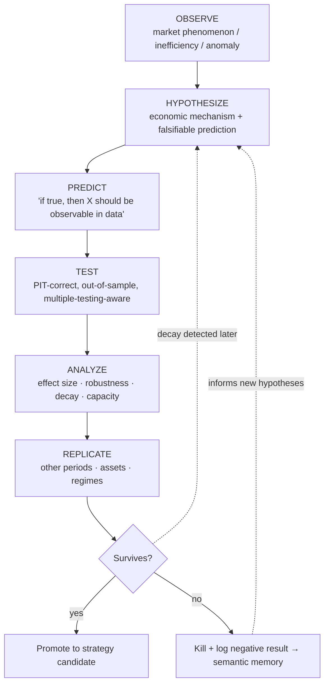
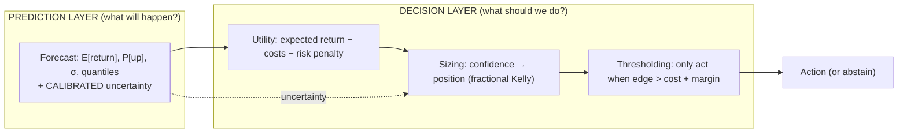
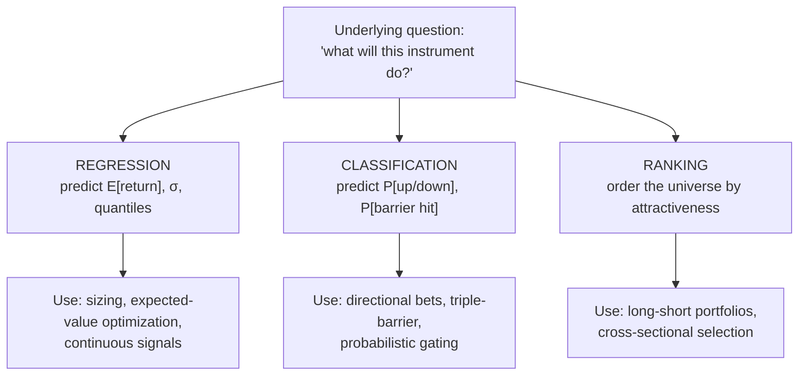
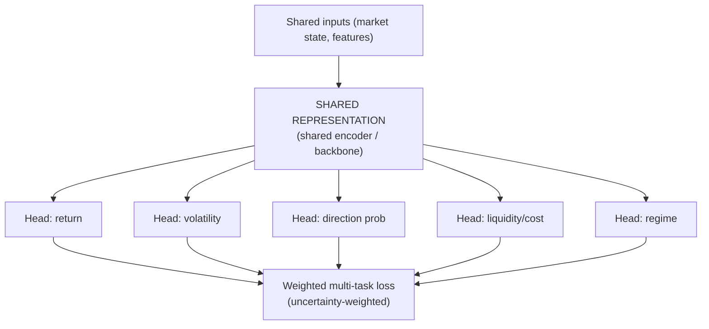
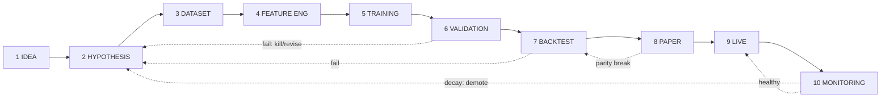
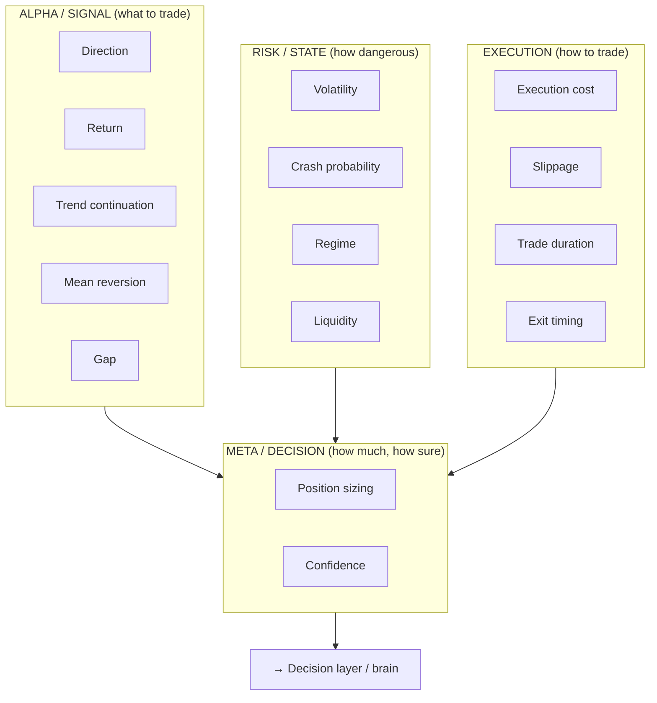
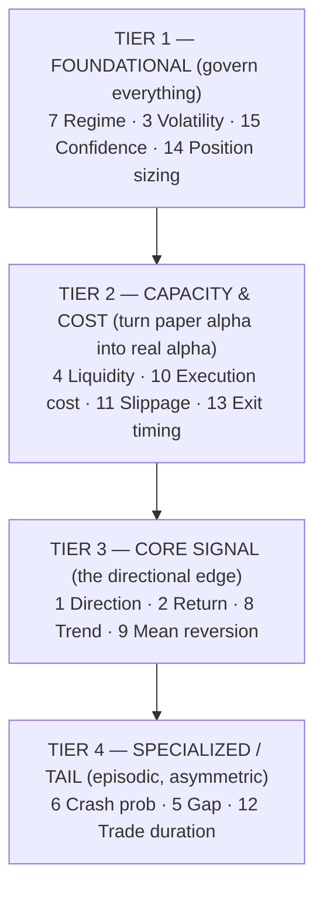
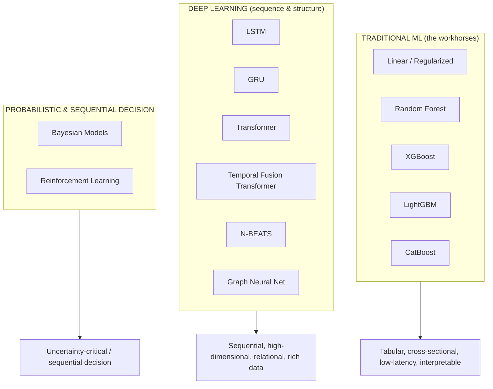
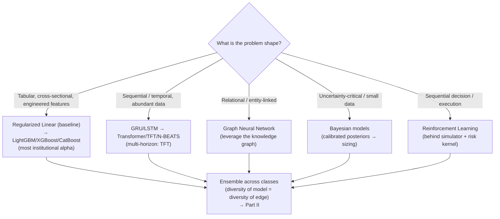

# ML & Quant Research Framework — Part I

> Companion to `AI_QUANT_PLATFORM_BLUEPRINT.md` (the body), `claude_aiBrain.md` (the mind), and `claude_ROI.md` (the data & knowledge foundation). This document designs the **research discipline** that produces the models those systems run — how a hedge fund *does science on markets*.
>
> **Scope of Part I: Sections 1–4** — research philosophy, the research pipeline, the catalogue of prediction problems, and the model zoo. Sections 5+ (validation science, feature research, ensembling, RL for execution, MLOps for alpha, etc.) follow separately.
>
> Governing stance: markets are the most **adversarial, non-stationary, low-signal** environment in applied ML. Techniques that win Kaggle competitions lose money here. Everything below is shaped by that reality.

---

## 1. Quant Research Philosophy

### 1.1 What is alpha?

**Alpha is risk-adjusted return that cannot be explained by known, priced risk factors.** Formally, it is the intercept `α` in `r_strategy = α + Σ βᵢ·Fᵢ + ε` after regressing a strategy's returns on every compensated factor (market, size, value, momentum, quality, carry, vol, …). If your "edge" is just leveraged exposure to a known factor, it isn't alpha — it's beta wearing a costume, and it's cheap.

Three sharper truths about alpha at an institutional fund:

1. **Alpha is information the market has not yet priced.** It exists only because of a *structural reason*: someone is forced to trade (index rebalancing, redemptions, margin calls), someone is slow (information diffuses unevenly), someone is constrained (mandates, regulation), or someone is behaviorally biased. **Every real alpha has a "who is on the other side and why do they lose?" story.** If you can't name the loser, you don't have alpha — you have an artifact.
2. **Alpha decays.** The moment an edge is discovered and traded, it begins to erode as capital crowds in and the structural cause is arbitraged away. Alpha is a depleting resource, not a fixed asset. This is why research is a *continuous* process, not a one-time discovery (and why the brain's Meta-Learner demotes decaying strategies).
3. **Alpha is capacity-constrained.** An edge worth 20% on \$10M may be worth 2% on \$1B and negative on \$10B, because your own trading moves the price (market impact). **Alpha × capacity is the real objective**, not alpha alone. A brilliant signal you can't size into is an academic paper, not a business.

> **Renaissance's real lesson:** the edge is not one giant signal — it is thousands of tiny, weak, *statistically robust*, *low-correlation* signals combined, each individually unimpressive (55% hit rate), collectively formidable. We optimize for a *portfolio of weak-but-diverse* predictors, not a single strong one. Diversity of edge is worth more than strength of any single edge.

### 1.2 Research philosophy

Six principles govern how we do research:

| Principle | Meaning | Why it matters in markets |
|---|---|---|
| **Hypothesis-first, not data-first** | Start with an economic *reason* an edge should exist, then test it. Never mine the data for patterns and rationalize after. | Data mining on 20 years of prices *guarantees* false discoveries; a prior hypothesis constrains the search space and gives a mechanism to believe |
| **Skepticism as default** | Assume every promising result is a bug, a leak, or overfitting until proven otherwise | The base rate of "backtest looks great" being real is very low; the null hypothesis is "no edge" |
| **Economic mechanism required** | Every signal must have a *why* — who loses, and why | A signal with no mechanism is a coincidence that will stop working the moment you fund it |
| **Robustness over optimality** | Prefer a signal that works okay everywhere to one that works brilliantly in one regime | Non-stationarity punishes the finely-tuned; the finely-tuned is finely-tuned *to the past* |
| **Out-of-sample is the only truth** | In-sample performance is worthless; only genuinely unseen data counts | You can always fit the past perfectly; the future is the exam |
| **Cost of being wrong dominates** | Design for the tail, not the mean; survival first | One catastrophic loss erases years of small gains — asymmetry rules |

**The multiple-testing tax (the discipline that separates funds that survive from funds that fool themselves):** if you test 1,000 signals at the 5% significance level, ~50 will look significant by pure chance. We treat *every* research decision as a test that consumes statistical budget, apply corrections (Bonferroni/BH-FDR, deflated Sharpe ratio, PBO), and **pre-register** the number of trials. A Sharpe of 2.0 found after 500 attempts is worth less than a Sharpe of 1.2 found on the first try. This is the single most-violated principle in quant research.

### 1.3 Scientific methodology

Quant research is empirical science under adversarial non-stationarity. The loop mirrors the scientific method, adapted for the fact that **the system you study reacts to being studied**:

**Non-negotiables of the method:**
- **Falsifiability:** a hypothesis must specify what evidence would *kill* it. "Momentum works" is not testable; "12-1 month momentum produces positive risk-adjusted returns in liquid equities, weakening in high-vol regimes" is.
- **The null is no-edge:** the burden of proof is on the signal to reject "there is nothing here," not on the skeptic.
- **Negative results are recorded** (per `claude_ROI.md` §20 and the brain's semantic memory) — a killed hypothesis is institutional knowledge that prevents re-testing dead ends and informs new priors.
- **Replication across independent axes** — a signal that survives only in one country, one decade, or one sector is fragile; real edges tend to generalize (with regime-dependent strength).

### 1.4 Prediction vs. decision-making

This distinction is where most quant ML goes wrong: **a prediction is not a decision.** A model that predicts return with high accuracy can still lose money, and a model with mediocre accuracy can print — because the mapping from *forecast* to *action* involves costs, uncertainty, sizing, and risk that the forecast alone ignores.

- **The prediction answers "what?"; the decision answers "what should we do, given costs, risk, and how sure we are?"** These are *separate models/layers*, deliberately. (This maps directly onto the brain's separation: analysts predict, the PM + sizing agent decide.)
- **Calibration > accuracy for decisions.** A model that says "60% up" and is right 60% of the time is *decision-useful* even at 60% accuracy, because you can size correctly. A model that's 70% accurate but *miscalibrated* (says 90% when it's 70%) will bankrupt you through oversizing. We optimize predictions for **calibration**, then let the decision layer exploit them.
- **Costs are first-class in the decision, not the prediction.** Predicting a +3bp move is useless if the round-trip cost is 5bp. The decision layer only acts when `predicted edge > expected cost + uncertainty margin`. Many "failed models" are fine predictors killed by a naive decision layer that ignored costs.
- **Abstention is a valid decision.** The right action is frequently *do nothing* — and that must be modeled explicitly, not as a degenerate "predict zero."

### 1.5 Multi-horizon prediction

Markets have structure at every timescale, and the *same instrument* is predictable by different mechanisms at different horizons. A single-horizon model is blind to this.

| Horizon | Dominant mechanism | Signal type | Decays into |
|---|---|---|---|
| **Microseconds–seconds** | Order-book dynamics, microstructure | Queue position, imbalance, latency | Execution alpha |
| **Minutes–hours** | Intraday flow, momentum/reversal, news diffusion | Short-term technical, event drift | Intraday strategies |
| **Days–weeks** | Post-event drift, short-term reversal, liquidity | Technical + event + flow | Swing strategies |
| **Weeks–months** | Momentum, earnings drift, analyst revisions | Cross-sectional factors | Medium-term factor |
| **Months–years** | Value, quality, macro cycle | Fundamental + macro | Long-horizon factor |

**Design principles for multi-horizon:**
- **Predict a *term structure* of forecasts, not a point.** For a given name, produce `{E[r_1min], E[r_1h], E[r_1d], E[r_5d], E[r_20d]}` with per-horizon confidence. This is richer, enables horizon-diversification, and reveals when short- and long-horizon signals *conflict* (itself information — a short-term reversal against a long-term trend).
- **Horizons demand different models & features** (microstructure models for seconds; factor models for months) — but they can share representation via multi-task learning (§1.7).
- **Horizon must match holding period and capacity.** A 1-minute edge on a large book is un-harvestable (impact swamps it); a 6-month edge is capacious but slow. Horizon selection is a *business* decision (capacity, turnover, cost) as much as a statistical one.
- **Confidence is horizon-dependent** and propagates to sizing — near-term forecasts are often more certain but smaller; long-term larger but noisier.

### 1.6 Regression vs. Classification vs. Ranking

The choice of *problem formulation* is more consequential than the choice of model. The same underlying question ("will this go up?") formulated three ways yields three different research programs.

| Formulation | Predicts | Strengths | Weaknesses | Best for |
|---|---|---|---|---|
| **Regression** | Continuous magnitude (return, vol, cost) | Rich signal; directly feeds EV & sizing; preserves magnitude | Hypersensitive to fat-tailed targets & outliers; hard to fit noisy returns; MSE rewards fitting noise | Sizing, volatility, cost/slippage, quantile forecasts |
| **Classification** | Probability of a discrete outcome | Robust to return-magnitude noise; naturally calibrated probabilities; triple-barrier realism | Discards magnitude (a 10% and 0.1% up are both "up"); threshold choice matters | Direction, barrier-hit, crash probability, meta-labeling |
| **Ranking (learning-to-rank)** | *Relative* order within the cross-section | **Regime-robust** (cares about relative, not absolute, level — cancels market beta); matches long-short construction; ignores un-forecastable market direction | No absolute magnitude/EV; needs a cross-section; harder to size standalone | Cross-sectional equity long-short, factor portfolios, security selection |

> **The institutional insight:** for cross-sectional equity strategies, **ranking is usually superior to regression** — because predicting *which stocks beat which* is far more tractable and regime-robust than predicting *absolute returns* (which are dominated by un-forecastable market moves). Renaissance-style stat-arb is fundamentally a ranking problem. Regression's magnitude matters most for *sizing* and for intrinsically-continuous targets (vol, cost). A mature framework uses **all three**, matched to the strategy.

### 1.7 Multi-task learning

Financial prediction tasks share deep structure — the same market state drives return, volatility, liquidity, and regime simultaneously. **Multi-task learning (MTL)** exploits this by learning a shared representation across related tasks, which is especially powerful in finance where labels are scarce and noisy (a single well-predicted task rarely has enough signal, but many tasks *together* regularize each other).

**Why MTL fits finance:**
- **Regularization through relatedness:** forcing one representation to serve return *and* volatility *and* regime prediction resists overfitting to any single noisy target — the auxiliary tasks act as a prior, curbing spurious fits.
- **Label efficiency:** return labels are extraordinarily noisy; auxiliary tasks with cleaner labels (realized volatility, which is far more predictable than return) inject learnable structure that improves the noisy task.
- **Coherent multi-output for the decision layer:** the decision/sizing layer *needs* return, vol, and confidence jointly — MTL produces them consistently from one model rather than three uncoordinated ones.
- **Natural fit for the multi-horizon term structure** (§1.5): each horizon is a task, sharing a backbone.

**MTL cautions:** tasks can *conflict* (negative transfer) — a task that hurts the primary objective must be down-weighted or dropped. Loss weighting matters (we prefer **uncertainty-based weighting** so the model learns which tasks to trust). And shared representations can propagate a bug across all heads — MTL raises both the ceiling and the blast radius.

---

## 2. The Complete Quant Research Pipeline

Every strategy travels the same disciplined path from idea to live capital to retirement. Each stage is a **gate** — a candidate that fails any gate is killed or sent back, and the capital/autonomy it's trusted with only grows as it clears later gates (mirroring the platform's promotion gauntlet and the brain's autonomy ladder).

### Stage 1 — Idea
- **What:** the origin of a candidate edge — from economic reasoning, market observation, academic literature, a prior signal's residual, the brain's research agent, or a discovered anomaly.
- **Discipline:** every idea starts with a **mechanism hypothesis in one sentence** ("who loses and why"). Ideas without a mechanism are logged but deprioritized. Ideas are cheap; the funnel is wide here and narrows hard.
- **Output:** a one-paragraph idea with a proposed economic rationale and expected horizon/asset class.

### Stage 2 — Hypothesis
- **What:** sharpen the idea into a **falsifiable, testable** statement: the predicted effect, its direction, its expected regime-dependence, and — critically — **what would disprove it.**
- **Discipline:** pre-register the hypothesis and the *number of variants* you intend to test (multiple-testing budget, §1.2). Define success metrics *before* looking at results.
- **Output:** a hypothesis spec: prediction target, universe, horizon, expected effect size, success/kill criteria, statistical budget.

### Stage 3 — Dataset
- **What:** assemble the **point-in-time-correct** training/research dataset (per `claude_ROI.md` §17–19) — PIT universe (no survivorship), as-of feature joins, PIT labels, purge/embargo.
- **Discipline:** define the PIT universe first; freeze the dataset to an immutable, versioned manifest so the experiment is reproducible. Run the automated **leakage audit** before anything else.
- **Output:** a registered, immutable dataset artifact + a leakage-clearance certificate.

### Stage 4 — Feature Engineering
- **What:** construct predictive features from the data/graph/embeddings via the single-definition feature pipeline (`claude_ROI.md` §11–12), so training features exactly match future serving features.
- **Discipline:** features must be PIT-correct (compile-time enforced), economically motivated (not brute-forced), and cross-sectionally normalized within the PIT universe. Feature *selection* consumes multiple-testing budget too.
- **Output:** a registered feature set (versioned), with parity guaranteed to the online store.

### Stage 5 — Training
- **What:** fit the model(s) from the zoo (§4) to the labeled dataset, with regularization appropriate to low signal-to-noise.
- **Discipline:** **temporal splits only** (never random shuffle); heavy regularization (markets punish complexity); hyperparameter search is itself part of the multiple-testing budget (nested CV so tuning doesn't leak into evaluation). Log the exact code SHA + data manifest + hyperparameters to the model registry.
- **Output:** a trained, registered, lineage-linked model version with its training metrics.

### Stage 6 — Validation
- **What:** rigorous out-of-sample assessment: walk-forward, combinatorial purged cross-validation, deflated Sharpe ratio, probability of backtest overfitting (PBO), stability across sub-periods/regimes.
- **Discipline:** this is the **primary overfitting gate.** Evaluate *calibration* (not just accuracy), decay, and robustness. Apply multiple-testing corrections against the pre-registered trial count. Most candidates die here — by design.
- **Output:** a validation dossier (signed); pass → backtest, fail → kill (log the negative result) or revise hypothesis.

### Stage 7 — Backtesting
- **What:** simulate the *full strategy* (signal → risk → sizing → execution) through history using the platform's shared backtest engine and realistic fill/impact model — the same code that will run live.
- **Discipline:** model costs, slippage, market impact, and capacity honestly (optimism here is self-deception). Stress across regimes and tail scenarios. Check that the strategy survives *net of costs at realistic size*, not gross at zero cost.
- **Output:** a signed backtest report (Sharpe, drawdown, capacity curve, cost sensitivity, regime breakdown) → registry.

### Stage 8 — Paper Trading
- **What:** deploy on **live data with simulated fills** (zero capital) — the platform's paper simulator. Catches what backtests can't: real-time data quirks, latency, operational bugs, live-vs-historical microstructure differences.
- **Discipline:** require a minimum soak period and a **live-vs-backtest parity check** — paper behavior must track backtest expectations. Divergence = a bug or a fragile signal.
- **Output:** paper-trading track record; parity certification.

### Stage 9 — Live
- **What:** graduated deployment of real capital — **constrained-live** (tiny, kernel-capped budget, human-supervised) escalating to bounded autonomy only as live-vs-paper parity and calibration hold (the brain's autonomy ladder §26).
- **Discipline:** canary by *capital budget*, not just traffic; budget auto-scales only while parity + Sharpe + calibration gates hold; automatic demotion on breach. Everything four-eyes-gated and audited.
- **Output:** a live strategy with a real, attributable P&L track record.

### Stage 10 — Monitoring
- **What:** continuous surveillance of the live strategy — realized vs. expected performance, signal decay, drift (feature & concept), calibration health, regime-conditioned behavior, and capacity utilization.
- **Discipline:** **alpha decays** (§1.1) — monitoring detects it and triggers demotion/retirement via the brain's Meta-Learner. Data-quality scores (`claude_ROI.md` §14) flow into confidence. A strategy that decays is demoted to shadow, its lessons written to memory, and the cycle feeds back to Stage 1–2.
- **Output:** live health telemetry; demote/retire/retrain decisions; lessons → semantic & mistake memory.

> **The pipeline is a ratchet, not a conveyor.** Trust (and capital) only increases as a candidate clears later gates, and it can be revoked instantly at any stage. The vast majority of ideas die before Stage 6 — and *that is the pipeline working correctly.* A pipeline that promotes most of its candidates is not rigorous; it is a capital-destruction machine.

---

## 3. Prediction Problems

A mature quant platform does not solve *one* prediction problem — it maintains a **portfolio of prediction problems**, each capturing a different facet of market behavior, each feeding the decision layer and the brain's agents. Below, every problem is defined with its **formulation, target, inputs, why it exists, and consumer**, then **ranked** by leverage.

### 3.1 The catalogue

| # | Problem | Formulation | Target | Key inputs | Why it exists / who consumes |
|---|---|---|---|---|---|
| 1 | **Direction** | Classification | P[up/down/flat] over horizon h | Technical, flow, factor, event features | The atomic signal; feeds directional bets & meta-labeling. Robust because it discards noisy magnitude |
| 2 | **Return** | Regression / quantile | E[return], full return distribution | Same + fundamentals | Magnitude for EV optimization & sizing; quantiles for risk. The richest but noisiest signal |
| 3 | **Volatility** | Regression | Realized σ over horizon | Returns, implied vol, regime, volume | *Far more predictable than return* (volatility clusters); drives sizing, risk, options, regime. A foundational, high-value target |
| 4 | **Liquidity** | Regression | Executable size, depth, resilience | Order-book, volume, spread | Determines *capacity* and whether an edge is harvestable; feeds sizing & execution. Turns paper alpha into real alpha |
| 5 | **Gap** | Classification / regression | P[overnight gap], gap magnitude | Overnight news, prior close, events, global markets | Overnight risk is un-hedgeable intraday; critical for holding-period & stop design |
| 6 | **Crash probability** | Classification (rare-event) | P[large adverse move / tail] | Vol term structure, credit, correlation, flow, macro | Tail protection & de-risking trigger; feeds the brain's emergency behavior. Asymmetric value — being right once pays for many false alarms |
| 7 | **Regime** | Classification / state model | P[regime ∈ {bull,bear,side,highvol,crisis}] | Vol, breadth, spreads, macro, correlation | The master context switch (`claude_aiBrain.md` §7); re-conditions *every* other model and the whole firm's behavior |
| 8 | **Trend continuation** | Classification | P[trend persists vs. reverses] | Momentum, strength, volume confirmation, regime | Distinguishes "ride it" from "fade it"; core to momentum strategies & stop placement |
| 9 | **Mean reversion** | Classification / regression | P[revert], reversion magnitude & speed | Deviation from fair value, overextension, microstructure | The counterpart to trend; core to stat-arb & range strategies. Trend vs. MR is regime-dependent — both needed |
| 10 | **Execution cost** | Regression | Expected implementation shortfall (bps) | Size, liquidity, urgency, spread, volatility | The decision layer's veto input — *predicted edge must exceed predicted cost*. Kills naive signals honestly |
| 11 | **Slippage** | Regression | Expected fill vs. decision price | Order size vs. depth, volatility, participation rate | Realized-cost component; feeds execution strategy & backtest realism. The gap between backtest fantasy and live reality |
| 12 | **Trade duration** | Regression / survival | Expected holding time to target/stop | Setup type, vol, horizon, barriers | Capital-turnover & capacity planning; feeds sizing (Kelly needs frequency) and opportunity-cost reasoning |
| 13 | **Exit timing** | Classification / RL | When to close (hold/exit signal) | Position state, P&L path, decay of thesis, regime | Exits determine realized P&L as much as entries; a well-timed exit is pure alpha. Often under-modeled |
| 14 | **Position sizing** | Regression / RL / optimization | Optimal fraction of capital | Confidence, vol, edge, correlation, portfolio state | Converts signal → action (`claude_aiBrain.md` §sizing); fractional-Kelly under uncertainty. **Sizing errors dominate signal errors in practice** |
| 15 | **Confidence** | Meta / calibration | Calibrated P[this prediction is correct] | The prediction + its features + model-agreement + historical calibration | The meta-signal that governs sizing & abstention; propagates through the brain (§confidence propagation). *Knowing when you don't know* |

### 3.2 Ranking the prediction tasks by leverage

Ranked by **marginal contribution to risk-adjusted, net-of-cost, capacity-aware P&L** — not by how interesting they are to model. This ranking is deliberately *un-intuitive to newcomers*, who over-index on return prediction.

| Rank | Task(s) | Why this rank |
|---|---|---|
| **1 (highest)** | **Regime, Volatility, Confidence, Position sizing** | These *govern* every other prediction. Correct regime + calibrated confidence + right size makes a mediocre signal profitable; wrong sizing makes a great signal a blowup. **Sizing and calibration errors are the dominant P&L drivers** — getting these right is worth more than any single alpha signal. Volatility is uniquely predictable and feeds all of them |
| **2** | **Liquidity, Execution cost, Slippage, Exit timing** | The difference between backtest and reality. A signal you can't execute cheaply at size is worthless; exits determine realized P&L. These convert theoretical edge into banked edge — where most funds silently lose their alpha |
| **3** | **Direction, Return, Trend, Mean reversion** | The "alpha" everyone obsesses over — genuinely necessary, but *lower leverage than Tiers 1–2* because a good signal poorly sized/executed loses money, while a modest signal well-managed makes it. Direction (robust) generally > Return (noisy) for most uses |
| **4** | **Crash probability, Gap, Trade duration** | Specialized and episodic, but *asymmetrically valuable* — crash prediction is rarely "right" yet one correct crisis call justifies its existence (feeds the brain's survival-first emergency behavior). Lower average leverage, critical tail leverage |

> **The counterintuitive institutional truth:** newcomers rank Return prediction #1 and Sizing/Execution last. **Professionals invert this.** The edge in *return prediction* is small and crowded; the edge in *disciplined sizing, regime-awareness, and cheap execution* is large and durable. Renaissance's moat is as much in Tiers 1–2 as in Tier 3. Design research effort accordingly.

---

## 4. The Model Zoo

No single model class wins in finance — each has a regime where it dominates and a regime where it's dangerous. A mature framework maintains a **zoo** and matches model to problem, then ensembles across them (ensembling detail is Part II). For each: **when to use, advantages, weaknesses, computational cost, financial use cases.**

### 4.1 Traditional ML

#### Linear & Regularized Models (OLS, Ridge, Lasso, Elastic-Net, logistic)
- **When to use:** the **default first model, always.** Baseline before anything complex; when interpretability and stability matter; low signal-to-noise cross-sectional factor models; production signals needing auditability.
- **Advantages:** interpretable (coefficients = factor exposures); extremely robust to overfitting (especially with L1/L2); fast to train and serve; stable across regimes; naturally regularizable; the coefficients *mean* something economically.
- **Weaknesses:** captures only linear relationships (misses interactions/nonlinearity); can underfit genuinely complex structure; sensitive to multicollinearity without regularization.
- **Computational cost:** **Minimal** — trains in milliseconds–seconds, serves in microseconds. Negligible.
- **Financial use cases:** factor models (Fama-French style), cross-sectional return ranking, risk models, linear signal combination, meta-labeling logistic layer, any signal where "why" must be explainable to a risk committee. **Never skip the linear baseline — if a deep model can't beat regularized linear out-of-sample, the deep model is overfitting.**

#### Random Forest
- **When to use:** nonlinear tabular problems where robustness > peak accuracy; feature-importance exploration; when you want low-variance predictions without careful tuning.
- **Advantages:** captures nonlinearity & interactions automatically; very robust to overfitting (bagging averages out variance); minimal tuning; handles mixed feature types; gives feature importance; parallelizable.
- **Weaknesses:** less accurate than boosting on most structured tasks; large memory footprint; weaker at extrapolation; can be dominated by gradient boosting in practice.
- **Computational cost:** **Low–moderate** — embarrassingly parallel training; moderate memory; fast inference.
- **Financial use cases:** nonlinear signal combination, feature screening, regime classification, a robust ensemble member, quick nonlinear baseline above linear.

#### XGBoost
- **When to use:** the **workhorse for structured/tabular financial prediction** — cross-sectional return/direction problems with engineered features. Often the single best model class for tabular alpha.
- **Advantages:** state-of-the-art accuracy on tabular data; handles nonlinearity, interactions, missing values; strong regularization controls; feature importance; battle-tested; handles the low signal-to-noise regime well with proper regularization.
- **Weaknesses:** **overfits easily if untuned** (dangerous in low-SNR markets — needs strong regularization + early stopping); many hyperparameters; not for raw sequential/unstructured data; less interpretable than linear.
- **Computational cost:** **Moderate** — slower to train than LightGBM; GPU-accelerable; fast inference. Hyperparameter search is the real cost.
- **Financial use cases:** cross-sectional stock ranking (learning-to-rank objective), direction classification, volatility/cost regression, signal ensembling, the backbone of many production tabular strategies.

#### LightGBM
- **When to use:** when you have **large datasets and need speed** — the practical default for big tabular quant problems; high-cardinality features; rapid research iteration.
- **Advantages:** *much faster* than XGBoost (leaf-wise growth, histogram binning) with comparable accuracy; low memory; native categorical handling; scales to huge datasets; fast iteration accelerates research throughput.
- **Weaknesses:** leaf-wise growth can overfit on small datasets (needs `num_leaves`/depth control); slightly less robust default behavior than XGBoost; same low-SNR overfitting caution.
- **Computational cost:** **Low–moderate** — fastest of the boosters to train; excellent memory efficiency; fast inference. Best speed/accuracy trade-off for research velocity.
- **Financial use cases:** large-universe cross-sectional models, high-frequency feature sets, rapid signal prototyping, production tabular alpha where retraining cadence matters, most places XGBoost is used but at greater scale.

#### CatBoost
- **When to use:** datasets with **many categorical features** (sector, venue, event-type, country); when you want strong out-of-the-box performance with minimal tuning and less overfitting.
- **Advantages:** best-in-class native categorical handling (ordered target encoding avoids leakage); strong defaults (less tuning); **ordered boosting reduces overfitting/prediction-shift** — valuable in low-SNR finance; robust.
- **Weaknesses:** slower training than LightGBM; smaller ecosystem; can be overkill when features are purely numeric.
- **Computational cost:** **Moderate** — slower to train than LightGBM, GPU-accelerable; fast inference.
- **Financial use cases:** models heavy on categorical context (event-driven with event types, cross-venue microstructure, sector/country-tagged cross-sectional models), robust ensemble member, situations where reducing overfitting is paramount.

> **Traditional-ML verdict:** for **tabular, cross-sectional** financial prediction — which is *most* of institutional quant alpha — **gradient-boosted trees (LightGBM/XGBoost/CatBoost) are usually the best models**, above a mandatory regularized-linear baseline. Deep learning earns its place on *sequential, high-dimensional, relational, or unstructured* data, not on engineered tabular features, where it typically overfits and underperforms boosting.

### 4.2 Deep Learning

#### LSTM (Long Short-Term Memory)
- **When to use:** sequential prediction where **temporal order and memory matter** — raw time-series, path-dependent patterns, when you have enough data to justify it.
- **Advantages:** captures long-range temporal dependencies & nonlinear sequential dynamics; handles variable-length sequences; learns features from raw series (less manual engineering).
- **Weaknesses:** **data-hungry & overfit-prone** (dangerous in low-SNR finance); slow sequential training (no parallelism across time); can be beaten by simpler models on noisy financial series; harder to interpret; vanishing-gradient on very long sequences.
- **Computational cost:** **Moderate–high** — GPU-recommended; sequential nature limits parallelism; slower than trees.
- **Financial use cases:** intraday/HF sequential patterns, volatility forecasting from return paths, order-flow sequence modeling, multi-horizon return sequences — *where sequential structure genuinely dominates and data is abundant.*

#### GRU (Gated Recurrent Unit)
- **When to use:** same problems as LSTM but with **less data or a need for faster training** — often the better *practical* choice on financial series.
- **Advantages:** simpler than LSTM (fewer gates/params) → faster training, less overfitting, comparable performance on many tasks; better fit for the smaller effective sample sizes common in finance.
- **Weaknesses:** slightly less expressive than LSTM on the most complex long-memory tasks; shares RNNs' sequential-training and overfitting cautions.
- **Computational cost:** **Moderate** — cheaper than LSTM (fewer parameters); still sequential.
- **Financial use cases:** the same as LSTM, and frequently *preferred* in practice because finance's limited, noisy data rewards the simpler, more regularized architecture. Good default RNN for financial sequences.

#### Transformer
- **When to use:** long sequences with **complex, long-range, multi-variate dependencies**; when you have substantial data; cross-asset/cross-time attention; foundation-model approaches to markets.
- **Advantages:** attention captures long-range dependencies without recurrence; **fully parallelizable training** (unlike RNNs); models cross-series interactions; scales with data; attention weights offer some interpretability; state-of-the-art on large sequence problems.
- **Weaknesses:** **very data-hungry** (severe overfitting risk on limited financial data — the central danger); computationally expensive (quadratic attention in sequence length); many design choices; can memorize noise spectacularly.
- **Computational cost:** **High** — GPU/multi-GPU; quadratic memory in sequence length; expensive to train and tune. The most expensive workhorse here.
- **Financial use cases:** cross-sectional + temporal joint modeling, multi-asset attention, news/text + market fusion (leveraging the embedding stack), long-horizon multivariate forecasting, market-state encoders feeding the brain's vector memory. Use with heavy regularization and skepticism.

#### Temporal Fusion Transformer (TFT)
- **When to use:** **multi-horizon forecasting with heterogeneous inputs** (static covariates + known-future inputs like calendars + observed time-varying inputs) *and* a need for interpretability. Arguably the best-designed DL architecture *for finance specifically*.
- **Advantages:** purpose-built for multi-horizon (§1.5); **interpretable** (variable-selection networks + attention show which inputs matter when); handles static + known-future + observed inputs natively; produces **quantile forecasts** (uncertainty, not just point) — ideal for the decision layer; respects the structure of financial forecasting problems.
- **Weaknesses:** complex to implement/tune; data-hungry; heavier than boosting; needs careful input categorization.
- **Computational cost:** **High** — more than a plain Transformer for equivalent sequence; GPU-required; substantial tuning.
- **Financial use cases:** multi-horizon return/volatility term-structure prediction, incorporating known-future events (earnings dates, econ calendar) as inputs, quantile risk forecasting, any forecast where *interpretability + uncertainty + multi-horizon* are all required — a strong fit for institutional needs.

#### N-BEATS
- **When to use:** **pure univariate time-series forecasting** where you want a strong, interpretable deep model without recurrence or heavy feature engineering.
- **Advantages:** strong accuracy on time-series benchmarks; **interpretable variant** decomposes into trend + seasonality basis; no recurrence (fast, parallel); pure deep-learning (no manual features); good for ensembles of forecasters.
- **Weaknesses:** primarily univariate (weaker at leveraging rich cross-sectional/exogenous features that drive most equity alpha); can overfit noisy financial series; less flexible than TFT for heterogeneous inputs.
- **Computational cost:** **Moderate** — lighter than Transformers; GPU-helpful; efficient inference.
- **Financial use cases:** volatility forecasting, macro/economic series forecasting, index-level and univariate series, decomposition of a series into trend/cycle components, a diversifying member in a forecast ensemble. Less central where cross-sectional features dominate.

#### Graph Neural Networks (GNN)
- **When to use:** when **relationships between instruments carry signal** — leveraging the Knowledge Graph (`claude_ROI.md` §7, §23): supply chains, common ownership, correlation clusters, sector linkages, contagion.
- **Advantages:** explicitly models inter-entity relationships that tabular/sequential models miss; captures *second-order* effects (a supplier's shock → the customer); naturally fuses the graph substrate into prediction; can uncover latent relational structure; propagates information along economically-meaningful edges.
- **Weaknesses:** requires a high-quality, PIT-correct graph (garbage graph → garbage predictions); complex to train; **temporal graphs are hard** (relationships change — must avoid graph lookahead); data-hungry; over-smoothing on deep graphs; still-maturing tooling.
- **Computational cost:** **High** — graph construction + specialized training; scales with graph size/density; GPU-required for large graphs.
- **Financial use cases:** supply-chain contagion signals, common-ownership/crowding risk, relationship-aware return prediction, sector/theme propagation, systemic-risk and correlation-cluster modeling — the model class that turns the platform's knowledge graph into alpha. A genuine differentiator where the graph is proprietary and good.

### 4.3 Probabilistic & Sequential-Decision Models

#### Bayesian Models (Bayesian regression, Gaussian Processes, Bayesian NNs, hierarchical models)
- **When to use:** when **uncertainty quantification is first-class** (which, per §1.4 and the brain's confidence discipline, is *always* for the decision layer); small-data regimes; when you want to encode priors (economic beliefs) explicitly; regime/hierarchical structure.
- **Advantages:** **principled, calibrated uncertainty** (posterior distributions, not point estimates) — directly feeds sizing & confidence propagation; naturally regularized via priors (excellent in low-data/low-SNR finance); encodes domain knowledge as priors; hierarchical models share strength across related entities (e.g., stocks within a sector); updates gracefully as data arrives (online learning).
- **Weaknesses:** computationally expensive (MCMC) or approximation-dependent (variational); GPs scale poorly (cubically) with data; requires statistical sophistication; prior choice is subjective and consequential.
- **Computational cost:** **Moderate–very high** — MCMC is expensive; GPs cubic in samples; variational/approximate methods cheaper. Inference cost varies enormously by method.
- **Financial use cases:** **confidence/uncertainty prediction (task #15)**, position sizing under parameter uncertainty (Bayesian Kelly), regime modeling (Bayesian state-space/HMM), small-sample factor estimation, hierarchical cross-sectional models, any decision where *knowing what you don't know* is the point. Philosophically the best-aligned class with the platform's calibration-first ethos.

#### Reinforcement Learning (RL)
- **When to use:** **sequential decision problems** where actions affect future state and reward is delayed/path-dependent — pre-eminently **execution** (order placement) and **dynamic portfolio/exit management**, not raw return prediction.
- **Advantages:** optimizes *sequential decisions* directly for a long-horizon objective (not just next-step prediction); handles action → market-state feedback (impact); learns policies that trade off immediate vs. future reward; ideal where the *decision*, not the *forecast*, is the hard part (execution, sizing, exit timing).
- **Weaknesses:** **notoriously sample-inefficient & unstable**; requires a high-fidelity market simulator (real-market RL is dangerous/expensive); reward design is treacherous (misspecified reward → pathological policy); severe overfitting-to-simulator risk; non-stationarity breaks learned policies; hard to interpret/validate — a serious concern for capital. **The highest-risk, highest-skill model class.**
- **Computational cost:** **Very high** — massive simulation + training compute; extensive tuning; the most expensive class to develop and validate responsibly.
- **Financial use cases:** **optimal execution** (the canonical, best-justified use — slicing/routing to minimize impact, feeding the execution agent), dynamic **exit timing** (task #13), **position sizing** as a sequential policy (task #14), market-making, dynamic hedging. Deploy behind the platform's full validation gauntlet and hard risk-kernel ceilings — RL *proposes* actions, the kernel still *disposes*.

### 4.4 Model selection summary

| Model class | Data shape | Interpretability | Overfit risk (finance) | Compute | Primary financial role |
|---|---|---|---|---|---|
| **Linear/Regularized** | Tabular | ★★★★★ | Low | Minimal | Baseline, factor models, explainable signals |
| **Random Forest** | Tabular | ★★★☆ | Low | Low–mod | Robust nonlinear baseline, feature screening |
| **XGBoost** | Tabular | ★★★ | Moderate | Moderate | Cross-sectional alpha workhorse |
| **LightGBM** | Tabular (large) | ★★★ | Moderate | Low–mod | Large-scale tabular alpha, fast iteration |
| **CatBoost** | Tabular (categorical) | ★★★ | Low–mod | Moderate | Categorical-heavy, robust ensembling |
| **LSTM/GRU** | Sequential | ★★ | High | Mod–high | Sequential/HF patterns, vol paths |
| **Transformer** | Sequential (large) | ★★ | Very high | High | Multivariate long-range, text+market fusion |
| **TFT** | Multi-horizon + hetero | ★★★★ | High | High | Multi-horizon + quantile + interpretable forecasting |
| **N-BEATS** | Univariate series | ★★★ | High | Moderate | Univariate/vol/macro forecasting, ensembles |
| **GNN** | Relational/graph | ★★ | High | High | Supply-chain/ownership/contagion alpha |
| **Bayesian** | Any (small-data) | ★★★★ | Low | Mod–very high | Uncertainty, sizing, confidence, hierarchical |
| **RL** | Sequential decision | ★ | Very high | Very high | Execution, exit timing, dynamic sizing |

> **The zoo doctrine:** no model wins alone. Traditional boosting dominates tabular alpha; deep learning earns sequential/relational/unstructured problems; Bayesian methods own uncertainty; RL owns sequential execution decisions. **The edge comes from combining diverse model classes** (whose errors are uncorrelated) — echoing §1.1's "portfolio of weak, diverse signals." A Transformer and a LightGBM disagreeing is *information*; their agreement is *conviction*. Ensembling strategy — how these combine into the single decision the brain acts on — is Part II.

---

## Part I complete — Sections 1–4 delivered.

**Covered:** (1) research philosophy — the nature and decay of alpha, hypothesis-first scientific method, prediction-vs-decision, multi-horizon, formulation choice, multi-task learning; (2) the ten-stage idea→monitoring research pipeline as a trust-ratchet of gates; (3) the fifteen prediction problems, each defined and *ranked by real P&L leverage* (with the counterintuitive Tier-1 = regime/vol/confidence/sizing insight); (4) the twelve-model zoo with when-to-use / advantages / weaknesses / compute / financial use cases and a selection framework.

**Companion documents:** `AI_QUANT_PLATFORM_BLUEPRINT.md` (body) · `claude_aiBrain.md` (mind) · `claude_ROI.md` (data foundation) · `claude_MLResearchFramework.md` (this — research discipline).

**Part II (to come):** validation & overfitting science (deflated Sharpe, PBO, CPCV) · feature research & selection · ensembling & signal combination · hyperparameter methodology · RL-for-execution deep dive · model risk & interpretability · research-to-production MLOps · capacity & decay management · the research-agent automation loop.
