# The Knowledge & Data Layer — Foundation of an Autonomous AI Investment Platform

> The AI brain (`claude_aiBrain.md`) and the distributed system (`AI_QUANT_PLATFORM_BLUEPRINT.md`) are already designed. This document designs the **substrate they stand on**: the data and knowledge layer. A hedge fund's edge is not its models — models are commodities. The edge is **proprietary, clean, point-in-time-correct data, wired together as knowledge.** Garbage in is not garbage out here; garbage in is *a blowup*.
>
> Design horizon: **10 years.** Every decision below optimizes for correctness first, reproducibility second, latency third, and cost fourth — in that strict order, because a fund that cannot reproduce its own research cannot trust its own capital.
>
> **Scope of this document: Sections 1–8** (data architecture → vector DB). Sections 9–30 follow separately.

---

## 0. Governing Principles of the Data Layer

Seven invariants that constrain everything below:

1. **Point-in-time correctness is sacred.** Every datum is stored with *two* timestamps — when the event happened (`event_time`) and when *we could have known it* (`knowledge_time` / arrival time). No query, backtest, or feature may ever use data before its `knowledge_time`. Lookahead bias is the silent killer of quant funds; we make it structurally impossible, not merely discouraged.
2. **The raw layer is immutable and eternal.** We never overwrite a vendor's raw delivery. Restatements, corrections, and revisions are *appended as new versions*, never destructive updates. History is a growing log, not a mutable table.
3. **Everything is versioned and reproducible.** Any dataset, feature, or training set can be reconstructed bit-for-bit as it existed on any past date. Research that can't be reproduced is research that can't be trusted with money.
4. **Bitemporal by default.** Because vendors revise, our world is two-dimensional in time: valid-time and transaction-time. We model this everywhere, not just where convenient.
5. **Lineage is mandatory.** Every derived value traces back through its transformations to its raw sources. When a trade loses money on bad data, we can find the exact bad byte in minutes.
6. **Quality is measured, gated, and alerted — not assumed.** Data flows through validation gates; failing data is quarantined, never silently consumed. A pipeline that ingests bad data without screaming is a liability.
7. **Storage follows access pattern, not fashion.** Hot tick data, cold research archives, graph relationships, and vector embeddings have utterly different access patterns. We use polyglot storage, matching each technology to its job.

---

## 1. Complete Data Architecture

### 1.1 The Medallion + Knowledge topology

The platform organizes data in **progressive refinement zones** (a medallion architecture) that culminate in two proprietary knowledge structures — the graph and the vector store — and two serving surfaces — the feature store (online/offline).

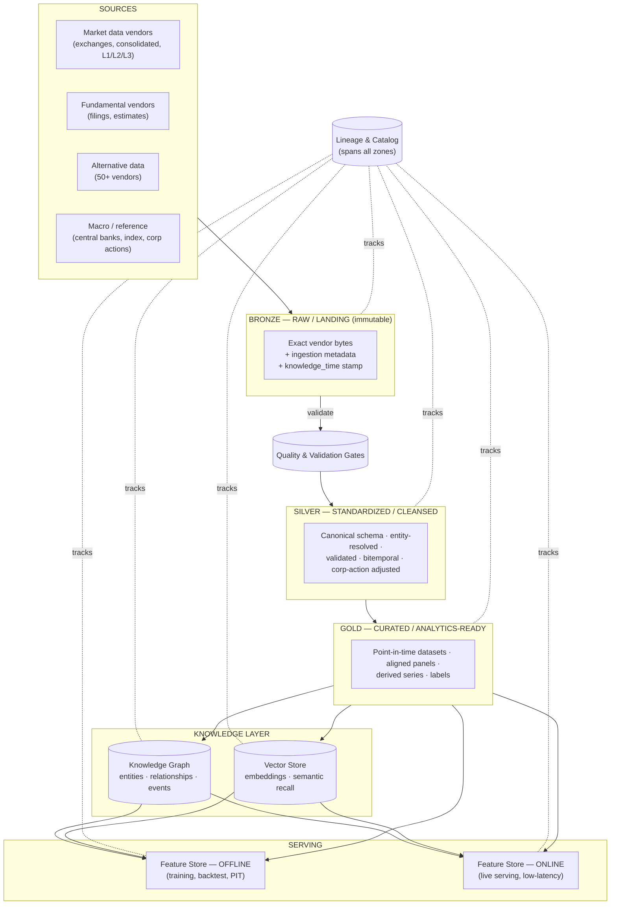

### 1.2 The zones explained

| Zone | Purpose | Mutability | Consumers |
|---|---|---|---|
| **Bronze / Raw** | Exact, immutable capture of every vendor delivery + arrival metadata. The legal and reproducibility ground truth. | Append-only, never edited | Reprocessing, audit, dispute resolution |
| **Silver / Standardized** | Canonical schemas, entity-resolved to master IDs, validated, corporate-action adjusted, bitemporal. | Append versions | Feature engineering, graph/vector builders |
| **Gold / Curated** | Point-in-time-correct analytical panels, aligned across sources, labels attached. | Versioned snapshots | Research, training-set generation, features |
| **Knowledge (Graph + Vector)** | The *relationships* and *semantics* the tabular zones can't express. | Bitemporal, versioned | AI agents, similarity recall, causal reasoning |
| **Serving (Feature Store)** | The train/serve-consistent surface the brain actually reads. | Online: fast-changing; Offline: PIT snapshots | Inference server, strategy engine, backtest |

### 1.3 Two-plane data movement

- **Batch / bulk plane** (the majority of history): vendor files → object-store landing → Spark/Flink batch refinement → curated tables (Iceberg/Delta). Runs on schedules and on-arrival triggers.
- **Streaming plane** (live market + real-time alt-data): feeds → Kafka → stream processors → online feature store + real-time graph/vector updates, *and* teed to the lake for the batch plane. This dual-write is what guarantees **online/offline parity** (§21, later doc) — the same computation defines a feature whether it arrives via stream or batch.

### 1.4 Physical layout (cloud-native, 10-year lens)

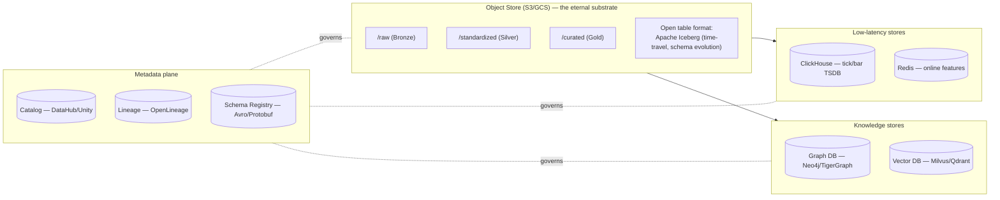

**Why open table formats (Iceberg) at the core:** ACID on the lake, snapshot isolation, time-travel (`AS OF` a past snapshot = free point-in-time reproducibility), safe schema evolution over a decade, and no vendor lock-in. This single choice underwrites principles #2, #3, and #4.

---

## 2. Every Dataset Required (the master data inventory)

A billions-under-management platform is fed by **five dataset families**. This is the master catalog; families 3–6 (market, fundamental, alt, macro) are decomposed in §3–§6.

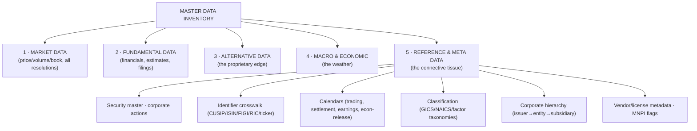

### 2.1 Reference & Meta Data — *the family everyone underestimates*

Reference data is boring, unglamorous, and **the single biggest source of silent, catastrophic error** in quant funds. It gets its own first-class treatment:

| Dataset | What it holds | Why it is load-bearing | Update cadence |
|---|---|---|---|
| **Security master** | Every instrument's canonical identity, lifecycle (listing/delisting), attributes | The spine every other dataset joins to; the source of the master entity ID | Daily + intraday for new listings |
| **Identifier crosswalk** | Mapping across CUSIP, ISIN, SEDOL, FIGI, RIC, Bloomberg, ticker, internal ID — *bitemporally* | Vendors speak different ID languages; tickers get **reused** (a delisted ticker reassigned to a new company) — a non-bitemporal crosswalk silently corrupts history | Daily |
| **Corporate actions** | Splits, dividends, spin-offs, M&A, symbol changes, rights | Wrong adjustment = fabricated returns; the difference between real and fantasy backtests | Continuous; pre-market critical |
| **Calendars** | Trading/settlement/holiday/earnings/econ-release schedules per venue | Aligns time across venues; defines "was the market open," "was this knowable yet" | Daily |
| **Classification** | GICS/NAICS sector, factor buckets, custom taxonomies — *bitemporal* (classifications get reclassified) | Sector-neutral strategies, peer groups, factor exposure | On change |
| **Corporate hierarchy** | Issuer ↔ legal entity ↔ subsidiary ↔ ultimate parent | Aggregating exposure, supply-chain, credit linkages; used heavily by the graph | On filing |
| **Vendor & license metadata** | Which vendor, which license terms, permitted uses, MNPI status | Enforces data-license boundaries *technically* (a strategy can't use data it isn't licensed for); segregates material non-public info | On contract |

> **Principle:** the security master + bitemporal identifier crosswalk is the **root of the entire data layer**. If this is wrong, everything downstream is confidently wrong. It is built and guarded first.

---

## 3. Market Data Hierarchy

Market data is organized as a **resolution pyramid** — from the finest (every message on the wire) to the coarsest (daily bars). Higher resolution = more signal, more cost, more storage, more noise. We capture the full pyramid because you cannot reconstruct fine resolution from coarse, but you can always aggregate down.

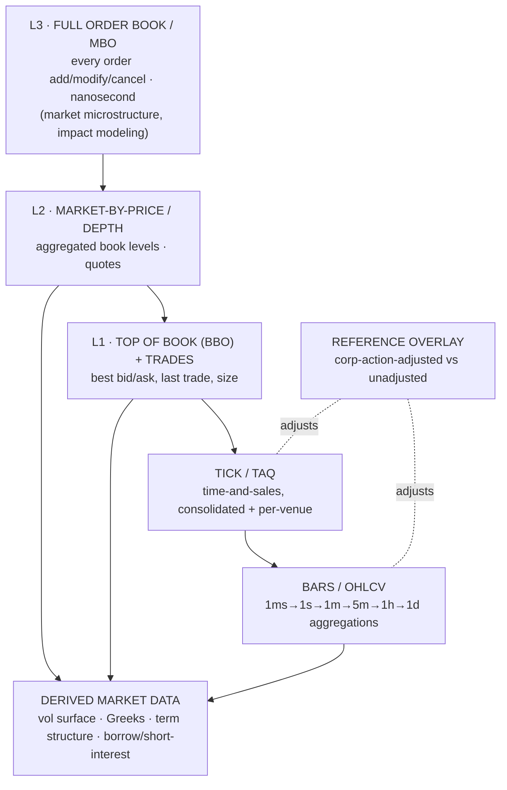

### 3.1 The layers

| Layer | Content | Primary use | Storage | Cadence |
|---|---|---|---|---|
| **L3 / MBO** | Every order-book message (add/modify/cancel/execute), per-venue, hardware-timestamped | Microstructure research, market-impact/fill models, execution alpha | Columnar (ClickHouse) + raw capture in object store | Real-time streaming; nanosecond stamps |
| **L2 / Depth** | Aggregated depth by price level, quote updates | Liquidity analysis, order-book imbalance features | ClickHouse | Real-time |
| **L1 / BBO + Trades** | Best bid/offer, last trade & size, per-venue + consolidated (SIP) | The workhorse for most signals; NBBO | ClickHouse (hot), Iceberg (cold) | Real-time |
| **Tick / TAQ** | Full time-and-sales | Backtest fills, VWAP, liquidity, trade-signing | ClickHouse + Iceberg | Real-time → archived |
| **Bars / OHLCV** | Aggregations across timeframes, adjusted & unadjusted | The majority of features & research | ClickHouse + Iceberg | Derived continuously |
| **Derived** | Implied-vol surface, Greeks, term structure, short-interest/borrow, funding | Options/vol strategies, carry, crowding | Curated Iceberg + graph | Intraday → daily |

### 3.2 Cross-cutting market-data disciplines

- **Multi-venue + consolidated:** store *per-venue* raw feeds *and* the consolidated view. Never assume the SIP; some alpha lives in inter-venue latency and fragmentation.
- **Adjusted vs. unadjusted, both retained:** we store raw prices and reconstruct adjustments *on demand* from the corporate-actions dataset at query time — so a re-stated split doesn't silently rewrite yesterday's features. Adjustment is a *point-in-time function*, not a baked-in value.
- **Timestamp triad:** exchange timestamp, our capture timestamp, and processing timestamp — all retained. Latency itself is a dataset.
- **Asset-class breadth (built for expansion):** equities first, but the schema is asset-class-agnostic from day one — futures, options, FX, rates, credit, crypto slot into the same pyramid via adapters (per the platform's plugin doctrine).

---

## 4. Fundamental Data Hierarchy

Fundamental data is where **point-in-time correctness is most violated by naive vendors** — because companies *restate* earnings. A vendor that shows you today's *corrected* value for a quarter reported two years ago has just leaked the future into your backtest.

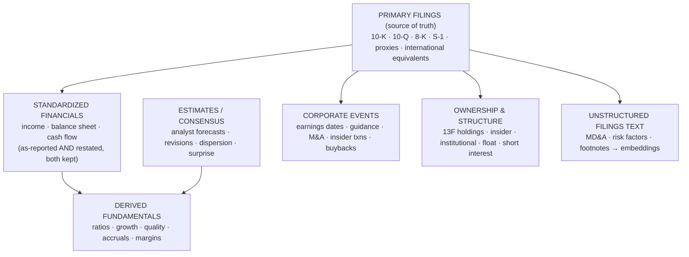

### 4.1 The layers

| Layer | Content | Point-in-time discipline | Cadence |
|---|---|---|---|
| **Primary filings** | Raw regulatory documents (SEC EDGAR + global equivalents) | Stamped with *filing/acceptance time* = the exact `knowledge_time` | On filing (real-time from EDGAR) |
| **Standardized financials** | Normalized statements across accounting standards | **As-first-reported preserved forever**; restatements appended as new versions with their own knowledge_time | Quarterly + on restatement |
| **Derived fundamentals** | Ratios, growth, quality/value/profitability factors | Computed *as of* each point in time from then-known data | On new filing |
| **Estimates/consensus** | Analyst forecasts, revisions, dispersion, surprise history | Each estimate stamped when *issued*; consensus is reconstructed as-of, never today's snapshot | Continuous |
| **Corporate events** | Earnings calendars, guidance, M&A, insider transactions, buybacks | Announcement-time stamped | Real-time |
| **Ownership & structure** | 13F, insider, institutional holdings, float, short interest | Filing-lagged (13F is 45 days late — model the lag explicitly) | Quarterly/bi-monthly |
| **Unstructured text** | MD&A, risk factors, footnotes, transcripts | Feeds the vector store & event extraction (§7–8) | On filing |

### 4.2 The bitemporal fundamentals principle (the crown jewel)

Every fundamental fact is stored as `(entity, metric, fiscal_period, value, valid_from, valid_to, knowledge_time, source_version)`. This lets any research query ask two distinct questions:
- *"What did we **know** about Q3 earnings on Nov 1?"* (transaction-time query — for backtesting)
- *"What is the **best current estimate** of Q3 earnings?"* (valid-time query — for present analysis)

The same table answers both, and **a backtest is physically incapable of seeing a restatement before it was filed.** This is the difference between a fund that survives and one that fools itself.

---

## 5. Alternative Datasets — the Proprietary Edge

Market and fundamental data are commodities; every fund has them. **Alpha lives in alternative data** — signals about the real economy that predate their appearance in prices or filings. This is where a decade-long infrastructure investment pays off, because alt-data is messy, unstructured, inconsistently identified, and legally fraught.

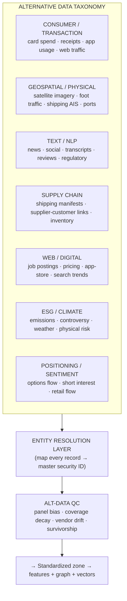

### 5.1 The categories and their signal

| Category | Example datasets | Signal it front-runs | Hard problems |
|---|---|---|---|
| **Consumer/transaction** | Credit/debit aggregates, receipts, app engagement, web traffic | Revenue *before* earnings | Panel bias, coverage shifts, entity mapping |
| **Geospatial/physical** | Satellite (parking lots, oil tanks, crop health), AIS shipping, foot-traffic | Physical activity → production/demand | Cost, revisit rate, cloud cover, geocoding |
| **Text/NLP** | News, social, earnings-call transcripts, product reviews, regulatory | Sentiment, events, narrative shifts | Noise, sarcasm, entity resolution, novelty |
| **Supply chain** | Bill-of-lading manifests, supplier-customer graphs, inventory | Second-order exposure (a supplier's supplier) | Graph completeness, lag |
| **Web/digital** | Job postings, product pricing, app-store ranks, search interest | Hiring → growth; pricing → margins | Scraping legality, structure drift |
| **ESG/climate** | Emissions, controversies, physical/transition risk, weather | Long-horizon risk, event tails | Standardization, greenwashing |
| **Positioning/sentiment** | Options flow, short interest, retail order flow | Crowding, contrarian setups | Timeliness, interpretation |

### 5.2 Alt-data-specific disciplines (why this is hard)

- **Entity resolution is the gate (§24, later doc):** an alt-data record ("SuperMart LLC, store #4471") is worthless until mapped to the master security ID of its ultimate public parent. A dedicated resolution layer (fuzzy matching + graph + human-in-the-loop for low-confidence) sits between every alt vendor and the lake.
- **Panel bias & coverage decay:** alt-data panels silently change composition (a card provider gains/loses a bank). We track *coverage metadata* as a dataset itself and normalize for it — an uncorrected panel shift looks like alpha and isn't.
- **Survivorship & backfill traps:** vendors love to deliver *backfilled* history that never existed live. We stamp `knowledge_time` = when the vendor *actually delivered*, and treat suspicious backfill as non-PIT (unusable for backtest).
- **Legal & license firewall:** MNPI screening, web-scraping compliance, and per-dataset license boundaries enforced technically. Alt-data is where funds get into legal trouble; the metadata layer makes permitted-use machine-enforced.
- **Decay awareness:** alt-data alpha decays as it commoditizes. Each dataset carries a *live signal-health metric*; the Meta-Learner (brain layer) demotes decaying sources.

---

## 6. Macroeconomic & Reference Datasets — the Weather

Macro data sets the regime (consumed heavily by the brain's Regime Sensing agent). Its defining trait: **heavy, irregular revisions and release-time sensitivity.**

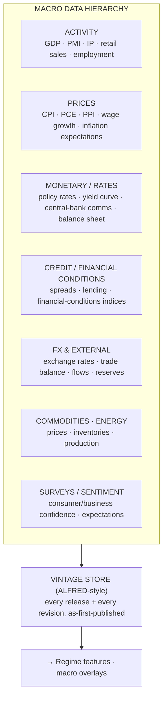

### 6.1 The macro layers

| Layer | Examples | Why it matters | Release cadence |
|---|---|---|---|
| **Activity** | GDP, PMI, industrial production, employment, retail sales | Growth regime, cycle position | Monthly/quarterly, scheduled |
| **Prices** | CPI, PCE, PPI, wages, breakevens, inflation expectations | Inflation regime → policy path | Monthly, high-impact releases |
| **Monetary/rates** | Policy rates, full yield curve, central-bank statements & minutes, balance sheet | Discount rate, the single biggest macro driver | On-meeting + continuous curve |
| **Credit/conditions** | IG/HY spreads, bank lending, financial-conditions indices | Stress detection, crisis early-warning | Daily/weekly |
| **FX & external** | Spot/forward FX, trade balances, capital flows, reserves | Cross-asset linkage, carry | Real-time (FX) / monthly (flows) |
| **Commodities/energy** | Prices, inventories (e.g. crude stocks), production | Inflation, sector inputs, real activity | Weekly/daily |
| **Surveys/sentiment** | Consumer & business confidence, expectations | Leading indicators, regime turns | Monthly |

### 6.2 The vintage discipline (macro's point-in-time crown jewel)

Macro series are **revised repeatedly** — the GDP print you saw in January is not the GDP number in today's database. Using the revised figure in a backtest is lookahead bias that has fooled countless funds.

We maintain a **vintage store** (an ALFRED-style archive): every macro series stored as a *sequence of vintages* — the value *as first published*, plus each subsequent revision, each with its own release timestamp. A backtest of a macro strategy uses the **vintage that was live on the trade date**, not the final revised number. Release-time is stamped to the minute (many macro releases move markets in milliseconds), so intraday strategies respect the exact embargo/release boundary.

> Macro + the reference data of §2.1 together form the **contextual backbone** — the coordinate system in which every instrument-level datum is interpreted.

---

## 7. Knowledge Graph Architecture

Tables express *attributes*; graphs express *relationships*. The alpha in "Company A's second-tier supplier just cut guidance" or "these twelve stocks share a hidden common factor" lives in the **relationship structure**, which no flat table captures. The Knowledge Graph is the platform's model of *how the financial world is connected*.

### 7.1 What the graph is for

- **Multi-hop reasoning:** supplier → customer → competitor chains; contagion and second-order exposure.
- **Crowding & correlation clusters:** discover latent common ownership/factor structure.
- **Event propagation:** trace how one event (a rate hike, a default) ripples across related entities.
- **Grounding the AI agents:** the brain's analysts query the graph for *causal context* the way a human analyst pulls up "who does this company depend on?"
- **Entity resolution backbone:** the graph *is* the master entity fabric that alt-data resolves into.

### 7.2 Graph schema (nodes & edges)

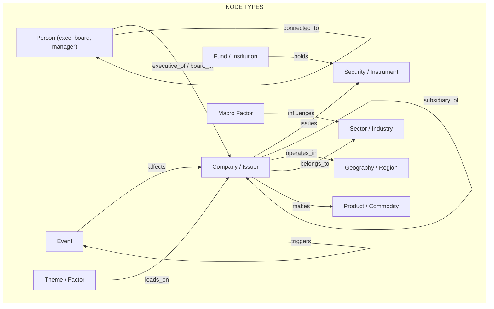

| Node types | Edge types (relationships) |
|---|---|
| Company/Issuer, Security, Person, Sector, Geography, Product/Commodity, Fund/Institution, Event, Macro Factor, Theme/Factor | `issues`, `supplies`, `customer_of`, `competes_with`, `subsidiary_of`/`parent_of`, `operates_in`, `belongs_to`, `makes`, `executive_of`, `board_member_of`, `holds`, `affects`, `triggers`, `influences`, `correlated_with`, `loads_on`, `co_owned_with`, `connected_to` |

### 7.3 Temporal & weighted graph (the hard part)

A static graph is a lie — relationships form, strengthen, and dissolve. Our graph is:
- **Temporal / bitemporal:** every edge carries `valid_from`/`valid_to` + `knowledge_time`. We can query the graph *as it was known on any past date* — supply-chain links, holdings, and board seats change, and a backtest must see only the then-known graph. **No graph lookahead.**
- **Weighted & probabilistic:** edges carry strength/confidence (a supplier relationship worth 40% of revenue ≠ one worth 2%; an *inferred* link ≠ a *filed* one). Confidence propagates when the AI agents reason over paths.
- **Provenance-stamped:** each edge records its source (filed vs. inferred vs. vendor-asserted), so the brain knows how much to trust a relationship.

### 7.4 Construction & maintenance

- **Sources:** filings (subsidiaries, execs, ownership), 13F (holdings), supply-chain vendors + NLP extraction from filings/news, classification data (sector/geo), statistical inference (correlation-cluster edges recomputed on a schedule).
- **Pipeline:** Silver-zone entities + extracted relations → entity resolution → edge validation (confidence threshold, human-in-loop for low-confidence structural edges) → temporal upsert into the graph store.
- **Storage:** a native property-graph engine (Neo4j / TigerGraph / Amazon Neptune) for transactional relationship queries; heavy analytical graph algorithms (community detection, centrality, PageRank-style contagion) run on a parallel graph-compute layer (e.g. GraphX/cuGraph) over snapshots.

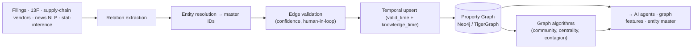

---

## 8. Vector Database Architecture

The graph captures *explicit, structured* relationships. The **vector store captures *semantic similarity*** — the fuzzy, high-dimensional "this situation *rhymes* with that one" that powers the brain's case-based reasoning and its episodic/semantic memory (from `claude_aiBrain.md`). This is the substrate of "find me past setups that look like now."

### 8.1 What gets embedded (the embedding corpus)

| Embedding domain | Source | What similarity means | Consumer |
|---|---|---|---|
| **Filings & disclosures** | 10-K/Q risk factors, MD&A, footnotes | "companies describing similar risks" | Fundamental agent, thematic clustering |
| **News & events** | Articles, headlines, PR | "events like this one" | Alt-data/news agent, event dedup |
| **Earnings-call transcripts** | Q&A + prepared remarks | "management tone/topic similarity" | Sentiment agent |
| **Market-state embeddings** | Encoded regime/market-state vectors | "market conditions like today" | Regime agent, episodic recall |
| **Trade episodes** | The brain's decision episodes (context+reasoning+outcome) | "past trades in analogous situations" | Episodic/mistake memory recall |
| **Research notes / theses** | Internal analyst & agent write-ups | "have we studied this before?" | Semantic memory, dedup |
| **Entity descriptors** | Company/product/theme profiles | "similar businesses" | Peer discovery, entity resolution assist |

### 8.2 Architecture

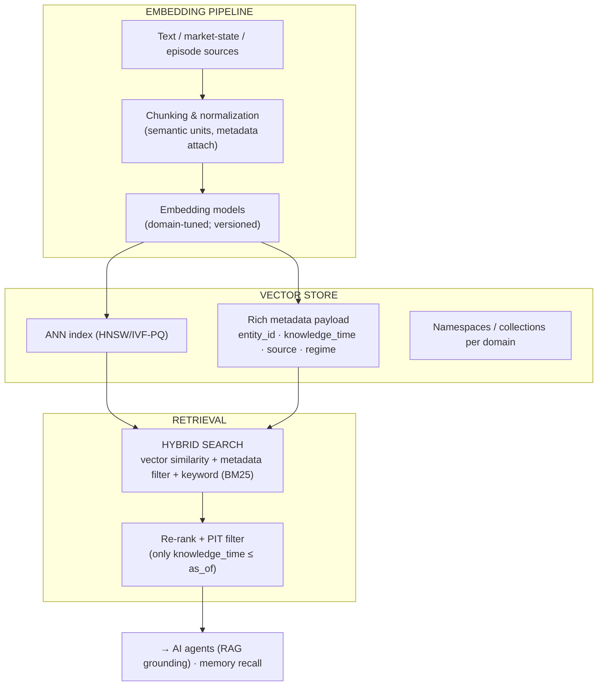

### 8.3 Design decisions that matter at fund scale

- **Point-in-time filtering on recall (non-negotiable):** every vector carries `knowledge_time`; retrieval **hard-filters** to vectors knowable as of the query date. Semantic recall must not leak the future any more than a SQL join may — a backtest asking "what did this remind us of?" gets only *then-available* analogues. This is the most-overlooked lookahead vector in RAG-based finance systems, and we close it structurally.
- **Hybrid retrieval, always:** pure vector search is insufficient for finance. We combine (a) ANN similarity, (b) **structured metadata filters** (entity, sector, date range, regime, source-reliability), and (c) sparse/keyword (BM25) for exact terms (tickers, figures). Retrieval is a *filtered* semantic search, never naive top-k.
- **Embedding versioning & re-embedding strategy:** embedding models improve; we **version every embedding by model+version** and keep the model that produced each vector. Re-embedding the corpus is a controlled, versioned migration (dual-index during transition) — never a silent swap that would make old and new vectors incomparable.
- **Metadata as first-class:** the payload (entity_id linking to the graph, knowledge_time, source, regime_context, confidence) is what turns a generic vector DB into a *financial* one — it lets the brain fuse semantic recall with graph relationships and PIT correctness in a single query.
- **Namespacing by domain:** separate collections per embedding domain (filings vs. episodes vs. news) so recall is scoped and index tuning is domain-specific; cross-domain search is an explicit federated query.
- **Storage engine:** a scalable ANN store (Milvus / Qdrant / Weaviate, or pgvector for smaller collections) with HNSW for low-latency online recall and IVF-PQ for large cold archives; sharded by domain and time, replicated for availability.
- **Tight coupling to the graph:** every vector's `entity_id` is a foreign key into the Knowledge Graph. The two knowledge stores are designed as a pair — the graph answers *"how is X connected to Y?"*, the vector store answers *"what is X similar to?"*, and the AI agents routinely need both in one reasoning step (e.g., "find companies *similar* to X that are also *supply-linked* to a distressed sector").

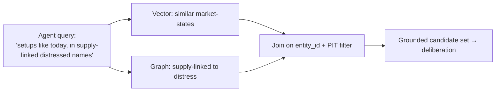

---

## 9. Hybrid Memory Architecture

The brain (`claude_aiBrain.md`) defines *five cognitive memories* (short-term, episodic, semantic, trade, mistake). This section defines the **data substrate** those memories physically live on — because a memory type is a *retrieval contract*, and each contract maps to a different storage engine. "Hybrid" means no single database serves memory; memory is a *federation* stitched together by the master entity ID and `knowledge_time`.

### 9.1 The memory-to-store mapping

| Cognitive memory | Retrieval contract | Physical store | Why this store |
|---|---|---|---|
| **Short-term / working** | "the live context of the current decision," ms latency, ephemeral | Redis / in-process | Sub-ms, TTL-expiring, no durability needed |
| **Episodic** | "past decisions that *resemble* now" (fuzzy) + "the exact episode X" (keyed) | Vector store (recall) + Iceberg (durable episode records) | Similarity needs ANN; the full immutable record needs the lake |
| **Semantic** | "what principle applies here" (structured, relational) | Knowledge Graph + curated principle tables | Principles are relationships/rules, not points |
| **Trade** | "our historical record & stats on this setup" (analytical, aggregatable) | ClickHouse / Iceberg (columnar) | Fast aggregation over millions of trades |
| **Mistake** | "have we erred like this before" (fuzzy + structured pattern-match) | Vector store + graph (error-pattern nodes) + relational catalog | An error is both a *pattern* (embed) and a *causal structure* (graph) |

### 9.2 The federation — one memory, many engines

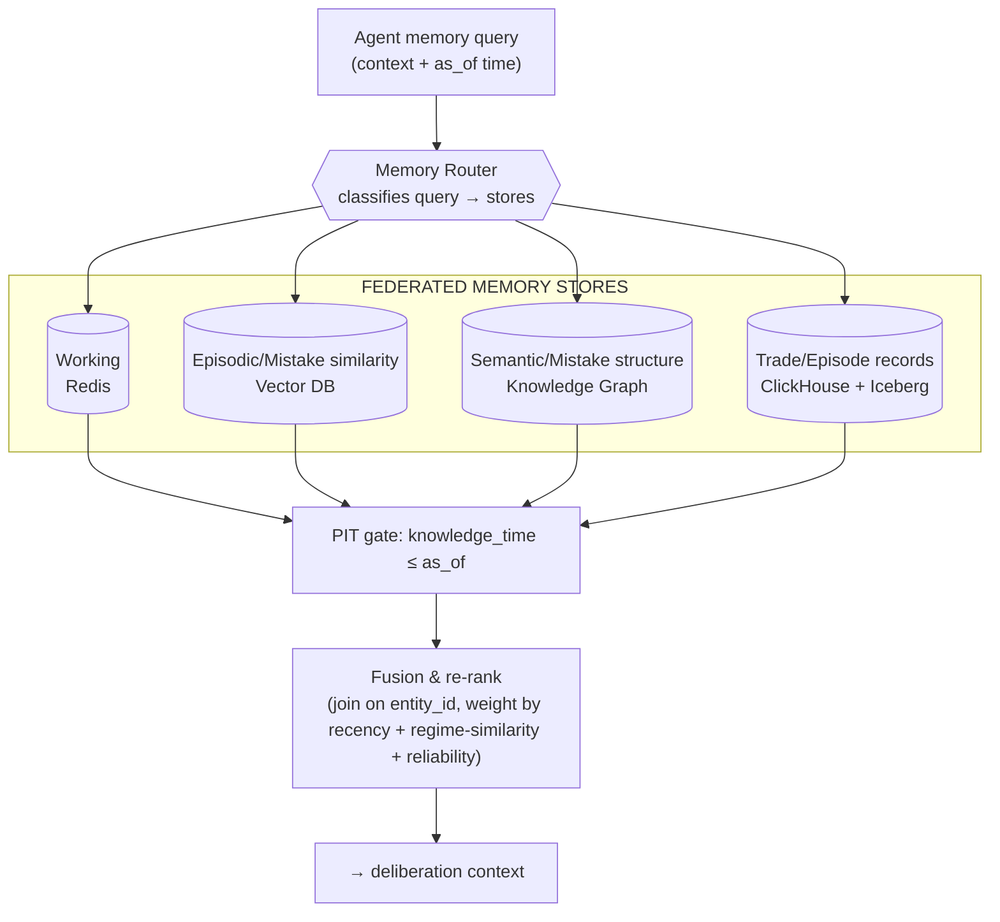

### 9.3 The disciplines that make it a memory and not just databases

- **Single spine:** every memory record — episode, trade, principle, mistake — carries the **master entity ID** and `knowledge_time`, so a fused recall (§8.3) joins vector, graph, and columnar results into one coherent view.
- **Consolidation pipeline:** working memory → (on trade close, driven by the brain's Reflection agent) → episodic record in Iceberg → embedded into the vector store → distilled principles promoted into the graph. This is the *write path* of memory, mirroring the human sleep-consolidation analogy.
- **Recency + regime-similarity weighting on recall:** a recalled memory's influence decays with age and is up-weighted when the *past regime matches the present regime* — an ancient episode from a structurally identical market can outweigh a recent one from a different regime.
- **Point-in-time on every recall:** memory is data; the PIT gate applies identically. A backtest's memory recall sees only what the brain could have remembered on that date. **No memory lookahead.**
- **Poisoning defense:** promotion from episodic → semantic requires statistical corroboration (the Meta-Learner gate from the brain doc); a single anomalous episode cannot rewrite a durable principle.

---

## 10. Data Lake Architecture

The lake is the **eternal substrate** — the append-only, immutable ground truth from which every other store is a derived, rebuildable projection. If everything else burns down, the lake + the code reconstructs the platform.

### 10.1 Internal structure

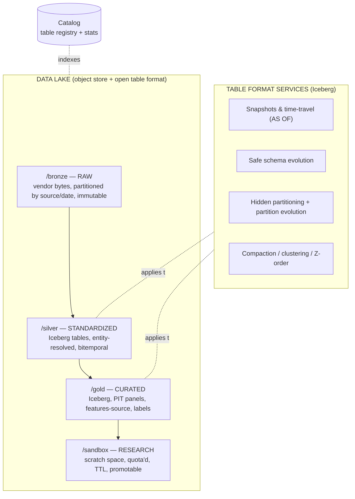

### 10.2 Key design decisions

- **Object store as the base** (S3/GCS/ADLS): infinite, cheap, durable (11 nines), decouples storage from compute — a decade of tick data costs storage, not cluster.
- **Open table format (Iceberg) over raw files:** brings ACID transactions, snapshot isolation, and **time-travel** to the lake. `SELECT ... AS OF snapshot_on(2024-06-01)` *is* point-in-time reproducibility, for free, at the storage layer. Schema evolution lets a 10-year-old table absorb new columns without rewrite.
- **Partitioning strategy:** by source + asset-class + date (hidden partitioning so queries needn't know the layout); partition *evolution* supported so we can re-granularize as volumes grow without migration.
- **Tiering & lifecycle:** hot (recent, NVMe-backed cache / ClickHouse) → warm (Iceberg standard storage) → cold (infrequent-access / glacier for aged raw). Automated by age + access telemetry. Retention is *forever* for raw and curated; only recompute-able intermediates expire.
- **Compute engines decoupled:** Spark (heavy batch), Flink (stream), Trino/DuckDB (interactive research), Ray (ML) all read the *same* Iceberg tables — one copy of data, many engines. No data silos.
- **The sandbox zone:** researchers get quota'd, TTL'd scratch space that reads Gold and writes freely; promotion of a sandbox dataset to Gold is a governed, reviewed, lineage-tracked act — this is how research stays reproducible without freezing exploration.

---

## 11. Feature Engineering Pipeline

Features are where raw data becomes *predictive signal*. The cardinal rule: **a feature is defined exactly once, and that single definition serves training, backtest, and live** — otherwise train/serve skew silently destroys live performance.

### 11.1 The pipeline

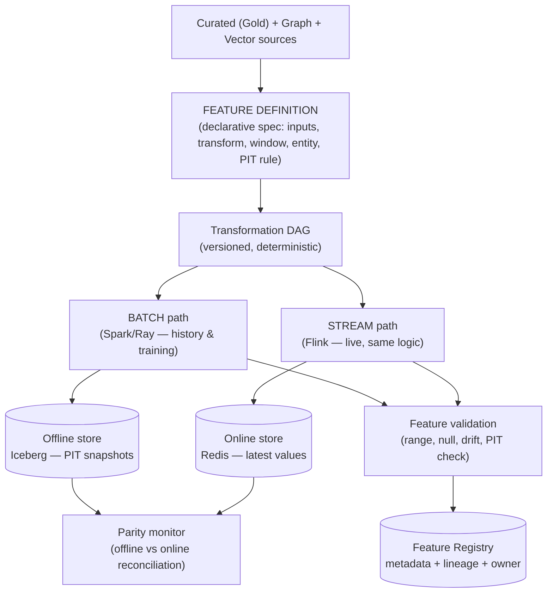

### 11.2 Principles

- **Declarative, single-definition features:** a feature is a *spec* (inputs, transform, window, entity key, PIT rule, freshness SLA), compiled to *both* a batch job and a streaming job from the same source — the structural guarantee behind online/offline parity (§21).
- **Deterministic & versioned transforms:** every transform is pure and versioned; changing a feature's logic creates a *new version* (`momentum_v3`), never mutates `momentum_v2`. Old models keep consuming the exact features they trained on.
- **Point-in-time windows only:** every windowed feature (e.g., 20-day volatility) is computed from data with `knowledge_time ≤ t`. The engine *forbids* referencing future rows — lookahead is a compile-time error, not a code-review hope.
- **Feature categories:** price/technical, fundamental-derived, cross-sectional (rank/z-score within universe at time t), graph-derived (centrality, supplier-distress), embedding-derived (semantic-cluster membership), macro-conditioned, and interaction features.
- **Cross-sectional correctness:** rank/normalize features are computed *within the point-in-time universe* (only instruments that existed and were tradable at t) — avoiding survivorship contamination in the normalization itself.
- **Backfill = replay, not fabrication:** to backfill a new feature over history, we *replay the batch job over the lake's historical snapshots* — reconstructing what the feature *would have been*, PIT-correct, never using today's data.

---

## 12. Feature Store Design

The feature store is the **serving contract** between the data layer and the brain. Two coordinated surfaces, one definition.

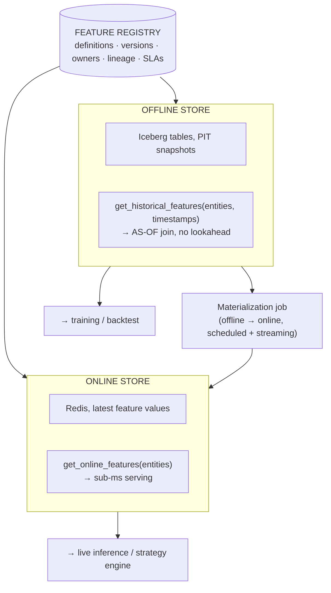

| Concern | Offline store | Online store |
|---|---|---|
| **Purpose** | Training-set & backtest feature retrieval | Live inference serving |
| **Access** | High-throughput, point-in-time *as-of joins* | Low-latency point lookups (sub-ms) |
| **Engine** | Iceberg on the lake | Redis / low-latency KV |
| **Correctness guarantee** | No lookahead: features joined at each row's timestamp | Freshness: latest value within SLA |
| **Consumers** | Backtest engine, training pipelines, research | Strategy engine, GPU inference |

**Load-bearing feature-store guarantees:**
- **Point-in-time correct training retrieval:** `get_historical_features(entity_ids, event_timestamps)` performs an **as-of join** — for each (entity, time) label row it fetches the feature value *as it was known at that time*. This is the single most important function in the entire data layer; it is what makes a training set honest.
- **Registry as the contract:** every feature is discoverable, versioned, owned, lineage-linked, and SLA-tagged. No "mystery column."
- **Materialization bridges the surfaces:** the same computed feature is written to offline (history) and pushed to online (latest) by a shared job — the parity monitor (§21) continuously reconciles the two.
- **Reuse over reinvention:** features are firm-wide assets; a new strategy composes existing registered features rather than re-deriving them, compounding quality and eliminating divergent definitions of "momentum."

---

## 13. Data Validation

Validation is the **gate between zones** — data does not advance from Bronze→Silver→Gold until it passes. Failing data is **quarantined and alerted**, never silently consumed (principle #6).

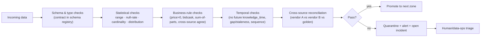

### 13.1 Validation layers

| Layer | Checks | Example failure caught |
|---|---|---|
| **Schema** | Types, required fields, enum domains (schema-registry-enforced) | Vendor silently adds/drops a column |
| **Statistical** | Range, null-rate, cardinality, distribution shift vs. history | A price feed sends values 100× off (unit change) |
| **Business rules** | Domain invariants: price>0, bid≤ask, volume≥0, statement identities balance | Negative volume; assets ≠ liabilities+equity |
| **Temporal** | `knowledge_time` not in future, no unexpected gaps, sequence monotonic, freshness SLA | A backdated (lookahead) delivery; a stale feed |
| **Cross-source reconciliation** | Multiple vendors agree within tolerance; vs. a golden source | Vendor A's split not reflected in Vendor B |

**Principles:** validation rules are **declarative, versioned, and per-dataset** (a great-expectations-style contract living beside the data); severity-tiered (warn / quarantine / halt); and **circuit-breaking** — a critical failure on a live feed can trip the platform into defensive mode (ties to the brain's emergency behavior). Every validation result is itself logged as data, feeding quality monitoring (§14).

---

## 14. Data Quality Monitoring

Validation is *point-in-time gating*; quality monitoring is *continuous observability of the data itself* — SLOs, dashboards, and alerts treating data like a production service.

### 14.1 The four quality dimensions, measured continuously

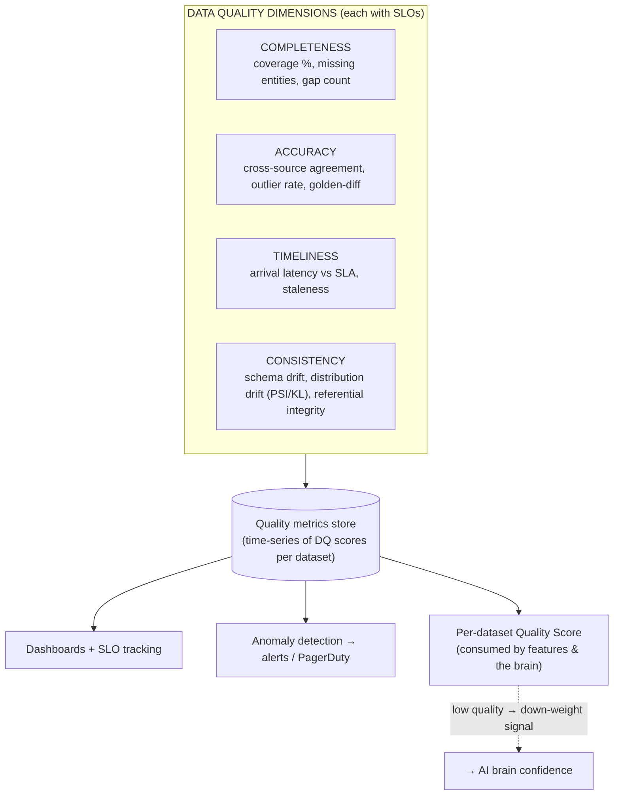

### 14.2 What makes it fund-grade

- **Data quality as a first-class signal into the brain:** each dataset carries a **live quality score**; when a source degrades (coverage drop, latency spike, drift), features derived from it are **down-weighted** and the brain's confidence in those signals falls automatically. Bad data doesn't just get flagged — it *quietly reduces conviction*. This closes the loop between data ops and decision-making.
- **Drift monitoring:** distributional drift (PSI/KL) on every important feature and source — catches the silent vendor change or regime shift that makes a feature mean something different than it did in training.
- **Coverage & panel-health tracking:** especially for alt-data (§5.2) — composition changes are monitored as data and normalized against.
- **SLO-driven, on-call:** each dataset has completeness/timeliness/accuracy SLOs; breaches page data-ops exactly like a service outage. Data has an on-call rotation.
- **Reconciliation as continuous, not one-off:** the 3-way (vendor/vendor/golden) reconciliation runs perpetually, not just at ingestion.

---

## 15. Data Lineage

Lineage is the **answer to "where did this number come from?"** — traced automatically from any feature or trade back through every transform to the raw vendor byte. It is the backbone of reproducibility, debugging, compliance, and impact analysis.

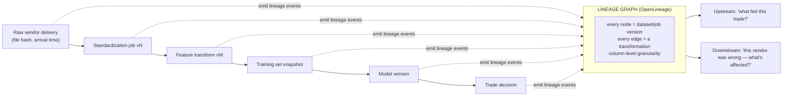

### 15.1 Capabilities

- **Column/field-level granularity:** not just "table A → table B," but "this feature derives from *these specific columns* of *these specific source versions*." Enough to isolate the exact bad input behind a bad trade.
- **Automatic capture:** lineage is emitted by the pipeline framework (OpenLineage-style events from Spark/Flink/Ray jobs), not hand-maintained — hand-maintained lineage is always stale and therefore worthless.
- **Bidirectional, and this is the payoff:**
  - **Upstream (audit/debug):** given a trade, reconstruct the *entire* data provenance chain — feeding explainability (brain §12) and the WORM audit ledger (platform doc).
  - **Downstream (impact analysis):** given a discovered vendor error, instantly enumerate *every* feature, model, backtest, and live trade contaminated by it — turning a "we might have a problem" into a precise remediation list in minutes.
- **Cross-layer:** lineage spans data → feature → training set → model → decision, so the data layer's lineage connects directly to the model registry and the brain's decision DAG. One unbroken chain from vendor byte to executed order.

---

## 16. Data Versioning

Everything is versioned so that **any artifact is reconstructable exactly as it existed at any past moment** (principle #3). Reproducibility is not a feature; it is the license to trust research.

| Artifact | Versioning mechanism | Reproduces… |
|---|---|---|
| **Raw data** | Immutable, append-only; each delivery is a versioned object (content-hashed) | The exact bytes a vendor sent, forever |
| **Curated tables** | Iceberg snapshots (every write = a snapshot; `AS OF` time-travel) | Any table as it was on any date |
| **Schemas** | Schema registry with versioned, compatibility-checked evolution | How data was shaped at time t |
| **Features** | Semantic feature versions (`feature@v3`) + definition-in-git | The exact feature logic a model trained on |
| **Training sets** | Immutable, content-addressed dataset snapshots (DVC/lakeFS-style) with a manifest of source snapshot IDs | The precise data a model saw |
| **Transformation code** | Git SHA, pinned in every job run | The exact logic that produced an output |
| **Graph & vector stores** | Bitemporal edges / versioned embeddings by model+version | The knowledge state as-of a date |

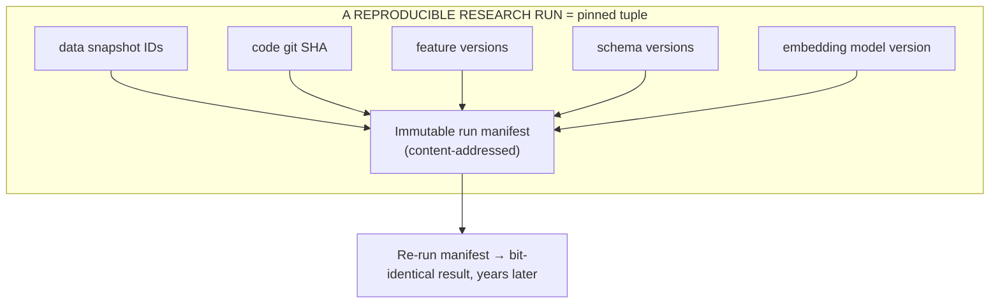

**The core guarantee:** a research result or a live model is pinned to an **immutable manifest** — (data snapshot IDs + code SHA + feature versions + schema versions + embedding version). Re-executing that manifest reproduces the result bit-for-bit, even years later. This is what lets the fund defend a decision to a regulator, debug a model long after its author left, and trust that a promoted strategy is the one that was actually validated.

---

## 17. Point-in-Time Correctness (the deep dive)

This is the **single most important property of the entire data layer** — important enough to earn its own section despite threading through all others. A fund that violates PIT correctness doesn't get bad backtests; it gets *convincing, profitable-looking* backtests that lose money live. It is the disease that presents as health.

### 17.1 The bitemporal model, precisely

Every fact carries two independent time axes:
- **`event_time` (valid time):** when the fact was true in the world (the fiscal quarter; the tick's exchange time; the trade's execution).
- **`knowledge_time` (transaction time):** when *we could first have known it* (vendor arrival; filing acceptance; macro release minute).

A point-in-time query fixes an `as_of` and enforces **`knowledge_time ≤ as_of`** on *every* datum it touches — market, fundamental, macro (via vintage), graph edge, vector, feature, and memory. There are no exceptions and no privileged datasets.

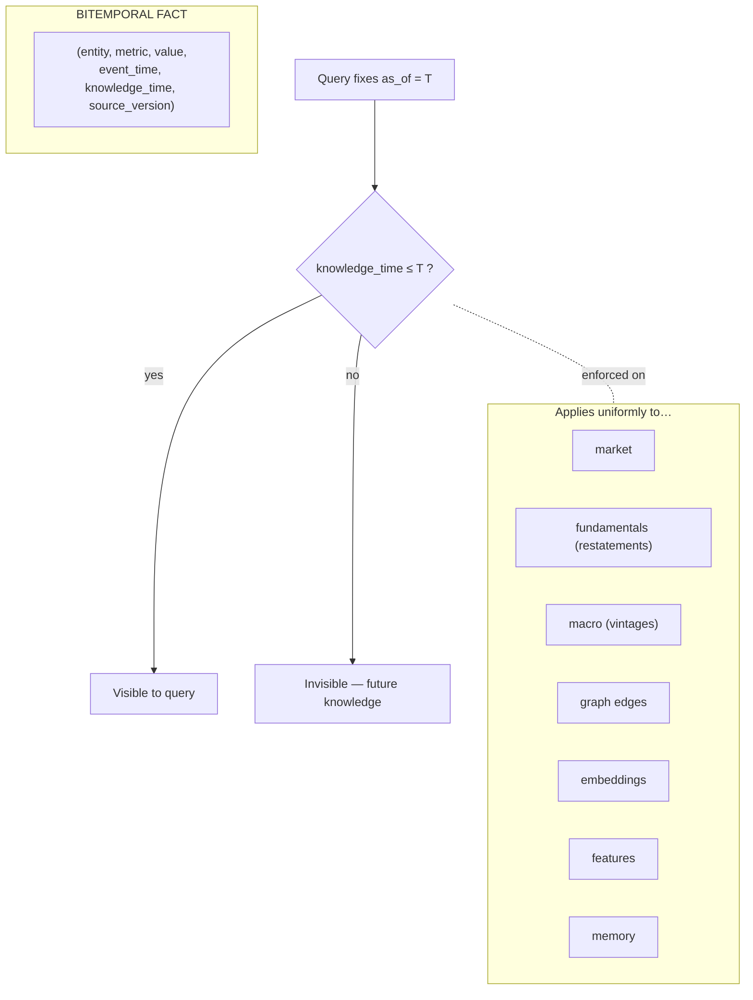

### 17.2 The lookahead traps we structurally close

| Trap | Naive system | Our defense |
|---|---|---|
| **Restatement leak** | Uses today's corrected earnings for a past date | As-first-reported preserved; `knowledge_time` gate (§4.2) |
| **Macro revision leak** | Uses final GDP instead of the first print | Vintage store; use the live vintage (§6.2) |
| **Survivorship bias** | Universe = today's surviving names | PIT universe: only names listed & tradable at t |
| **Identifier reuse** | Reused ticker maps history to wrong company | Bitemporal crosswalk (§2.1) |
| **Corporate-action leak** | Bakes today's adjustment into old prices | Adjust at query-time from PIT action data (§3.2) |
| **Backfilled alt-data** | Treats vendor backfill as if live | `knowledge_time` = actual delivery; backfill flagged non-PIT (§5.2) |
| **Feature lookahead** | Window references future rows | Compile-time PIT enforcement (§11) |
| **Memory/RAG lookahead** | Recalls future episodes/embeddings | PIT filter on recall (§8.3, §9) |

### 17.3 Enforcement, not etiquette
PIT is enforced by *construction*, at multiple layers: bitemporal storage (can't retrieve what wasn't known), the feature engine's compile-time checks (can't reference the future), the feature store's as-of join (training rows fetch then-known values), Iceberg time-travel (query the lake as-of a snapshot), and PIT filters on graph/vector/memory recall. **A researcher cannot accidentally cheat** — the infrastructure refuses. This is the deepest expression of principle #1.

---

## 18. Label Engineering

If features are the inputs to learning, **labels are the definition of the target** — and a subtly wrong label teaches the model the wrong thing with perfect confidence. Label engineering is where most quant ML silently fails.

### 18.1 Label families

| Label type | Definition | Use |
|---|---|---|
| **Forward return** | Return over horizon h (raw, excess, risk-adjusted) | The workhorse regression/classification target |
| **Triple-barrier** | First of {profit-take, stop-loss, time-limit} hit (López de Prado) | Realistic, path-aware trade outcomes |
| **Volatility-scaled** | Return normalized by then-known vol | Comparable targets across regimes/names |
| **Cross-sectional rank** | Rank of forward return within PIT universe | Relative-value / long-short strategies |
| **Event-conditioned** | Outcome around an event (earnings drift) | Event-driven strategies |
| **Regime-tagged** | Any label, annotated with the realized regime | Regime-conditioned training/evaluation |

### 18.2 The disciplines that keep labels honest

```mermaid
flowchart LR
    PRICE["PIT price path (event_time)"] --> HORIZON["Define horizon + barriers"]
    HORIZON --> LABEL["Compute label at t using ONLY future PRICES,<br/>never future FEATURES"]
    LABEL --> EMBARGO["Purge + embargo overlapping windows"]
    EMBARGO --> WEIGHT["Sample weights<br/>(uniqueness, decay, class balance)"]
    WEIGHT --> META["Meta-labeling<br/>(second model: 'act on this signal?')"]
    META --> OUT["Labeled, weighted training rows"]
```

- **The label/feature time asymmetry:** a label at time *t* legitimately uses *future prices* (that's the point — we're predicting the future). But it must be computed so that at *serving* time *t*, only past features feed the model. The training row is `(features known at t, outcome realized after t)` — never features-from-the-future.
- **Purging & embargo:** overlapping label windows leak information across the train/test boundary; we **purge** training samples whose label window overlaps the test set and **embargo** a gap around it (combinatorial purged CV, per the platform's backtest gauntlet). This is essential and near-universally botched.
- **Sample weighting:** overlapping labels violate IID; we weight by *label uniqueness*, decay older samples, and balance classes/regimes so the model isn't dominated by correlated or stale examples.
- **Meta-labeling:** a two-stage design — a primary model sets *direction*, a secondary model sets *whether to act and how much* — cleanly separating signal from sizing and improving precision.
- **Regime-aware labeling:** labels tagged with realized regime so training and evaluation can be regime-stratified (a model that's great in bull and lethal in crisis must be *seen* to be so).

---

## 19. Training Dataset Generation

A training set is a **first-class, immutable, versioned artifact** — not a query someone ran once. It is assembled by joining PIT features to PIT labels, then frozen and content-addressed so the exact bytes a model saw are reproducible forever (§16).

```mermaid
flowchart TB
    UNI["PIT universe selection<br/>(names tradable at each t — no survivorship)"] --> ASOF["As-of feature join<br/>(feature store: values known at t)"]
    LAB["PIT labels (§18)"] --> ASOF
    ASOF --> PURGE["Purge + embargo + sample weights"]
    PURGE --> SPLIT["Walk-forward / purged-CV splits<br/>(temporal, never random shuffle)"]
    SPLIT --> FREEZE["Freeze → immutable snapshot + manifest"]
    FREEZE --> REG2[("Dataset registry<br/>(hash, sources, feature/label versions)")]
    REG2 --> TRN["→ model training (registry-linked)"]
```

**Non-negotiables:**
- **PIT universe first:** the set of eligible instruments is reconstructed as-of each timestamp (listed, tradable, liquid enough, licensed) — survivorship excluded at the *universe* level, not patched later.
- **As-of joins throughout:** features and labels are joined at each row's timestamp via the feature store's PIT retrieval (§12) — the training set is honest by construction.
- **Temporal splits only:** walk-forward and purged/combinatorial CV — **never** random k-fold, which shuffles the future into the past. Splits respect purge+embargo (§18).
- **Immutable + manifested:** the finished set is frozen, hashed, and registered with its full manifest (source snapshots, feature/label versions, universe definition, split scheme). The model registry links each model to the exact dataset artifact it trained on — closing the lineage loop from vendor byte → feature → label → training set → model → trade.
- **Leakage audit gate:** an automated check scans every generated set for the classic leaks (future knowledge_time, overlapping windows, target in features, survivorship) before it can be registered. Generation *cannot* emit a leaky set.

---

## 20. Research Dataset Generation

Research datasets serve a *different master* than training sets: **speed of exploration and breadth**, not frozen reproducibility — yet they must be *promotable* to reproducible status without a rewrite, or research and production diverge (the classic "worked in my notebook" death).

### 20.1 The research workflow

```mermaid
flowchart TB
    GOLD2["Gold curated + feature store + graph + vector"] --> SAND["Research sandbox<br/>(fast engines: DuckDB/Trino/Spark; notebooks)"]
    SAND --> EXPLORE["Explore: hypotheses, factor tests,<br/>event studies, quick backtests"]
    EXPLORE --> PIN{Promising?}
    PIN -->|no| DISCARD["Discard (but log the negative result)"]
    PIN -->|yes| PROMOTE["Promote: pin to manifest →<br/>reproducible research dataset"]
    PROMOTE --> VALIDATE["Full PIT + leakage validation"]
    VALIDATE --> REG3[("Research registry → hands to training-set gen")]
```

### 20.2 Principles

- **Same sources, looser latency:** research reads the *same* Gold/feature-store/graph/vector layer as production — so a finding is expressed in production-identical features and *cannot* silently depend on data production won't have. The sandbox differs in *freshness tolerance and compute quotas*, not in *definitions*.
- **PIT-correct even in exploration:** the sandbox inherits the same PIT machinery — researchers explore fast but can't accidentally cheat (a leaky exploration is a wasted exploration). The infrastructure keeps them honest at notebook speed.
- **Promotion, not rewrite:** a promising research dataset is *pinned* (manifested, §16) and flows into the same validation + training-set pipeline (§19). There is no reimplementation gap between "research found it" and "production runs it" — the seam where alpha dies is engineered away.
- **Negative results are data:** discarded hypotheses are logged (what was tried, why it failed) — feeding the brain's semantic/mistake memory and preventing the firm from re-testing the same dead ends. Institutional knowledge compounds even from failures.
- **Wide-and-cheap by design:** research runs on interactive engines over the lake (DuckDB/Trino) and spot compute — exploration is *meant* to be broad, fast, and disposable, while every keeper is reproducible.

---

## 21. Online vs. Offline Feature Parity

Train/serve skew is the **most common cause of "great backtest, dead live strategy."** A model trained on a feature computed one way, then served a feature computed *a different way* in production, is being fed a subtly different input than it learned on — and it fails silently. Parity is the guarantee that the feature a model sees live is *numerically identical* to the one it trained on.

### 21.1 The single-definition doctrine (the structural fix)

```mermaid
flowchart TB
    DEF["ONE feature definition<br/>(declarative spec — §11)"]
    DEF --> COMPILE["Compiler"]
    COMPILE --> BJOB["Batch job (Spark/Ray)<br/>→ offline store (history)"]
    COMPILE --> SJOB["Stream job (Flink)<br/>→ online store (live)"]
    BJOB --> OFF[("Offline value @ t")]
    SJOB --> ON[("Online value @ now")]
    OFF & ON --> RECON["PARITY MONITOR<br/>replay online inputs through batch logic<br/>→ assert |online − offline| < ε"]
    RECON --> ALERT{Divergence?}
    ALERT -->|yes| BLOCK["Alert + block promotion + open incident"]
    ALERT -->|no| PASS["Parity certified"]
```

- **Same logic, two runtimes:** the batch and stream jobs are *compiled from one spec*, not hand-written twice. Two hand-maintained implementations of "20-day volatility" will always eventually diverge; one compiled definition cannot.
- **Continuous parity reconciliation:** the parity monitor periodically **replays the exact inputs the online store saw through the offline batch logic** and asserts equality within tolerance ε. Divergence is an incident, and a feature that fails parity **cannot be used to promote a model** (ties to CI/CD gates in the platform doc).
- **Shared source of truth:** both paths read the same Gold zone; the streaming path also *writes back* to the lake, so tomorrow's batch recompute reconciles against what actually streamed live (dual-write, §1.3).

### 21.2 The subtle parity killers we design against

| Skew source | How it sneaks in | Defense |
|---|---|---|
| **Logic divergence** | Batch in SQL, online in app code | Single compiled definition |
| **Time-window edges** | Batch uses closed bars; live uses partial in-progress bar | Explicit, spec'd window-close semantics identical in both |
| **Data freshness** | Live has a value batch didn't yet have (or vice-versa) | Freshness SLA + `knowledge_time` alignment |
| **Fill/imputation** | Different null-handling in the two paths | Imputation is part of the *definition*, not the runtime |
| **Feature staleness** | Online value stale past its SLA | Freshness monitoring; stale feature → down-weighted, flagged to brain |

> **The principle:** parity is not achieved by *testing*; it is achieved by *construction* (one definition) and *proven* by continuous reconciliation. This is the data-layer twin of the platform's "one codebase for backtest/paper/live."

---

## 22. Embedding Strategy (deep dive)

Embeddings turn unstructured finance (text, market states, episodes) into vectors the brain can reason over by similarity (§8). At fund scale over 10 years, the *strategy* around embeddings matters more than the model choice — because models change and vectors must stay comparable, honest, and current.

### 22.1 The embedding lifecycle

```mermaid
flowchart TB
    SRC3["Sources: filings · news · transcripts · episodes · market-states"] --> CHUNK2["Chunking (semantic units) + metadata attach"]
    CHUNK2 --> MODEL3["Embedding model<br/>(domain-adapted, versioned)"]
    MODEL3 --> STORE3[("Vector store<br/>+ model_version + knowledge_time + entity_id")]
    STORE3 --> SERVE3["PIT-filtered hybrid recall (§8.3)"]
    subgraph GOV3["EMBEDDING GOVERNANCE"]
        VER["Version every vector by model+version"]
        MIG["Re-embed = dual-index migration, never silent swap"]
        DRIFTe["Embedding drift monitoring"]
        EVAL["Retrieval-quality eval set (does recall find the right analogues?)"]
    end
    GOV3 -.governs.- MODEL3 & STORE3
```

### 22.2 Strategic decisions

- **Domain adaptation over generic models:** a generic text embedder doesn't know "dovish," "guidance cut," or that two differently-worded risk factors mean the same exposure. We fine-tune / adapt embedding models on financial corpora (filings, transcripts, our own labeled analogues) so *similarity means financial similarity*.
- **Heterogeneous encoders per domain:** text embeddings (filings/news), **market-state encoders** (a learned encoder mapping regime/price/vol context → vector), and **episode encoders** (encoding a full decision context) are *different models* writing to *different namespaces* (§8.3). One-size embedding is malpractice.
- **Version-and-migrate, never swap:** every vector records its `model_version`. Upgrading the embedder is a **controlled dual-index migration** — old and new indices coexist, queries are validated for consistency, then cut over. A silent re-embed makes historical and new vectors incomparable and *breaks episodic memory's ability to recall the past* — a catastrophic, hard-to-detect failure.
- **PIT-honest embeddings:** an episode embedded today must not use a model that "knows" the future differently than the model available at the episode's date for *backtest* recall — so backtests either use period-appropriate embeddings or explicitly accept and document the embedding as a stationary transform. The `knowledge_time` filter still governs *which* vectors are recallable.
- **Retrieval-quality evaluation:** embeddings are judged by *downstream recall usefulness* (does "find similar setups" return genuinely analogous, profitable-to-know episodes?), tracked on a labeled eval set — not by intrinsic embedding metrics. Drift in recall quality triggers re-adaptation.
- **Chunking is a design choice:** filings are chunked into semantic units (risk factor, segment, MD&A paragraph) with metadata, so recall returns *the relevant passage*, not a whole 200-page document. Chunk granularity is tuned per domain.

---

## 23. Graph Relationships (deep dive)

§7 defined the graph's schema and construction. This deep dive specifies **how relationships are typed, weighted, inferred, and reasoned over** — because the graph's value is entirely in the *quality and honesty of its edges*.

### 23.1 Relationship taxonomy by provenance and certainty

```mermaid
flowchart TB
    subgraph PROV["EDGE PROVENANCE TIERS (drives trust)"]
        FILED["FILED — from regulatory disclosure<br/>(subsidiary_of, board_of, holds) — highest trust"]
        VENDOR["ASSERTED — vendor-provided<br/>(supplier_of, customer_of) — medium trust"]
        EXTRACTED["EXTRACTED — NLP from text<br/>(mentioned_with, rumored M&A) — variable trust"]
        INFERRED["INFERRED — statistical<br/>(correlated_with, co_moves, latent_factor) — model-dependent"]
    end
    FILED & VENDOR & EXTRACTED & INFERRED --> EDGE["Edge with:<br/>type · weight · confidence · valid_time · knowledge_time · source"]
    EDGE --> REASON["Multi-hop reasoning<br/>(confidence compounds & decays over hops)"]
```

### 23.2 Relationship classes and their alpha

| Class | Example edges | Alpha it unlocks |
|---|---|---|
| **Structural** | `subsidiary_of`, `parent_of`, `issues` | Correct exposure aggregation; consolidated risk |
| **Economic** | `supplier_of`, `customer_of`, `competes_with` | Supply-chain contagion, second-order earnings signals |
| **Ownership** | `holds`, `co_owned_with` | Crowding, common-ownership correlation, forced-selling cascades |
| **Human** | `executive_of`, `board_of`, `connected_to` | Governance, interlock networks, key-person risk |
| **Thematic/factor** | `loads_on`, `belongs_to`, `exposed_to` | Latent factor discovery, thematic baskets |
| **Causal/event** | `affects`, `triggers`, `influences` | Event propagation, contagion pathways |
| **Statistical** | `correlated_with`, `co_moves_with` | Hidden clusters, diversification traps |

### 23.3 Reasoning disciplines

- **Confidence-weighted multi-hop:** when the brain traverses supplier → supplier → customer, edge confidences **compound and decay** — a 3-hop path through weak/inferred edges yields low-confidence evidence, correctly discounted in deliberation. The graph never presents a 4th-order rumor as fact.
- **Temporal traversal (no graph lookahead):** every traversal is `as_of`-scoped; the brain reasons over the graph *as it was known* at decision time. A supply link discovered last month is invisible to a backtest of last year (§7.3).
- **Weight = economic materiality:** edges carry magnitude (supplier worth 40% of COGS ≠ 2%); reasoning is weighted by materiality, so contagion analysis focuses on links that actually move earnings.
- **Statistical edges recomputed & decayed:** `correlated_with` edges are recomputed on a rolling schedule and *expire* — a correlation from a prior regime is down-weighted, preventing the graph from asserting stale relationships as current.
- **Graph algorithms as features:** community detection (crowding clusters), centrality (systemic-importance / contagion hubs), and path-based contagion scores become **graph-derived features** in the feature store (§11) — the graph feeds the tabular model, not just the LLM agents.

---

## 24. Entity Resolution

Entity resolution is the **gate that makes all other data usable** — it maps every record from every source (a ticker, a CUSIP, "Apple Inc.", "AAPL US Equity", a store address, a vessel, a job posting) to **one canonical master entity ID**. Without it, you cannot join fundamental data to prices to alt-data to the graph. It is unglamorous and existential.

```mermaid
flowchart TB
    subgraph IN2["INCOMING RECORDS (heterogeneous)"]
        R1["Market: 'AAPL' @ NASDAQ"]
        R2["Fundamental: CIK 0000320193"]
        R3["Alt-data: 'Apple Store #R456'"]
        R4["News: 'the iPhone maker'"]
    end
    IN2 --> BLOCK2["BLOCKING<br/>(candidate generation — reduce comparisons)"]
    BLOCK2 --> MATCH["MATCHING<br/>deterministic (ID crosswalk) → probabilistic (fuzzy) → ML/graph"]
    MATCH --> SCORE2{Confidence}
    SCORE2 -->|high| LINK["Auto-link → master entity ID"]
    SCORE2 -->|low| HUMAN2["Human-in-the-loop review queue"]
    LINK & HUMAN2 --> MASTER[("MASTER ENTITY REGISTRY<br/>bitemporal · survivorship-safe")]
    MASTER --> ALL["→ every join in the platform"]
```

### 24.1 The resolution ladder (cheap-and-certain → expensive-and-fuzzy)

1. **Deterministic:** the bitemporal identifier crosswalk (§2.1) resolves exact IDs (CUSIP/ISIN/FIGI/CIK) — the majority of structured data, `knowledge_time`-aware so **reused tickers resolve to the right company for the date**.
2. **Probabilistic / fuzzy:** name/address normalization + fuzzy matching for messy strings ("Apple Inc." / "Apple Incorporated" / "AAPL").
3. **ML + graph-assisted:** for the hardest cases (alt-data addresses, NLP entity mentions, subsidiaries), a matching model + the knowledge graph (a store resolves to its operating subsidiary → ultimate public parent).
4. **Human-in-the-loop:** low-confidence links go to a review queue; decisions feed back as training labels — the resolver *learns*.

### 24.2 What makes it fund-grade

- **Bitemporal & survivorship-safe:** the master registry is versioned in time — it knows a company's identity *as of any date*, handling mergers, renames, ticker reuse, and delistings without corrupting history.
- **Confidence on every link:** each resolution carries a confidence; downstream, a low-confidence entity mapping *lowers the confidence of any signal derived from it* (propagates to the brain).
- **Subsidiary → parent rollup via the graph:** alt-data about "Store #456" resolves through `subsidiary_of`/`parent_of` edges to the tradable parent — this is precisely where alt-data alpha is won or lost.
- **Resolution is itself lineage-tracked & reversible:** if a mapping is later found wrong, downstream impact analysis (§15) enumerates every affected feature and trade.

---

## 25. Event Ontology

An **ontology** is a formal, shared vocabulary — the schema of *meaning*. The event ontology defines *what kinds of things happen* in markets, so that a news article, a filing, and a price move can all be normalized to the same typed event and reasoned over uniformly by both the graph and the AI agents.

```mermaid
flowchart TB
    EVENT2["EVENT (root)<br/>{id, type, entities[], event_time, knowledge_time, materiality, confidence, source, polarity}"]
    EVENT2 --> CORP["CORPORATE<br/>earnings · guidance · M&A · buyback · dividend · management-change · restatement"]
    EVENT2 --> MKT2["MARKET<br/>gap · halt · circuit-breaker · unusual-volume · vol-spike · regime-shift"]
    EVENT2 --> MACRO2["MACRO<br/>rate-decision · data-release · policy-change · geopolitical"]
    EVENT2 --> CREDIT2["CREDIT/RISK<br/>downgrade · default · covenant-breach · bankruptcy"]
    EVENT2 --> REG2b["REGULATORY/LEGAL<br/>investigation · litigation · approval · sanction"]
    EVENT2 --> ALT2["ALT/EXOGENOUS<br/>supply-disruption · weather · cyber · product-launch"]
```

### 25.1 Design properties

- **Typed, hierarchical, extensible:** a taxonomy with a common root schema — every event, whatever its type, carries `entities[]` (resolved master IDs), both timestamps, `materiality`, `confidence`, `source`, and `polarity` (bullish/bearish/ambiguous). New event types are added as subtypes without breaking existing consumers (10-year extensibility).
- **Entity-linked & PIT-stamped:** events connect to the graph (an event `affects` entities, `triggers` other events) and carry `knowledge_time` — so event-driven backtests see only events known then.
- **Relationships between events:** `triggers`, `precedes`, `contradicts`, `confirms`, `duplicates` — enabling causal chains (a rate hike *triggers* a sector selloff) and **deduplication** (fifty articles about one earnings beat collapse to one event with fifty sources → correct materiality, not fifty-fold overcounting).
- **Materiality & novelty scoring:** each event is scored for market relevance and novelty (is this new information or an echo?) — feeding the brain's alt-data/news agent directly.
- **Extraction pipeline:** NLP over news/filings/transcripts extracts candidate events → entity-resolved → typed against the ontology → deduplicated → confidence-scored → written to the event store + graph.

---

## 26. Market Ontology

The market ontology formalizes **the structure of markets themselves** — instruments, venues, sessions, order types, and their relationships — so that behavior is asset-class- and venue-agnostic and new markets plug in without rewrites (the platform's expansion doctrine at the data layer).

```mermaid
flowchart TB
    INSTR["INSTRUMENT (root)"]
    INSTR --> EQ["Equity (common, ADR, ETF, preferred)"]
    INSTR --> DER["Derivative (option, future, swap, forward)"]
    INSTR --> FI["Fixed income (govt, corp, muni)"]
    INSTR --> FX2["FX (spot, forward, pair)"]
    INSTR --> CR2["Crypto (token, perp)"]
    INSTR --> COMM2["Commodity (spot, contract)"]
    DER -.underlying_of.-> EQ
    subgraph MKTSTRUCT["MARKET STRUCTURE"]
        VENUE["Venue (exchange, ATS, dark pool, OTC)"]
        SESSION["Session (pre/regular/post, auctions)"]
        ORDER["Order type (market, limit, stop, peg, iceberg)"]
        TICK["Tick/lot/trading rules"]
    end
    INSTR --> LISTED["listed_on"] --> VENUE
    VENUE --> SESSION & ORDER & TICK
```

### 26.1 Design properties

- **Instrument taxonomy with relationships:** `underlying_of` (option → stock), `constituent_of` (stock → index/ETF), `converts_to`, `same_issuer_as` — so the platform *understands* that an ETF's risk decomposes into constituents, an option's risk references its underlying, etc.
- **Venue & microstructure model:** venues, sessions (including opening/closing auctions), order types, and trading rules (tick size, lot size, price limits) are first-class — the execution and microstructure agents reason over this, and it makes multi-venue/fragmentation handling explicit.
- **Asset-class-agnostic core:** the common instrument root lets the *same* feature/label/risk machinery operate across equities, futures, options, FX, credit, and crypto — a new asset class is a new subtype + adapter, not a new platform.
- **Contract lifecycle:** for derivatives, the ontology models expiries, rolls, settlement, and continuous-contract construction (essential for honest futures backtests).

---

## 27. Financial Ontology

The financial ontology formalizes **the accounting and economic meaning** of fundamental data — so that "revenue," "EBITDA," and "free cash flow" mean the *same thing* across issuers, accounting standards (GAAP/IFRS), and a decade of taxonomy changes. It is the semantic layer over §4.

```mermaid
flowchart TB
    CONCEPT["FINANCIAL CONCEPT (canonical)"]
    CONCEPT --> STMT2["Statement concepts<br/>revenue · COGS · EBITDA · net income · assets · FCF"]
    CONCEPT --> RATIO2["Derived concepts<br/>margins · ROE · leverage · accruals · growth"]
    CONCEPT --> FACTOR["Factor concepts<br/>value · quality · momentum · size · profitability"]
    subgraph MAP["MAPPING LAYER"]
        GAAP["US-GAAP tags (XBRL)"] --> CONCEPT
        IFRS["IFRS tags"] --> CONCEPT
        VEND["Vendor-specific fields"] --> CONCEPT
    end
    CONCEPT --> TAX["Classification ontology<br/>GICS / NAICS / custom (bitemporal)"]
```

### 27.1 Design properties

- **Canonical concepts with multi-standard mapping:** a single canonical `Revenue` concept, with mappings from US-GAAP XBRL tags, IFRS tags, and each vendor's field names — so cross-market, cross-vendor comparability is *defined*, not hoped for. Handles the reality that the same economic quantity is reported differently everywhere.
- **Derivation graph:** ratios and factors are defined *as compositions* of canonical concepts (FCF = CFO − capex; ROE = NI / equity) — one authoritative definition, reused everywhere, versioned when methodology changes.
- **Bitemporal classification:** GICS/NAICS/custom taxonomies are versioned in time (companies get reclassified; sectors get restructured) — peer groups and sector-neutral strategies use the *then-current* classification (no classification lookahead).
- **Factor definitions as first-class:** value/quality/momentum/etc. are formally defined over the concept graph, so "quality" means one thing firm-wide and factor research is reproducible.
- **Grounds the AI agents:** the fundamental analyst agent reasons over *canonical concepts*, insulated from the messy vendor/standard-specific reality beneath — the ontology is what lets it compare a US and a European issuer coherently.

---

## 28. Storage Technologies (the matrix)

Polyglot persistence, matched to access pattern (principle #7). No single database; each store earns its place.

| Store | Technology | Data | Access pattern | Why this technology |
|---|---|---|---|---|
| **Object lake** | S3/GCS + **Apache Iceberg** | Raw + curated, all history | Batch scans, time-travel | Infinite/cheap/durable; ACID + snapshots + schema evolution |
| **Time-series DB** | **ClickHouse** | Ticks, bars, order-book | High-throughput columnar scans | Massive compression, vectorized range queries over years |
| **Online feature / cache** | **Redis** (cluster) | Online features, working memory | Sub-ms point lookups | Lowest-latency KV, TTL support |
| **Transactional / reference** | **PostgreSQL** | Security master, corp actions, metadata | ACID reads/writes | Relational integrity for the spine |
| **Knowledge graph** | **Neo4j / TigerGraph / Neptune** | Entities + relationships | Multi-hop traversal | Native graph = fast relationship queries |
| **Vector DB** | **Milvus / Qdrant / Weaviate** | Embeddings | ANN similarity + metadata filter | Purpose-built hybrid vector search |
| **Metrics TSDB** | **Prometheus / VictoriaMetrics** | Ops + DQ metrics | Recent-window queries | Built for operational time-series |
| **Metadata plane** | **DataHub/Unity (catalog), OpenLineage (lineage), Confluent/Avro (schema registry), lakeFS/DVC (data version)** | Catalog, lineage, schemas, dataset versions | Governance queries | Best-of-breed metadata tooling |
| **Event backbone** | **Kafka / Redpanda** | The durable event log (source of truth) | Append + replay | Durable log, high fan-out, replayable |

```mermaid
flowchart TB
    KAFKA2[("Kafka — source-of-truth log")] --> LAKE3[("Iceberg lake<br/>raw→curated")]
    LAKE3 --> CH2[("ClickHouse<br/>TSDB")] & GDB2[("Graph DB")] & VEC2[("Vector DB")] & OFF2[("Offline features")]
    LAKE3 --> PG2[("Postgres<br/>reference/master")]
    OFF2 --> RED2[("Redis<br/>online features")]
    META2[("Catalog · Lineage · Schema Registry · Data-Version")] -.governs.- LAKE3 & CH2 & GDB2 & VEC2 & PG2
    subgraph SOT["Everything below is a rebuildable projection of Kafka + Iceberg"]
        CH2; GDB2; VEC2; OFF2; RED2; PG2
    end
```

> **Rebuildability guarantee:** every specialized store (ClickHouse, graph, vector, Redis, Postgres-derived) is a **materialized projection** of the Kafka log + Iceberg lake. Any of them can be dropped and rebuilt from source of truth — no store holds unrecoverable state. This is what makes the whole layer disaster-recoverable.

---

## 29. Data Update Frequencies (the cadence matrix)

Every dataset has a *natural cadence*; mismatching ingestion to cadence either wastes money (over-polling static data) or leaks staleness (under-polling live data). This matrix drives ingestion scheduling and freshness SLAs.

| Dataset | Update frequency | Latency SLA | Ingestion mode |
|---|---|---|---|
| **L3/L2/L1 market data** | Continuous (µs–ms) | Real-time (< ms) | Streaming (Kafka) |
| **Trades / TAQ** | Continuous | Real-time | Streaming |
| **Bars (intraday)** | Per-interval (1s–1h) | Seconds | Streaming aggregation |
| **Bars (daily) / EOD** | Daily post-close | Minutes after close | Batch |
| **Options / vol surface** | Intraday snapshots + EOD | Seconds–minutes | Streaming + batch |
| **Corporate actions** | Continuous; **critical pre-market** | Before next open | Streaming + batch |
| **Fundamentals (filings)** | On-filing (event-driven) | Minutes of acceptance | Streaming (EDGAR) |
| **Estimates / consensus** | Continuous (as revised) | Minutes–hours | Batch/API |
| **Ownership (13F etc.)** | Quarterly (45-day lag) | Model the lag explicitly | Batch |
| **News / social** | Continuous | Seconds | Streaming |
| **Transcripts** | Per-event (earnings) | Minutes–hours | Batch |
| **Consumer/transaction alt-data** | Daily/weekly (vendor-dependent) | Hours–days | Batch |
| **Satellite/geospatial** | Per-revisit (days) | Days | Batch |
| **Macro releases** | Scheduled (monthly/weekly) | To-the-minute at release | Streaming (calendar-triggered) |
| **Reference / security master** | Daily + intraday new listings | Before use | Batch + streaming |
| **Graph edges (statistical)** | Rolling recompute (daily/weekly) | N/A | Batch |
| **Embeddings** | On new document + periodic re-embed | Minutes (new) | Streaming + batch |

```mermaid
flowchart LR
    subgraph RT["REAL-TIME (streaming)"]
        A2["market · trades · news · macro-release · corp-actions"]
    end
    subgraph INTRA["INTRADAY (micro-batch)"]
        B2["intraday bars · vol surface · estimates"]
    end
    subgraph DAILY["DAILY (batch)"]
        C2["EOD bars · reference master · fundamentals sweep · graph recompute"]
    end
    subgraph SLOW["PERIODIC (batch)"]
        D2["13F (quarterly) · satellite (per-revisit) · consumer alt-data (weekly)"]
    end
    RT --> ONLINE3["Online store + real-time features"]
    INTRA & DAILY & SLOW --> OFFLINE3["Offline store + research"]
```

**Principle:** ingestion mode follows cadence — real-time feeds stream, event-driven sources trigger on arrival, periodic sources batch on schedule. **Freshness SLAs are monitored (§14);** a source that misses its cadence is flagged, and derived signals are down-weighted until it recovers.

---

## 30. Consolidated Cross-Subsystem Architecture

The whole Knowledge & Data Layer, end to end — from vendor byte to the brain's reasoning, with every subsystem in one view.

```mermaid
flowchart TB
    subgraph SRC4["SOURCES"]
        V["Market · Fundamental · Alt · Macro · Reference vendors"]
    end
    subgraph INGEST4["INGESTION"]
        STREAM4["Streaming (Kafka)"]; BATCH4["Batch (files/API)"]
    end
    subgraph LAKE4["LAKE (Iceberg, bitemporal, immutable)"]
        BRONZE4["Bronze RAW"] --> SILVER4["Silver STANDARDIZED"] --> GOLD4["Gold CURATED"]
    end
    subgraph GATES4["QUALITY & RESOLUTION"]
        VAL4["Validation gates"]; ER4["Entity resolution → master ID"]; DQ4["DQ monitoring"]
    end
    subgraph KNOW4["KNOWLEDGE"]
        KG4[("Knowledge Graph<br/>ontology-typed, temporal")]; VEC4[("Vector store<br/>domain embeddings, PIT")]
    end
    subgraph FEAT4["FEATURES & MEMORY"]
        FE4["Feature pipeline (one definition)"]; OFF4[("Offline store PIT")]; ON4[("Online store")]; MEM4[("Hybrid memory federation")]
    end
    subgraph GOV4["GOVERNANCE (spans all)"]
        LIN4["Lineage"]; VER4["Versioning / manifests"]; PIT4["Point-in-time enforcement"]; CAT4["Catalog / schema registry"]
    end
    BRAIN4{{"→ AI BRAIN (claude_aiBrain)<br/>agents · deliberation · decisions"}}

    V --> INGEST4 --> BRONZE4
    BRONZE4 --> VAL4 --> SILVER4
    SILVER4 --> ER4 --> GOLD4
    GOLD4 --> KG4 & VEC4 & FE4
    FE4 --> OFF4 & ON4
    KG4 & VEC4 & OFF4 --> MEM4
    KG4 & VEC4 & ON4 & MEM4 --> BRAIN4
    OFF4 --> TRAIN4["Training/research sets → models"] --> BRAIN4
    DQ4 -.quality score.-> BRAIN4
    GOV4 -.enforced across.- LAKE4 & KNOW4 & FEAT4
    ONTO4["Ontologies: event · market · financial"] -.type everything.- SILVER4 & KG4
```

### 30.1 The layer in one paragraph
Vendor data lands **immutably** in the lake, is **validated** at every zone boundary, **entity-resolved** to a single master ID, and refined into **point-in-time-correct** curated tables. From there it forks into the **knowledge stores** (a temporal graph of relationships and a PIT-filtered vector store of semantics), the **feature store** (one definition serving offline training and online inference with proven parity), and the **hybrid memory federation** the brain reasons over. **Ontologies** give everything shared meaning; **lineage, versioning, and PIT enforcement** span every subsystem so that any number is traceable to its source, any result is reproducible bit-for-bit, and no query can ever see the future. **Quality scores flow into the brain's confidence**, closing the loop between data health and decision conviction. Every specialized store is a rebuildable projection of the Kafka log plus the Iceberg lake — so the entire layer is disaster-recoverable from two sources of truth.

---

## Closing: Why This Is a 10-Year Foundation

The Knowledge & Data Layer is designed to outlive every model, every strategy, and every engineer who touches it:

1. **Correctness is structural, not procedural.** Point-in-time correctness, immutability, and bitemporality are enforced by the infrastructure — a researcher *cannot* accidentally cheat, and a model *cannot* be trained on data it couldn't have known. This is the property that separates funds that compound from funds that blow up.
2. **Reproducibility is total.** Every artifact pins to an immutable manifest; any result reconstructs bit-for-bit years later. Research is trustworthy, decisions are defensible, and knowledge survives personnel turnover.
3. **Knowledge, not just data.** The graph and vector stores capture *relationships* and *semantics* that tables cannot — the substrate for genuine reasoning rather than pattern-matching. Ontologies give it all shared, extensible meaning.
4. **Quality is a live signal, not an assumption.** Data health flows directly into decision confidence; degraded data quietly reduces conviction rather than silently poisoning trades.
5. **Everything is rebuildable.** Kafka + Iceberg are the two sources of truth; every other store is a disposable projection. The layer cannot lose data it was ever given.
6. **Built for expansion.** Asset-class-agnostic ontologies, plugin ingestion, and open formats mean new markets, new vendors, and new data types slot in without re-architecting — the platform's expansion doctrine, realized at the data layer.

> The models are the visible edge; this layer is the *invisible* one. A fund with mediocre models and this data layer beats a fund with brilliant models and messy data — every time, because the second fund is unknowingly training on lies. **Clean, point-in-time-correct, richly-connected, reproducible data *is* the alpha.** Everything the brain does is only as trustworthy as the substrate this document defines.

---

## Document complete — Sections 1–30 delivered.

**Full coverage:** data architecture (1) · dataset inventory (2) · market (3) · fundamental (4) · alternative (5) · macro (6) hierarchies · knowledge graph (7) · vector DB (8) · hybrid memory (9) · data lake (10) · feature pipeline (11) · feature store (12) · validation (13) · quality monitoring (14) · lineage (15) · versioning (16) · point-in-time correctness (17) · label engineering (18) · training-set generation (19) · research-set generation (20) · online/offline parity (21) · embedding strategy (22) · graph relationships (23) · entity resolution (24) · event ontology (25) · market ontology (26) · financial ontology (27) · storage technologies (28) · update frequencies (29) · consolidated architecture (30). **30+ Mermaid diagrams throughout.**

**Companion documents:** `AI_QUANT_PLATFORM_BLUEPRINT.md` (the body — distributed system) · `claude_aiBrain.md` (the mind — intelligence layer) · `claude_ROI.md` (this — the foundation — knowledge & data layer).
