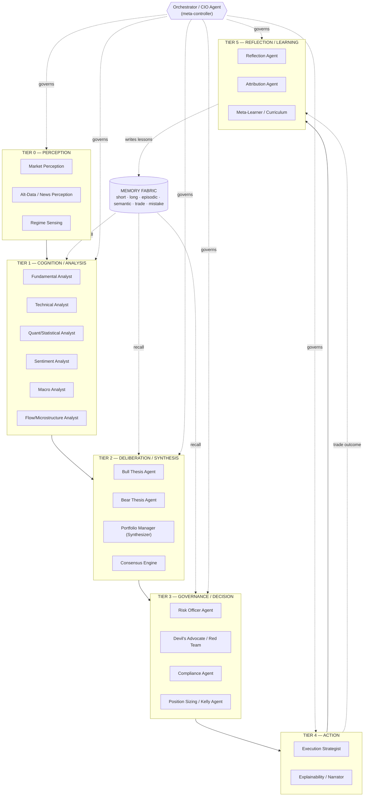
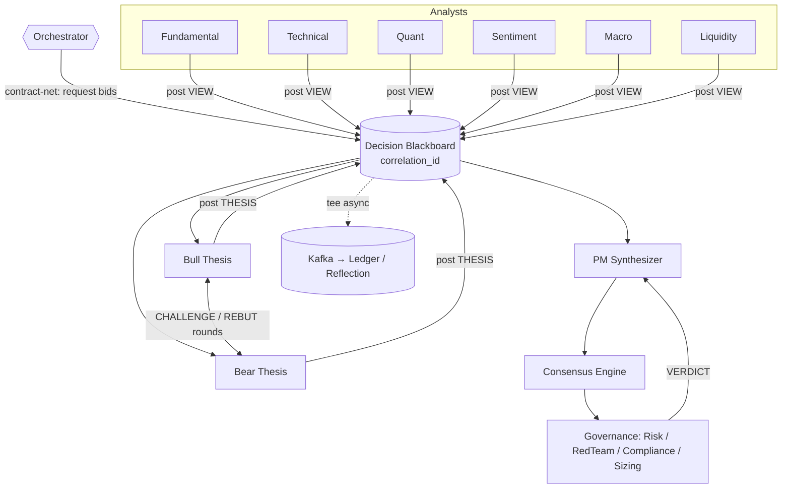
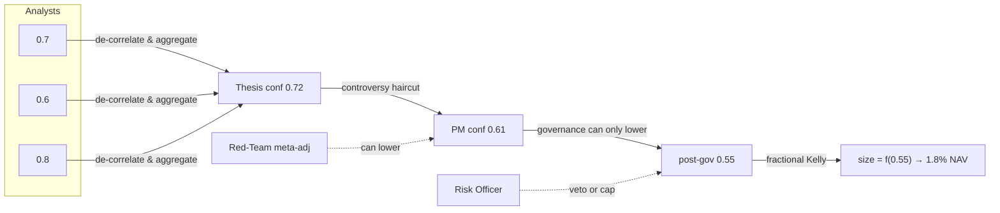
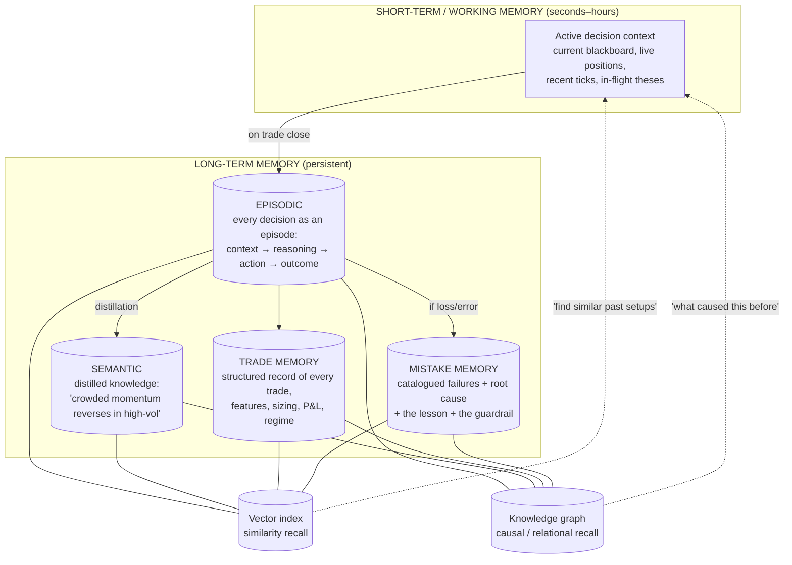
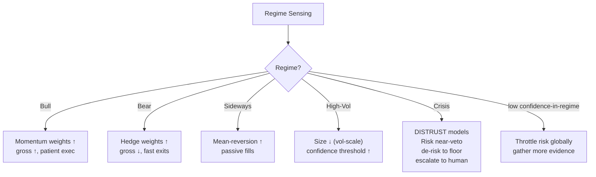
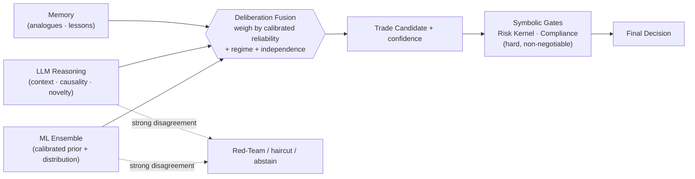
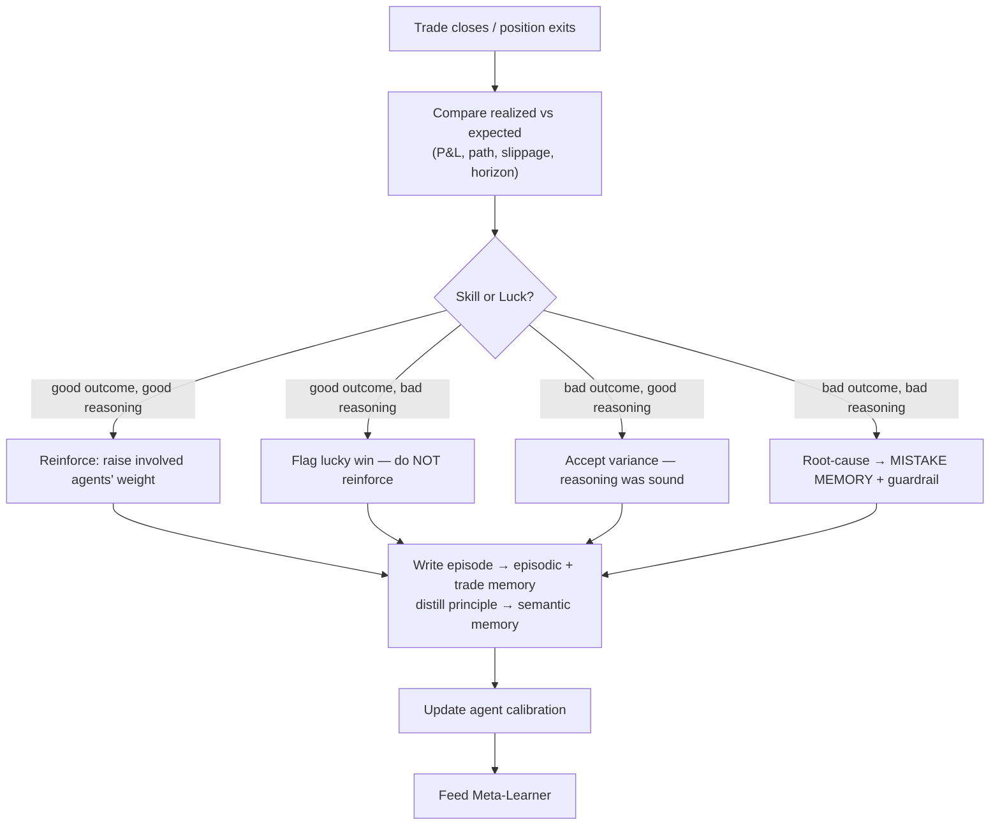
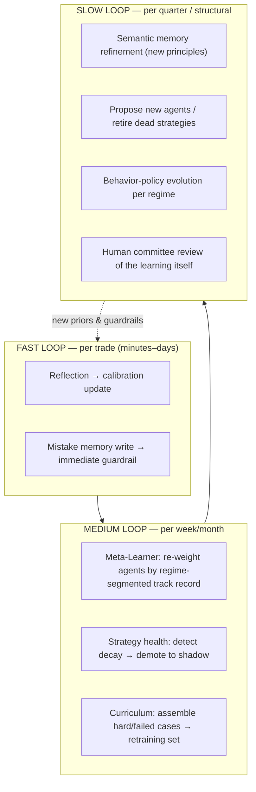
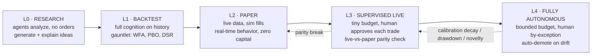
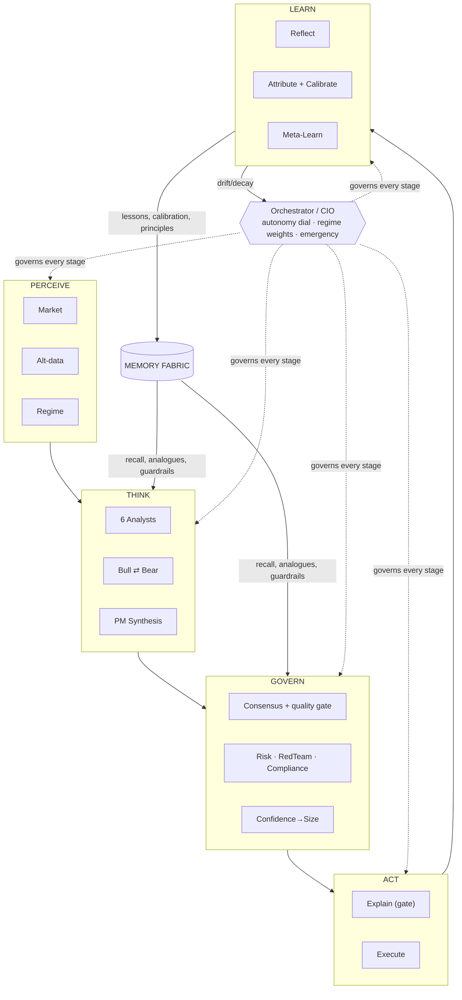

# The Intelligence Layer — Cognitive Architecture of an Autonomous AI Investment Firm

> This is the **brain** that sits on top of the distributed platform (see `AI_QUANT_PLATFORM_BLUEPRINT.md`). The platform is the body — nerves (Kafka), organs (services), skeleton (Kubernetes). This document designs the mind: how the system *perceives, reasons, decides, remembers, reflects, and improves*.
>
> Design intent: behave like an **investment firm staffed by specialists**, not a trading bot. A bot maps signal → order. A firm *deliberates* — analysts argue, a PM weighs them, a risk officer can veto, a CIO sets the regime, and every decision is written down and reviewed after the fact. We are building that firm in silicon.

---

## 0. First Principles of the Cognitive Layer

Nine invariants that constrain every design choice below:

1. **Deliberation over reflex.** A single model output is a hypothesis, never a decision. Decisions emerge from structured multi-agent debate.
2. **Separation of powers.** The agent that *proposes* a trade is never the agent that *approves* it. Proposer, critic, risk officer, and executor are distinct, with opposed incentives.
3. **Confidence is a first-class citizen.** Every belief, signal, and vote carries a calibrated uncertainty that propagates end-to-end. Low confidence is not failure — it is information that changes behavior.
4. **Memory is the moat.** Alpha decays; the ability to *learn from your own history of mistakes* compounds. The memory subsystem is as important as the reasoning subsystem.
5. **Every decision must justify itself.** If a trade cannot be explained in a causal, auditable chain, it does not execute in autonomous mode. Explainability is a gate, not a report.
6. **Regime-conditioned behavior.** The same signal means different things in a bull melt-up versus a liquidity crisis. The system's entire disposition shifts with the detected market regime.
7. **The kernel is sovereign.** The Intelligence Layer *proposes*; the platform's risk kernel (hard, human-owned ceilings) *disposes*. No agent, no consensus, no reflection can raise a hard limit. Cognition lives strictly inside the sandbox the kernel defines.
8. **Reflection is mandatory, not optional.** Every closed trade triggers a post-mortem that writes to memory. The system that does not reflect does not learn.
9. **Autonomy is earned, revocable, and graduated.** Trust is a dial, not a switch, and it turns down instantly the moment calibration degrades.

---

## 1. Complete Cognitive Architecture

The brain is organized as a **five-tier cognitive stack**, mirroring how a real investment firm processes the world from raw perception to executed action to learned wisdom.



**Reading the stack top to bottom:**
- **Tier 0 — Perception** turns raw market/alt-data into structured, contextualized observations and *names the regime*.
- **Tier 1 — Cognition** is the analyst floor: six specialists each view the same instrument through one lens and emit a *view* with confidence.
- **Tier 2 — Deliberation** forces adversarial synthesis: an explicit bull and bear thesis are constructed, then a PM synthesizer + consensus engine reconcile them into a candidate decision.
- **Tier 3 — Governance** is the check on cognition: risk, red-team, compliance, and sizing can attenuate or veto — never amplify beyond the kernel.
- **Tier 4 — Action** chooses *how* to execute and produces the mandatory human-readable justification.
- **Tier 5 — Reflection** closes the loop: every outcome is attributed, every mistake is catalogued, and the meta-learner adjusts the firm's behavior over time.
- The **Orchestrator/CIO** is the meta-controller threading through all tiers — it sets the deliberation budget, arbitrates deadlocks, tunes agent weights by regime, and owns the autonomy dial.
- The **Memory Fabric** is read by every cognitive tier and written by reflection — it is the connective tissue that makes the firm learn.

---

## 2. The Agent Roster (18 Specialized Agents)

Each agent is a bounded specialist. Below: its **responsibility**, **inputs**, and **outputs**. Every agent output carries a common envelope — `{claim, evidence[], confidence ∈ [0,1], calibration_class, regime_context, provenance, dissent_notes}` — so downstream agents can reason about *how much to trust* each input, not just its content.

### Tier 0 — Perception

**1. Market Perception Agent**
- **Responsibility:** Convert raw ticks/bars/order-book into denoised, structured market state: trend, momentum, volatility surface, liquidity, correlation structure. The "eyes."
- **Inputs:** Normalized market data (feature store online path), volatility & liquidity features, cross-asset correlations.
- **Outputs:** `MarketStateVector` — structured observation with per-feature confidence and data-quality flags (stale/gapped/suspect).

**2. Alt-Data & News Perception Agent**
- **Responsibility:** Ingest and interpret unstructured signals — news, filings, transcripts, social, satellite/supply-chain. Entity-resolve to instruments; extract events (earnings surprise, guidance cut, M&A). Uses LLM reasoning over text.
- **Inputs:** News/filings/social streams, NLP embeddings, entity graph.
- **Outputs:** `EventSet` — timestamped, entity-linked events with materiality score, novelty score, and source-reliability weighting.

**3. Regime Sensing Agent** *(the CIO's instrument)*
- **Responsibility:** Continuously classify the prevailing market regime and estimate transition probabilities. The single most behavior-shaping signal in the system (see §9).
- **Inputs:** Volatility term structure, breadth, credit spreads, correlation dispersion, macro prints, liquidity metrics.
- **Outputs:** `RegimeState` — distribution over {Bull, Bear, Sideways, High-Vol, Crisis/Black-Swan}, transition-hazard estimate, and a **confidence-in-regime** score that gates system-wide risk appetite.

### Tier 1 — Cognition (the Analyst Floor)

**4. Fundamental Analyst Agent**
- **Responsibility:** Value instruments from fundamentals — earnings, cash flow, balance sheet, growth, quality, relative valuation.
- **Inputs:** Financials, estimates, sector comps, macro context.
- **Outputs:** `FundamentalView` — fair-value estimate, mispricing magnitude, thesis, horizon, confidence.

**5. Technical Analyst Agent**
- **Responsibility:** Price/volume structure — trend, support/resistance, momentum, mean-reversion setups, pattern completion.
- **Inputs:** `MarketStateVector`, multi-timeframe price/volume history.
- **Outputs:** `TechnicalView` — directional bias, entry/exit zones, invalidation level, horizon, confidence.

**6. Quant/Statistical Analyst Agent**
- **Responsibility:** Model-driven edge — the ensemble of registered ML models (factor models, GBMs, sequence models, RL policies). This is where the trained models "vote." Produces the statistical prior.
- **Inputs:** Feature vectors (point-in-time), model-registry ensemble outputs from the GPU inference server.
- **Outputs:** `QuantView` — expected return, predicted distribution (not just a point), model-agreement metric, per-model attribution, confidence (calibrated).

**7. Sentiment Analyst Agent**
- **Responsibility:** Aggregate positioning and crowd psychology — is the trade crowded? Is sentiment a contrarian signal or a momentum confirm?
- **Inputs:** `EventSet`, options skew/put-call, positioning data, social sentiment.
- **Outputs:** `SentimentView` — sentiment level, crowding score, contrarian/confirming flag, confidence.

**8. Macro Analyst Agent**
- **Responsibility:** Top-down context — rates, inflation, growth, policy, cross-asset regime linkages. Sets the weather the stock flies in.
- **Inputs:** Macro data, yield curve, central-bank signals, `RegimeState`.
- **Outputs:** `MacroView` — regime-conditioned tailwind/headwind per sector/factor, scenario probabilities, confidence.

**9. Flow / Microstructure Analyst Agent**
- **Responsibility:** Read order-flow, liquidity, and market impact — *can we even get this size on without moving the market?* Distinguishes real edge from illusory (illiquid) edge.
- **Inputs:** Order-book depth, trade prints, historical impact model, current liquidity.
- **Outputs:** `LiquidityView` — executable size, expected slippage/impact, optimal participation rate, confidence.

### Tier 2 — Deliberation (Adversarial Synthesis)

**10. Bull Thesis Agent**
- **Responsibility:** Construct the *strongest possible* case FOR the trade, marshaling every analyst view that supports it. Deliberately one-sided by design.
- **Inputs:** All Tier-1 views, relevant memory recall (similar past setups that worked).
- **Outputs:** `BullThesis` — structured argument, supporting evidence, expected payoff, key assumptions, confidence.

**11. Bear Thesis Agent**
- **Responsibility:** Construct the *strongest possible* case AGAINST — what breaks this trade, what the bulls are ignoring, historical analogues that failed.
- **Inputs:** All Tier-1 views, mistake memory (similar past setups that lost).
- **Outputs:** `BearThesis` — structured counter-argument, tail risks, disconfirming evidence, confidence.

**12. Portfolio Manager (Synthesizer) Agent**
- **Responsibility:** The PM. Weigh bull vs. bear against the *existing portfolio* (not in isolation) — marginal contribution to return, diversification, factor exposure, correlation. Produces a candidate decision.
- **Inputs:** `BullThesis`, `BearThesis`, all Tier-1 views, current portfolio state, `RegimeState`.
- **Outputs:** `TradeCandidate` — direction, target size, horizon, rationale synthesis, portfolio-fit score, **pre-governance confidence**.

**13. Consensus Engine** *(mechanism, not a persona — see §6)*
- **Responsibility:** Aggregate the weighted, confidence-scored votes of all analysts into a single agreement measure and detect the *shape* of disagreement (noise vs. genuine controversy).
- **Inputs:** All Tier-1 views + theses with confidence + regime-conditioned agent weights.
- **Outputs:** `ConsensusReport` — agreement score, dispersion, dissent map, and a decision-quality flag (proceed / deliberate more / abstain).

### Tier 3 — Governance (Checks on Cognition)

**14. Risk Officer Agent**
- **Responsibility:** Independent risk view with **veto power**. Checks marginal VaR, stress/scenario loss, concentration, correlation-cluster exposure, drawdown budget. Cannot be overruled by consensus — only by human four-eyes.
- **Inputs:** `TradeCandidate`, portfolio risk state, `RegimeState`, stress scenarios.
- **Outputs:** `RiskVerdict` — approve / attenuate (with max size) / veto, with reason codes and the binding constraint.

**15. Devil's Advocate / Red-Team Agent**
- **Responsibility:** Adversarially attack the *decision process itself*, not the trade — "Are we overfit to recent regime? Is this crowded consensus a warning? Are we anchored on a memory that doesn't apply?" Guards against groupthink and correlated agent failure.
- **Inputs:** Full deliberation trace, `ConsensusReport`, memory of past consensus failures.
- **Outputs:** `RedTeamReport` — process-risk flags, meta-confidence adjustment (can *lower* system confidence).

**16. Compliance Agent**
- **Responsibility:** Pre-trade regulatory/mandate gate — restricted lists, wash/self-match, position limits, mandate constraints, licensing of data used. Hard gate.
- **Inputs:** `TradeCandidate`, compliance rules, restricted lists, data-lineage of the decision.
- **Outputs:** `ComplianceVerdict` — clear / block, with citation.

**17. Position Sizing / Kelly Agent**
- **Responsibility:** Translate an approved directional view + confidence into an *optimal size* — fractional-Kelly under uncertainty, scaled by regime, capped by risk budget. Confidence directly modulates size.
- **Inputs:** Approved `TradeCandidate`, propagated confidence, `RiskVerdict` max size, `RegimeState`, portfolio state.
- **Outputs:** `SizedOrder` — final notional, entry plan, stop/invalidation, confidence-scaled.

### Tier 4 — Action

**18. Execution Strategist Agent**
- **Responsibility:** Decide *how* to execute — order type, slicing (VWAP/TWAP/POV/implementation-shortfall), venue, urgency — to minimize impact given `LiquidityView`. Hands the plan to the platform's EMS.
- **Inputs:** `SizedOrder`, `LiquidityView`, real-time microstructure, urgency from regime.
- **Outputs:** `ExecutionPlan` — child-order schedule, routing, and abort conditions.

**+ Explainability / Narrator Agent** *(cross-cutting, Tier 4/5)*
- **Responsibility:** Compose the mandatory human-readable justification for every decision — the causal chain from perception → views → theses → synthesis → governance → size → execution. Gate in autonomous mode: no explanation, no trade.
- **Inputs:** Complete decision trace, all agent envelopes, memory citations.
- **Outputs:** `DecisionNarrative` — layered explanation (one-line → paragraph → full trace), written to the WORM ledger.

### Tier 5 — Reflection & Learning

**19. Reflection Agent** *(runs after every closed trade — §16)*
- **Responsibility:** Post-mortem each trade: was the outcome consistent with the reasoning? Skill or luck? Which agents were right/wrong? Writes lessons to memory.
- **Inputs:** Trade outcome, original decision trace, realized vs. expected, market path.
- **Outputs:** `TradePostMortem` + `MemoryWrite` (episodic + trade +, if applicable, mistake memory).

**20. Attribution & Meta-Learner Agent** *(the CIO's learning arm — §17–18)*
- **Responsibility:** Aggregate post-mortems into structural learning — recalibrate agent trust weights, detect decaying strategies, propose curriculum for retraining, adjust regime-conditioned behavior. Turns individual mistakes into firm-level policy.
- **Inputs:** Stream of `TradePostMortem`s, agent hit-rates over time, regime-segmented performance.
- **Outputs:** `AgentWeightUpdate`, `StrategyHealthReport`, `RetrainingCurriculum`, `BehaviorPolicyUpdate`.

> **Orchestrator / CIO Agent** (meta-controller, spans all tiers): owns the autonomy dial, the deliberation budget, deadlock arbitration, regime-conditioned agent weighting, and the emergency protocol. Not a specialist — the conductor. Described throughout §5, §6, §9, §24, §26.

**Roster count: 18 specialists + Narrator + Orchestrator = 20 cognitive units.**

---

## 3. Agent Communication Protocols

Agents do not call each other ad hoc — that way lies a tangled, untraceable mess. Communication is **structured, typed, and recorded**.

### 3.1 The Message Envelope (universal contract)
Every inter-agent message is a typed, immutable record:
```
{
  msg_id, correlation_id (the decision this belongs to),
  from_agent, to_agent | broadcast, tier,
  intent: VIEW | THESIS | CHALLENGE | VOTE | VERDICT | QUERY | REFLECTION,
  payload,                       # the typed claim
  confidence ∈ [0,1],
  calibration_class,             # this agent's historical reliability bucket
  evidence[],                    # pointers to features/memory/data (provenance)
  regime_context,
  timestamp, causal_parents[]    # forms the decision DAG
}
```
The `correlation_id` + `causal_parents[]` mean **every decision reconstructs as a directed acyclic graph** — perfect for explainability and post-mortem.

### 3.2 Three communication patterns
- **Blackboard (shared deliberation space).** For a given `correlation_id`, all agents read/write a shared, append-only blackboard. Analysts post views; theses read them; the PM reads everything. This avoids N² direct messaging and gives the Narrator a complete trace for free.
- **Contract-net (task delegation).** The Orchestrator broadcasts a decision request; agents "bid" with their relevance/confidence for this instrument+regime; the Orchestrator allocates deliberation budget to the most relevant. In a crisis regime, the Macro and Liquidity agents get more compute; in a quiet trend, the Technical/Quant agents lead.
- **Structured debate (adversarial rounds).** Bull and Bear agents exchange bounded rounds of `CHALLENGE`/`REBUT` messages, each round required to cite *new* evidence. The debate terminates on convergence, budget exhaustion, or Orchestrator call.

### 3.3 Transport
Maps onto the platform's spine: intra-decision agent traffic runs on a **low-latency in-process/gRPC bus** (deliberation is latency-sensitive), while every message is **teed asynchronously to Kafka** for the ledger, observability, and the reflection loop. The blackboard is the source of truth for one decision; Kafka is the source of truth for history.



---

## 4. Consensus Mechanism

Consensus is **not majority voting** — that would let six correlated analysts (all reading the same momentum signal) outvote one right-for-the-right-reasons dissenter. Instead:

### 4.1 Confidence-weighted, reliability-adjusted, regime-conditioned aggregation
Each analyst view contributes a vote weighted by three factors:
- **Stated confidence** (the agent's own uncertainty),
- **Calibration weight** (the agent's *historical* reliability — an agent that is 90%-confident and 55%-right gets discounted; see §8),
- **Regime relevance** (the Orchestrator's regime-conditioned weight — the Macro agent matters more in a crisis, the Technical agent more in a trend).

The aggregate is a **belief distribution over outcomes**, not a scalar — preserving disagreement shape rather than averaging it away.

### 4.2 Decision-quality gate (the key innovation)
The Consensus Engine emits not just "what" but "*how trustworthy is this consensus*":
- **Strong, coherent agreement** (high weighted agreement, low dispersion, diverse *reasoning paths*) → proceed.
- **Fragile agreement** (high agreement but from a *single* correlated cause — everyone just read the same news) → the Red-Team is invoked and confidence is haircut.
- **Genuine controversy** (bimodal views, strong on both sides) → escalate to extended debate or **abstain** (see §7).
- **Diffuse uncertainty** (everyone low-confidence) → shrink toward no-trade / minimum size.

> **Principle:** the system distinguishes *agreement* from *conviction*. Ten agents weakly agreeing is weaker than three strongly agreeing with independent reasoning. Diversity of *reasoning path* is a multiplier; correlated reasoning is a discount.

---

## 5. Disagreement Resolution

When agents conflict, the system resolves in an escalating ladder — never by silently averaging:

1. **Evidence reconciliation.** Are they disagreeing on *facts* or on *interpretation*? If facts (one agent has stale data), the Orchestrator forces a data refresh — often the conflict dissolves.
2. **Structured debate rounds.** Bull vs. Bear exchange bounded, evidence-cited rounds. Many disagreements resolve when each must confront the other's strongest point.
3. **Weighting by regime-conditioned track record.** If debate doesn't converge, defer toward the agent(s) with the best *calibrated* history *in this regime* for *this kind of setup* (pulled from trade memory).
4. **Red-Team tiebreak.** The Devil's Advocate assesses whether the disagreement reflects real controversy (→ reduce size / abstain) or resolvable noise.
5. **PM synthesis with explicit dissent recording.** The PM may still decide — but the dissent is *recorded in the narrative and the ledger*. A dissent that later proves right feeds directly into recalibrating that agent's weight upward (the system rewards prescient minorities).
6. **Abstention as a valid outcome.** If controversy is genuine and high-stakes, **not trading is a decision** — logged, explained, and reflected upon like any trade.
7. **Human escalation.** Above a stakes/uncertainty threshold, the decision is routed to a human (see §25).

> Renaissance's real lesson isn't a magic model — it's *disciplined disagreement*. We encode it: dissent is data, abstention is respectable, and being-right-when-others-were-wrong is explicitly rewarded in the weighting.

---

## 6. Confidence Scoring & Propagation

### 6.1 What confidence means here
Confidence is a **calibrated probability**, not a vibe. An agent claiming 0.8 confidence must, over history, be right ~80% of the time when it says 0.8. This is enforced by:
- **Calibration tracking** (reliability diagrams / Brier score per agent, per regime),
- **Post-hoc recalibration** (temperature scaling / isotonic on each agent's raw outputs),
- **Calibration class** attached to every message so consumers know how much to trust the stated number.

### 6.2 Confidence propagation (§23)
Confidence flows through the decision DAG and *compounds conservatively*:
- **Analyst → Thesis:** a thesis is only as strong as its evidence; confidence is aggregated but **penalized for correlated evidence** (three analysts citing the same source ≠ three independent confirmations).
- **Thesis → PM:** the PM's confidence = f(net thesis strength, consensus coherence, portfolio fit). Genuine controversy caps it.
- **PM → Governance:** Risk/RedTeam/Compliance can only *lower* confidence (or veto). Governance never raises it. This asymmetry is deliberate — the money path is fail-closed.
- **Confidence → Size:** the Sizing agent maps final confidence to notional via fractional Kelly, so **confidence literally becomes position size**. Low confidence → small or zero.
- **Uncertainty types are tracked separately:** *aleatoric* (irreducible market noise) vs. *epistemic* (we-don't-know-enough, reducible by more data/analysis). High epistemic uncertainty triggers "gather more / wait"; high aleatoric triggers "size down."



---

## 7. Market Regime Detection

The **Regime Sensing Agent** is the master switch that re-conditions the entire firm's behavior. It runs continuously, independent of any single trade.

### 7.1 Method (ensemble, not a single classifier)
- **Statistical regime models:** Hidden Markov Models / Markov-switching over returns & volatility; change-point detection; volatility-of-volatility.
- **Feature panel:** realized & implied vol term structure, cross-asset correlation dispersion, market breadth, credit spreads, funding/liquidity stress, drawdown depth, macro surprise index.
- **LLM macro-synthesizer:** reasons over the qualitative narrative (policy shifts, geopolitical shocks) to catch regime changes the statistics lag on.
- **Output:** a *distribution* over regimes + transition-hazard + **confidence-in-regime**. Regime is never a hard label — it's a belief, and low confidence-in-regime itself throttles risk.

### 7.2 The five regimes and their meaning
`{Bull-Trend, Bear-Trend, Sideways/Range, High-Volatility, Crisis/Black-Swan}` — behavior per regime is detailed in §11.

### 7.3 Why it's central
Regime sets, system-wide: (a) agent weights, (b) gross/net exposure caps, (c) position-sizing aggressiveness, (d) execution urgency, (e) which strategies are enabled, (f) the human-escalation threshold. **One signal, global effect** — because in markets, context dominates content.

---

## 8. Memory Fabric — the Firm's Institutional Knowledge

Five specialized memory systems plus a working buffer. Memory is what turns a model into an *institution*.



### 8.1 Short-Term / Working Memory (§10)
- **What:** the active cognitive scratchpad for the *current* decision(s) — the live blackboard, current positions, recent market path, in-flight theses, the last N minutes of context.
- **Implementation stance:** in-memory, bounded, fast (Redis / process memory). Auto-expires; the salient parts are consolidated into long-term memory at trade close.
- **Why:** deliberation needs a coherent, low-latency context window — the analog of a trader's live attention.

### 8.2 Episodic Memory (§12)
- **What:** every decision stored as a complete *episode* — the full context, the reasoning DAG, the action, and the eventual outcome. "On 2026-03-14, in high-vol regime, we bought X because [thesis]; here's what happened."
- **Recall:** vector-similarity ("find past episodes that look like now") + graph ("what happened after similar macro shocks").
- **Why:** enables **case-based reasoning** — the Bull/Bear agents literally retrieve analogous past episodes as evidence. This is how the firm "remembers being burned."

### 8.3 Semantic Memory (§13)
- **What:** *distilled, generalized* knowledge extracted from many episodes — durable market wisdom, not raw events. "Crowded momentum trades reverse violently when volatility regime-shifts." "This factor decays after earnings." Stored as a curated knowledge graph + principles.
- **Recall:** consulted by analysts and the PM as priors and constraints.
- **Why:** the difference between remembering *events* and understanding *principles*. Semantic memory is the firm's accumulated theory of markets, continuously refined by the Meta-Learner.

### 8.4 Trade Memory (§14)
- **What:** the structured, queryable record of *every trade* — instrument, entry/exit, size, the confidence at decision time, the responsible agents, the regime, realized vs. expected P&L, slippage, holding period.
- **Recall:** powers calibration ("how well-calibrated was the Quant agent in bear regimes?"), sizing ("our historical edge on this setup"), and attribution.
- **Why:** the ground-truth ledger the entire learning loop is trained against. Without it, no calibration, no skill-vs-luck attribution.

### 8.5 Mistake Memory (§15) — *the most important memory*
- **What:** a *dedicated, first-class* catalogue of failures — not just losing trades, but **reasoning failures**: overconfidence, ignored dissent, stale data acted upon, regime misread, crowding missed, correlated-bet blowups. Each entry: `{context, what we believed, what actually happened, root cause, the lesson, the guardrail installed}`.
- **Recall:** **actively consulted before every new decision** — the Bear agent and Red-Team query mistake memory for "have we made this class of error before in a setup like this?" A matching mistake pattern raises a flag and haircuts confidence.
- **Why:** most trading systems repeat their mistakes because mistakes aren't structurally remembered. Here, a mistake once made becomes a *permanent immune-system antibody*. This is the single biggest driver of long-run robustness.

### 8.6 Governance of memory
- **Point-in-time correctness:** memory recall is time-gated — you can only recall what was knowable at decision time (no lookahead leakage into backtests).
- **Decay & relevance:** episodes are weighted by recency *and* regime-similarity; ancient episodes from a structurally different market are down-weighted, not deleted.
- **Poisoning defense:** memory writes are validated (an anomalous outcome doesn't overwrite a well-established principle without corroboration); the Meta-Learner requires statistical support before promoting an episode's lesson to semantic memory.

---

## 9. Regime-Conditioned Behavior (§21)

The firm behaves like a *different firm* in each regime. The Orchestrator applies a **behavior policy** keyed on `RegimeState`.

| Regime | Disposition | Agent weighting | Exposure / sizing | Execution | Dominant risk |
|---|---|---|---|---|---|
| **Bull-Trend** | Trend-following, ride momentum, buy dips | Technical + Quant momentum up; Sentiment as crowding-watch | Higher gross, longer holds, wider trailing stops | Patient, minimize impact | Complacency, late-cycle reversal |
| **Bear-Trend** | Capital preservation, short/hedge, sell rallies | Macro + Risk up; downside protection | Lower gross, tighter stops, favor liquidity | Faster exits, hedge overlays | Bear-rally whipsaw |
| **Sideways/Range** | Mean-reversion, harvest range, sell vol | Technical mean-reversion + Stat-arb up | Moderate, quick turnover, small edges | Passive/limit orders, capture spread | False breakouts |
| **High-Volatility** | Reduce, widen bands, demand more edge | Liquidity + Risk + Red-Team up; raise confidence threshold | Cut size sharply (vol-scaling), shorten horizon | Urgent, cross the spread when needed | Gap risk, liquidity holes |
| **Crisis / Black-Swan** | **Survive first.** De-risk, de-correlate, raise cash | Risk Officer near-veto authority; Macro + Liquidity dominate; Quant models *distrusted* (out-of-distribution) | Slash gross toward defensive floor; kill leverage | Immediate, prioritize getting out over price | Model breakdown, cascading correlations, funding |

### 9.1 Black-Swan special handling (the most important row)
Black-swan events are **out-of-distribution** — exactly where trained ML models are most dangerous (confident and wrong). So the system *deliberately distrusts its own quant models* in crisis:
- **Automatic epistemic humility:** confidence-in-regime drops → global risk appetite collapses toward a defensive floor.
- **Circuit breakers hand off to the risk kernel:** the cognitive layer stops *initiating* and shifts to *orderly de-risking* within hard limits.
- **Novelty detection:** if current market state has *no close analogue in episodic memory* (high novelty score), the system flags "unprecedented," widens uncertainty, and escalates to humans.
- **Fail-closed:** when in doubt in a crisis, the default action is *reduce and preserve*, never *press the bet*. Losing alpha is survivable; a blowup is not.



---

## 10. Combining ML Models + LLM Reasoning into One Decision (§22)

The system fuses **three fundamentally different kinds of intelligence** — and never lets any one dominate blindly:

1. **Statistical/ML models** (the Quant agent's ensemble): pattern recognition, calibrated probabilistic edge, superhuman on structured, in-distribution data. **Weakness:** brittle out-of-distribution, can't explain themselves.
2. **LLM reasoning** (analyst, thesis, macro, red-team agents): contextual synthesis, causal narrative, handling novelty and unstructured text, *explaining* — behaving like a human analyst. **Weakness:** miscalibrated, can hallucinate, no innate numeric edge.
3. **Symbolic/rule constraints** (risk kernel, compliance): hard, verifiable guarantees. **Weakness:** no learning, no nuance.

### 10.1 The fusion doctrine
- **ML provides the prior; LLM provides the context and the veto/confirm.** The Quant agent emits a calibrated probabilistic view; the LLM analysts *contextualize* it ("the model is bullish, but it hasn't seen this policy shock — discount it"). The LLM can *lower* confidence in the model when the world is out-of-distribution; it should not fabricate edge the models don't see.
- **Never a naive blend of scores.** Fusion happens through the *deliberation structure*, not by averaging a model score with an LLM score. The ML output is *evidence* the reasoning agents weigh — with the ML's calibrated track record as its weight.
- **Cross-checking, both directions:** if ML and LLM strongly disagree, that disagreement is a first-class signal → Red-Team review, confidence haircut, possible abstain. Agreement across *independent kinds of reasoning* is the strongest confirmation the system can produce.
- **Symbolic layer is absolute:** whatever ML+LLM conclude, the risk kernel and compliance are hard gates. Learning systems propose; verified rules dispose.



---

## 11. Reasoning Before an Order (§19) — the Decision Pipeline

Before *any* order, a fixed reasoning pipeline executes and is recorded. No shortcuts in autonomous mode.

```mermaid
flowchart TB
    T["Trigger: signal / event / rebalance"] --> PERC["1 · Perceive<br/>market state + events + regime"]
    PERC --> RECALL["2 · Recall<br/>similar episodes, relevant lessons,<br/>mistake-memory check"]
    RECALL --> ANALYZE["3 · Analyze<br/>6 analyst views + confidences"]
    ANALYZE --> DEBATE["4 · Deliberate<br/>Bull vs Bear structured debate"]
    DEBATE --> SYNTH["5 · Synthesize<br/>PM candidate vs portfolio"]
    SYNTH --> CONS["6 · Consensus<br/>agreement + decision-quality gate"]
    CONS --> Q1{Quality OK?}
    Q1 -->|controversy / low conf| ABSTAIN["Abstain or gather more<br/>(logged as a decision)"]
    Q1 -->|proceed| GOV["7 · Govern<br/>Risk · Red-Team · Compliance"]
    GOV --> Q2{Approved?}
    Q2 -->|veto| ABSTAIN
    Q2 -->|approve/attenuate| SIZE["8 · Size<br/>confidence→fractional Kelly"]
    SIZE --> EXPLAIN["9 · Explain<br/>generate DecisionNarrative"]
    EXPLAIN --> Q3{Narrative coherent?<br/>(gate in autonomy)}
    Q3 -->|no| ABSTAIN
    Q3 -->|yes| EXEC["10 · Execute<br/>ExecutionPlan → EMS"]
    EXEC --> LEDGER["Write full trace → WORM ledger"]
    LEDGER --> REFLECT["→ Reflection loop on close"]
```

Every stage writes to the blackboard and tees to the ledger, so the *reasoning* — not just the order — is permanently auditable.

---

## 12. Explainability — Every Trade Justifies Itself (§20)

Explainability is a **gate**, produced by the Narrator agent as a layered artifact:

- **Layer 1 — One-liner:** "Long AAPL 1.8% NAV: strong quant momentum + earnings-beat confirmation, bull thesis dominated bear on flow support, high-vol regime → half-Kelly sizing."
- **Layer 2 — Structured rationale:** the key views, the winning thesis, the main risks accepted, the dissent recorded, the binding risk constraint, the confidence and why.
- **Layer 3 — Full causal DAG:** the complete decision graph — every agent message, every piece of evidence with provenance, every memory citation, the model versions used, the regime context. Reconstructable years later for any regulator or post-mortem.

**Enforcement:** in supervised and autonomous modes, a trade with an incoherent or missing narrative is **blocked**. Explainability isn't documentation *after* the decision — it's a *precondition* of the decision. This also feeds reflection: a decision you can't explain is one you can't learn from.

---

## 13. Self-Reflection After Every Trade (§16)

The **Reflection Agent** fires on every position close (and on significant mark-to-market moves), producing a `TradePostMortem`:



**The crucial discipline — separate outcome from process.** A winning trade with bad reasoning (luck) is *not* rewarded; a losing trade with sound reasoning (variance) is *not* punished. Rewarding luck and punishing variance is how firms destroy themselves. The system reflects on *reasoning quality*, using outcome as noisy evidence — exactly as a good CIO reviews a trader.

---

## 14. Self-Improvement Loops & Learning from Mistakes (§17–18)

Three nested learning loops operating at different timescales:



### 14.1 Learning from historical mistakes (the antibody system)
1. Every mistake is root-caused and written to **mistake memory** with an installed **guardrail** (a check that would have caught it).
2. Before each new decision, the Bear/Red-Team agents **query mistake memory** for analogous error patterns → if matched, flag + confidence haircut. *The system cannot walk into the same trap twice without at least being warned.*
3. The Meta-Learner mines mistake memory for *recurring* patterns → promotes them to **semantic principles** and, if systemic, proposes structural changes (new guardrail, agent re-weight, strategy retirement).
4. **Backtest-the-lesson:** proposed behavior changes are validated on historical data (via the platform's backtest gauntlet) before adoption — the firm learns, but only changes that *survive out-of-sample* are kept. No overfitting to the last mistake.

### 14.2 Anti-overfitting on the learning itself
The meta-learning is disciplined: changes require statistical support across many episodes, are validated out-of-sample, and are gated by the human committee for structural shifts. The system is built to learn *durable* lessons, not to chase the last trade.

---

## 15. Emergency Behavior Under High Uncertainty (§24)

When uncertainty spikes — high dispersion, low confidence-in-regime, novelty with no memory analogue, model/LLM disagreement, data-quality degradation, or drawdown-velocity anomaly — the Orchestrator triggers **graduated emergency protocols**:

| Uncertainty level | Trigger | System behavior |
|---|---|---|
| **Elevated** | Rising dispersion / mild epistemic uncertainty | Raise confidence threshold; size down; prefer liquid names; more deliberation budget |
| **High** | Genuine controversy or low regime confidence | Default to **abstain**; only high-conviction, well-explained trades pass; hedge existing risk |
| **Severe** | Novelty (no analogue), model OOD, data suspect | **Stop initiating.** Shift to orderly de-risking within kernel limits; escalate to human |
| **Critical** | Drawdown velocity / feed failure / cascade | **Cognitive layer yields to the risk kernel's circuit breaker.** Mass de-risk / flatten per policy; page humans; require four-eyes to resume |

**Doctrine:** under high uncertainty the system's default flips from "find a trade" to "preserve capital and defer." Uncertainty *contracts* the action space rather than being ignored. The worst decisions are made confidently in fog — so in fog, the system stops being confident.

---

## 16. Human Override Modes (§25)

Humans are always sovereign above the AI. Override is layered and always-available (routed through the platform's control plane, RBAC + four-eyes, every action to the WORM ledger):

- **Observe** — humans watch every decision + narrative live; no intervention.
- **Approve-per-trade** — the AI proposes fully reasoned+explained trades; a human clicks to execute (supervised mode default).
- **Veto / hold** — humans can veto any pending trade or freeze any strategy/instrument instantly.
- **Constrain** — humans tighten limits, disable regimes/strategies, cut gross, or narrow the universe on the fly (only tighten — loosening needs four-eyes committee).
- **Nudge / inject** — humans add a view or constraint into deliberation ("treat this as crisis regime," "avoid this name") that the agents must weigh and the narrative must reflect.
- **Global kill-switch** — one action halts all new intent and de-risks; resuming *always* requires explicit human four-eyes. No AI consensus can resume trading after a kill.

**Invariant:** the AI can *never* expand its own authority. It can propose, warn, and de-risk autonomously; it can only *gain* capital or loosen limits through human action. The hard ceilings live in the risk kernel, outside cognition entirely.

---

## 17. Autonomy Levels (§26)

Autonomy is a **graduated dial**, each level a rung earned by demonstrated, measured, *calibrated* reliability — and instantly revocable.



| Level | Capital | Human role | Promotion gate | Auto-demotion trigger |
|---|---|---|---|---|
| **Research** | none | directs research | ideas are reproducible & explained | — |
| **Backtesting** | none | reviews reports | passes anti-overfit gauntlet (WFA, purged-CV, DSR, PBO) | fails out-of-sample |
| **Paper** | none | monitors | N days live-data parity + stable calibration | behavior diverges from backtest |
| **Supervised Live** | tiny, capped | approves each trade | live results parity with paper; calibration holds | parity break / miscalibration |
| **Fully Autonomous** | bounded, kernel-capped | exception-only + can override | sustained calibrated performance across ≥1 regime cycle | drawdown, calibration decay, drift, novelty, or process failure → instant demote |

**Governing rule:** autonomy scales with *calibration*, not with profit. A profitable-but-miscalibrated system is demoted — because its confidence can't be trusted to size the next bet. Capital-at-risk is always a function of *demonstrated, measured reliability*, never of ambition or recent luck. Demotion is automatic and fast; promotion is deliberate and human-gated.

---

## 18. Consolidated Diagrams

### 18.1 Cognitive Architecture — see §1.
### 18.2 Agent Communication — see §3.3.
### 18.3 Decision Pipeline — see §11.
### 18.4 Memory Architecture — see §8.
### 18.5 Reflection Loop — see §13.

### 18.6 The Whole Mind, One View



---

## 19. Why This Is a Firm, Not a Bot — Closing Synthesis

A trading bot is a function: `signal → order`. What we've designed is an **organization with a mind**:

- It **perceives** context and *names its own regime* before acting.
- It **deliberates** — proposer, critic, PM, risk officer, red-team — with *separation of powers* and disciplined disagreement.
- It **quantifies its own uncertainty**, propagates it honestly, and lets confidence *become* position size.
- It **remembers** — episodically, semantically, and, crucially, its own **mistakes** — and consults that memory before every decision.
- It **reflects** on every trade, separating skill from luck, and **learns durable lessons** that survive out-of-sample.
- It **explains itself** as a precondition of acting, not as an afterthought.
- It **knows when it doesn't know** — and in fog, it preserves capital and defers to humans rather than pressing confident bets into the unknown.
- It **earns autonomy** in graduated, revocable rungs, tied to *calibration* rather than recent profit, always beneath a sovereign human-owned risk kernel it can never override.

The intelligence is not in any single model. It is in the **structure** — the separation of powers, the confidence discipline, the memory of mistakes, the mandatory reflection, and the regime-conditioned humility. That structure is what lets this system be trusted, eventually, with institutional capital: not because it is always right, but because it is *calibrated about how right it is*, it *remembers when it was wrong*, and it *turns its own authority down the moment it stops being trustworthy*.

> The next design docs this invites: (a) the **calibration & confidence math** (proper scoring, reliability tracking, fractional-Kelly under model uncertainty); (b) the **agent prompt/role contracts & orchestration protocol**; (c) the **memory schema & point-in-time recall guarantees**. Each deserves its own detailed specification.
