# AQROS — Execution Blueprint (Master Engineering Guide)

> **AQROS** = *Autonomous Quant Research & Order System.* This document turns the four source-of-truth design docs into a buildable plan a senior engineering team can execute from an empty repository.
>
> **Source of truth (do not contradict; this doc *implements* them):**
> - `AI_QUANT_PLATFORM_BLUEPRINT.md` — the body (distributed system)
> - `claude_aiBrain.md` — the mind (cognitive/agent architecture)
> - `claude_ROI.md` — the foundation (knowledge & data layer)
> - `claude_MLResearchFramework.md` — the discipline (ML & quant research)
>
> **This document's job:** *how to build it* — repo, services, databases, APIs, roadmap, MVP, priorities, testing, CI/CD. Sections 1–10 here; 11–16 follow after review.
>
> **Prime directives for the build team:** (1) Correctness on the money path over everything. (2) One codebase for backtest/paper/live — never fork the logic. (3) Point-in-time correctness is enforced by construction, never by review. (4) The risk kernel is sovereign; the AI proposes, the kernel disposes. (5) Every artifact is versioned, reproducible, and auditable. (6) Ship a thin vertical slice end-to-end before widening any layer.

---

## 1. Project Goals

We build in four trust-gated stages. **Capital-at-risk increases only as validated reliability increases** — this mirrors the autonomy ladder (`claude_aiBrain.md` §26) and the model lifecycle (`claude_MLResearchFramework.md` §16). Each stage is a shippable, demonstrable product, not a checkpoint.

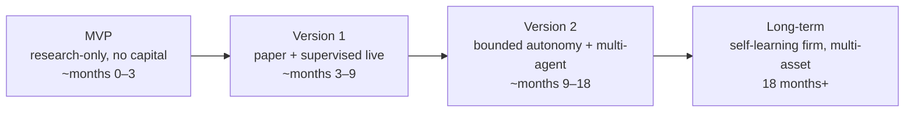

### 1.1 MVP — "Our numbers are real" (research-only, zero capital)
**Goal:** a reproducible research loop that can ingest data, engineer point-in-time-correct features, train and validate one model class, and backtest a strategy honestly — with no path to real money at all.

Included:
- Market-data ingestion (one vendor, equities/daily+intraday bars) → time-series store.
- Data lake (Bronze/Silver/Gold) on object storage with an open table format; **bitemporal, PIT-correct** storage (`claude_ROI.md` §17).
- Feature store (offline path only) with as-of joins; single feature definition.
- One model class (gradient-boosted trees) + the mandatory linear baseline (`claude_MLResearchFramework.md` §4.1).
- Validation gauntlet: walk-forward + purged CV + deflated Sharpe (`claude_MLResearchFramework.md` §8).
- Backtest engine with realistic costs; signed backtest report.
- Model registry (versioning + lineage) and experiment tracking.
- Minimal API + a read-only research UI (view backtests, datasets, lineage).

Explicitly excluded: live/paper trading, execution, the multi-agent brain, online feature serving, GPU inference, autonomy. (Full exclusion list in §7.)

### 1.2 Version 1 — "It behaves in real time" (paper + supervised live)
**Goal:** the same strategy/risk code runs on *live data*, first with simulated fills (paper), then with tiny, human-approved real capital.

Adds:
- Event backbone (Kafka) as the spine; streaming ingestion.
- Online feature store (Redis) + **online/offline parity monitor** (`claude_ROI.md` §21).
- Real-time strategy engine + **risk engine with a hard kernel** (pre-trade checks, exposure caps).
- OMS + EMS with a broker adapter; **paper simulator** (live data, simulated fills) sharing the exact strategy/risk/OMS code as backtest.
- Control plane (promote/demote, kill-switch, limits) with RBAC + four-eyes; WORM audit ledger.
- Supervised-live: approve-per-trade, kernel-capped tiny budget, live-vs-paper parity gate.
- GPU inference service (single-model serving); basic explainability (SHAP + a decision narrative).
- Observability stack (metrics/logs/traces) and alerting.

### 1.3 Version 2 — "The firm deliberates" (bounded autonomy + multi-agent)
**Goal:** the cognitive layer comes online — specialized agents deliberate, a consensus mechanism and risk-critic govern, confidence propagates to sizing, and the system executes autonomously *within hard kernel ceilings*.

Adds:
- The multi-agent brain (`claude_aiBrain.md`): perception → analyst floor → bull/bear deliberation → PM synthesis → governance (risk/red-team/compliance/sizing) → execution + narrator → reflection.
- Knowledge graph + vector store; hybrid memory federation (episodic/semantic/trade/mistake).
- Regime detection re-conditioning behavior; confidence scoring + calibration.
- Reflection-after-every-trade + mistake memory + the meta-learner (self-improvement loops).
- Model portfolio: ensemble architecture, drift detection, automatic (validated, non-auto-promoting) retraining.
- Bounded fully-autonomous trading with exception-only human supervision and auto-demotion on drift.
- Portfolio optimizer; richer explainability (counterfactuals, attention).

### 1.4 Long-term Vision — "The factory works" (self-learning, multi-asset, institutional)
**Goal:** a continuously self-improving AI investment firm managing institutional capital across asset classes.

Adds (see §16 for detail): multi-market/multi-asset (futures, options, FX, crypto) via adapters on the same spine; agentic research automation (agents propose strategies through the full gauntlet); distributed training; multi-region active-passive DR; financial foundation models + causal AI + temporal GNNs (`claude_MLResearchFramework.md` §17); institutional-grade compliance, capacity management, and multi-prime connectivity.

> **Feature-to-stage rule of thumb:** if a feature can *lose money when wrong*, it does not appear before V1, and only under a hard kernel + human approval. If it *learns and acts autonomously*, it does not appear before V2, and only within validated bounds. Everything in MVP is safe by construction because there is no path to capital.

---

## 2. Repository Architecture

**Decision: a monorepo** (single repository, many services) with strict, enforced module boundaries. Rationale: one place to reason about cross-cutting contracts (event schemas, common types), atomic cross-service changes, hermetic reproducible builds, and unified CI — critical when backtest/paper/live must share code exactly. Boundaries are enforced by build tooling (Bazel/Nx-style targets) + `CODEOWNERS`, so "monorepo" never means "big ball of mud."

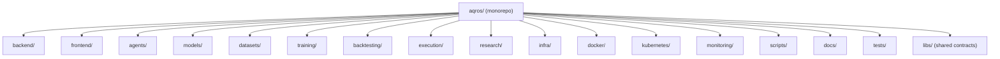

### 2.1 Top-level folders — purpose and rationale

| Folder | Contains | Why it exists / boundary rule |
|---|---|---|
| **`libs/`** (shared) | Event/topic schemas (Avro/Protobuf), canonical domain types (money, instrument, time-with-PIT), auth/mTLS clients, observability wrappers, the backtest/paper/live shared strategy+risk core | The **single source of cross-service contracts.** Every service depends *only* on `libs/` for shared meaning — never on another service's internals. This is what makes the monorepo safe. The shared strategy/risk/OMS core lives here so backtest/paper/live physically cannot diverge |
| **`backend/`** | The microservices (API gateway, auth, market-data, feature-store, model-registry, risk, portfolio, OMS/EMS, memory, notification, etc.) — one subfolder per service | The running system's server-side. Each service is independently buildable/deployable; cross-service comms go through `libs/` contracts (async Kafka or gRPC), never direct imports |
| **`frontend/`** | Research UI, trader/control console, admin console (dashboards, backtest viewer, live risk, approvals) | Human surfaces. Talks only to the API gateway — never directly to internal services. Kept thin; business logic lives server-side |
| **`agents/`** | The cognitive layer (`claude_aiBrain.md`): perception, analysts, bull/bear, PM, consensus, risk-critic, red-team, compliance, sizing, narrator, reflection, meta-learner, orchestrator | The "mind." Each agent is a bounded unit with a typed contract. Agents *propose*; they call the risk service, never the venue. Sandboxed (V2+) |
| **`models/`** | Model definitions, architectures, per-model configs, registry-linked artifacts metadata (not weights — those go to object storage) | Model *code and specs*. Weights/artifacts are versioned in object storage + registry; this folder is what produces them, kept separate from training orchestration |
| **`datasets/`** | Dataset definitions, PIT universe specs, feature/label definitions, dataset-generation manifests | The *declarative* data contracts (`claude_ROI.md` §11, §18–19). Not raw data (that's the lake) — the specs that reproduce datasets deterministically |
| **`training/`** | Training pipelines/DAGs, HPO configs, validation harness (walk-forward, CPCV, nested CV), evaluation metrics | The research→model machinery (`claude_MLResearchFramework.md` §7–9). Orchestrates `models/` over `datasets/`, writes to the registry |
| **`backtesting/`** | Backtest engine harness, cost/impact/matching simulator, report generation | The historical-replay harness that drives the **shared** strategy/risk core from `libs/`. Not a reimplementation — a data source + fill simulator around shared code |
| **`execution/`** | OMS, EMS, broker/venue adapters (FIX/REST), smart-order-routing, cancel-on-disconnect | The money path. Highest review bar. Adapters are pluggable; the OMS transactional core is stable |
| **`research/`** | Notebooks, exploratory analysis, hypothesis registry, negative-results log, ad-hoc scripts | The scientist's sandbox (`claude_ROI.md` §20, `claude_MLResearchFramework.md` §2). Reads Gold/feature-store; promotable-not-rewritten into `datasets/`+`training/`. Quota'd, not production |
| **`infra/`** | Terraform/IaC (VPCs, node pools, KMS, buckets, managed DBs), environment definitions, secrets *references* | Cloud infrastructure as code. Never secrets themselves — only references (Vault/KMS paths) |
| **`docker/`** | Per-service Dockerfiles (distroless, non-root), base images pinned by digest, `docker-compose` for local dev | Reproducible images. One Dockerfile per service; a compose file that boots the whole platform locally |
| **`kubernetes/`** | Helm charts + Kustomize base/overlays (dev/staging/prod), HPA/KEDA configs, node-pool taints, admission policies | K8s deployment. Overlays differ by config only; same images dev→prod (environment parity) |
| **`monitoring/`** | Prometheus rules, Grafana dashboards (business + infra), alert definitions, OpenTelemetry collector config, log pipeline | Observability-as-code (`AI_QUANT_PLATFORM_BLUEPRINT.md` observability). Dashboards and alerts live in git, reviewed like code |
| **`scripts/`** | Dev bootstrap, data backfill, migration runners, one-off ops tooling, local seed-data generators | Automation glue. Anything a human would otherwise do by hand; kept idempotent and documented |
| **`docs/`** | The four source-of-truth docs, this blueprint, ADRs (architecture decision records), runbooks, API references, onboarding | The written brain. ADRs record *why* decisions were made (minimizes future re-litigation and technical debt) |
| **`tests/`** | Cross-service integration/system/simulation/stress tests, shared fixtures, the deterministic-replay golden sets | Whole-system tests (unit tests live beside each service's code). The golden-replay sets that gate the money path (§9) |

### 2.2 Inside a `backend/<service>/` (the standard service skeleton)
Every service follows the same internal layout so any engineer can navigate any service:
```
backend/<service>/
├── api/            # transport layer: REST/gRPC/WS handlers (thin)
├── domain/         # business logic (pure, testable, no I/O)
├── adapters/       # DB, Kafka, external clients (I/O at the edges)
├── config/         # typed config schema + defaults
├── migrations/     # DB migrations (if it owns a DB)
├── tests/          # unit + service-level integration tests
├── Dockerfile      # (or reference to docker/)
└── README.md       # what it does, contracts, runbook link
```
This is **hexagonal / ports-and-adapters**: domain logic is pure and framework-free (fast to test, easy to reason about), with transport and I/O pushed to the edges. Minimizes technical debt by keeping the valuable logic independent of swappable infrastructure.

> **Boundary enforcement (anti-tech-debt):** build targets declare explicit dependencies; a service importing another service's `domain/` fails the build. Cross-service contracts are code-generated from `libs/event-schemas` and `libs/proto`, so a schema change breaks compilation everywhere it matters — contracts can't silently drift.

---

## 3. Microservice Architecture

Services are grouped by plane (matching `AI_QUANT_PLATFORM_BLUEPRINT.md`). Each entry: **responsibility · inputs · outputs · dependencies · failure handling.** The governing failure philosophy: **fail-closed on the money path, fail-open on the alpha path** — losing a signal is recoverable; an uncontrolled order is not.

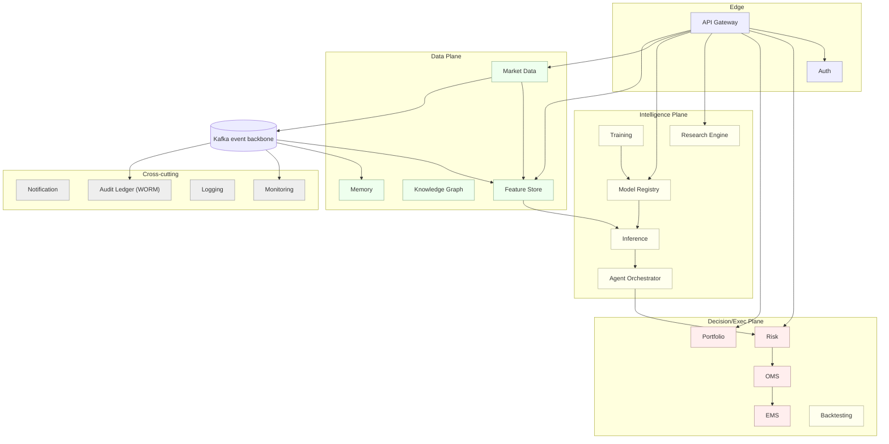

### 3.1 Edge & Access

**API Gateway** — *single ingress, many protocols.*
- **Responsibility:** terminate north-south traffic; route REST/GraphQL/WS/gRPC; enforce authN handoff, authZ (OPA), rate limits, versioning, idempotency keys. **Never on the order critical path** (trading is internal-only).
- **Inputs:** client HTTP/WS requests. **Outputs:** routed internal calls; streamed responses.
- **Dependencies:** Auth, OPA policy, all public-facing services.
- **Failure:** stateless → horizontal replicas behind a load balancer; if down, control/research is unavailable but *trading is unaffected* (it's internal). Circuit-breaks to failing upstreams; returns typed errors.

**Authentication/Authorization** — *identity for humans and services.*
- **Responsibility:** OIDC for humans (SSO + WebAuthn MFA), SPIFFE/mTLS identities for services, issue/validate short-lived tokens, RBAC + four-eyes policy evaluation.
- **Inputs:** login/token requests, policy queries. **Outputs:** tokens, allow/deny decisions.
- **Dependencies:** identity provider, secrets manager, OPA.
- **Failure:** highly-available replicas; token caching with short TTL; **fail-closed** — if authZ can't decide, deny. Never allow-on-error for privileged actions.

### 3.2 Data Plane

**Market Data Service** — *the hardened boundary to the outside world.*
- **Responsibility:** terminate vendor/venue feeds, normalize to canonical schema, timestamp at ingest (triad: exchange/capture/process), dedupe, sequence, publish to Kafka partitioned by symbol; write raw to the lake immutably.
- **Inputs:** vendor feeds (FIX/WebSocket/REST/files). **Outputs:** `market.ticks.{shard}` topics; raw lake objects; TSDB writes.
- **Dependencies:** Kafka, object storage, TSDB, reference/security-master data.
- **Failure:** **dual-feed arbitration**; heartbeat/sequence-gap detection → if a feed is stale, mark data quality low and signal Risk to defensive mode; raw capture is append-only so nothing is lost; replay from raw on recovery.

**Feature Store Service** — *train/serve-consistent feature serving.*
- **Responsibility:** serve offline features (PIT as-of joins for training/backtest) and online features (sub-ms for live); own the feature registry; run the parity monitor (`claude_ROI.md` §21).
- **Inputs:** curated Gold data, streaming updates, feature definitions. **Outputs:** feature vectors (offline batch + online point lookups); parity metrics.
- **Dependencies:** lake (offline), Redis (online), Kafka (stream), registry.
- **Failure:** online store replicated; on Redis loss, serve last-known + flag staleness to consumers (which lower confidence); **never silently serve stale features** — freshness SLA breach is surfaced to the brain and down-weights signals. Offline path is rebuildable from the lake.

**Knowledge Graph Service** (V2) — *relationships and multi-hop reasoning.*
- **Responsibility:** maintain the temporal/bitemporal property graph (entities, edges with confidence + valid/knowledge time); serve traversal queries; compute graph features and algorithms.
- **Inputs:** entity-resolved relations from filings/13F/supply-chain/NLP. **Outputs:** graph queries, graph-derived features, contagion/crowding scores.
- **Dependencies:** entity resolution, lake, Kafka.
- **Failure:** read replicas; queries are PIT-scoped (no lookahead); if unavailable, dependent GNN features are marked missing and models degrade gracefully (fail-open on alpha).

**Memory Service** (V2) — *the hybrid memory federation.*
- **Responsibility:** route memory queries across working (Redis), episodic/mistake similarity (vector), semantic/structure (graph), and trade/episode records (columnar); enforce PIT recall; run the consolidation pipeline (working→episodic→semantic).
- **Inputs:** agent memory queries (context + as_of), trade outcomes from reflection. **Outputs:** fused, PIT-filtered, recency/regime-weighted recall.
- **Dependencies:** Redis, vector DB, graph, columnar store, reflection agent.
- **Failure:** each backing store degrades independently; on partial failure, return partial recall with a completeness flag (agents lower confidence accordingly). Recall is advisory — never on the money path directly.

### 3.3 Intelligence Plane

**Model Registry Service** — *the governed gate between research and capital.*
- **Responsibility:** version models (immutable manifests: data snapshots + code SHA + features + hyperparams + validation dossier + signature); manage stages (shadow/challenger/canary/champion/retired); enforce promotion policy (four-eyes); append-only audit.
- **Inputs:** trained models + validation dossiers; stage-transition requests. **Outputs:** model metadata, signed artifacts (pointers to object storage), stage state.
- **Dependencies:** object storage (artifacts), Postgres (metadata), audit ledger.
- **Failure:** metadata in ACID Postgres (replicated); artifacts in durable object storage; **refuses unsigned/unvalidated models** — a registry outage blocks *promotions* (fail-closed) but doesn't stop already-serving models.

**Training Service** — *research→model machinery.*
- **Responsibility:** orchestrate training pipelines/DAGs, HPO (budget-aware, nested CV), validation gauntlet, evaluation; register results with full lineage.
- **Inputs:** dataset manifests, model specs, HPO configs. **Outputs:** trained candidates + validation dossiers → registry.
- **Dependencies:** feature store (offline), datasets, compute cluster (CPU/GPU), registry, experiment tracking.
- **Failure:** jobs are checkpointed and idempotent (retry-safe); runs on interruptible/spot compute (research is latency-tolerant); a failed run never corrupts the registry (results only registered on success + validation pass).

**Inference Service** (V1) — *GPU model serving.*
- **Responsibility:** serve model predictions with dynamic batching + strict latency budget; refuse unsigned models; expose per-prediction confidence/attribution hooks.
- **Inputs:** feature vectors, model version. **Outputs:** predictions + calibrated confidence + model_version.
- **Dependencies:** registry, feature store, GPU nodes.
- **Failure:** **circuit breaker + latency SLO** — on timeout/failure, the strategy engine uses a **deterministic fallback signal** (alpha degrades, path unaffected). Autoscaled on queue depth (KEDA on Kafka lag).

**Research Engine Service** — *the scientist's platform surface.*
- **Responsibility:** run interactive/exploratory research over Gold + feature store + graph + vector; manage the hypothesis registry and negative-results log; promote sandbox datasets to reproducible artifacts.
- **Inputs:** research queries, hypotheses. **Outputs:** analysis results, promotable dataset manifests.
- **Dependencies:** lake (interactive engines: DuckDB/Trino), feature store, registry.
- **Failure:** isolated on research node pool (never contends with trading); PIT-enforced even in exploration; failures are researcher-visible, never affect production.

**Agent Orchestrator + Agents** (V2) — *the cognitive layer.*
- **Responsibility:** run the deliberation pipeline (perception→analysts→bull/bear→PM→consensus→governance→execution+narrator→reflection); manage the decision blackboard; enforce deliberation budget and guardrails; own the autonomy dial.
- **Inputs:** market state, features, inference outputs, memory recall. **Outputs:** trade candidates + confidence + decision narrative → Risk.
- **Dependencies:** inference, feature store, memory, knowledge graph, risk, model registry.
- **Failure:** agents sandboxed (gVisor/microVM); a crashed/timed-out agent is isolated and its view excluded (consensus proceeds with recorded dissent); **agents can only propose** — the risk kernel is the backstop. On orchestrator failure, no new autonomous decisions are made (fail-closed).

### 3.4 Decision & Execution Plane

**Risk Service (with hard kernel)** — *the sovereign backstop.*
- **Responsibility:** in-memory position/exposure book; sub-µs pre-trade checks; live VaR/stress; **hard kernel** of human-owned ceilings (max notional, order rate, drawdown) no agent can raise; arm/execute kill-switches.
- **Inputs:** trade candidates, portfolio state, regime, limits. **Outputs:** approve/attenuate/veto + reason codes; risk events.
- **Dependencies:** portfolio/position state, market data, control plane (limits).
- **Failure:** **active-active failover; fail-closed** — if Risk can't verify a trade, the trade is rejected. On any reconciliation break (our book ≠ broker), halt the affected scope. The kernel's ceilings are enforced even under partial failure.

**Portfolio Service** — *positions, P&L, optimization.*
- **Responsibility:** authoritative position/P&L accounting (reconciled 3-way: OMS↔Postgres↔broker); portfolio optimization (target positions from signals + risk constraints); exposure aggregation.
- **Inputs:** fills, signals, risk constraints, market marks. **Outputs:** positions, P&L, target allocations.
- **Dependencies:** OMS, market data, risk.
- **Failure:** strongly-consistent (Postgres); continuous reconciliation halts on mismatch rather than guessing; rebuildable from the event log + broker statements.

**OMS (Order Management)** — *transactional order lifecycle.*
- **Responsibility:** parent-order state machine, idempotency (client-generated IDs), lifecycle events, broker reconciliation.
- **Inputs:** approved orders from Risk. **Outputs:** order lifecycle events, fills → Portfolio/ledger.
- **Dependencies:** Risk (upstream gate), EMS, Postgres.
- **Failure:** event-sourced → replay + broker reconciliation before resuming after a crash; pauses new orders during rebuild; idempotency prevents duplicate orders on retry.

**EMS (Execution Management)** — *routing and venue connectivity.*
- **Responsibility:** smart order routing, child-order slicing (VWAP/TWAP/POV/IS), venue adapters (FIX/REST), **cancel-on-disconnect** dead-man switch.
- **Inputs:** parent orders. **Outputs:** child orders to venues; exec reports.
- **Dependencies:** OMS, venue/broker connectivity, impact model.
- **Failure:** broker-side cancel-on-disconnect armed at session start; on venue disconnect, working orders auto-cancel and reroute; never assumes a fill it didn't confirm.

**Backtesting Service** — *the shared-code harness.*
- **Responsibility:** deterministic historical replay driving the **same** strategy/risk/OMS core (from `libs/`) with a simulated EMS + cost/impact model; produce signed reports; run anti-overfitting analytics (CPCV, PBO, DSR).
- **Inputs:** dataset manifest, strategy spec, cost model. **Outputs:** signed backtest report → registry.
- **Dependencies:** feature store (offline, PIT), shared core, simulator.
- **Failure:** deterministic + reproducible (golden replay in CI); embarrassingly parallel on batch compute; a failed run is just a failed job (no capital impact).

### 3.5 Cross-cutting Services

**Notification Service** — routes alerts (PagerDuty/Slack/email) for risk events, drift, SLO breaches, approval requests. Fail-open with redundancy; a missed *nice-to-have* notification is tolerable, but critical risk alerts have redundant channels + escalation.

**Monitoring Service** — Prometheus/Grafana/Tempo + business dashboards (P&L, exposure, slippage) and infra (latency, queue depth, GPU util); Alertmanager. If down, the platform still trades but blind — so monitoring itself is monitored (dead-man's-switch heartbeat) and HA.

**Logging Service** — structured, correlation-ID-tagged logs (Loki) with trace linkage; ships to durable storage. Buffered locally on pipeline failure; logs are diagnostic, never on the money path.

**Audit Ledger Service (WORM)** — append-only, hash-chained, tamper-evident record of every decision, explanation, order, fill, limit change, and human action; anchored to object-lock storage. **Inviolable** — write-once, no mutation path, ever. Regulatory foundation + input to the reflection loop.

---

## 4. Database Design

**Polyglot persistence — right store per access pattern** (`claude_ROI.md` §28, `AI_QUANT_PLATFORM_BLUEPRINT.md` §6). The unifying principle: **Kafka + the object-store lake are the source of truth; every other store is a rebuildable projection.** No specialized store holds unrecoverable state.

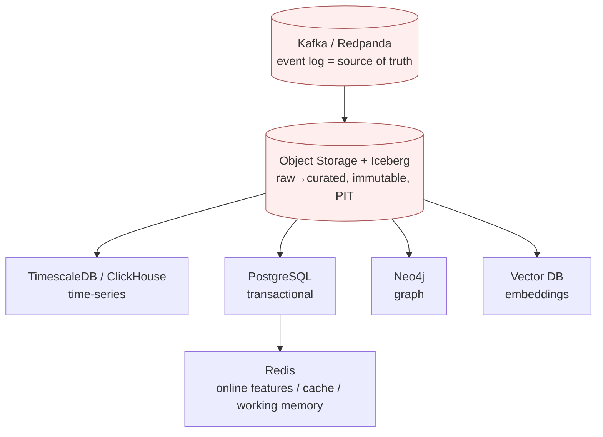

### 4.1 Store-by-store

**PostgreSQL** — *ACID transactional spine.*
- **Stores:** orders & order lifecycle, accounts, positions/P&L ledger, risk limits, strategy/model metadata, the security master + bitemporal identifier crosswalk (`claude_ROI.md` §2.1), registry metadata, users/roles.
- **Relationships:** strongly-relational — orders→fills→positions; strategies→models→deployments; the security master is the root entity every dataset joins to.
- **Scaling:** vertical first; then read-replicas for query load; table partitioning by time/account; Citus (distributed Postgres) if a single node is outgrown. Money-adjacent state stays strongly consistent — do not shard the order ledger casually.

**TimescaleDB** (MVP) → **ClickHouse** (scale) — *time-series.*
- **Stores:** ticks, bars (all resolutions), order-book snapshots, derived series (vol surface), metrics history.
- **Decision:** start with **TimescaleDB** (Postgres extension — one fewer system to operate, SQL-native, great for MVP/V1 volumes); migrate the highest-volume tick/L2 data to **ClickHouse** when columnar scan performance and compression at multi-year/multi-billion-row scale demand it (V2+). Both are projections of the lake, so migration is additive, not destructive.
- **Relationships:** keyed by instrument (master ID) + time; joins to Postgres security master.
- **Scaling:** Timescale hypertable partitioning + compression + continuous aggregates; ClickHouse sharding + replication; hot(NVMe)/warm/cold tiering to object storage.

**Redis (Cluster)** — *hot, low-latency.*
- **Stores:** online feature values, order-state cache, working memory (V2), rate-limit counters, hot lookups.
- **Relationships:** keyed by (entity, feature) or (session); ephemeral/TTL'd — not a system of record.
- **Scaling:** hash-slot sharding (Redis Cluster); replicas for availability; sized for working set, not history. Rebuildable from feature store/lake on loss.

**Neo4j** (V2) — *knowledge graph.*
- **Stores:** entities (company/security/person/sector/fund/event/theme) and temporal, weighted, provenance-stamped edges (`claude_ROI.md` §7, §23).
- **Relationships:** *is* the relationship store — multi-hop supply-chain/ownership/correlation traversals.
- **Scaling:** read replicas for traversal load; heavy graph-algorithm workloads (community/centrality/contagion) run on a parallel graph-compute layer over snapshots; consider TigerGraph/Neptune if graph size outgrows Neo4j. Bitemporal → query as-of any date.

**Vector Database** (V2) — *semantic recall.*
- **Stores:** embeddings for filings, news, transcripts, market-states, trade episodes, research notes — each with rich metadata (entity_id, knowledge_time, source, regime, model_version).
- **Decision:** start with **pgvector** (rides existing Postgres — minimal ops for early V2) for smaller collections; move to a dedicated ANN store (**Qdrant/Milvus/Weaviate**) when collection size + recall latency demand HNSW/IVF-PQ at scale.
- **Relationships:** `entity_id` is a foreign key into Neo4j — graph + vector are a designed pair (`claude_ROI.md` §8.3).
- **Scaling:** shard by domain (namespace) + time; HNSW for hot recall, IVF-PQ for cold archive; PIT-filtered retrieval always.

**Object Storage (S3/GCS) + Iceberg** — *the eternal substrate.*
- **Stores:** the data lake (Bronze raw / Silver standardized / Gold curated), model artifacts/weights, training-set snapshots, backtest reports, the WORM audit ledger (object-lock), embeddings cold archive.
- **Relationships:** the ground truth everything else projects from; Iceberg snapshots provide time-travel = free PIT reproducibility.
- **Scaling:** effectively infinite + cheap; lifecycle tiering (standard→infrequent→glacier for aged raw); partition by source/asset-class/date. Retention: forever for raw + curated + audit; only recompute-able intermediates expire.

### 4.2 Cross-database disciplines (anti-tech-debt)
- **Bitemporal everywhere it matters:** every fact carries `event_time` + `knowledge_time`; PIT queries enforce `knowledge_time ≤ as_of` (`claude_ROI.md` §17). This is a *schema* rule, enforced in `libs/common-types`, not per-query discipline.
- **Migrations are versioned + forward-only** (per service that owns a DB); schema changes go through the schema registry with compatibility checks.
- **No cross-service DB sharing:** each service owns its schema; other services reach it via the service's API/events, never by direct DB access. This is the single most important rule for avoiding a distributed monolith.
- **Rebuildability tested:** a periodic game-day drops a projection store and rebuilds it from Kafka+lake to prove the guarantee holds.

---

## 5. API Design

**Protocol-per-purpose** (matching `AI_QUANT_PLATFORM_BLUEPRINT.md` §5): REST for control/CRUD, GraphQL for flexible research reads, WebSocket for live push, gRPC for internal high-performance service-to-service. **The trading hot path is internal gRPC/in-process only — never exposed through the public gateway.**

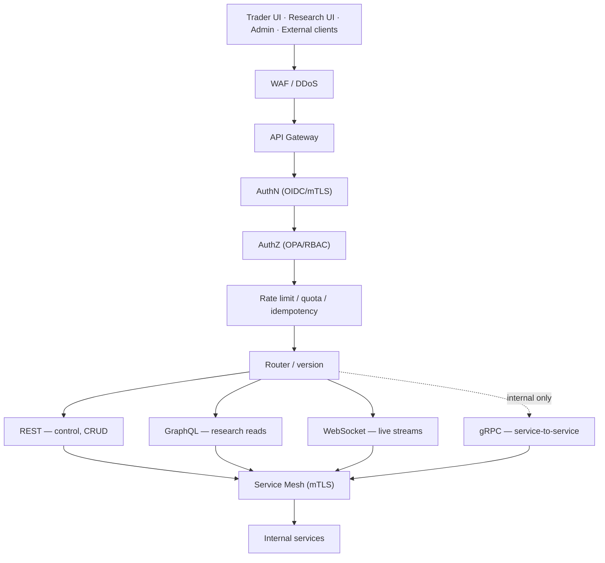

### 5.1 API surfaces

| Surface | Protocol | Purpose | Examples |
|---|---|---|---|
| **Control** | REST | Mutating operations, four-eyes-gated | `POST /v1/strategies/{id}/promote`, `POST /v1/risk/limits`, `POST /v1/kill-switch/global` |
| **Query/Research** | GraphQL | Flexible reads across TSDB/registry/ledger without over-fetching | backtest reports, lineage, model metadata, portfolio state |
| **Live streams** | WebSocket | Push to UIs | positions, P&L, risk, live decisions + narratives |
| **Internal** | gRPC | Low-latency service-to-service | Strategy→Risk→OMS (the sacred path), feature lookups, inference |
| **External (later)** | REST (signed) | Institutional clients / reporting | read-only performance, positions (no order control externally) |

### 5.2 Cross-cutting API rules
- **Authentication:** OIDC (humans) + mTLS/SPIFFE (services). Every request carries an identity; the gateway validates before routing.
- **Authorization:** OPA policy-as-code evaluated centrally — RBAC roles (`trader`, `risk-officer`, `researcher`, `committee`, `sre`) + **four-eyes** on limit changes, promotions, autonomy escalation. Fail-closed.
- **Rate limits & quotas:** per client/role at the gateway; trading-internal APIs are quota-exempt but mesh-protected (retries/timeouts/circuit-breaking).
- **Idempotency:** required on all mutating endpoints (client-supplied idempotency key) — retries never duplicate an order or a promotion.
- **Versioning:** URL-versioned REST (`/v1`, `/v2`) with deprecation windows; gRPC via protobuf backward-compat rules; GraphQL via additive schema evolution. Contracts generated from `libs/` so client/server can't drift.
- **Errors:** typed, coded error responses (never leak internals); every error carries a correlation ID that ties to logs/traces.

### 5.3 Request flow (a control action, end to end)
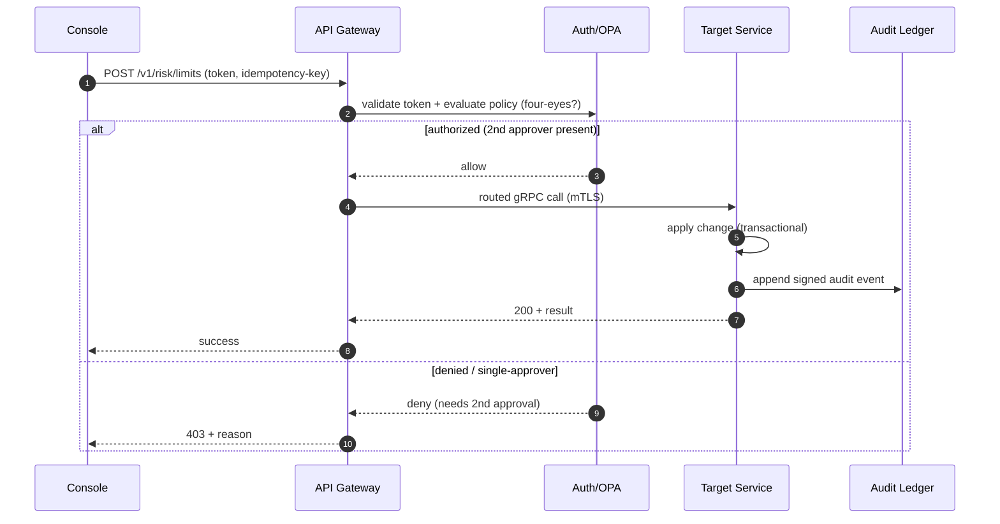
The trading path (Strategy→Risk→OMS→EMS) uses the same identity/mesh guarantees but runs **in-process/gRPC internally**, bypassing the gateway entirely for latency and to keep it off the public attack surface.

---

## 6. Development Roadmap

Phased by **thin vertical slices** — each phase ships something demonstrable end-to-end, not a horizontal layer. Complexity is rated ●(low) ●●(medium) ●●●(high) ●●●●(very high). Weeks are indicative for a ~6–10 engineer team; the *sequence and dependencies* matter more than exact dates.

```mermaid
flowchart LR
    P0["Wk1-2<br/>Foundations"] --> P1["Wk3-6<br/>Data spine"] --> P2["Wk7-10<br/>Features+train"] --> P3["Wk11-14<br/>Backtest gauntlet"] --> M3["Mo3: MVP ✅"]
    M3 --> P4["Mo3-4<br/>Event backbone+online"] --> P5["Mo4-6<br/>Risk+OMS/EMS+paper"] --> M6["Mo6: Paper ✅"]
    M6 --> P6["Mo6-9<br/>Supervised live+control"] --> M9["Mo9: V1 ✅"]
    M9 --> P7["Mo9-14<br/>Brain+memory+graph"] --> P8["Mo14-18<br/>Autonomy+self-learn"] --> M18["Mo18: V2 ✅"]
```

### MVP phases (months 0–3)

**Phase 0 — Foundations (Weeks 1–2) · ●**
- **Objectives:** monorepo skeleton, CI bootstrap, local dev (docker-compose), `libs/` contracts scaffold, IaC baseline, ADR process.
- **Deliverables:** repo with all top-level folders + one "hello" service running locally and in CI; schema-registry + codegen wired; observability stub.
- **Dependencies:** none. **Complexity:** ● — but do it *right* (this is the anti-tech-debt foundation).

**Phase 1 — Data spine (Weeks 3–6) · ●●●**
- **Objectives:** market-data ingestion (one vendor), the lake (Bronze/Silver/Gold on Iceberg), TimescaleDB, security master + bitemporal crosswalk, validation gates, PIT storage.
- **Deliverables:** historical + daily data flowing into the lake and TSDB, PIT-correct; data-quality dashboard; reference-data master.
- **Dependencies:** Phase 0. **Complexity:** ●●● — PIT correctness and reference data are the hardest, highest-leverage foundation.

**Phase 2 — Features + training (Weeks 7–10) · ●●●**
- **Objectives:** offline feature store (as-of joins, single definition), feature/label engineering, training service (GBT + linear baseline), model registry + experiment tracking.
- **Deliverables:** reproducible training run producing a registered, lineage-linked model from PIT features/labels.
- **Dependencies:** Phase 1. **Complexity:** ●●● — leakage prevention is subtle; nested CV wiring.

**Phase 3 — Backtest gauntlet (Weeks 11–14) · ●●●**
- **Objectives:** backtest engine on the shared strategy/risk core, cost/impact simulator, validation gauntlet (walk-forward, purged/combinatorial CV, DSR, PBO), signed reports.
- **Deliverables:** one end-to-end strategy: idea→dataset→model→backtest→signed report, honestly net of costs. **This is the MVP.**
- **Dependencies:** Phase 2. **Complexity:** ●●● — the shared-core discipline starts here and must hold forever.

### V1 phases (months 3–9)

**Phase 4 — Event backbone + online serving (Months 3–4) · ●●●**
- **Objectives:** Kafka spine, streaming ingestion, online feature store (Redis) + **parity monitor**, inference service (GPU serving).
- **Deliverables:** live data streaming; online features serving with proven parity to offline; a model serving predictions in real time.
- **Dependencies:** Phase 3. **Complexity:** ●●●.

**Phase 5 — Risk + OMS/EMS + paper (Months 4–6) · ●●●●**
- **Objectives:** risk engine + **hard kernel**, portfolio/position accounting, OMS, EMS with a broker adapter, paper simulator (live data, sim fills) on the shared core.
- **Deliverables:** end-to-end paper trading: live signal→risk→OMS→simulated fill, reconciled, with a kill-switch. **This is V1's paper milestone.**
- **Dependencies:** Phase 4. **Complexity:** ●●●● — the money-path core; highest review bar.

**Phase 6 — Supervised live + control plane (Months 6–9) · ●●●●**
- **Objectives:** control plane (promote/demote/limits, RBAC + four-eyes), WORM audit ledger, supervised-live (approve-per-trade, tiny kernel-capped budget, live-vs-paper parity gate), basic explainability + observability hardening.
- **Deliverables:** first real (tiny) capital under full human supervision, fully audited and explainable. **This is V1.**
- **Dependencies:** Phase 5. **Complexity:** ●●●●.

### V2 phases (months 9–18)

**Phase 7 — Brain + memory + graph (Months 9–14) · ●●●●**
- **Objectives:** multi-agent deliberation pipeline, consensus + risk-critic + red-team, confidence scoring/calibration, knowledge graph + vector store + hybrid memory, regime detection, explainability (SHAP/counterfactual/narrative), reflection + mistake memory.
- **Deliverables:** decisions produced by agent deliberation with propagated confidence and full narratives, learning from every trade — still human-supervised.
- **Dependencies:** Phase 6. **Complexity:** ●●●●.

**Phase 8 — Bounded autonomy + self-learning (Months 14–18) · ●●●●**
- **Objectives:** ensemble architecture, drift detection + validated auto-retraining (non-auto-promoting), meta-learner self-improvement loops, portfolio optimizer, bounded fully-autonomous trading with auto-demotion.
- **Deliverables:** autonomous trading within hard ceilings, exception-only human supervision, continuous self-improvement. **This is V2.**
- **Dependencies:** Phase 7. **Complexity:** ●●●●.

### Long-term (months 18+)
Multi-asset adapters, agentic research automation, distributed training, multi-region DR, foundation/causal/GNN models, institutional compliance & capacity — detailed in §16.

---

## 7. MVP Definition

**The MVP is a research-only platform that proves our numbers are real — with no path to capital.** If it can lose money when wrong, it is not in the MVP.

### 7.1 What the MVP *is* (the minimum honest research loop)
Ingest one vendor's equity data → store it PIT-correctly in the lake + TimescaleDB → engineer PIT features and labels → train GBT + linear baseline → validate through the gauntlet (walk-forward, purged CV, deflated Sharpe) → backtest one strategy on the shared strategy/risk core with realistic costs → produce a signed, reproducible backtest report, viewable in a minimal read-only UI, with full lineage and model versioning.

### 7.2 What is intentionally *excluded* (deferred to V1/V2)
- **All trading** — no live, no paper, no OMS/EMS, no broker connectivity, no execution. (V1)
- **The multi-agent brain** — no agents, no deliberation, no consensus, no memory, no regime engine. (V2)
- **Online/real-time everything** — no Kafka streaming, no online feature store, no real-time inference. Batch only. (V1)
- **Knowledge graph, vector store, alternative data.** (V2)
- **Autonomy, self-learning, drift/retraining loops.** (V2)
- **GPU inference serving** — MVP trains on GPU if needed but serves nothing in real time. (V1)
- **Multi-asset** — equities only. (Long-term)
- **Rich frontend** — read-only research views only; no trading console. (V1)

### 7.3 What is *mocked* (stubbed with a clean interface for later replacement)
- **Market-data vendor** — a single vendor (or even a static historical dataset) behind a `MarketDataProvider` interface; real-time feeds mocked as replay.
- **Broker/venue** — not built; the *interface* is stubbed so the shared core compiles against it.
- **Notification/alerting** — logs to console behind a `Notifier` interface.
- **Auth** — a simple dev auth (single admin role) behind the real OIDC interface, so wiring real SSO later is a swap, not a rewrite.
- **Kafka** — an in-process event bus behind the same producer/consumer interface (so V1 swaps in real Kafka without touching business logic).

### 7.4 What is *simplified* (real but minimal, hardened later)
- **One model class** (GBT) + baseline — not the full zoo.
- **Single-node databases** — no clustering/replication yet (Timescale + one Postgres); rebuildability still designed in.
- **Cost model** — a realistic-but-simple fixed+spread cost model, not full market-impact simulation.
- **Validation** — walk-forward + purged CV + DSR (the essentials); CPCV added later.
- **Deployment** — docker-compose locally + a single staging box; full K8s deferred to V1.

> **MVP success criterion:** a researcher can propose a hypothesis and, without writing infrastructure code, produce a *reproducible, PIT-correct, leakage-audited, signed* backtest report — and a second engineer can reproduce it bit-for-bit from its manifest months later. Nothing about the MVP can touch money, so it is safe by construction. Every mock/stub sits behind the *real* interface, so V1 is composition, not rework — this is the core anti-technical-debt bet.

---

## 8. Development Priority

Every major component ranked by **importance** (to the end goal), **difficulty**, **dependencies**, and **expected build time**. Build order follows importance × unblocking-power: foundations that everything depends on come first, even when unglamorous.

### 8.1 Priority table

| # | Component | Importance | Difficulty | Depends on | Est. time | Stage |
|---|---|---|---|---|---|---|
| 1 | Monorepo + CI + `libs/` contracts | ★★★★★ | ●● | — | 1–2 wk | MVP |
| 2 | Data lake + PIT bitemporal storage | ★★★★★ | ●●●● | 1 | 2–3 wk | MVP |
| 3 | Reference data (security master + crosswalk) | ★★★★★ | ●●● | 2 | 1–2 wk | MVP |
| 4 | Market-data ingestion + TSDB | ★★★★★ | ●●● | 2,3 | 2 wk | MVP |
| 5 | Feature store (offline, as-of joins) | ★★★★★ | ●●● | 2,4 | 2 wk | MVP |
| 6 | Label engineering + dataset generation | ★★★★☆ | ●●● | 5 | 1–2 wk | MVP |
| 7 | Training service + model registry | ★★★★☆ | ●●● | 5,6 | 2 wk | MVP |
| 8 | Validation gauntlet (WF, purged CV, DSR) | ★★★★★ | ●●● | 7 | 1–2 wk | MVP |
| 9 | Shared strategy/risk/OMS core (`libs/`) | ★★★★★ | ●●● | 1 | 2 wk | MVP |
| 10 | Backtest engine + cost simulator | ★★★★★ | ●●● | 8,9 | 2 wk | MVP |
| 11 | Research UI (read-only) | ★★★☆☆ | ●● | 7,10 | 1–2 wk | MVP |
| 12 | Kafka event backbone | ★★★★★ | ●●● | 1 | 1–2 wk | V1 |
| 13 | Online feature store + parity monitor | ★★★★☆ | ●●● | 5,12 | 2 wk | V1 |
| 14 | Inference service (GPU serving) | ★★★★☆ | ●●● | 7,13 | 2 wk | V1 |
| 15 | Risk engine + hard kernel | ★★★★★ | ●●●● | 9 | 3 wk | V1 |
| 16 | OMS | ★★★★★ | ●●●● | 15 | 2–3 wk | V1 |
| 17 | EMS + broker adapter | ★★★★★ | ●●●● | 16 | 3 wk | V1 |
| 18 | Portfolio/position accounting + recon | ★★★★★ | ●●● | 16 | 2 wk | V1 |
| 19 | Paper simulator | ★★★★☆ | ●●● | 13,15,16 | 2 wk | V1 |
| 20 | Control plane + RBAC/four-eyes | ★★★★★ | ●●● | 15 | 2 wk | V1 |
| 21 | WORM audit ledger | ★★★★★ | ●●● | 12 | 1–2 wk | V1 |
| 22 | API gateway + auth (real OIDC/mTLS) | ★★★★☆ | ●●● | 1 | 2 wk | V1 |
| 23 | Observability stack (metrics/logs/traces) | ★★★★★ | ●●● | 12 | 2 wk | V1 |
| 24 | Explainability (SHAP + narrative) | ★★★★☆ | ●●● | 14 | 2 wk | V1/V2 |
| 25 | Agent orchestrator + agents | ★★★★★ | ●●●● | 14,26,27 | 6–8 wk | V2 |
| 26 | Knowledge graph + entity resolution | ★★★★☆ | ●●●● | 2,3 | 4 wk | V2 |
| 27 | Vector store + hybrid memory | ★★★★☆ | ●●●● | 2,26 | 4 wk | V2 |
| 28 | Regime detection + calibration | ★★★★☆ | ●●● | 14 | 2–3 wk | V2 |
| 29 | Reflection + mistake memory + meta-learner | ★★★★★ | ●●●● | 25,27 | 4 wk | V2 |
| 30 | Ensemble + drift detection + auto-retrain | ★★★★☆ | ●●●● | 7,14,28 | 4 wk | V2 |
| 31 | Portfolio optimizer | ★★★☆☆ | ●●● | 18 | 2 wk | V2 |

### 8.2 Priority principles
- **Unblocking power trumps glamour.** The lake, PIT storage, and reference data (items 2–3) are the least exciting and most important — everything is confidently wrong without them. Build them first, properly.
- **The shared core (item 9) is built once, early, and reused by backtest, paper, and live** — never re-implemented. This single decision prevents the deadliest class of bug.
- **The risk kernel (item 15) is the highest-difficulty money-path item** — it gets the most senior engineers, formal review, and the most tests.
- **The brain (items 25–29) is deliberately last** — it's the highest value but depends on everything beneath it being solid. Building it early on a shaky foundation guarantees rework.

---

## 9. Testing Strategy

Testing is graded by **blast radius**: the closer to capital, the more rigorous. The money path demands deterministic, reproducible, adversarial testing; the alpha path tolerates statistical validation. **A recovery path or a strategy that isn't tested does not exist.**

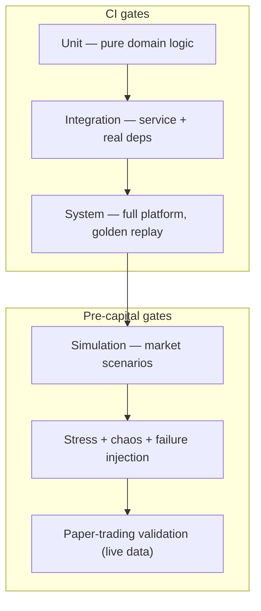

### 9.1 The test pyramid + finance-specific layers

**Unit testing** — pure `domain/` logic (no I/O): risk checks, sizing math, feature transforms, order state machine, PIT-window logic. Fast, deterministic, run on every commit. Target high coverage on the money-path domain specifically. Property-based tests for invariants (e.g., "risk kernel never approves beyond a hard ceiling for any input").

**Integration testing** — a service against its *real* dependencies (test containers: Postgres, Timescale, Kafka, Redis). Verifies contracts, migrations, event schemas, DB queries. Catches the "works in unit tests, breaks on real Kafka" class.

**System testing** — the whole platform wired together, driven by **deterministic golden replay**: a fixed historical session that must reproduce bit-for-bit. Any non-determinism on the money path *fails the build* (`AI_QUANT_PLATFORM_BLUEPRINT.md` CI/CD). This is the backbone gate for backtest/paper/live parity.

**Backtesting validation** — meta-tests on the backtest engine itself: known-answer strategies produce known results; leakage-audit tests (inject a lookahead feature → the engine/validator must catch it); cost-model sanity; CPCV/PBO/DSR correctness. *We test that our tests-of-strategies are honest.*

**Simulation testing** — the strategy/risk/execution stack against synthetic and replayed market scenarios: trending, ranging, high-vol, gap, thin-liquidity, and specific historical crises. Validates regime-conditioned behavior (V2) and execution logic under varied microstructure.

**Stress testing** — extreme conditions: market-data floods (millions of events/sec), order bursts, latency spikes, book-vs-broker reconciliation breaks, flash-crash replays. Verifies back-pressure, circuit breakers, and that the kernel holds under load.

**Failure injection (chaos)** — scheduled game-days killing services, dropping feeds, partitioning the network, exhausting Redis, disconnecting the broker mid-order. Verifies fail-closed on money path / fail-open on alpha path, dead-man switches, and recovery-by-replay. Run in staging continuously and in controlled prod windows.

**Paper-trading validation** — the final pre-capital gate: the exact production code runs on *live data with simulated fills* for a minimum soak period; behavior must track backtest expectations (**live-vs-paper parity**). Divergence blocks promotion to real capital. This catches everything historical tests structurally can't (real-time quirks, latency, operational bugs).

### 9.2 Testing disciplines
- **Determinism on the money path is mandatory** — seeded, clock-injected, reproducible. Time is never read from the wall clock in domain logic (it's injected), so tests and replays are exact.
- **PIT/leakage tests are first-class** — the CI suite includes adversarial leakage cases; a change that introduces lookahead fails automatically.
- **No promotion without its gate** — code can't reach staging without system+golden-replay passing; can't reach real capital without paper-parity passing (enforced in CI/CD, §10).
- **Test data is versioned** — golden sets and fixtures are pinned artifacts (reproducibility, `claude_ROI.md` §16).

---

## 10. CI/CD Pipeline

**GitOps + progressive delivery for both code and capital.** The repository is the single source of deployment truth; promotion is automated but gated, and *capital* rolls out as carefully as code (`AI_QUANT_PLATFORM_BLUEPRINT.md` CI/CD).

```mermaid
flowchart LR
    PR["PR (signed commits)"] --> CI["CI: build + lint + format + unit + integration"]
    CI --> SCAN["SBOM + CVE scan + secret scan"]
    SCAN --> REPLAY["Deterministic golden replay (money path)"]
    REPLAY --> SIGN["Build + sign image (cosign/SLSA provenance)"]
    SIGN --> STG["Deploy staging (ArgoCD/GitOps)"]
    STG --> SYST["System + simulation + chaos suite"]
    SYST --> PAPER10["Paper-trade soak (auto)"]
    PAPER10 --> CANARY10["Canary: 1% capital, parity check"]
    CANARY10 --> PROD10["Progressive rollout (budget auto-scales on gates)"]
    CANARY10 -->|parity/SLO break| ROLL10["Auto-rollback + demote"]
```

### 10.1 Git workflow & branch strategy
- **Trunk-based development** with short-lived feature branches merged via PR to `main`. `main` is always releasable. Rationale: minimizes long-lived divergence and merge hell in a monorepo; pairs with feature flags for incomplete work.
- **Feature flags** gate incomplete/risky features so they can merge to trunk dark and enable progressively (esp. anything touching the money path or autonomy).
- **Release tags** are immutable; deployments reference a git SHA + signed image digest (reproducibility).

### 10.2 Code review
- **Mandatory PR review**; `CODEOWNERS` routes each path to its owners. **Money-path code (`risk-engine/kernel`, `oms`, `ems`, shared core) requires two approvers**, one senior, and (for the kernel) a formal-methods/checklist review. No AI-generated code merges to the money path without two human approvers.
- Reviews check: contract/schema changes, PIT correctness, test coverage of new logic, failure handling, and observability (does it emit the metrics/traces to debug it in prod?).

### 10.3 Quality gates (all blocking, in order)
1. **Lint + format** — enforced style (auto-fixable, so reviews focus on substance not whitespace); config in-repo.
2. **Unit + integration tests** — must pass; coverage thresholds on money-path domain.
3. **Security scans** — SBOM generation, CVE scan (Trivy/Grype), secret detection, dependency-license check. CVEs above a severity threshold block the build.
4. **Deterministic golden replay** — money-path bit-for-bit reproduction; non-determinism fails.
5. **Image build + sign** — distroless, non-root, pinned base by digest; cosign signature + SLSA provenance; the inference server and registry refuse unsigned artifacts.

### 10.4 Deployment pipeline (GitOps)
- **ArgoCD** reconciles cluster state from git (Helm/Kustomize overlays per env). A deploy is a git commit; the cluster converges to it.
- **Promotion path:** merge→staging (auto) → system/chaos/paper suites (auto gates) → canary (small capital) → progressive prod rollout. Each stage is a gate; failure halts promotion.
- **Environment parity:** identical images dev→prod; only config/overlay differs. No "works in staging, breaks in prod" from image drift.

### 10.5 Rollback
- **Code rollback = git revert** → ArgoCD reconciles to the previous signed image. Deterministic and fast (immutable versions).
- **Model/strategy rollback** = registry stage transition to the previous champion (§11 of the ML framework) — instant, because every model is an immutable version.
- **Capital rollback** = auto-demote on parity/SLO/drawdown breach: budget scales to zero, positions de-risked per policy, humans paged. **Resuming after a kill always requires human four-eyes.**
- **A deployment without a tested rollback path does not ship** — rollback is exercised in game-days, not assumed.

---

## 11. Infrastructure

**Cloud-native, container-first, Kubernetes-ready — but not Kubernetes on day one.** The infrastructure evolves with the stages: docker-compose for MVP, a single managed cluster for V1, full multi-pool K8s for V2. Every layer is defined as code (Terraform + Helm/Kustomize) so environments are reproducible and disposable.

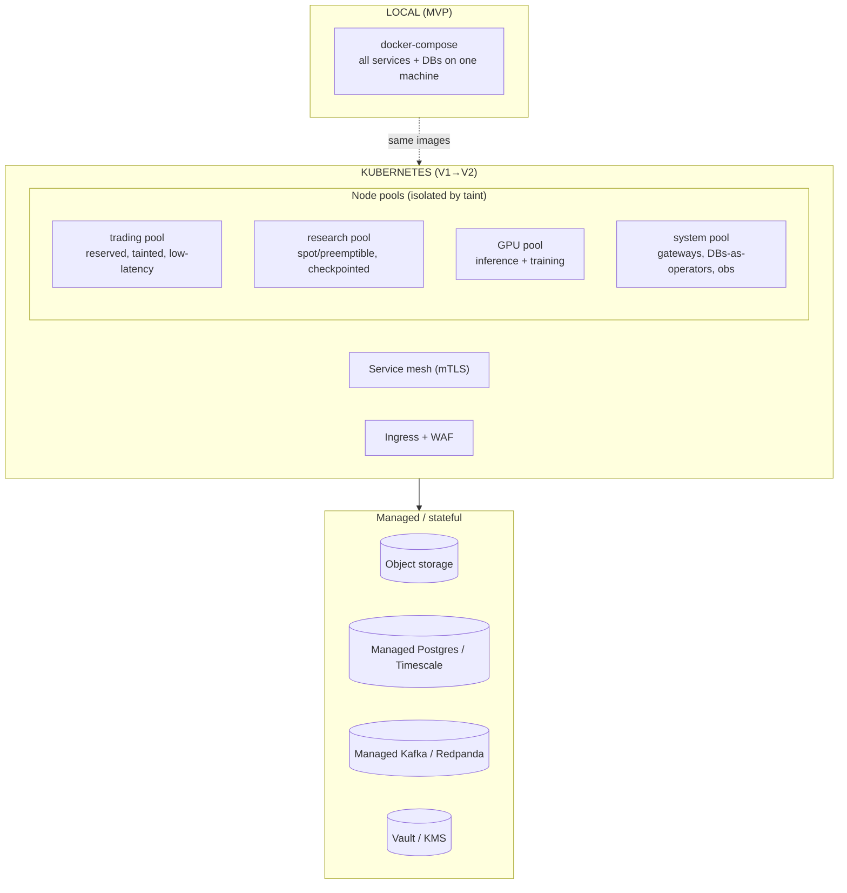

### 11.1 Containerization
- **Docker:** one distroless, non-root, read-only-rootfs image per service; base images pinned by digest; multi-stage builds keep images minimal (smaller attack surface, faster pulls). The image built in CI is the *exact* artifact that runs in prod (environment parity).
- **Docker Compose:** the full-platform local dev environment — every service + Timescale/Postgres/Redis/(in-process bus for MVP, real Kafka for V1) boots with one command. This is the developer's inner loop; it must stay fast and reliable (developer productivity is a first-class goal).

### 11.2 Kubernetes readiness (V1+)
- **Node-pool isolation (critical):** trading workloads run on **reserved, tainted** nodes that research/batch jobs can *never* be scheduled onto (taints/tolerations + separate pools). Alpha research must never contend with live trading for a CPU core (`AI_QUANT_PLATFORM_BLUEPRINT.md` §8). Separate pools for trading / research (spot) / GPU / system.
- **Autoscaling:** HPA on RPS/latency for stateless services; **KEDA on Kafka lag** for stream processors and inference (scale on real backlog, not CPU); cluster-autoscaler for node elasticity. Research/training scale elastically on spot with checkpointing.
- **Service mesh (Istio/Linkerd):** mTLS between all services, retries/timeouts/circuit-breaking, traffic shifting for canaries.
- **Admission control:** Kyverno/OPA-Gatekeeper rejects non-compliant workloads (unsigned images, root containers, missing resource limits). Policy-as-code, in git.
- **Stateful services stay managed where possible:** use managed Postgres/Kafka/object-storage rather than self-hosting stateful systems in K8s early — reduces operational burden and risk. Self-host only when scale/cost justifies it.

### 11.3 Compute: GPU vs CPU workers
- **GPU workers:** model training and real-time inference (Triton-style serving with dynamic batching, MIG partitioning to pack small models). Autoscaled and *bin-packed* — GPUs are the most expensive resource, so utilization is monitored and idle GPUs scaled to zero.
- **CPU workers:** everything else — ingestion, feature computation, risk, OMS/EMS, backtests (embarrassingly parallel on CPU batch), agents. The trading hot path is CPU, NUMA-pinned on the trading pool for latency determinism.
- **Batch/research compute:** Ray/K8s Jobs on spot instances with checkpointing for backtests and HPO — interruptible and cheap.

### 11.4 Secrets, monitoring, logging (infra view)
- **Secrets:** Vault / cloud KMS with dynamic, short-lived DB and broker credentials; auto-rotation; no static secrets in images or env files (only references in `infra/`). Detail in §12.
- **Monitoring:** Prometheus/VictoriaMetrics + Grafana + Tempo (traces) + Alertmanager→PagerDuty; dashboards-as-code in `monitoring/`. Business *and* infra metrics. The observability stack is itself HA and heartbeat-monitored (you can't fly blind).
- **Logging:** structured JSON logs with correlation IDs → Loki (or managed equivalent) → durable storage; trace-linked. Log pipelines buffer locally on backend failure so diagnostics survive an outage.

### 11.5 Cloud deployment
- **Cloud-agnostic core** via Terraform modules + open standards (K8s, Iceberg, Kafka) — avoids lock-in, but pick one primary cloud to start (don't build multi-cloud prematurely; it's real cost for hypothetical benefit).
- **Multi-AZ from V1** (availability); **multi-region active-passive DR** from V2 (replay from the replicated event log; minutes RTO). See §14 and §16.

---

## 12. Security

Security is the license to manage capital, not a feature. Threat model: market manipulation, insider misuse, credential theft, model exfiltration, supply-chain compromise, and a rogue/buggy strategy. Defense is **layered and default-deny**; the money path is the most hardened surface.

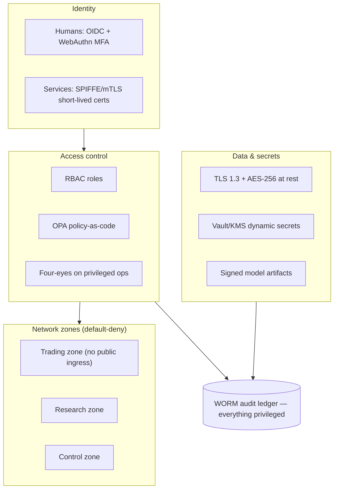

- **Authentication:** OIDC SSO + phishing-resistant MFA (WebAuthn/FIDO2) for humans; SPIFFE/SPIRE workload identities + mutual TLS with short-lived certs for services. No shared accounts, no static service passwords.
- **Authorization:** OPA policy-as-code, least-privilege RBAC (`trader`/`risk-officer`/`researcher`/`committee`/`sre`). **Four-eyes** enforced on limit changes, model promotions, and autonomy escalation — no single human can arm live capital. Fail-closed: undecidable authZ = deny.
- **API keys:** for external/service clients, scoped, rotatable, rate-limited, revocable; issued and tracked centrally; never embedded in code.
- **Secrets:** Vault/KMS, dynamic short-lived credentials, automatic rotation, no secret ever in git or an image. Broker keys held at an HSM boundary where the venue supports it.
- **Encryption:** TLS 1.3 in transit everywhere (mesh-enforced), AES-256 at rest on every store, field-level encryption for PII/account data.
- **Network segmentation:** three default-deny zones — **Trading** (venue connectivity, OMS/EMS, risk — *no public ingress at all*, egress only to whitelisted venues), **Research** (data lake, backtest, notebooks), **Control** (APIs, admin). Explicit, audited zone crossings only. Closes data-exfiltration paths.
- **Model security:** the registry signs every artifact (cosign); the inference server refuses unsigned models. Models are IP — access-controlled, egress-monitored.
- **Supply chain:** signed commits, SLSA provenance, SBOM per image, CVE gating, base images pinned by digest, admission control rejecting non-compliant workloads. **Strategy plugins/agents run sandboxed** (gVisor/Firecracker microVMs) with CPU/mem/syscall/network quotas — a hostile or buggy strategy cannot touch the venue, other strategies, or the network.
- **Audit logs:** every privileged action, data access, limit change, model load, and human override flows into the **WORM, hash-chained** ledger — tamper-evident, externally anchored, write-once. Regulatory foundation and the substrate for post-mortems and the reflection loop.
- **Risk controls (security-adjacent):** pre-trade compliance (restricted lists, wash/self-match prevention, spoofing surveillance) *before* an order leaves; hard, un-overridable-by-AI kernel ceilings (max notional/rate/drawdown).
- **Human override:** always-available, layered — observe / approve-per-trade / veto-hold / constrain / global kill-switch. **The AI can never expand its own authority**; it can propose, warn, and de-risk, but only humans (four-eyes) can loosen limits or resume after a kill (`claude_aiBrain.md` §16).

---

## 13. Cost Optimization

The goal: **build and validate cheaply; spend real money only where it directly protects capital or generates alpha.** Most of the platform's value (research, backtest) is latency-tolerant and interruptible — exploit that ruthlessly.

| Area | Recommendation | Why |
|---|---|---|
| **Local development** | Full platform on docker-compose; run research/backtests locally on sampled data before touching the cloud | Zero cloud cost for the inner loop; developers iterate fast on a laptop |
| **Cloud development** | One shared dev cluster, aggressive auto-scale-to-zero, spot instances for everything non-critical, TTL'd ephemeral environments per feature branch | Pay only for what's actively used; nightly teardown of idle envs |
| **GPU usage** | Spot/preemptible GPUs for training (checkpointed); scale inference GPUs to zero when idle; MIG-partition to pack small models; batch inference where latency allows; start with smaller models + the linear baseline before reaching for GPUs | GPUs are the single largest cost; utilization discipline is the biggest lever. Most MVP research needs *no* GPU |
| **Storage** | Lifecycle tiering (hot NVMe → warm → cold/glacier for aged raw); columnar compression (ClickHouse/Iceberg); keep raw forever but cheaply; deduplicate vendor deliveries | Storage is cheap only if tiered; "keep everything" is affordable with lifecycle policies, ruinous without |
| **Inference optimization** | Dynamic batching, quantization/distillation where accuracy permits, caching of repeated feature/inference results, deterministic fallback (no GPU) when the budget is blown | Cuts GPU spend and latency simultaneously |
| **Training optimization** | Budget-aware HPO (Hyperband/successive-halving — cheap fidelities first), early stopping, incremental/warm-start retraining instead of from-scratch, nested-CV only on survivors | Fewer, smarter trials — saves compute *and* controls the multiple-testing tax (`claude_MLResearchFramework.md` §7) |
| **Data vendors** | Start with one vendor / free-and-cheap sources for MVP; add expensive alt-data only when a validated use-case justifies the license | Alt-data licenses are a major recurring cost; buy them against proven demand, not speculation |
| **Managed vs self-hosted** | Use managed DBs/Kafka early (cheaper in *engineer-hours* than self-hosting); self-host only when scale makes managed uneconomical | Engineering time is the scarcest resource early; optimize for it |

> **Cost doctrine:** separate the **cheap, interruptible cold path** (research, backtest, training — spot instances, scale-to-zero, sampled data) from the **always-on hot path** (live trading, risk — reserved, HA). Spend on the hot path (reliability is non-negotiable near capital) and economize hard on the cold path (90% of compute, latency-tolerant). Never let a research job run on a reserved trading node, and never cheap out on the risk engine's availability.

---

## 14. Deployment Strategy

Six environments, with **strictly gated promotion** — the same trust ratchet as the model lifecycle and autonomy ladder, applied to infrastructure. Capital appears only in the last two, and only after everything before it is green.

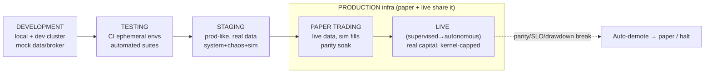

| Environment | Purpose | Data | Capital | Promotion gate → next |
|---|---|---|---|---|
| **Development** | Feature work, fast iteration | Mocked/sampled | None | PR passes lint+unit+integration |
| **Testing (CI)** | Automated verification, ephemeral per-PR | Fixtures + golden replay | None | Full CI suite + deterministic replay green |
| **Staging** | Prod-like validation | Real (delayed) data | None | System + simulation + chaos suites pass |
| **Paper trading** | Live behavior, zero risk | **Live data**, simulated fills | None | Min soak period + **live-vs-paper parity** + calibration hold |
| **Live — supervised** | Real capital, human-approved | Live | Tiny, kernel-capped | Live parity with paper + four-eyes committee approval |
| **Live — autonomous** | Bounded autonomy | Live | Bounded, kernel-capped | Sustained calibrated performance ≥1 regime cycle |

**Promotion principles:**
- **Same image, all environments** — only config/overlay differs (environment parity). What passed staging is byte-identical to what trades.
- **Paper and live share production infrastructure** — paper is not a lesser environment; it's production code on production infra with a simulated fill boundary. This is what makes paper-parity meaningful.
- **Promotion is evidence-based and often human-gated at capital boundaries** (four-eyes); demotion is **automatic and instant** on any breach. The dial turns up slowly and deliberately, down immediately.
- **Every promotion/demotion is audited** to the WORM ledger with who/what authorized it.
- **Rollback is always available and tested** — code (git revert→ArgoCD), model (registry stage), capital (auto-demote to paper or halt). Resuming after a kill requires human four-eyes.

---

## 15. Engineering Standards

Standards exist to **minimize technical debt and maximize developer productivity** — they make the codebase navigable by any engineer and keep the money path defensible. Enforced by tooling wherever possible (a standard that relies on memory is a standard that decays).

- **Naming conventions:** consistent, domain-driven names across the stack — services as nouns (`market-data`, `risk-engine`), events as `subject.verb` past-tense (`orders.filled`, `signals.generated`), topics namespaced by domain. Ubiquitous language from the design docs (instrument, signal, regime, episode) used identically in code, DB, and docs — no synonyms for the same concept. Enforced by linters + review.
- **Folder conventions:** every service follows the standard skeleton (§2.2 — `api/domain/adapters/config/migrations/tests`); ports-and-adapters everywhere. New service = copy the template. Predictability over cleverness.
- **Documentation standards:** every service has a README (what it does, its contracts, its runbook link); every significant decision is an **ADR** (context → decision → consequences) in `docs/` — this prevents re-litigating settled choices and is the single best defense against architectural drift. Public APIs documented from the schema (generated, not hand-written).
- **Logging standards:** structured JSON only; every log carries a **correlation ID** threading a request/decision across services; levels used consistently (ERROR = actionable, WARN = anomalous-but-handled, INFO = business events, DEBUG = diagnostics). No secrets or PII in logs ever. Money-path decisions log enough to reconstruct them (feeds explainability + audit).
- **Error handling:** explicit, typed errors — never swallow exceptions on the money path; fail-closed there, fail-open (with degradation + alert) on the alpha path. Errors carry context (correlation ID, what was attempted); retries are idempotent; timeouts and circuit-breakers on every external call. Distinguish *expected* domain rejections (a risk veto) from *unexpected* faults (a crash) — they get different handling and alerting.
- **Configuration management:** typed config schema per service (validated at startup — fail fast on bad config); config via environment/overlays, secrets via references only; the *same* image reads different config per environment. No config in code; no code-per-environment.
- **Dependency management:** pinned, lock-filed dependencies; a single source of truth for shared library versions in the monorepo; automated dependency-update PRs with CI gating; minimal dependencies on the money path (every dependency is attack surface + a maintenance liability). SBOM tracked (§12).
- **Versioning:** semantic versioning for libraries and APIs; immutable, content-addressed versions for models, datasets, and images (reproducibility, `claude_ROI.md` §16); backward-compatible schema evolution (registry-enforced). Every deployable artifact traces to a git SHA.
- **Code review & quality:** two approvers on the money path (one senior + formal review for the kernel), one elsewhere; reviews gate on tests, contracts, failure handling, and observability. Automated lint/format so humans review substance, not style.

> **Standards doctrine:** the codebase should read as if written by one careful engineer. Consistency compounds — a predictable codebase is faster to build in, safer to change, and cheaper to onboard into. Every standard here is enforced by CI or `CODEOWNERS` where possible, because unenforced standards are aspirations, not standards.

---

## 16. Future Expansion (3–5 years)

The architecture is designed so growth is **additive, not re-architecting** — new markets are adapters, new scale is more nodes, new intelligence is new models behind the same governance. The invariants (risk kernel sovereignty, PIT correctness, WORM audit, human sovereignty at the capital boundary) *expand in scope but never weaken*.

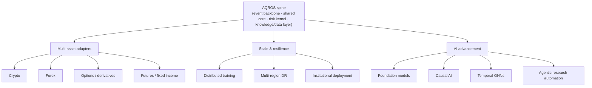

### 16.1 Multi-market & multi-asset support
The asset-class-agnostic ontologies (`claude_ROI.md` §26) and plugin/adapter architecture mean each new market is a **new adapter + data feed + ontology subtype**, not a new platform:
- **Crypto:** 24/7 markets (no session boundaries — the calendar model already abstracts this), on-chain data as a new alt-data source, multiple exchanges + perpetuals; watch custody/settlement differences. Often the *easiest* first expansion (accessible data, API-native venues).
- **Forex:** deep liquidity, macro-driven (leverages the existing macro/regime layer), OTC microstructure, carry strategies; multi-currency accounting extension.
- **Options / derivatives:** the biggest modeling lift — volatility surface, Greeks, expiries/rolls, path-dependency; the instrument ontology already models `underlying_of` and contract lifecycle. Enables vol strategies and richer hedging.
- **Futures / fixed income:** continuous-contract construction, roll handling, term structure; extends the same time-series + reference-data machinery.

### 16.2 Scale & resilience
- **Distributed training:** multi-GPU/multi-node (data + model parallel) for foundation-scale models; Ray/Kubeflow orchestration; the training service abstracts this so research code is unchanged.
- **Multi-region deployment:** active-passive DR (V2) → active-active (later) with the event log replicated cross-region; replay-based recovery gives minutes RTO. Latency-sensitive trading co-located near venues.
- **Institutional deployment:** multi-account/multi-strategy capital allocation, portfolio margin, multi-prime connectivity, client reporting APIs, SOC2/regulatory compliance hardening, capacity management (alpha × capacity, `claude_MLResearchFramework.md` §1.1) as a first-class constraint.

### 16.3 AI advancement (on the same rails)
Each frontier from `claude_MLResearchFramework.md` §17 plugs into the existing model registry + validation gauntlet — new intelligence never bypasses the discipline:
- **Financial foundation models** — pre-trained multi-modal market representations for transfer learning (attacks label scarcity); gated through the same PIT/validation/deflation apparatus.
- **Causal AI** — mechanism-based models that survive regime change; the highest-leverage bet for *durable* alpha.
- **Temporal GNNs** — monetizing the proprietary knowledge graph while respecting no-lookahead.
- **Agentic research automation** — agents generating and pre-screening hypotheses at scale through the full gauntlet, with human-gated trust escalation (automate the research loop, never the authority).

> **Expansion doctrine:** growth is composition. New asset → adapter. New scale → nodes. New intelligence → a validated model behind the sovereign kernel. If an expansion ever requires weakening the risk kernel, PIT correctness, the audit trail, or human sovereignty at the capital boundary — it is the wrong design. The spine was built for the endgame; the future is plugged into it, not bolted onto it.

---

## Document complete — Execution Blueprint, Sections 1–16 delivered.

**Full coverage:** project goals & staging (1) · repository architecture (2) · microservice architecture (3) · database design (4) · API design (5) · development roadmap (6) · MVP definition (7) · development priority (8) · testing strategy (9) · CI/CD pipeline (10) · infrastructure (11) · security (12) · cost optimization (13) · deployment strategy (14) · engineering standards (15) · future expansion (16). **12 Mermaid diagrams.**

**How to use this document:** it is the *how-to-build* layer over the four source-of-truth design docs. Start at §7 (MVP) and §6 (roadmap Phase 0), build the thin vertical slice through the backtest gauntlet, and let the trust ratchet (MVP→V1→V2) govern when capital and autonomy are introduced. Every mock sits behind a real interface (§7.3) so each stage composes onto the last rather than reworking it — the core bet against technical debt.

**The complete AQROS document set:**
- `AI_QUANT_PLATFORM_BLUEPRINT.md` — **the body** (distributed system architecture)
- `claude_aiBrain.md` — **the mind** (autonomous cognitive/agent architecture)
- `claude_ROI.md` — **the foundation** (knowledge & data layer)
- `claude_MLResearchFramework.md` — **the discipline** (ML & quant research framework)
- `Execution_Blueprint.md` — **the build plan** (this — master engineering guide)
