# AQROS — Remaining Services Architecture (V1 → V2 → v1.0)

> **Status:** architecture specification (design only — no implementation code).
> **Author role:** Principal Software Architect.
> **Authority:** This document *implements* the five source-of-truth docs in `docs/` and obeys `CLAUDE.md`. Where it touches "how to build," `Execution_Blueprint.md` wins; where it touches "what to build" in a domain, the relevant design doc wins; on rules/style, `CLAUDE.md` wins. This document does **not** redesign the four completed services (Market Data, Feature Store, Research Dataset Builder, Training Pipeline) — it composes onto them.

---

## 0. Scope, Inherited Conventions, and Global Invariants

### 0.1 What this document covers

The four foundation services are complete: **Market Data** (`:8002`), **Feature Store** (`:8003`), **Research Dataset Builder** (`:8008`), **Training Pipeline** (`:8009`). This document designs the **fifteen remaining architectural concerns** that carry AQROS from "our research numbers are real" (MVP, done) to a governed, self-improving, capital-managing platform (v1.0):

| # | Concern | Kind | Stage |
|---|---|---|---|
| 1 | Model Registry | service | V1 (start now) |
| 2 | Backtesting Engine | service (harness over shared core) | V1 (start now) |
| 3 | Strategy Engine | service (thin wrapper over `libs/` strategy core) | V1 |
| 4 | Portfolio Management | service (thin wrapper over `libs/` accounting core) | V1 |
| 5 | Risk Management | service (the sovereign kernel; `libs/` core) | V1 |
| 6 | Paper Trading Engine | harness over shared core | V1 |
| 7 | Live Trading Engine (OMS + EMS) | service (money path) | V1 |
| 8 | Broker Integration Layer | service (pluggable adapters) | V1 |
| 9 | AI Brain (LLM Orchestrator) | service + `agents/` | V2 |
| 10 | Monitoring & Observability (+ WORM Audit Ledger) | platform + service | V1 |
| 11 | Notification Service | service | V1 |
| 12 | Experiment Tracking | service (MLflow-backed) | V1 (start now) |
| 13 | Scheduling & Retraining | service | V2 |
| 14 | Secrets & Configuration | platform (Vault/KMS) | V1 |
| 15 | Deployment Architecture | platform (Docker → K8s) | spans all |

### 0.2 Conventions every new service inherits (non-negotiable)

Every service below is assumed to follow the **exact** patterns the four finished services already use. These are stated once here and not repeated per service:

- **Package/skeleton.** `backend/<service-name>/` (hyphenated dir), module `aqros_<service_name>` (snake_case), `src/`-layout hatchling package, `py.typed`. Internal layout is strict ports-and-adapters: `domain/` (pure, no I/O), `adapters/` (DB/HTTP/broker/LLM), `api/` (thin FastAPI: `schemas.py`, `deps.py`, `routes/`), `config.py`, `app.py`, `main.py`, `migrations/` (Alembic, if it owns a DB), `tests/{unit,integration}`.
- **Shared core.** Depends on `libs/aqros-core` (workspace source): `BaseServiceSettings` (env prefix `AQROS_`, fail-fast validation), `create_app()` factory, `HealthRegistry` + `/health`,`/health/live`,`/health/ready`, structured logging with correlation IDs.
- **Config.** Typed `Settings(BaseServiceSettings)` with `service_name`, `port`, `database_url`, upstream base URLs, all overridable via `AQROS_*`. No secrets in code — references only (see §14).
- **Persistence.** SQLAlchemy 2.0 async (`DeclarativeBase`/`Mapped`), asyncpg, Alembic forward-only migrations. **A service owns its database and no other service may touch it (Hard Rule §9 / §7.9).** Tables are snake_case plural; every time-sensitive fact carries `event_time` + `knowledge_time` (bitemporal, `claude_ROI.md` §17).
- **Boundaries.** Cross-service communication is **only** via (a) published REST/gRPC contracts or (b) events on the backbone. Never a direct DB connection or Python import of another service's `domain/`. Local decoupled dataclasses translate foreign payloads (the pattern Training Pipeline already uses for `DatasetManifest`).
- **Time.** No wall-clock reads in `domain/` — the clock is injected (`Clock` port). This is what makes backtest/paper/live deterministic and reproducible (`CLAUDE.md` §5, §6.3).
- **Testing.** Unit tests against fakes for every port + `hypothesis` property tests for invariants; integration tests via `testcontainers` Postgres and `httpx.ASGITransport`. Money-path code additionally passes the **deterministic golden-replay** system test.
- **Quality gates.** `ruff`, `black --check`, `mypy --strict`, `pytest` all green; two approvers on money-path code, one senior + kernel review on the risk kernel.

### 0.3 The single most important invariant: one core, three contexts

Per Hard Rule §7.1 and Principle §6.2, the **strategy, risk, sizing, portfolio-accounting, and order-lifecycle logic live exactly once, in `libs/`**, and are shared verbatim by three execution contexts:

```
                 ┌─────────────────────────────────────────────┐
                 │   libs/aqros-exec-core  (pure domain)         │
                 │   • strategy signal→intent   • risk kernel    │
                 │   • position/P&L accounting  • OMS state m/c   │
                 │   • sizing            • cost/impact interfaces │
                 └───────────────┬──────────────┬────────────────┘
        drives (in-proc)         │              │        drives (in-proc / gRPC)
   ┌──────────────────┐  ┌───────┴───────┐  ┌───┴──────────────────┐
   │ Backtesting (2)  │  │ Paper Trading │  │ Live Trading OMS/EMS │
   │ historical data  │  │ live data +   │  │ live data + REAL     │
   │ + sim fills      │  │ sim fills     │  │ fills via Broker (8) │
   └──────────────────┘  └───────────────┘  └──────────────────────┘
      ONLY the data source and the fill boundary differ. Never the logic.
```

Consequently, **Backtesting (2), Paper Trading (6), and Live Trading (7)** are *harnesses/wrappers*, not re-implementations. The **Strategy Engine (3), Risk Management (5), and Portfolio Management (4)** services are thin deployable wrappers that expose the same `libs/` domain over REST/gRPC/events for real-time use. A new `libs/aqros-exec-core` package is introduced (peer to `aqros-core`) to hold this shared core. If any design below appears to duplicate this logic, the duplication is the bug.

### 0.4 The event backbone

`Execution_Blueprint.md` mandates an event backbone that is the *source of truth*; for the MVP an **in-process bus behind a producer/consumer interface** is acceptable, swapped for **Kafka/Redpanda** at V1 without touching business logic. This design introduces `libs/aqros-events`:

- A typed `EventBus` port (`publish(topic, event)`, `subscribe(topic, group, handler)`), an `InProcessEventBus` adapter (dev/test), and a `KafkaEventBus` adapter (V1+, `redpanda` locally).
- Envelope: every event carries `event_id` (ULID, idempotency), `event_time`, `knowledge_time`, `correlation_id`, `causation_id`, `producer`, `schema_version`, `payload`. Schemas are versioned (Avro/JSON Schema) and registered; additive evolution only.
- Topic naming: `subject.verb` past tense (`orders.filled`, `signals.generated`, `risk.rejected`, `models.promoted`), namespaced by domain (`CLAUDE.md` §10).
- **Every database is a rebuildable projection of the log** (`Execution_Blueprint.md` §4).

### 0.5 Platform-wide event catalog (produced/consumed map)

| Topic | Produced by | Consumed by |
|---|---|---|
| `market.bars.<res>` | Market Data | Feature Store, Strategy, Paper, Live, Monitoring |
| `datasets.build.completed` | Dataset Builder | Scheduling, Experiment Tracking |
| `models.trained` | Training Pipeline | Model Registry, Experiment Tracking |
| `models.registered` | Model Registry | Backtesting, Notification, AI Brain |
| `models.stage.changed` | Model Registry | Strategy, Live, Notification, Audit Ledger |
| `backtests.completed` | Backtesting | Model Registry, Experiment Tracking, Notification |
| `signals.generated` | Strategy Engine | Risk, AI Brain, Monitoring |
| `orders.intended` | Strategy / AI Brain | Risk |
| `risk.approved` / `risk.rejected` / `risk.attenuated` | Risk Management | OMS(Live), Paper, Audit Ledger, Notification |
| `orders.submitted` / `orders.acked` / `orders.filled` / `orders.canceled` / `orders.rejected` | Live Trading (OMS/EMS) / Paper | Portfolio, Risk, Audit Ledger, Monitoring |
| `positions.updated` / `pnl.updated` | Portfolio | Risk, Strategy, AI Brain, Monitoring |
| `broker.connected` / `broker.disconnected` / `broker.reconcile.break` | Broker Integration | Risk, Live, Notification, Monitoring |
| `risk.limit.changed` / `killswitch.armed` | Risk / Control plane | Audit Ledger, Notification, all execution |
| `decisions.made` / `decisions.explained` | AI Brain | Audit Ledger, Notification, Monitoring |
| `alerts.raised` | Monitoring | Notification |
| `retrain.requested` / `retrain.completed` | Scheduling | Training Pipeline, Notification |
| `*` (all) | everyone | **Audit Ledger (WORM)** — subscribes to everything privileged |

### 0.6 Port and database allocation (continuing the established sequence)

Existing: gateway `8000`, auth `8001`, market-data `8002`/`5432`, feature-store `8003`/`5433`, model-registry `8004`(reserved), risk-engine `8005`(reserved), portfolio `8006`(reserved), audit-ledger `8007`(reserved), dataset-builder `8008`/`5434`, training-pipeline `8009`/`5435`.

| Service | HTTP port | gRPC port | Postgres port | Other stores |
|---|---|---|---|---|
| Model Registry | 8004 | — | 5436 | Object store (artifacts) |
| Risk Management | 8005 | 9005 | 5437 | Redis (in-mem book mirror) |
| Portfolio Management | 8006 | 9006 | 5438 | — |
| Audit Ledger (WORM) | 8007 | — | 5439 (append-only) | Object-lock bucket |
| Backtesting Engine | 8010 | — | 5440 | Object store (reports) |
| Strategy Engine | 8011 | 9011 | 5441 | Redis (signal cache) |
| Paper Trading Engine | 8012 | — | 5442 | — |
| Live Trading (OMS/EMS) | 8013 | 9013 | 5443 | — |
| Broker Integration | 8014 | 9014 | 5444 (session/idem) | — |
| AI Brain (Orchestrator) | 8015 | — | 5445 | Vector DB, Redis |
| Notification | 8017 | — | 5446 | — |
| Experiment Tracking | 8018 | — | 5447 | Object store (MLflow) |
| Scheduling & Retraining | 8019 | — | 5448 | — |
| Monitoring gateway | 8016 | — | — | Prometheus/Loki/Tempo |
| Secrets & Config | 8020 | — | — | Vault/KMS |
| Kafka/Redpanda | — | — | — | 9092 |
| Redis | — | — | — | 6379 |
| MinIO (object store) | — | — | — | 9000/9001 |

---

## 1. Model Registry

**Purpose.** The governed gate between research and capital. It is the single authoritative record of every model version, its immutable lineage manifest, its validation dossier, and its lifecycle stage. Nothing reaches paper or live capital except through a registered, signed, human-promoted model (Hard Rule §7.4: never auto-promote to real capital).

**Responsibilities.**
- Ingest trained candidates from Training Pipeline (which already produces versioned `Trained_Model` records + reproducibility metadata) and record them as **immutable model versions** with a content-addressed manifest (data snapshot hash + code SHA + feature versions + hyperparameters + validation dossier + artifact signature).
- Manage lifecycle **stages**: `registered → shadow → challenger → canary → champion → retired` (mirrors `Execution_Blueprint.md` §3.3), enforce legal transitions, and enforce **four-eyes promotion policy** (no single actor promotes to `champion`/live).
- Sign artifacts (cosign) and refuse to serve unsigned/unvalidated models; downstream (Strategy/Live) verify signatures.
- Serve model metadata, artifact pointers (object storage), and current stage state; expose lineage queries.
- Append every stage transition to the WORM audit ledger.

**Public REST APIs.**
- `POST /v1/models` — register a new model version from a Training Pipeline reference (idempotent on `training_run_id + model_name + version`).
- `GET /v1/models` — list/filter by name, stage, dataset lineage.
- `GET /v1/models/{name}/versions/{version}` — full manifest + validation dossier.
- `GET /v1/models/{name}/versions/{version}/artifact` — signed artifact download (streams from object store).
- `GET /v1/models/{name}/champion` — resolve the current champion for a model family.
- `POST /v1/models/{name}/versions/{version}/transition` — request a stage transition (body: `to_stage`, `justification`, `approver`); **four-eyes**: returns `202 pending_second_approval` until a second distinct approver confirms.
- `POST /v1/models/{name}/versions/{version}/approve` — second approver confirmation.
- `GET /v1/models/{name}/lineage` — dataset/feature/code provenance chain.

**Events consumed.** `models.trained` (auto-register candidate as `registered`), `backtests.completed` (attach dossier), `datasets.build.completed` (lineage cross-check).
**Events produced.** `models.registered`, `models.stage.changed` (with `from`/`to`/`approvers`), `models.retired`.

**Database schema (Postgres `:5436`).**
- `models` (id, name, model_family, created_at) — the logical family.
- `model_versions` (id, model_id FK, version, training_run_id, dataset_name, dataset_version, dataset_checksum, code_sha, feature_versions_json, hyperparameters_json, artifact_uri, artifact_signature, artifact_checksum, current_stage, created_at, knowledge_time; **unique(model_id, version)**; version immutable/write-once).
- `validation_dossiers` (id, model_version_id FK, walk_forward_json, purged_cv_json, deflated_sharpe, pbo, backtest_report_uri, passed bool).
- `stage_transitions` (id, model_version_id FK, from_stage, to_stage, requested_by, approved_by, justification, created_at) — append-only, four-eyes columns enforced.
- `promotion_policies` (model_family, min_stage_soak_days, required_gates_json).

**Storage requirements.** Postgres for metadata (ACID, replicated). Object storage (MinIO local → S3/R2) for artifacts + validation reports, versioned, immutable, object-lock on `champion` artifacts. Artifacts are content-addressed; the registry stores pointers, never bytes in Postgres.

**Directory structure.**
```
backend/model-registry/
├── src/aqros_model_registry/
│   ├── domain/       models.py (ModelVersion, Stage, Manifest, Dossier, Transition),
│   │                 lifecycle.py (legal-transition state machine),
│   │                 promotion.py (four-eyes policy), signing.py (verify/sign ports)
│   ├── adapters/     db.py, orm.py, repository.py, object_store.py (artifacts),
│   │                 cosign_signer.py, training_pipeline_client.py, event_bus.py, audit_client.py
│   ├── api/          schemas.py, deps.py, routes/{models.py,transitions.py,lineage.py}
│   ├── config.py, app.py, main.py
├── migrations/  tests/{unit,integration}
```

**Ports and adapters.** Ports: `ModelVersionRepository`, `ArtifactStore` (reuse the pattern from Training Pipeline; swappable local→S3), `ArtifactSigner`, `TrainingPipelineClient`, `EventBus`, `AuditLedgerClient`, `Clock`. Adapters implement each; four-eyes and stage-machine logic stay pure in `domain/`.

**Failure handling.** Fail-closed on promotion: if the audit ledger or signer is unavailable, a promotion request is *rejected*, never silently allowed. A registry outage blocks new promotions but does **not** stop already-serving champions (Strategy/Live cache the champion pointer). Manifest writes are transactional; artifact upload precedes metadata commit (no dangling pointer). Registration from `models.trained` is idempotent on the version key.

**Docker deployment.** Standard `docker/Dockerfile.service` (`SERVICE=model-registry, MODULE=aqros_model_registry, PORT=8004`), `model-registry-db` Postgres `:5436`, depends on MinIO. Reuses the reserved `model-registry` compose slot.

**Testing strategy.** Unit: stage-machine legality (property test: no illegal transition for any input), four-eyes (property: a single approver never reaches `champion`), manifest immutability. Integration: register→transition→approve→resolve-champion against real Postgres + MinIO; signature verify/refuse. Golden: a registered champion round-trips its manifest bit-for-bit.

**Security considerations.** Signed artifacts (cosign); inference/strategy refuse unsigned. Promotion is four-eyes, RBAC-gated (`committee`/`risk-officer`), and audited to WORM. Artifact object store is access-controlled + egress-monitored (models are IP). No path lets the AI promote itself (Hard Rule §7.3/§7.4).

**Future scalability.** Postgres read-replicas for lineage queries; artifact CDN/tiering; multi-region artifact replication; the same registry later governs foundation models, ensembles, and agent policies through the identical gauntlet — new intelligence never bypasses the gate.

---

## 2. Backtesting Engine

**Purpose.** Deterministic historical replay that drives the **shared** strategy/risk/OMS core from `libs/aqros-exec-core` against Dataset-Builder datasets + Feature-Store PIT features, with a realistic cost/impact simulator, producing **signed, reproducible backtest reports** and anti-overfitting analytics (CPCV, PBO, deflated Sharpe). This is the MVP's crown and the pre-capital gate.

**Responsibilities.**
- Replay a dataset (or PIT feature stream) through the *identical* strategy → risk → sizing → simulated-OMS pipeline used by paper/live.
- Simulate fills via a pluggable cost model (fixed + spread + configurable market-impact); never assume free/instant fills.
- Enforce point-in-time correctness structurally (inherits leakage-audited datasets; the engine itself performs a leakage self-audit — inject a lookahead feature and assert it's caught).
- Compute the validation gauntlet: walk-forward, purged/combinatorial CV, PBO, deflated Sharpe, turnover, capacity.
- Emit a signed report (content-addressed) attachable to a Model Registry validation dossier.

**Public REST APIs.**
- `POST /v1/backtests` — launch a backtest (body: `dataset_build_run_id` or `strategy_spec` + `model_name/version`, `cost_model`, `date_range`, `seed`); synchronous for small runs, `202` + job id for large (Scheduling drives big fan-outs).
- `GET /v1/backtests/{id}` — status + summary.
- `GET /v1/backtests/{id}/report` — full signed report (metrics, per-fold, equity curve, drawdowns, PBO/DSR).
- `GET /v1/backtests/{id}/report/download` — report artifact (object store).
- `GET /v1/backtests?model_name=&strategy=` — list/compare.

**Events consumed.** `models.registered` (optionally auto-backtest a candidate), `datasets.build.completed`.
**Events produced.** `backtests.completed` (id, model ref, DSR, PBO, passed), `backtests.failed`.

**Database schema (Postgres `:5440`).**
- `backtest_runs` (id, strategy_spec_json, model_name, model_version, dataset_build_run_id, cost_model_json, seed, status, started_at, completed_at, code_sha).
- `backtest_metrics` (backtest_run_id FK, sharpe, deflated_sharpe, sortino, max_drawdown, turnover, hit_rate, pbo, capacity_estimate).
- `backtest_fold_metrics` (backtest_run_id FK, fold, split_role, metrics_json).
- `backtest_reports` (backtest_run_id FK, report_uri, report_checksum, signature).
Only metadata in Postgres; equity curves / trade blotters / full reports live as Parquet/JSON in object storage (same split as Dataset Builder).

**Storage requirements.** Postgres (run metadata + headline metrics). Object storage for full reports, equity curves, per-trade blotters. Reads Feature Store/Dataset Builder over REST only. CPU-bound, embarrassingly parallel — suited to spot/batch compute.

**Directory structure.**
```
backend/backtesting/
├── src/aqros_backtesting/
│   ├── domain/     engine.py (deterministic event loop over shared core),
│   │               cost_model.py (fixed/spread/impact), report.py,
│   │               validation.py (walk-forward/CPCV/PBO/DSR), leakage_audit.py
│   ├── adapters/   db.py, orm.py, repository.py, object_store.py,
│   │               dataset_builder_client.py, feature_store_client.py,
│   │               model_registry_client.py, event_bus.py
│   ├── api/  config.py, app.py, main.py
```
The engine imports `libs/aqros-exec-core` for strategy/risk/OMS — it supplies only the historical data source + simulated fill boundary.

**Ports and adapters.** Ports: `DatasetSource`, `FeatureSource`, `ModelArtifactSource` (from Registry), `CostModel`, `FillSimulator`, `ReportStore`, `EventBus`, `Clock` (injected → determinism). The shared-core `Strategy`, `RiskKernel`, `OMS` are injected as the same objects live uses.

**Failure handling.** A failed backtest is just a failed job (zero capital impact). Determinism is mandatory: seeded RNG + injected clock → bit-for-bit golden replay in CI; any non-determinism fails the build. Partial runs are checkpointed and resumable. Reports are only registered on success + gauntlet pass (a failed validation never yields a "passed" dossier).

**Docker deployment.** `SERVICE=backtesting, MODULE=aqros_backtesting, PORT=8010`, `backtesting-db` `:5440`, MinIO. Scaled horizontally as stateless workers pulling jobs.

**Testing strategy.** *Meta-tests on the tester itself*: known-answer strategies produce known results; **leakage-injection test** (a lookahead feature must be caught); cost-model sanity; CPCV/PBO/DSR numerical correctness against references. Golden deterministic replay is the gating system test. Property tests: same inputs+seed ⇒ identical report hash.

**Security considerations.** Runs in the research zone, never contends with trading nodes (taints). Verifies model-artifact signatures before loading. Reports signed + content-addressed so a backtest cited in a promotion can't be forged or silently altered.

**Future scalability.** Ray/K8s-Job fan-out across thousands of parameter/CPCV combinations on spot compute; distributed report aggregation; capacity/impact models grow richer (full LOB simulation) without changing the shared-core contract.

---

## 3. Strategy Engine

**Purpose.** Turn model predictions + features + regime context into **order intents** using strategy logic that lives once in `libs/aqros-exec-core`. In backtest/paper/live it is the *same* code; as a service it is the real-time wrapper that consumes signals and emits intents to Risk. It never sizes beyond what Risk allows and never talks to a venue.

**Responsibilities.**
- Resolve the current champion model (from Registry), pull PIT/online features (Feature Store), obtain predictions (from the model artifact or, V1+, the Inference service), and translate calibrated prediction + confidence → a target position / order intent via a registered strategy spec.
- Apply confidence-to-size mapping (low confidence → small/no trade; `CLAUDE.md` §6.6) — but final sizing authority is Risk's.
- Support multiple concurrent strategies, each a versioned, registered spec; combine weak diverse signals (the project's edge is the portfolio of signals, not one model).
- Emit `signals.generated` and `orders.intended`; in V2, hand candidates to the AI Brain instead of directly to Risk when autonomy tier requires deliberation.

**Public REST APIs.**
- `POST /v1/strategies` — register a strategy spec (versioned, immutable).
- `GET /v1/strategies` / `GET /v1/strategies/{id}` — list/detail.
- `POST /v1/strategies/{id}/activate` / `deactivate` — control (four-eyes for live-bound strategies).
- `GET /v1/signals?strategy=&as_of=` — recent signals (PIT-scoped).
- `POST /v1/strategies/{id}/evaluate` — synchronous "what would this strategy do given current state" (used by dashboards/backtests).

**Events consumed.** `market.bars.<res>`, `models.stage.changed` (swap champion), `positions.updated`/`pnl.updated` (state for sizing), `decisions.made` (V2, from AI Brain).
**Events produced.** `signals.generated`, `orders.intended`.

**Database schema (Postgres `:5441`).**
- `strategy_specs` (id, name, version, spec_json, model_family, status, created_at; unique(name,version); immutable).
- `signals` (id, strategy_id FK, instrument, event_time, knowledge_time, prediction, confidence, target_position, rationale_json, correlation_id) — bitemporal, PIT-queryable.
- `strategy_activations` (id, strategy_id FK, context enum{backtest,paper,live}, activated_by, active bool, created_at).
Redis: hot cache of latest signal per (strategy, instrument).

**Storage requirements.** Postgres for specs + signal history (audit/replay). Redis for hot signals. Reads Feature Store + Model Registry over REST/gRPC. No venue or broker access.

**Directory structure.**
```
backend/strategy-engine/
├── src/aqros_strategy_engine/
│   ├── domain/    (thin) strategy_runner.py wrapping libs/aqros-exec-core strategies,
│   │              confidence_sizing.py, signal.py
│   ├── adapters/  db.py, orm.py, repository.py, feature_store_client.py,
│   │              model_registry_client.py, inference_client.py (V1+),
│   │              redis_cache.py, event_bus.py
│   ├── api/  config.py, app.py, main.py
```

**Ports and adapters.** Ports: `FeatureSource`, `PredictionSource` (model artifact/Inference), `ChampionResolver` (Registry), `SignalRepository`, `SignalCache`, `EventBus`, `Clock`. Strategy math is in `libs/`; this service is orchestration + I/O.

**Failure handling.** Alpha path → **fail-open with degradation**: if features are stale or inference times out, emit a lower-confidence or no-trade signal and flag it (never fabricate a confident signal). Circuit-break to a deterministic fallback (e.g., hold). A missing champion ⇒ strategy inactive + alert. Signals are advisory until Risk approves.

**Docker deployment.** `SERVICE=strategy-engine, MODULE=aqros_strategy_engine, PORT=8011` (+ gRPC `9011` for the low-latency Strategy→Risk hop), `strategy-engine-db` `:5441`, Redis. Autoscale (HPA) on signal throughput.

**Testing strategy.** Unit: confidence→size mapping (property: monotonic, capped, zero at low confidence), spec parsing. Integration: signal generation against faked feature/prediction ports + real Postgres. Golden replay shares fixtures with Backtesting to prove identical behavior across contexts.

**Security considerations.** Strategy specs are versioned/audited; activation for live is four-eyes + RBAC. Runs in the research/decision zone; no venue egress. In V2, third-party/agent-authored strategies run sandboxed (gVisor) with quotas.

**Future scalability.** Many strategies as independent stateless workers keyed by instrument shard; ensemble/meta-strategy combination; regime-conditioned strategy selection (V2) plugs in via the same signal contract.

---

## 4. Portfolio Management

**Purpose.** The authoritative accounting brain: positions, P&L, exposures, and (V2) optimization. It is reconciled three ways (OMS ↔ its own Postgres ↔ broker) and is rebuildable from the event log. It provides the state Risk and Strategy read; it never sends orders.

**Responsibilities.**
- Maintain authoritative per-account, per-instrument positions and realized/unrealized P&L from fills, corporate actions, and market marks.
- Aggregate exposures (gross/net, sector, factor, currency) for Risk consumption.
- Continuous **3-way reconciliation**; halt the affected scope on any mismatch rather than guessing (fail-closed on accounting).
- (V2) Portfolio optimization: target positions from combined signals subject to risk constraints.

**Public REST APIs.**
- `GET /v1/portfolio/{account}/positions` — current positions (+ `as_of` for PIT).
- `GET /v1/portfolio/{account}/pnl` — realized/unrealized P&L, time-series.
- `GET /v1/portfolio/{account}/exposures` — aggregated exposures.
- `POST /v1/portfolio/{account}/reconcile` — trigger reconciliation (also runs continuously).
- `POST /v1/portfolio/optimize` — (V2) target allocation from signals + constraints.
- WebSocket `/v1/portfolio/{account}/stream` — live positions/P&L push to UIs.

**Events consumed.** `orders.filled`, `orders.canceled`, `market.bars.<res>` (marks), `broker.reconcile.break`.
**Events produced.** `positions.updated`, `pnl.updated`, `portfolio.reconcile.break` (halts scope).

**Database schema (Postgres `:5438`, strongly consistent).**
- `accounts` (id, name, base_currency, context enum{paper,live}, created_at).
- `positions` (id, account_id FK, instrument, quantity, avg_cost, event_time, knowledge_time; unique(account_id,instrument)).
- `fills` (id, account_id FK, order_id, instrument, qty, price, fees, event_time, knowledge_time, source enum{paper,live}) — the event-sourced ledger.
- `pnl_snapshots` (id, account_id FK, realized, unrealized, equity, as_of).
- `reconciliations` (id, account_id FK, oms_hash, broker_hash, internal_hash, matched bool, break_detail_json, created_at).
- `target_allocations` (V2) (id, account_id FK, instrument, target_weight, created_at).

**Storage requirements.** Postgres (strongly consistent, replicated) — money-adjacent state is never casually sharded. Rebuildable from `orders.filled` + broker statements via the event log. No object store needed.

**Directory structure.**
```
backend/portfolio/
├── src/aqros_portfolio/
│   ├── domain/    (from libs/aqros-exec-core) accounting.py, pnl.py, exposures.py,
│   │              reconciliation.py, optimizer.py (V2)
│   ├── adapters/  db.py, orm.py, repository.py, market_data_client.py,
│   │              broker_client.py, event_bus.py, ws.py
│   ├── api/  config.py, app.py, main.py
```

**Ports and adapters.** Ports: `PositionRepository`, `FillLedger`, `MarketMarkSource`, `BrokerStatementSource`, `EventBus`, `Clock`. Accounting logic is shared-core (identical in backtest/paper/live).

**Failure handling.** **Fail-closed on reconciliation**: our-book ≠ broker ⇒ halt trading for that scope + page humans (never trade on an uncertain book). Strongly consistent writes; idempotent fill application (dedupe on `order_id + fill_seq`). On crash, rebuild positions by replaying `orders.filled` then reconcile against the broker before resuming.

**Docker deployment.** `SERVICE=portfolio, MODULE=aqros_portfolio, PORT=8006` (+ gRPC `9006`), `portfolio-db` `:5438`. Reuses reserved compose slot. Multi-AZ Postgres from V1.

**Testing strategy.** Unit: P&L math, avg-cost, corporate actions, exposure aggregation (property: sum of position values = equity within tolerance). Integration: fill→position→reconcile against real Postgres; injected reconciliation break halts scope. Golden replay: identical P&L for the same fill sequence across contexts.

**Security considerations.** Trading-zone service; account data field-encrypted; all mutations audited. Read APIs RBAC-scoped per account/role.

**Future scalability.** Partition positions/fills by account + time; read replicas for exposure/P&L dashboards; multi-currency + portfolio-margin extensions for institutional accounts; optimizer scales as a separate batch job.

---

## 5. Risk Management (the sovereign kernel)

**Purpose.** The inviolable backstop between intent and execution. It holds an in-memory position/exposure book, runs pre-trade checks in microseconds, computes live VaR/stress, and enforces a **hard kernel** of human-owned ceilings (max notional, order rate, drawdown) that **no agent, model, or automated loop can raise** (Hard Rules §7.3). The AI proposes; the kernel disposes. Highest review bar in the system.

**Responsibilities.**
- Pre-trade verification of every `orders.intended`: position/exposure limits, restricted lists, wash/self-match/spoofing surveillance, buying power — decide **approve / attenuate / veto** with reason codes.
- Maintain the hard kernel ceilings (human-owned, four-eyes to change, immutable to the AI); arm/execute kill-switches (per-strategy, per-account, global).
- Compute portfolio risk (VaR, stress scenarios, drawdown tracking) and drive defensive mode on data-quality or regime signals.
- Enforce the trust ladder: refuse live intents from a strategy/model that hasn't cleared paper parity (Hard Rule §7.6).

**Public REST APIs.**
- `POST /v1/risk/check` — synchronous pre-trade check (internal gRPC `9005` on the hot path); returns decision + reason codes. Idempotent on intent id.
- `GET /v1/risk/limits` / `POST /v1/risk/limits` — read/propose limit changes (**four-eyes**, audited; the kernel ceilings require `risk-officer` + `committee`).
- `POST /v1/risk/kill-switch` — arm global/scoped kill-switch (immediate; resume requires four-eyes).
- `GET /v1/risk/exposures` / `GET /v1/risk/var` — live risk state.
- `GET /v1/risk/state` — current mode (normal/defensive/halted).

**Events consumed.** `orders.intended`, `positions.updated`/`pnl.updated`, `market.bars.<res>` (marks/vol), `broker.disconnected`/`broker.reconcile.break` (→ defensive/halt), `models.stage.changed` (trust-ladder gating), `decisions.made` (V2).
**Events produced.** `risk.approved`, `risk.rejected`, `risk.attenuated`, `risk.limit.changed`, `killswitch.armed`, `risk.mode.changed`.

**Database schema (Postgres `:5437`).**
- `risk_limits` (id, scope enum{global,account,strategy,instrument}, scope_ref, limit_type, value, is_kernel bool, created_by, approved_by, created_at) — `is_kernel=true` rows are human-owned; append-only history.
- `risk_decisions` (id, intent_id, decision enum, reason_codes_json, exposures_snapshot_json, correlation_id, event_time, knowledge_time) — every check recorded.
- `kill_switch_events` (id, scope, scope_ref, armed_by, reason, armed_at, resumed_by, resumed_at).
- `risk_snapshots` (id, account_id, var, gross, net, drawdown, mode, as_of).
Redis mirrors the hot in-memory book for fast recovery; Postgres is the durable record.

**Storage requirements.** In-memory book (authoritative at runtime, rebuilt from Portfolio + event log on start). Postgres for limits, decisions, kill-switch history (durable, audited). Redis for hot mirror + rate-limit counters. Every decision also streamed to the WORM ledger.

**Directory structure.**
```
backend/risk-engine/
├── src/aqros_risk_engine/
│   ├── domain/    (from libs/aqros-exec-core, kernel is THE crown jewel)
│   │              kernel.py (hard ceilings — pure, formally reviewed),
│   │              pretrade_checks.py, var.py, surveillance.py, killswitch.py, book.py
│   ├── adapters/  db.py, orm.py, repository.py, redis_book.py,
│   │              portfolio_client.py, market_data_client.py, event_bus.py, audit_client.py, grpc_server.py
│   ├── api/  config.py, app.py, main.py
```

**Ports and adapters.** Ports: `PositionBookSource` (Portfolio), `MarketRiskSource`, `LimitRepository`, `RiskDecisionRepository`, `EventBus`, `AuditLedgerClient`, `Clock`. The kernel and pre-trade math are pure `libs/` domain — shared identically by backtest/paper/live, so a limit that vetoes in live also vetoes in backtest.

**Failure handling.** **Fail-closed, always.** If Risk cannot verify a trade (dependency down, book uncertain, timeout), the trade is **rejected**. Active-active failover. On any reconciliation break, halt the affected scope. Kernel ceilings hold even under partial failure (they are in-memory constants loaded at start, re-validated against Postgres). Kill-switch is a dead-man default: ambiguous state ⇒ halt. Resume after any kill requires human four-eyes (§7.7).

**Docker deployment.** `SERVICE=risk-engine, MODULE=aqros_risk_engine, PORT=8005` (+ gRPC `9005` — the sacred hot-path hop), `risk-engine-db` `:5437`, Redis. Reserved compose slot. HA replicas; NUMA-pinned on the trading node pool in K8s (V1+).

**Testing strategy.** The most rigorous in the platform. Unit + **property tests as invariants**: "the kernel never approves beyond a hard ceiling for *any* input" (exhaustive/`hypothesis`), rate-limit correctness, surveillance rules. Integration: intent→decision against real Postgres/Redis. Chaos/stress: order bursts, book-vs-broker breaks, feed-stale defensive mode. Golden replay must reproduce identical decisions. Formal-checklist review + two approvers (one senior) on any kernel change.

**Security considerations.** The AI can **never** raise its own limits — kernel changes are four-eyes, human-only, audited to WORM, and structurally impossible via any API the AI can reach. Trading-zone only, no public ingress. Every decision + limit change is hash-chained into the ledger. Kill-switch endpoints are the most tightly RBAC-controlled surface in AQROS.

**Future scalability.** Sharded in-memory books per account/venue with a global exposure aggregator; sub-µs check path can move to a compiled sidecar (Rust) later without changing the pure-domain kernel contract; multi-venue/multi-asset limits are additive rows, not new logic.

---

## 6. Paper Trading Engine

**Purpose.** Run the **exact production code** (shared strategy/risk/OMS core) on **live data with simulated fills** — the final pre-capital gate. It is not a lesser environment: it is production code on production infra with only the fill boundary simulated. Its job is to prove **live-vs-paper parity** and catch everything historical backtests structurally can't (real-time quirks, latency, operational bugs).

**Responsibilities.**
- Subscribe to live market data, drive the same Strategy→Risk→OMS pipeline as live, and simulate fills through a realistic fill/slippage model at live prices.
- Book paper positions/P&L through the Portfolio service (an account flagged `context=paper`).
- Compute and expose **live-vs-paper parity** and calibration metrics over a soak window; block promotion to real capital on divergence (Hard Rule §7.6).
- Provide the soak-period evidence the control plane requires before supervised-live.

**Public REST APIs.**
- `POST /v1/paper/sessions` — start a paper session (strategy/model refs, account, fill model).
- `GET /v1/paper/sessions/{id}` — status, runtime P&L, parity metrics.
- `GET /v1/paper/sessions/{id}/parity` — live-vs-paper / backtest-vs-paper divergence report.
- `POST /v1/paper/sessions/{id}/stop`.
- WebSocket `/v1/paper/sessions/{id}/stream` — live paper decisions + fills.

**Events consumed.** `market.bars.<res>`, `signals.generated`/`orders.intended`, `risk.approved`.
**Events produced.** `orders.submitted`/`orders.filled` (with `source=paper`), `paper.parity.updated`, `paper.session.completed`.

**Database schema (Postgres `:5442`).**
- `paper_sessions` (id, strategy_id, model_name, model_version, account_id, fill_model_json, status, started_at, stopped_at, code_sha).
- `paper_parity` (session_id FK, metric, paper_value, reference_value, divergence, as_of).
Fills/positions live in Portfolio (paper account); this DB holds session control + parity only.

**Storage requirements.** Small Postgres (session + parity). Relies on Portfolio for the paper ledger, Feature Store/Market Data for live data, shared core for logic. No object store.

**Directory structure.**
```
backend/paper-trading/
├── src/aqros_paper_trading/
│   ├── domain/    session.py (drives libs/aqros-exec-core), fill_simulator.py,
│   │              parity.py (live-vs-paper divergence)
│   ├── adapters/  db.py, orm.py, repository.py, market_data_client.py,
│   │              strategy_client.py, risk_client.py, portfolio_client.py, event_bus.py
│   ├── api/  config.py, app.py, main.py
```

**Ports and adapters.** Ports: `LiveMarketSource`, `FillSimulator`, `RiskClient`, `PortfolioClient`, `SessionRepository`, `EventBus`, `Clock` (real clock in live-paper, but injected so tests replay). The Strategy/Risk/OMS objects are the *same* shared-core objects live uses — differing only in the `FillSimulator` vs a real broker fill.

**Failure handling.** No capital at risk, but it must faithfully mirror live failure semantics (so parity is meaningful): Risk still fails-closed, reconciliation still halts, feed-stale still triggers defensive mode. A crashed session resumes by replay. Parity divergence beyond threshold auto-flags and blocks promotion.

**Docker deployment.** `SERVICE=paper-trading, MODULE=aqros_paper_trading, PORT=8012`, `paper-trading-db` `:5442`. Runs on **production infra** (same images as live) — this is what makes parity meaningful.

**Testing strategy.** Integration: full pipeline with faked live feed + fill simulator + real Risk/Portfolio. **Parity is itself tested**: a known strategy on a fixed live-replay must match its backtest within tolerance. Golden replay shared with Backtesting and Live.

**Security considerations.** Same trading-zone controls as live (it *is* production code). Cannot reach a real venue — the fill boundary is a simulator, structurally (no Broker Integration credentials wired). RBAC-gated session control.

**Future scalability.** Many concurrent paper sessions as stateless workers; richer microstructure fill models; multi-asset paper accounts; continuous always-on paper shadow of every live strategy for ongoing parity monitoring.

---

## 7. Live Trading Engine (OMS + EMS)

**Purpose.** The money path. **OMS** owns the transactional parent-order lifecycle with idempotency and broker reconciliation; **EMS** owns smart routing, child-order slicing, venue connectivity, and cancel-on-disconnect. It executes **only** orders that passed Risk, carry a coherent explanation, and (until fully autonomous) have human approval (Hard Rule §7.7). Fail loudly, fail closed.

**Responsibilities.**
- OMS: parent-order state machine (`new→risk_approved→working→partially_filled→filled/canceled/rejected`), client-generated idempotency IDs (retries never duplicate an order), event-sourced lifecycle, continuous broker reconciliation.
- EMS: order slicing (VWAP/TWAP/POV/IS), smart routing across venues, venue adapters via Broker Integration, **cancel-on-disconnect** dead-man switch armed at session start.
- Emit lifecycle + fill events to Portfolio, Risk, and the WORM ledger; enforce that no order leaves without a fresh Risk approval + (supervised mode) human approval token.

**Public REST APIs.** (control surface; the hot path is internal gRPC `9013`)
- `POST /v1/orders` — submit an approved order (idempotency key required; validates a fresh `risk.approved` token + approval token in supervised mode).
- `GET /v1/orders/{id}` — order + lifecycle + fills.
- `POST /v1/orders/{id}/cancel`.
- `GET /v1/orders?account=&status=` — blotter.
- `POST /v1/orders/{id}/approve` — human per-trade approval (supervised-live; four-eyes-capable).

**Events consumed.** `risk.approved` (the only gate to `working`), `broker.disconnected`/`broker.connected`, `killswitch.armed` (immediate cancel-all in scope).
**Events produced.** `orders.submitted`, `orders.acked`, `orders.filled`, `orders.partially_filled`, `orders.canceled`, `orders.rejected`.

**Database schema (Postgres `:5443`, event-sourced).**
- `orders` (id, client_order_id UNIQUE (idempotency), account_id, strategy_id, instrument, side, qty, order_type, limit_price, status, risk_decision_id, approval_token, created_at, knowledge_time).
- `order_events` (id, order_id FK, event_type, payload_json, seq, event_time) — append-only lifecycle log (the source for replay).
- `child_orders` (id, parent_order_id FK, venue, qty, price, algo, status).
- `executions` (id, order_id FK, child_order_id, venue_exec_id UNIQUE, qty, price, fees, event_time) — dedupe on `venue_exec_id`.
- `reconciliations` (id, account_id, broker_snapshot_hash, oms_snapshot_hash, matched bool, break_json, created_at).

**Storage requirements.** Postgres, strongly consistent, replicated, multi-AZ. Event-sourced → rebuildable from `order_events` + broker statements. No object store on the hot path (latency).

**Directory structure.**
```
backend/live-trading/
├── src/aqros_live_trading/
│   ├── domain/    (from libs/aqros-exec-core) oms_state_machine.py, idempotency.py,
│   │              ems_router.py, slicing.py (vwap/twap/pov/is), cancel_on_disconnect.py, reconciliation.py
│   ├── adapters/  db.py, orm.py, repository.py, broker_client.py (→ Broker Integration),
│   │              risk_client.py (gRPC), portfolio_client.py, event_bus.py, audit_client.py, grpc_server.py
│   ├── api/  config.py, app.py, main.py
```

**Ports and adapters.** Ports: `BrokerGateway` (→ Broker Integration, §8), `RiskClient`, `OrderRepository`, `EventLog`, `EventBus`, `AuditLedgerClient`, `Clock`. OMS/EMS domain is shared-core (the same state machine paper/backtest use, differing only in the `BrokerGateway`/`FillSimulator` boundary).

**Failure handling.** **Fail-closed, loudly.** No order to `working` without a fresh `risk.approved` (re-checked, not cached stale). Idempotency prevents duplicate orders on retry. On crash: replay `order_events`, reconcile against broker, **pause new orders until reconciled** (never assume an unconfirmed fill). Broker-side **cancel-on-disconnect** armed at session start; on venue disconnect, working orders auto-cancel/reroute. `killswitch.armed` ⇒ immediate cancel-all in scope. Every external broker call has timeout + idempotent retry + circuit breaker.

**Docker deployment.** `SERVICE=live-trading, MODULE=aqros_live_trading, PORT=8013` (+ gRPC `9013`), `live-trading-db` `:5443`. Trading node pool (reserved, tainted, NUMA-pinned) in K8s; multi-AZ Postgres; **never** exposed through the public gateway.

**Testing strategy.** Highest bar. Unit: state-machine legality (property: no illegal transition; idempotency: duplicate `client_order_id` never creates two orders), slicing math. Integration: order lifecycle against a **stubbed broker behind the real `BrokerGateway` interface** + real Postgres. Chaos: broker disconnect mid-order, duplicate fill events, reconciliation break, kill-switch cancel-all. Golden replay bit-for-bit. Two approvers + kernel-adjacent review.

**Security considerations.** Trading zone, no public ingress, egress only to whitelisted venues. Every order/fill/cancel/approval hash-chained to WORM. Supervised mode requires a human approval token per trade (four-eyes capable); autonomous mode only within kernel ceilings and only after V2 gates. Broker credentials never touch this service directly — they live behind Broker Integration + Secrets (§8, §14).

**Future scalability.** Multi-venue smart routing, FIX sessions, co-location for latency; the compiled ultra-low-latency order path (Rust/C++) can replace the hot loop later behind the same `BrokerGateway`/OMS contracts; multi-prime connectivity is new adapters, not new OMS logic.

---

## 8. Broker Integration Layer

**Purpose.** The hardened, pluggable boundary to the outside execution world. It normalizes every broker/venue's idiosyncratic API (Alpaca, IBKR, crypto exchanges, later FIX) behind **one canonical `BrokerGateway` contract** so OMS/EMS, paper, and backtest compile against the identical interface. Mocks sit behind the real interface (Principle §6.9), so adding a real broker later is composition, not rework.

**Responsibilities.**
- Translate canonical orders/cancels/queries ↔ each broker's protocol; normalize fills, positions, and account state back to canonical form.
- Manage broker sessions, auth (credentials from Secrets, never in code), heartbeats, and **cancel-on-disconnect** arming.
- Detect disconnects/sequence gaps and emit reconciliation signals; expose broker positions for Portfolio's 3-way recon.
- Provide a **paper/stub adapter** (deterministic simulated broker) selectable by config — the same interface used by the MVP and by tests.

**Public REST APIs.** (mostly internal gRPC `9014`)
- `POST /v1/broker/orders` — place canonical order at the active broker (idempotent on client id).
- `DELETE /v1/broker/orders/{id}` — cancel.
- `GET /v1/broker/positions` / `GET /v1/broker/account` — broker-side truth (for reconciliation).
- `GET /v1/broker/status` — session/connectivity health.

**Events consumed.** `killswitch.armed` (cancel-all at broker).
**Events produced.** `broker.connected`, `broker.disconnected`, `broker.order.acked`, `broker.fill.received`, `broker.reconcile.break`.

**Database schema (Postgres `:5444`, minimal).**
- `broker_sessions` (id, broker, account_ref, status, connected_at, disconnected_at).
- `idempotency_keys` (client_order_id UNIQUE, broker_order_id, first_seen_at) — dedupe/idempotency at the boundary.
- `broker_events` (id, broker, event_type, raw_payload_json, normalized_json, received_at) — raw capture for replay/audit.
Credentials are **never** stored here — fetched at runtime from Vault (§14).

**Storage requirements.** Small Postgres (sessions + idempotency + raw event capture for audit/replay). Raw broker payloads captured append-only (nothing lost; replay on recovery). No object store.

**Directory structure.**
```
backend/broker-integration/
├── src/aqros_broker_integration/
│   ├── domain/    gateway.py (canonical BrokerGateway port + canonical order/fill types),
│   │              normalization.py, session.py
│   ├── adapters/  brokers/{stub_broker.py, alpaca.py, ibkr.py, ...}, db.py, orm.py,
│   │              repository.py, secrets_client.py, event_bus.py, grpc_server.py
│   ├── api/  config.py, app.py, main.py
```

**Ports and adapters.** The canonical `BrokerGateway` is the port; each broker is an adapter (`stub_broker` for MVP/paper/tests, real brokers for live). `SecretsClient`, `EventBus`, `IdempotencyStore`, `Clock` round out the ports. Selecting a broker is a config-driven adapter swap — zero OMS changes.

**Failure handling.** Every venue call has timeout + idempotent retry + circuit breaker. Idempotency keys prevent duplicate submissions on retry. On disconnect: emit `broker.disconnected`, trigger OMS cancel-on-disconnect, auto-reconnect with backoff. Raw capture is append-only so no fill is lost; **never report a fill it didn't confirm from the venue.** Sequence-gap detection ⇒ `broker.reconcile.break`.

**Docker deployment.** `SERVICE=broker-integration, MODULE=aqros_broker_integration, PORT=8014` (+ gRPC `9014`), `broker-integration-db` `:5444`. Trading zone, egress only to whitelisted venue endpoints. MVP/V1-paper run the `stub_broker` adapter (no external egress at all).

**Testing strategy.** Contract tests: every broker adapter must satisfy the same `BrokerGateway` conformance suite (so they're interchangeable). Unit: normalization round-trips, idempotency. Integration: against broker sandbox/paper APIs where available, else the deterministic stub. Chaos: disconnect, partial fills, duplicate exec reports, venue rejects.

**Security considerations.** Broker credentials fetched from Vault as short-lived/dynamic secrets, held at an HSM boundary where supported, never logged, never in git/images (Hard Rule §7.5). Egress-whitelisted. Every raw broker message captured for audit. Adapters are the only component with venue credentials — OMS/EMS never see them.

**Future scalability.** New brokers/venues = new adapters behind the same contract; FIX sessions, multi-prime, crypto exchanges, options venues all plug in identically. A low-latency co-located adapter can be added without touching OMS.

---

## 9. AI Brain (LLM Orchestrator)

**Purpose.** The cognitive layer (V2) — an investment firm staffed by AI specialists, not a chatbot. It runs the deliberation pipeline from `claude_aiBrain.md`: perception → analyst floor → bull/bear debate → PM synthesis → consensus → governance (risk-critic/red-team/compliance/sizing) → execution hand-off + narrator → reflection. It **proposes**; it calls Risk, never a venue. It is the last major concern built, on top of a solid foundation (Priority §8: the brain comes last).

**Responsibilities.**
- Orchestrate the multi-agent deliberation over a decision blackboard, enforcing a deliberation budget and guardrails; agents are bounded units with typed contracts (code in `agents/`, orchestration here).
- Produce trade candidates with **calibrated confidence** and a **coherent, auditable decision narrative** — no trade in autonomous mode without an explanation (Hard Rule §7.7).
- Read the hybrid memory fabric (working/episodic/semantic/trade/mistake) PIT-correctly; run reflection-after-every-trade on *reasoning quality*, not outcome luck (Hard Rule §7.10).
- Own the **autonomy dial** within hard kernel ceilings; on orchestrator failure, make **no new autonomous decisions** (fail-closed).

**Public REST APIs.**
- `POST /v1/deliberations` — run a deliberation for an instrument/context; returns candidate + confidence + narrative (or `202` for async).
- `GET /v1/deliberations/{id}` — transcript, agent votes, dissent, consensus, narrative.
- `GET /v1/decisions/{id}/explanation` — the human-readable justification (also to WORM).
- `POST /v1/autonomy/tier` — set autonomy tier (four-eyes; kernel-capped; audited).
- `GET /v1/agents` / `GET /v1/agents/{id}/status` — agent roster/health.

**Events consumed.** `market.bars.<res>`, `signals.generated`, `positions.updated`, `models.stage.changed`, `orders.filled` (→ reflection), `risk.rejected` (→ learn).
**Events produced.** `decisions.made`, `decisions.explained`, `orders.intended` (to Risk), `reflections.recorded`, `mistakes.recorded`.

**Database schema (Postgres `:5445` + Vector DB + Redis).**
- `deliberations` (id, instrument, context, as_of, autonomy_tier, status, correlation_id, created_at).
- `agent_contributions` (id, deliberation_id FK, agent_role, output_json, confidence, dissent bool, tokens, model_id, latency_ms).
- `decisions` (id, deliberation_id FK, candidate_json, consensus_confidence, narrative_text, outcome enum, created_at).
- `reflections` (id, decision_id FK, trade_outcome, reasoning_quality_score, lessons_json, created_at).
- `mistakes` (id, reflection_id FK, pattern_embedding_ref, description, created_at).
Vector DB (pgvector → Qdrant): episodic/mistake/semantic embeddings with metadata (`entity_id`, `knowledge_time`, `regime`, `model_version`). Redis: working memory + blackboard.

**Storage requirements.** Postgres (deliberations, decisions, reflections — audit-grade). Vector DB (semantic recall, PIT-filtered). Redis (working memory). Knowledge graph (V2, Neo4j) referenced via `entity_id`. Object storage for full transcripts.

**Directory structure.** Orchestration service `backend/ai-brain/` + agents in `agents/`:
```
backend/ai-brain/
├── src/aqros_ai_brain/
│   ├── domain/    orchestrator.py (pipeline + deliberation budget), blackboard.py,
│   │              consensus.py, confidence.py (calibration), autonomy.py (dial + kernel guard),
│   │              narrative.py, reflection.py
│   ├── adapters/  db.py, orm.py, repository.py, llm_client.py (Claude: opus/sonnet/haiku),
│   │              vector_store.py, memory_client.py, feature_store_client.py,
│   │              inference_client.py, risk_client.py, event_bus.py, audit_client.py
│   ├── api/  config.py, app.py, main.py
agents/  perception/ analysts/ bull_bear/ pm/ risk_critic/ red_team/ compliance/ sizing/ narrator/ reflection/ meta_learner/ orchestrator/
```

**Ports and adapters.** Ports: `LLMClient` (versioned prompts; model IDs from `CLAUDE.md` §9 — `claude-opus-4-8` for reasoning-heavy, `claude-haiku-4-5` for cheap high-volume), `MemoryClient`, `VectorStore`, `FeatureSource`, `PredictionSource`, `RiskClient`, `AuditLedgerClient`, `Clock`. Agents are sandboxed units with typed I/O.

**Failure handling.** **Fail-closed on autonomy**: orchestrator/agent failure ⇒ no new autonomous decisions; a crashed/timed-out agent is isolated and its view excluded (consensus proceeds with recorded dissent). LLM calls have timeout + retry + fallback to a smaller model or a deterministic no-trade. Agents can only *propose* — Risk is the backstop. Memory recall is advisory, never directly on the money path; partial recall returns a completeness flag that lowers confidence.

**Docker deployment.** `SERVICE=ai-brain, MODULE=aqros_ai_brain, PORT=8015`, `ai-brain-db` `:5445`, Vector DB, Redis, Neo4j (V2). Agents sandboxed (gVisor/microVM) with CPU/mem/syscall/network quotas. GPU pool for local inference where used.

**Testing strategy.** Unit: consensus/confidence/autonomy-guard as pure logic (property: autonomy dial can never exceed kernel ceiling for any input; low consensus ⇒ small/no size). Deterministic tests use a **fake LLM** (fixed responses) so pipelines are reproducible. Integration: full deliberation against fakes for memory/inference/risk. Reflection tests assert reasoning-quality scoring is outcome-independent (Hard Rule §7.10). Adversarial: prompt-injection resistance on any ingested text.

**Security considerations.** LLM prompts/outputs treated as untrusted; ingested text (news/filings) is sanitized against prompt injection. The brain **cannot** raise limits or reach a venue — only propose to Risk. Every decision + narrative + agent vote is hash-chained to WORM. Autonomy escalation is four-eyes. Agents sandboxed; model artifacts signed. No secrets/PII in prompts or logs.

**Future scalability.** More agents behind the same typed contract; foundation models, causal models, temporal GNNs plug into the same registry + gauntlet; agentic research automation (agents proposing strategies through the full gauntlet, human-gated trust escalation) — automate the research loop, never the authority.

---

## 10. Monitoring & Observability (+ WORM Audit Ledger)

**Purpose.** You cannot manage capital blind. This concern is the platform's senses: metrics, logs, traces, business dashboards, alerting, and the **immutable WORM audit ledger** — the tamper-evident record of every decision, order, fill, limit change, and human action, and the substrate for the reflection loop and regulatory compliance (Hard Rule §7.8: never modify the ledger).

**Responsibilities.**
- Collect metrics (Prometheus/VictoriaMetrics), logs (Loki), traces (Tempo/OpenTelemetry) from every service; correlate by `correlation_id`.
- Serve business dashboards (P&L, exposure, slippage, parity, fill quality) and infra dashboards (latency, queue depth/Kafka lag, GPU util) — dashboards-as-code in `monitoring/`.
- Evaluate alert rules → emit `alerts.raised` to Notification; escalate critical risk alerts on redundant channels.
- Be self-monitored (dead-man's-switch heartbeat) and HA — the monitor is itself monitored.
- **Audit Ledger (WORM):** subscribe to all privileged events; append-only, hash-chained, externally anchored to object-lock storage; expose read/verify APIs only (no mutation path exists).

**Public REST APIs.**
- Monitoring gateway (`:8016`): `GET /v1/metrics/query`, `GET /v1/dashboards`, `GET /v1/slo`, `GET /v1/health/platform` (aggregate readiness of all services), `POST /v1/alerts/rules` (RBAC).
- Audit Ledger (`:8007`): `POST /v1/audit/events` (append, idempotent, internal-only), `GET /v1/audit/events?correlation_id=` (read), `GET /v1/audit/verify/{range}` (hash-chain integrity proof). **No update/delete endpoints exist.**

**Events consumed.** Everything privileged (`risk.*`, `orders.*`, `decisions.*`, `models.stage.changed`, `killswitch.armed`, `risk.limit.changed`, human actions) → Audit Ledger. `alerts.raised` internally.
**Events produced.** `alerts.raised`, `slo.breached`, `heartbeat.missed`.

**Database schema.** Audit Ledger (Postgres `:5439`, append-only): `audit_events` (id, seq, event_type, actor, subject, payload_json, prev_hash, hash, correlation_id, event_time, knowledge_time) — each row's `hash = H(prev_hash + payload)`; periodic anchor to object-lock. Monitoring itself uses Prometheus TSDB/Loki/Tempo (not Postgres). `alert_rules`, `slo_definitions` in a small config store.

**Storage requirements.** Prometheus/VictoriaMetrics (metrics, tiered retention), Loki (logs → durable object storage), Tempo (traces). Audit Ledger: append-only Postgres + object-lock bucket (WORM), retained forever. All observability config is code in `monitoring/`.

**Directory structure.**
```
backend/audit-ledger/           # the WORM service (its own service, trading-grade)
├── src/aqros_audit_ledger/ domain/{hash_chain.py, ledger.py}, adapters/{db.py,orm.py,object_lock.py,event_bus.py}, api/, config.py, app.py, main.py
backend/monitoring-gateway/     # thin API over Prometheus/Loki/Tempo + platform health
├── src/aqros_monitoring_gateway/ ...
monitoring/                     # Prometheus rules, Grafana dashboards, Alertmanager, OTel collector (as code)
```

**Ports and adapters.** Ledger ports: `EventBus` (subscribe-all), `HashChainStore`, `ObjectLockAnchor`, `Clock`. Monitoring gateway ports: `MetricsBackend`, `LogBackend`, `TraceBackend`, `HealthAggregator`. Services emit via the shared `aqros-core` logging (correlation IDs) + an OTel exporter added to `libs/`.

**Failure handling.** Monitoring is HA + heartbeat-monitored; if it's down the platform still trades (it's not on the money path) but paging escalates. Log pipelines buffer locally on backend failure (diagnostics survive outages). The Audit Ledger is inviolable: append-only, hash-chained; a broken chain is itself an alert; the ledger append is fire-and-forget from the money path (never blocks a trade) but guaranteed-delivery via the durable event log.

**Docker deployment.** Prometheus, Grafana, Loki, Tempo, Alertmanager, OTel collector as compose/K8s services (from `monitoring/`). `audit-ledger` (`:8007`, reserved slot) and `monitoring-gateway` (`:8016`) as standard services. Audit bucket is object-lock (WORM) enabled.

**Testing strategy.** Ledger: property test — hash chain verifies for any append sequence; **no code path mutates a written row** (enforced structurally + tested). Integration: subscribe-all captures every privileged event; verify endpoint detects tampering. Monitoring: alert-rule unit tests (rule fires on synthetic breach), dashboard-as-code lint, dead-man's-switch test.

**Security considerations.** The ledger is the regulatory foundation — write-once, tamper-evident, externally anchored, no mutation path ever (Hard Rule §7.8). Read APIs RBAC-scoped; no secrets/PII in metrics or logs; log scrubbing enforced in `aqros-core` logging. Monitoring access is role-gated.

**Future scalability.** VictoriaMetrics/ClickHouse for metric scale; log tiering; multi-region ledger replication; the ledger feeds the meta-learner and compliance reporting unchanged as scope grows.

---

## 11. Notification Service

**Purpose.** Route alerts and approval requests to humans across channels (Slack, email, PagerDuty, SMS, in-app) with severity-based escalation. Fail-open with redundancy: a missed nice-to-have is tolerable, but critical risk alerts and approval requests have redundant channels + escalation.

**Responsibilities.**
- Subscribe to alert/approval events and fan them out to the right recipients per routing rules and severity.
- Manage channel adapters, templates, deduplication/rate-limiting (avoid alert storms), and escalation ladders (ack timeout → next tier).
- Deliver **four-eyes approval requests** (limit changes, promotions, per-trade approvals) with deep links back to the control surface; track ack/response.
- Provide delivery receipts + an audit trail of what was sent to whom.

**Public REST APIs.**
- `POST /v1/notifications` — send (internal; body: severity, channels, template, recipients, dedupe_key).
- `GET /v1/notifications/{id}` — delivery status.
- `POST /v1/routing-rules` / `GET /v1/routing-rules` — manage routing (RBAC).
- `POST /v1/approvals/{id}/respond` — capture a human approve/deny (feeds four-eyes flows).
- `GET /v1/channels/health` — channel connectivity.

**Events consumed.** `alerts.raised`, `slo.breached`, `risk.rejected`, `killswitch.armed`, `broker.disconnected`, `models.stage.changed` (approval requests), `paper.session.completed`, `retrain.completed`.
**Events produced.** `notifications.sent`, `notifications.failed`, `approvals.responded`.

**Database schema (Postgres `:5446`).**
- `notifications` (id, severity, template, payload_json, dedupe_key, correlation_id, created_at).
- `deliveries` (id, notification_id FK, channel, recipient, status enum{sent,failed,acked}, attempts, sent_at, acked_at).
- `routing_rules` (id, event_type, severity_min, channels_json, recipients_json, escalation_json, active).
- `approval_requests` (id, subject_type, subject_ref, requested_by, required_approvers, status, created_at).

**Storage requirements.** Small Postgres (notifications, deliveries, rules, approvals). No object store. Secrets (channel API keys) from Vault.

**Directory structure.**
```
backend/notification/
├── src/aqros_notification/
│   ├── domain/    routing.py, escalation.py, dedupe.py, template.py, approval.py
│   ├── adapters/  db.py, orm.py, repository.py,
│   │              channels/{slack.py,email.py,pagerduty.py,sms.py,console.py}, secrets_client.py, event_bus.py
│   ├── api/  config.py, app.py, main.py
```

**Ports and adapters.** Ports: `NotificationChannel` (one adapter per channel; MVP uses a `console` adapter behind the real interface — Principle §6.9), `NotificationRepository`, `RoutingRuleRepository`, `SecretsClient`, `EventBus`, `Clock`.

**Failure handling.** **Fail-open with redundancy**: a channel failure retries + falls back to another channel; critical severities require ≥2 channels and escalate on ack-timeout. Dedupe/rate-limit prevents storms. Delivery is idempotent on `dedupe_key`. A total Notification outage never blocks trading (alerts buffer + replay from the event log).

**Docker deployment.** `SERVICE=notification, MODULE=aqros_notification, PORT=8017`, `notification-db` `:5446`. Redundant channel egress. MVP runs console-only.

**Testing strategy.** Unit: routing/escalation/dedupe logic (property: a critical alert always selects ≥2 distinct channels). Integration: send→deliver→ack against fake channels + real Postgres; escalation-on-timeout. Chaos: channel outage triggers fallback.

**Security considerations.** Channel credentials from Vault; recipient PII field-encrypted, never logged. Approval responses are RBAC-authenticated and audited to WORM (they feed four-eyes decisions). No trade content leaks to low-trust channels.

**Future scalability.** More channels as adapters; per-user preference management; digest/summarization (LLM) of alert floods; on-call rotation integration.

---

## 12. Experiment Tracking

**Purpose.** The scientific record of every training/backtest experiment — parameters, metrics, artifacts, lineage — so results are reproducible and comparable (`CLAUDE.md` §9: MLflow). It complements the Model Registry (Registry governs *promotion*; Experiment Tracking records *exploration*). It can start now alongside Training Pipeline.

**Responsibilities.**
- Log experiment runs (params, metrics, tags, git SHA, dataset manifest ref, artifacts) from Training Pipeline and Backtesting.
- Provide comparison/search across runs; link every run to its dataset (Dataset Builder), model (Registry), and backtest (Backtesting) — full lineage.
- Back the "which experiment produced this candidate" query the Registry dossier references.
- Wrap MLflow (tracking server) behind an AQROS-typed API so services depend on a stable contract, not MLflow internals.

**Public REST APIs.**
- `POST /v1/experiments` / `GET /v1/experiments` — create/list experiments.
- `POST /v1/experiments/{id}/runs` — start a run.
- `POST /v1/runs/{id}/log` — log params/metrics/artifacts (idempotent).
- `POST /v1/runs/{id}/finish` — finalize (status, summary).
- `GET /v1/runs?experiment=&metric=&order=` — search/compare.
- `GET /v1/runs/{id}/lineage` — dataset/model/backtest provenance.

**Events consumed.** `models.trained`, `backtests.completed`, `datasets.build.completed`.
**Events produced.** `experiments.run.completed`.

**Database schema (Postgres `:5447` — MLflow's backend store).**
- MLflow-managed: `experiments`, `runs`, `params`, `metrics`, `tags`, `latest_metrics`.
- AQROS overlay: `run_lineage` (run_id FK, dataset_build_run_id, model_name, model_version, backtest_id, git_sha) for cross-service provenance.

**Storage requirements.** Postgres (MLflow backend). Object storage (MinIO → S3) for MLflow artifacts (plots, models, reports). This is the one service that intentionally wraps an external tool (MLflow) rather than being pure-domain.

**Directory structure.**
```
backend/experiment-tracking/
├── src/aqros_experiment_tracking/
│   ├── domain/    experiment.py, run.py, lineage.py (typed AQROS contracts)
│   ├── adapters/  mlflow_client.py, db.py, orm.py (lineage overlay),
│   │              object_store.py, event_bus.py
│   ├── api/  config.py, app.py, main.py
```

**Ports and adapters.** Ports: `ExperimentBackend` (MLflow adapter; swappable), `LineageRepository`, `ArtifactStore`, `EventBus`, `Clock`. AQROS lineage logic stays in `domain/`; MLflow specifics stay in the adapter.

**Failure handling.** Alpha-path service → fail-open: a logging failure degrades (buffer + retry) but never blocks training/backtesting. Idempotent logging on `run_id + key`. Runs are only marked complete on success; a crashed run is `interrupted`, not silently "finished."

**Docker deployment.** `SERVICE=experiment-tracking, MODULE=aqros_experiment_tracking, PORT=8018`, `experiment-tracking-db` `:5447`, MLflow server + MinIO. Research zone.

**Testing strategy.** Unit: lineage assembly, typed-contract mapping. Integration: log→search→lineage against a real MLflow + Postgres + MinIO; idempotent re-log. Reproducibility: same run inputs ⇒ same recorded lineage.

**Security considerations.** Research zone; RBAC read; artifacts access-controlled (models are IP). No secrets in params/tags (scrubbed). Lineage is auditable but not on the money path.

**Future scalability.** MLflow scales with Postgres + object storage; migrate to a managed tracking store if needed; the AQROS-typed API means the backend can be swapped without touching callers; supports HPO sweeps (Optuna) logging thousands of trials.

---

## 13. Scheduling & Retraining

**Purpose.** The automation clock and the (validated, **non-auto-promoting**) retraining loop (V2). It triggers periodic data builds, feature refreshes, backtests, and drift-gated retraining — producing model *candidates* that must still pass the full gauntlet and human four-eyes before any capital (Hard Rules §7.4). It orchestrates; it never promotes.

**Responsibilities.**
- Schedule recurring jobs (cron-like + event-driven): market-data backfills, dataset rebuilds, feature parity checks, periodic backtests, drift detection.
- Detect model/feature drift (from Monitoring metrics + online/offline parity) and, when policy triggers, request retraining via Training Pipeline.
- Orchestrate DAGs (dataset → train → backtest → register-as-candidate) with checkpointing/idempotency; interruptible on spot compute.
- Enforce that retraining outputs are candidates only — promotion stays human + four-eyes in the Registry.

**Public REST APIs.**
- `POST /v1/schedules` / `GET /v1/schedules` — manage scheduled jobs (RBAC).
- `POST /v1/jobs/{id}/trigger` — manual trigger.
- `GET /v1/jobs/{id}` — DAG run status/history.
- `POST /v1/retrain` — request a retraining pipeline (dataset/model refs, reason).
- `GET /v1/drift?model=` — current drift signals.

**Events consumed.** `models.stage.changed`, `positions.updated`/`pnl.updated`, `slo.breached`, `alerts.raised` (drift), Monitoring drift metrics, `datasets.build.completed`, `models.trained`, `backtests.completed` (DAG progression).
**Events produced.** `retrain.requested`, `retrain.completed`, `schedule.job.started/completed/failed`, `drift.detected`.

**Database schema (Postgres `:5448`).**
- `schedules` (id, name, cron_or_trigger, job_spec_json, enabled, created_by, created_at).
- `job_runs` (id, schedule_id FK, dag_json, status, started_at, completed_at, checkpoint_json).
- `dag_tasks` (id, job_run_id FK, task_name, status, upstream_json, output_ref, attempts).
- `drift_signals` (id, model_name, metric, value, threshold, breached bool, as_of).
- `retrain_requests` (id, model_name, reason, dataset_build_run_id, status, resulting_training_run_id, created_at).

**Storage requirements.** Postgres (schedules, DAG state, drift, retrain requests). No object store (artifacts live with their producing services). Interruptible/checkpointed jobs on spot compute.

**Directory structure.**
```
backend/scheduling/
├── src/aqros_scheduling/
│   ├── domain/    scheduler.py, dag.py (idempotent, checkpointed), drift.py (detection policy),
│   │              retrain_policy.py (candidate-only, never promote)
│   ├── adapters/  db.py, orm.py, repository.py, dataset_builder_client.py,
│   │              training_pipeline_client.py, backtesting_client.py,
│   │              model_registry_client.py, monitoring_client.py, event_bus.py
│   ├── api/  config.py, app.py, main.py
```

**Ports and adapters.** Ports: `JobStore`, `DagExecutor`, upstream service clients (Dataset Builder, Training Pipeline, Backtesting, Registry, Monitoring), `EventBus`, `Clock` (injected — schedules are deterministic in tests). MVP can use a simple in-process scheduler behind the port; V2 swaps in a real orchestrator (Prefect/Temporal/Airflow) without touching policy logic.

**Failure handling.** Alpha-path: jobs are checkpointed + idempotent + retry-safe on interruptible compute; a failed run never corrupts downstream (results only recorded on success). **Retraining never auto-promotes** — a policy that tried to would be rejected (Hard Rule §7.4). Drift detection fail-open: missing metrics ⇒ conservative "possible drift" alert, not silence.

**Docker deployment.** `SERVICE=scheduling, MODULE=aqros_scheduling, PORT=8019`, `scheduling-db` `:5448`. Research/system pool; jobs fan out to spot compute.

**Testing strategy.** Unit: DAG dependency resolution + idempotency (property: re-running a completed task is a no-op), drift-policy thresholds, **retrain-policy never emits a promote action** (asserted). Integration: schedule→trigger→DAG against faked upstream clients + real Postgres. Chaos: task failure mid-DAG resumes from checkpoint.

**Security considerations.** RBAC on schedule/retrain management; retrain requests audited. The loop cannot escalate capital or autonomy (candidates only). Runs in research/system zone, never trading nodes.

**Future scalability.** Swap the in-process scheduler for Temporal/Prefect at scale; distributed DAG execution; sophisticated drift (population stability, concept drift) feeding the meta-learner; the candidate-only invariant holds at any scale.

---

## 14. Secrets & Configuration

**Purpose.** Centralized, auditable secrets and dynamic configuration — the platform's trust root. No secret ever lives in code, images, or git (Hard Rule §7.5); services fetch short-lived, dynamic credentials at runtime. Typed config is validated at startup (fail fast). This is a platform capability (Vault/KMS) plus a thin AQROS access pattern, not a heavy custom service.

**Responsibilities.**
- Broker/vendor/LLM API keys, DB credentials, signing keys — issued as **dynamic, short-lived, auto-rotated** secrets from Vault/cloud KMS.
- Serve non-secret dynamic configuration (feature flags, limits references, routing) with typed schemas and change auditing.
- Provide a uniform `SecretsClient` port used by every service (already implied by `aqros-core`'s env-based config; §14 formalizes the runtime-secrets path for V1+).
- Broker signing keys held at an HSM boundary where the venue supports it.

**Public APIs.** Primarily the Vault API (token/AppRole/K8s-auth); AQROS wraps it:
- `GET /v1/config/{service}` — resolved non-secret config (typed).
- `POST /v1/config/{service}` — propose config change (RBAC, four-eyes for limit-adjacent config, audited).
- `GET /v1/flags` — feature flags.
- Secrets are **never** exposed via a browsable API — only fetched by authenticated workloads via short-lived leases.

**Events consumed.** (minimal) `killswitch.armed` (may revoke broker leases).
**Events produced.** `config.changed`, `secret.rotated` (metadata only — never the secret value).

**Database schema.** Vault owns secret storage (not Postgres). A small config store (Postgres or Vault KV) holds: `config_versions` (service, key, value_json, version, changed_by, approved_by, created_at) and `feature_flags` (key, value, scope, updated_by). Secret *values* are never in Postgres — only references/metadata.

**Storage requirements.** Vault (or cloud KMS) as the secret backend, sealed/unsealed per ops policy; short-lived DB creds via Vault's database secrets engine. Config store small. Everything else references, never values.

**Directory structure.**
```
libs/aqros-core/          # extend with a SecretsClient port + settings integration
backend/config-service/   # thin config API (optional; Vault covers secrets directly)
├── src/aqros_config_service/ domain/{config.py, flags.py}, adapters/{vault.py, db.py, orm.py, event_bus.py}, api/, config.py, app.py, main.py
infra/                    # Vault policies, KMS keys, secret REFERENCES only (never values)
```

**Ports and adapters.** A `SecretsClient` port in `aqros-core` (adapters: `EnvSecrets` for MVP/dev, `VaultSecrets` for V1+); `ConfigStore` port. Swapping dev env-vars for Vault is an adapter change, not a rewrite (Principle §6.9). Every service depends on the port, never on Vault directly.

**Failure handling.** **Fail-closed for the money path**: if a broker/DB credential can't be leased/renewed, the dependent operation is refused (never fall back to a stale/hardcoded secret). Config validated at startup — bad config fails the service fast rather than at first use. Vault HA (Raft/Consul); short lease TTLs bound blast radius of any leak. Secret rotation is transparent to services (they re-lease).

**Docker deployment.** Vault as a compose/K8s service; `config-service` (`:8020`) optional and thin. Dev uses `EnvSecrets` (`.env`, git-ignored) behind the real `SecretsClient` interface; staging/prod use Vault with K8s auth. No secret in any image layer.

**Testing strategy.** Unit: config schema validation (fail-fast on bad config), flag resolution. Integration: `VaultSecrets` against a dev Vault container (lease, renew, revoke); `EnvSecrets` parity. Security tests: assert no secret value is ever logged, returned by a config API, or written to Postgres.

**Security considerations.** The core of Hard Rule §7.5. Dynamic short-lived creds, auto-rotation, HSM for broker keys, no static secrets anywhere. All config/secret access audited to WORM; four-eyes on limit-adjacent config. Secret scanning in CI (a secret in a PR fails the build). Least-privilege Vault policies per service identity (SPIFFE/mTLS).

**Future scalability.** Cloud KMS/HSM integration, per-region secret replication, automatic rotation policies, dynamic broker credentials per session; the `SecretsClient` port means the backend can evolve without touching services.

---

## 15. Deployment Architecture

**Purpose.** How AQROS runs, from a laptop to production, without ever losing environment parity or the trust ladder. It evolves with the stages: **docker-compose (MVP/now) → single managed K8s cluster (V1) → multi-pool, multi-AZ K8s (V2)**. The image that passes CI is byte-identical to the image that trades.

**Responsibilities (platform-level).**
- Package every service via the shared, parameterized `docker/Dockerfile.service` (already proven by the four live services) — distroless-leaning, non-root, pinned base by digest.
- Provide the full local stack via `docker-compose.yml` (already extended for training-pipeline); each new service adds its `<service>` + `<service>-db` entries, continuing the port/DB sequence in §0.6.
- Provide K8s manifests (Helm/Kustomize in `kubernetes/`) with node-pool isolation, autoscaling, service mesh, and admission control for V1+.
- Enforce GitOps promotion (ArgoCD) through the six-environment trust ladder with automatic demotion on breach.

**"Public APIs."** Not a service — but it owns the **API Gateway** (`:8000`) as the single north-south ingress (auth handoff, OPA authZ, rate limits, idempotency, versioning). The trading hot path (Strategy→Risk→OMS→EMS/Broker) is **internal gRPC/in-process only**, never exposed through the gateway.

**Events.** N/A directly; owns the Kafka/Redpanda backbone (`:9092`) that carries all platform events (§0.4–0.5) and the schema registry that versions them.

**Database / storage (platform view).** Per-service Postgres (one DB per service, §0.6), Redis (online/cache/working memory), Kafka/Redpanda (event log = source of truth), MinIO→S3/R2 (object lake + artifacts + WORM), Vector DB + Neo4j (V2). Every store is a rebuildable projection of Kafka + the lake; a periodic game-day drops a projection and rebuilds it to prove the guarantee.

**Directory structure.**
```
docker/           Dockerfile.service (shared, parameterized), compose overrides
docker-compose.yml  (root — full local stack, all services + infra)
kubernetes/       base/ + overlays/{dev,staging,prod}/ (Helm/Kustomize), HPA/KEDA, taints, admission policies
infra/            Terraform (VPC, node pools, KMS, buckets, managed DB/Kafka), secret references only
monitoring/       Prometheus rules, Grafana dashboards, Alertmanager, OTel collector (as code)
.github/workflows/  CI/CD (build→scan→golden-replay→sign→deploy→gates)
```

**Ports and adapters (deployment view).** The "ports" are environment boundaries; the "adapters" are overlays: same image, different config per environment (dev env-secrets vs Vault; in-process bus vs Kafka; stub broker vs real broker). Environment parity is the invariant — only config/overlay differs.

**Node-pool isolation (K8s, V1+).**
- **trading pool** — reserved, tainted, NUMA-pinned, low-latency: Risk, OMS/EMS, Broker Integration, Portfolio. Research/batch can **never** schedule here.
- **research pool** — spot/preemptible, checkpointed: Backtesting, Training, Scheduling, Experiment Tracking, Dataset Builder.
- **gpu pool** — inference + training (V2 brain), scale-to-zero when idle.
- **system pool** — gateway, auth, monitoring, notification, registries, DB operators.

**Failure handling (platform).** Multi-AZ from V1; multi-region active-passive DR from V2 (replay from the replicated event log, minutes RTO). Fail-closed money path / fail-open alpha path is enforced per service (above). Rollback is always available and tested: **code** = git revert → ArgoCD; **model/strategy** = Registry stage transition; **capital** = auto-demote to paper/halt on parity/SLO/drawdown breach. A deployment without a tested rollback path does not ship.

**Docker deployment.** MVP/now: `docker compose up` boots the whole platform (proven pattern; each service already builds from `docker/Dockerfile.service`). CI builds + signs (cosign/SLSA) the exact image that runs in prod. Distroless, non-root, read-only rootfs, pinned digests.

**Testing strategy (deployment).** CI gates in order (all blocking): lint+format → unit+integration → SBOM+CVE+secret scan → **deterministic golden replay (money path)** → build+sign image → deploy staging (GitOps) → system+simulation+chaos suites → paper-trade soak → canary (1% capital, parity check) → progressive rollout. Chaos game-days in staging continuously; controlled prod windows.

**Security considerations.** Three default-deny network zones — **Trading** (no public ingress; egress only to whitelisted venues), **Research**, **Control**. mTLS/SPIFFE between services; OIDC + WebAuthn MFA for humans; OPA policy-as-code + RBAC + four-eyes on privileged ops; signed images + admission control rejecting unsigned/root/limitless workloads; Vault dynamic secrets; WORM audit of every privileged action. The gateway is the only public surface; trading is internal-only.

**Future scalability.** Cloud-agnostic Terraform core (K8s/Iceberg/Kafka open standards, one primary cloud first); KEDA on Kafka lag for stream/inference autoscaling; managed stateful services early (Postgres/Kafka/object store), self-host only when scale justifies; multi-region active-active later. Growth is additive: new service = new pool workload; new scale = more nodes; the spine was built for the endgame.

---

## 16. Dependency Graph & Implementation Order

### 16.1 Dependency graph

```
                         [COMPLETE FOUNDATION]
   Market Data (8002) → Feature Store (8003) → Dataset Builder (8008) → Training Pipeline (8009)
        │                     │                        │                        │
        │                     │                        │                        ▼
        │                     │                        │              (12) Experiment Tracking ◄─┐
        │                     │                        │                        │                │
        │                     │                        │                        ▼                │
        │                     │                        └──────────────► (1) Model Registry ───────┤
        │                     │                                                 │                 │
        │                     │                    ┌────────────────────────────┤                 │
        │                     │                    ▼                            ▼                 │
        │                     │        libs/aqros-exec-core ──────► (2) Backtesting Engine ───────┘
        │                     │        (shared strategy/risk/       │  (validation gauntlet)
        │                     │         OMS/portfolio core)         │
        │                     │                    │                │
        │                     ▼                    ▼                │
        └────────► (3) Strategy Engine     (5) Risk Mgmt (KERNEL)   │
                          │                    │      │             │
                          │   ┌────────────────┘      │             │
                          ▼   ▼                       ▼             │
                     (4) Portfolio Mgmt ◄──── (6) Paper Trading ◄───┘
                          │                       │
                          │                       ▼
                          └──────────► (7) Live Trading (OMS/EMS)
                                             │
                                             ▼
                                    (8) Broker Integration Layer
                                             │
   ─────────────── CROSS-CUTTING (build alongside, depended-on by all) ───────────────
   (14) Secrets & Config ─┐   (10) Monitoring + WORM Audit Ledger ─┐   (11) Notification
                          └──────────► every service ◄─────────────┘            ▲
                                                                                │
   (13) Scheduling & Retraining ──► drives Dataset Builder / Training / Backtest / Registry
   (9) AI Brain (V2) ──► consumes Strategy/Inference/Memory, proposes to Risk
   (15) Deployment ──► packages & runs everything (spans all)
```

### 16.2 Correct implementation order (with rationale)

Ordering follows **unblocking power** (foundations first) and the **trust ladder** (nothing that can lose money before its safety scaffolding exists). The single highest-leverage early decision is **`libs/aqros-exec-core`** — build the shared strategy/risk/OMS/portfolio core once, before any harness.

| Order | Build | Why here |
|---|---|---|
| **0** | `libs/aqros-events` + `libs/aqros-exec-core` (skeleton) | The event bus interface and the shared core are prerequisites for everything downstream. Build the contracts first (anti-tech-debt). |
| **1** | **(14) Secrets & Config** (`EnvSecrets` behind port) + **(10) Monitoring/WORM** (stubs) | Cross-cutting scaffolding every later service needs; cheap now, painful to retrofit. Ledger + secrets ports first. |
| **2** | **(12) Experiment Tracking** | Composes directly onto the finished Training Pipeline; records experiments immediately; no dependency on execution. Start now. |
| **3** | **(1) Model Registry** | The governed gate; Backtesting attaches dossiers to it and Strategy resolves champions from it. Needed before any capital path. |
| **4** | **(2) Backtesting Engine** (on `libs/aqros-exec-core`) | Completes/hardens the MVP gauntlet; forces the shared-core discipline into existence; produces the dossiers the Registry governs. |
| **5** | **(5) Risk Management — the hard kernel** | The sovereign backstop. Highest difficulty, most senior review. Must exist before *any* order flows (paper or live). |
| **6** | **(4) Portfolio Management** | Position/P&L accounting the Risk kernel and Strategy read; reconciliation foundation. |
| **7** | **(3) Strategy Engine** | Turns models+features into intents; depends on Registry (champion) + Feature Store + shared core. |
| **8** | **(8) Broker Integration** (stub adapter first) | The `BrokerGateway` contract must exist before OMS/EMS and Paper compile against it; stub broker unblocks paper. |
| **9** | **(6) Paper Trading Engine** | First end-to-end money-path *shape* with zero capital: Strategy→Risk→OMS(sim)→Portfolio. Proves parity. |
| **10** | **(11) Notification** + control-plane four-eyes | Approval requests, alerts, escalation — needed before supervised live. |
| **11** | **(7) Live Trading (OMS/EMS)** + real Broker adapter | Real capital, kernel-capped, human-approved. Only after paper parity holds (Hard Rule §7.6). **This is the V1 milestone.** |
| **12** | **(13) Scheduling & Retraining** | Automates the research/retrain loop (candidate-only). Depends on the full research chain existing. Early V2. |
| **13** | **(9) AI Brain (LLM Orchestrator)** | Built last, on a solid foundation (Priority §8). Consumes everything beneath; proposes to Risk. **This is the V2 milestone.** |
| **∥** | **(15) Deployment** | Evolves continuously: compose now → K8s at V1 → multi-pool/multi-AZ at V2. Not a discrete step. |

**Critical path to first real capital:** `exec-core` → Registry → Backtesting → **Risk kernel** → Portfolio → Strategy → Broker(stub) → Paper → Notification/control → Live. Everything else composes around this spine.

---

## 17. Master Roadmap — from current state to AQROS v1.0

Current state: **MVP foundation complete** (Market Data, Feature Store, Dataset Builder, Training Pipeline) — a reproducible, PIT-correct, leakage-audited research loop with no path to capital. The roadmap below maps to `Execution_Blueprint.md` §6 phases; weeks are indicative for a ~6–10 engineer team, but the **sequence and gates** are what matter.

```mermaid
flowchart LR
    NOW["NOW<br/>MVP foundation ✅<br/>data→features→datasets→training"]
      --> A["A · Research completion<br/>exec-core + Registry + Backtesting + Experiment Tracking"]
      --> MA["🎯 MVP-complete<br/>signed reproducible backtest gauntlet"]
      --> B["B · V1 spine<br/>Kafka + Secrets + Monitoring/WORM"]
      --> C["C · Money-path core<br/>Risk kernel + Portfolio + Strategy + Broker(stub) + Paper"]
      --> MB["🎯 Paper milestone<br/>live-data paper trading, parity-gated"]
      --> D["D · Supervised live<br/>OMS/EMS + real broker + Notification + control/4-eyes"]
      --> M1["🎯 AQROS V1<br/>tiny real capital, fully audited & supervised"]
      --> E["E · Cognition<br/>Scheduling/retrain + AI Brain + memory/graph"]
      --> M2["🎯 AQROS V2<br/>bounded autonomy within kernel ceilings"]
      --> F["F · Hardening → v1.0<br/>chaos/DR/compliance/scale"]
      --> V10["🏁 AQROS v1.0"]
```



### Milestone A — Complete the research platform (start now) · ~4–6 wk
Build `libs/aqros-events` + `libs/aqros-exec-core` skeleton, **Experiment Tracking (12)**, **Model Registry (1)**, **Backtesting Engine (2)**. Wire Training Pipeline → Experiment Tracking + Registry; Backtesting → dossiers → Registry.
**Gate → MVP-complete:** a researcher produces a signed, reproducible, leakage-audited backtest report through the full gauntlet (walk-forward + purged CV + DSR/PBO), registered with lineage, reproducible bit-for-bit from its manifest. *(This closes `Execution_Blueprint.md` Phase 3.)*

### Milestone B — V1 spine · ~3–4 wk
Stand up the **event backbone** (Kafka/Redpanda, swap the in-process bus), **Secrets & Config (14)** (`VaultSecrets` in staging), **Monitoring/Observability + WORM Audit Ledger (10)**. Add OTel + correlation IDs across all services.
**Gate:** every service emits/consumes real events; the ledger captures all privileged events with a verifiable hash chain; a game-day rebuilds a projection store from the log.

### Milestone C — Money-path core (zero capital) · ~6–8 wk
Build the **Risk kernel (5)** (most senior review, property-tested invariants), **Portfolio (4)**, **Strategy Engine (3)**, **Broker Integration (8)** with the **stub broker**, and the **Paper Trading Engine (6)**. Everything drives `libs/aqros-exec-core`.
**Gate → Paper milestone:** end-to-end paper trading on live data — Strategy→Risk→OMS(sim)→Portfolio — reconciled, kill-switchable, with **live-vs-paper / backtest-vs-paper parity** measured over a soak window. *(This closes `Execution_Blueprint.md` Phase 5's paper milestone.)*

### Milestone D — Supervised live · ~6–8 wk
Build **Live Trading OMS/EMS (7)** with a **real broker adapter (8)**, **Notification (11)**, and the **control plane** (promote/demote/limits, RBAC + four-eyes). Enforce: no live order without a fresh Risk approval + human approval token; cancel-on-disconnect; 3-way reconciliation.
**Gate → 🎯 AQROS V1:** first tiny, kernel-capped real capital under full human supervision, with parity-to-paper held and every action audited to WORM. *(This closes `Execution_Blueprint.md` Phase 6.)*

### Milestone E — Cognition & self-improvement · ~4–6 mo
Build **Scheduling & Retraining (13)** (candidate-only, drift-gated), then the **AI Brain (9)** with the multi-agent deliberation pipeline, memory fabric (vector + graph), confidence calibration, regime detection, and reflection-after-every-trade. The brain proposes to Risk; the kernel stays sovereign.
**Gate → 🎯 AQROS V2:** decisions produced by agent deliberation with propagated confidence and full narratives; **bounded fully-autonomous trading within hard kernel ceilings**, exception-only human supervision, auto-demotion on drift/breach. *(This closes `Execution_Blueprint.md` Phases 7–8.)*

### Milestone F — Hardening to v1.0 · ~2–3 mo
Full chaos/failure-injection game-days in staging + controlled prod windows; multi-AZ (and active-passive DR groundwork); K8s node-pool isolation fully enforced; SBOM/CVE/secret-scan CI gates; capacity management; compliance/reporting hardening; performance/latency tuning on the trading pool.
**Gate → 🏁 AQROS v1.0:** the platform runs the full trust ladder end-to-end (research → backtest → paper → supervised live → bounded autonomous) with proven rollback at every layer, sustained calibrated performance across ≥1 regime cycle, and no unresolved money-path or PIT-correctness risks.

### Roadmap invariants (hold at every milestone)
- **Never skip a trust rung** (§7.6): capital grows only as validated reliability grows.
- **One core for backtest/paper/live** (§7.1): `libs/aqros-exec-core` is never forked.
- **The kernel is sovereign** (§7.3): the AI never raises its own limits; four-eyes + human only.
- **Everything reproducible & audited** (§7.8): immutable manifests + WORM ledger, forever.
- **Every mock behind a real interface** (§6.9): each milestone composes onto the last — never a rewrite.

---

## Appendix A — New shared libraries introduced

| Library | Purpose | Consumed by |
|---|---|---|
| `libs/aqros-events` | `EventBus` port + `InProcessEventBus`/`KafkaEventBus` adapters, versioned envelope + schema registry | every service |
| `libs/aqros-exec-core` | The shared strategy / risk-kernel / sizing / portfolio-accounting / OMS state-machine domain (pure) | Backtesting, Paper, Live, Strategy, Risk, Portfolio |
| `aqros-core` (extend) | add `SecretsClient` port (`EnvSecrets`/`VaultSecrets`), OTel exporter, `Clock` port | every service |

## Appendix B — Consolidated new port/DB allocations

See §0.6. Continuing the sequence: HTTP `8010–8020`, gRPC `9005/9006/9011/9013/9014`, Postgres `5436–5448`, plus Kafka `9092`, Redis `6379`, MinIO `9000/9001`. All added to `docker-compose.yml` as `<service>` + `<service>-db` pairs following the existing pattern, and to `kubernetes/overlays/*` for V1+.

## Appendix C — Housekeeping note

A stray file `_tmp_trainers_draft.py` exists at the repo root (leftover scratch from Training Pipeline work). It is unused by any package and should be deleted to keep the repo tidy (`CLAUDE.md` §8: keep the repo tidy). Flagging rather than deleting, since it's outside this task's scope.

---

*End of document.*
