# ML & Quant Research Framework — Part I

> Companion to `AI_QUANT_PLATFORM_BLUEPRINT.md` (the body), `claude_aiBrain.md` (the mind), and `claude_ROI.md` (the data & knowledge foundation). This document designs the **research discipline** that produces the models those systems run — how a hedge fund *does science on markets*.
>
> **Scope of Part I: Sections 1–4** — research philosophy, the research pipeline, the catalogue of prediction problems, and the model zoo. Sections 5+ (validation science, feature research, ensembling, RL for execution, MLOps for alpha, etc.) follow separately.
>
> Governing stance: markets are the most **adversarial, non-stationary, low-signal** environment in applied ML. Techniques that win Kaggle competitions lose money here. Everything below is shaped by that reality.

---

## 1. Quant Research Philosophy

### 1.1 What is alpha?

**Alpha is risk-adjusted return that cannot be explained by known, priced risk factors.** Formally, it is the intercept `α` in `r_strategy = α + Σ βᵢ·Fᵢ + ε` after regressing a strategy's returns on every compensated factor (market, size, value, momentum, quality, carry, vol, …). If your "edge" is just leveraged exposure to a known factor, it isn't alpha — it's beta wearing a costume, and it's cheap.

Three sharper truths about alpha at an institutional fund:

1. **Alpha is information the market has not yet priced.** It exists only because of a *structural reason*: someone is forced to trade (index rebalancing, redemptions, margin calls), someone is slow (information diffuses unevenly), someone is constrained (mandates, regulation), or someone is behaviorally biased. **Every real alpha has a "who is on the other side and why do they lose?" story.** If you can't name the loser, you don't have alpha — you have an artifact.
2. **Alpha decays.** The moment an edge is discovered and traded, it begins to erode as capital crowds in and the structural cause is arbitraged away. Alpha is a depleting resource, not a fixed asset. This is why research is a *continuous* process, not a one-time discovery (and why the brain's Meta-Learner demotes decaying strategies).
3. **Alpha is capacity-constrained.** An edge worth 20% on \$10M may be worth 2% on \$1B and negative on \$10B, because your own trading moves the price (market impact). **Alpha × capacity is the real objective**, not alpha alone. A brilliant signal you can't size into is an academic paper, not a business.

> **Renaissance's real lesson:** the edge is not one giant signal — it is thousands of tiny, weak, *statistically robust*, *low-correlation* signals combined, each individually unimpressive (55% hit rate), collectively formidable. We optimize for a *portfolio of weak-but-diverse* predictors, not a single strong one. Diversity of edge is worth more than strength of any single edge.

### 1.2 Research philosophy

Six principles govern how we do research:

| Principle | Meaning | Why it matters in markets |
|---|---|---|
| **Hypothesis-first, not data-first** | Start with an economic *reason* an edge should exist, then test it. Never mine the data for patterns and rationalize after. | Data mining on 20 years of prices *guarantees* false discoveries; a prior hypothesis constrains the search space and gives a mechanism to believe |
| **Skepticism as default** | Assume every promising result is a bug, a leak, or overfitting until proven otherwise | The base rate of "backtest looks great" being real is very low; the null hypothesis is "no edge" |
| **Economic mechanism required** | Every signal must have a *why* — who loses, and why | A signal with no mechanism is a coincidence that will stop working the moment you fund it |
| **Robustness over optimality** | Prefer a signal that works okay everywhere to one that works brilliantly in one regime | Non-stationarity punishes the finely-tuned; the finely-tuned is finely-tuned *to the past* |
| **Out-of-sample is the only truth** | In-sample performance is worthless; only genuinely unseen data counts | You can always fit the past perfectly; the future is the exam |
| **Cost of being wrong dominates** | Design for the tail, not the mean; survival first | One catastrophic loss erases years of small gains — asymmetry rules |

**The multiple-testing tax (the discipline that separates funds that survive from funds that fool themselves):** if you test 1,000 signals at the 5% significance level, ~50 will look significant by pure chance. We treat *every* research decision as a test that consumes statistical budget, apply corrections (Bonferroni/BH-FDR, deflated Sharpe ratio, PBO), and **pre-register** the number of trials. A Sharpe of 2.0 found after 500 attempts is worth less than a Sharpe of 1.2 found on the first try. This is the single most-violated principle in quant research.

### 1.3 Scientific methodology

Quant research is empirical science under adversarial non-stationarity. The loop mirrors the scientific method, adapted for the fact that **the system you study reacts to being studied**:

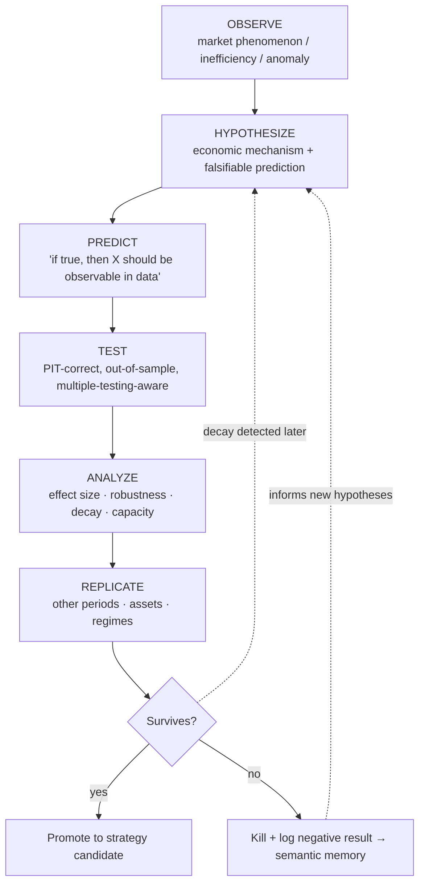

**Non-negotiables of the method:**
- **Falsifiability:** a hypothesis must specify what evidence would *kill* it. "Momentum works" is not testable; "12-1 month momentum produces positive risk-adjusted returns in liquid equities, weakening in high-vol regimes" is.
- **The null is no-edge:** the burden of proof is on the signal to reject "there is nothing here," not on the skeptic.
- **Negative results are recorded** (per `claude_ROI.md` §20 and the brain's semantic memory) — a killed hypothesis is institutional knowledge that prevents re-testing dead ends and informs new priors.
- **Replication across independent axes** — a signal that survives only in one country, one decade, or one sector is fragile; real edges tend to generalize (with regime-dependent strength).

### 1.4 Prediction vs. decision-making

This distinction is where most quant ML goes wrong: **a prediction is not a decision.** A model that predicts return with high accuracy can still lose money, and a model with mediocre accuracy can print — because the mapping from *forecast* to *action* involves costs, uncertainty, sizing, and risk that the forecast alone ignores.

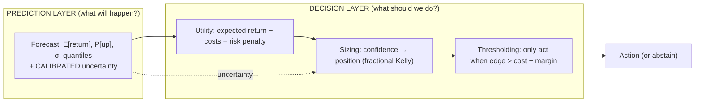

- **The prediction answers "what?"; the decision answers "what should we do, given costs, risk, and how sure we are?"** These are *separate models/layers*, deliberately. (This maps directly onto the brain's separation: analysts predict, the PM + sizing agent decide.)
- **Calibration > accuracy for decisions.** A model that says "60% up" and is right 60% of the time is *decision-useful* even at 60% accuracy, because you can size correctly. A model that's 70% accurate but *miscalibrated* (says 90% when it's 70%) will bankrupt you through oversizing. We optimize predictions for **calibration**, then let the decision layer exploit them.
- **Costs are first-class in the decision, not the prediction.** Predicting a +3bp move is useless if the round-trip cost is 5bp. The decision layer only acts when `predicted edge > expected cost + uncertainty margin`. Many "failed models" are fine predictors killed by a naive decision layer that ignored costs.
- **Abstention is a valid decision.** The right action is frequently *do nothing* — and that must be modeled explicitly, not as a degenerate "predict zero."

### 1.5 Multi-horizon prediction

Markets have structure at every timescale, and the *same instrument* is predictable by different mechanisms at different horizons. A single-horizon model is blind to this.

| Horizon | Dominant mechanism | Signal type | Decays into |
|---|---|---|---|
| **Microseconds–seconds** | Order-book dynamics, microstructure | Queue position, imbalance, latency | Execution alpha |
| **Minutes–hours** | Intraday flow, momentum/reversal, news diffusion | Short-term technical, event drift | Intraday strategies |
| **Days–weeks** | Post-event drift, short-term reversal, liquidity | Technical + event + flow | Swing strategies |
| **Weeks–months** | Momentum, earnings drift, analyst revisions | Cross-sectional factors | Medium-term factor |
| **Months–years** | Value, quality, macro cycle | Fundamental + macro | Long-horizon factor |

**Design principles for multi-horizon:**
- **Predict a *term structure* of forecasts, not a point.** For a given name, produce `{E[r_1min], E[r_1h], E[r_1d], E[r_5d], E[r_20d]}` with per-horizon confidence. This is richer, enables horizon-diversification, and reveals when short- and long-horizon signals *conflict* (itself information — a short-term reversal against a long-term trend).
- **Horizons demand different models & features** (microstructure models for seconds; factor models for months) — but they can share representation via multi-task learning (§1.7).
- **Horizon must match holding period and capacity.** A 1-minute edge on a large book is un-harvestable (impact swamps it); a 6-month edge is capacious but slow. Horizon selection is a *business* decision (capacity, turnover, cost) as much as a statistical one.
- **Confidence is horizon-dependent** and propagates to sizing — near-term forecasts are often more certain but smaller; long-term larger but noisier.

### 1.6 Regression vs. Classification vs. Ranking

The choice of *problem formulation* is more consequential than the choice of model. The same underlying question ("will this go up?") formulated three ways yields three different research programs.

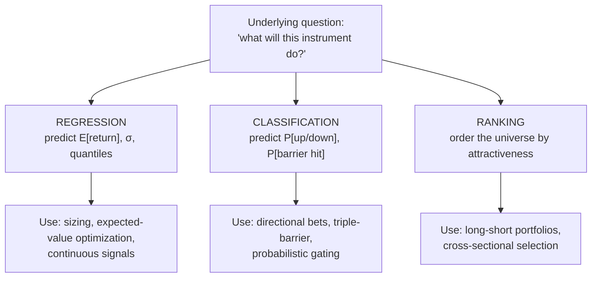

| Formulation | Predicts | Strengths | Weaknesses | Best for |
|---|---|---|---|---|
| **Regression** | Continuous magnitude (return, vol, cost) | Rich signal; directly feeds EV & sizing; preserves magnitude | Hypersensitive to fat-tailed targets & outliers; hard to fit noisy returns; MSE rewards fitting noise | Sizing, volatility, cost/slippage, quantile forecasts |
| **Classification** | Probability of a discrete outcome | Robust to return-magnitude noise; naturally calibrated probabilities; triple-barrier realism | Discards magnitude (a 10% and 0.1% up are both "up"); threshold choice matters | Direction, barrier-hit, crash probability, meta-labeling |
| **Ranking (learning-to-rank)** | *Relative* order within the cross-section | **Regime-robust** (cares about relative, not absolute, level — cancels market beta); matches long-short construction; ignores un-forecastable market direction | No absolute magnitude/EV; needs a cross-section; harder to size standalone | Cross-sectional equity long-short, factor portfolios, security selection |

> **The institutional insight:** for cross-sectional equity strategies, **ranking is usually superior to regression** — because predicting *which stocks beat which* is far more tractable and regime-robust than predicting *absolute returns* (which are dominated by un-forecastable market moves). Renaissance-style stat-arb is fundamentally a ranking problem. Regression's magnitude matters most for *sizing* and for intrinsically-continuous targets (vol, cost). A mature framework uses **all three**, matched to the strategy.

### 1.7 Multi-task learning

Financial prediction tasks share deep structure — the same market state drives return, volatility, liquidity, and regime simultaneously. **Multi-task learning (MTL)** exploits this by learning a shared representation across related tasks, which is especially powerful in finance where labels are scarce and noisy (a single well-predicted task rarely has enough signal, but many tasks *together* regularize each other).

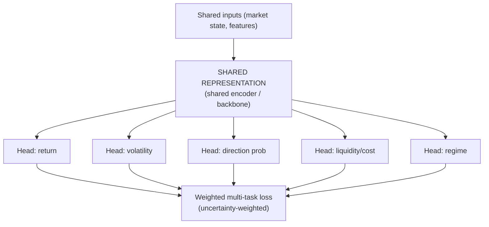

**Why MTL fits finance:**
- **Regularization through relatedness:** forcing one representation to serve return *and* volatility *and* regime prediction resists overfitting to any single noisy target — the auxiliary tasks act as a prior, curbing spurious fits.
- **Label efficiency:** return labels are extraordinarily noisy; auxiliary tasks with cleaner labels (realized volatility, which is far more predictable than return) inject learnable structure that improves the noisy task.
- **Coherent multi-output for the decision layer:** the decision/sizing layer *needs* return, vol, and confidence jointly — MTL produces them consistently from one model rather than three uncoordinated ones.
- **Natural fit for the multi-horizon term structure** (§1.5): each horizon is a task, sharing a backbone.

**MTL cautions:** tasks can *conflict* (negative transfer) — a task that hurts the primary objective must be down-weighted or dropped. Loss weighting matters (we prefer **uncertainty-based weighting** so the model learns which tasks to trust). And shared representations can propagate a bug across all heads — MTL raises both the ceiling and the blast radius.

---

## 2. The Complete Quant Research Pipeline

Every strategy travels the same disciplined path from idea to live capital to retirement. Each stage is a **gate** — a candidate that fails any gate is killed or sent back, and the capital/autonomy it's trusted with only grows as it clears later gates (mirroring the platform's promotion gauntlet and the brain's autonomy ladder).

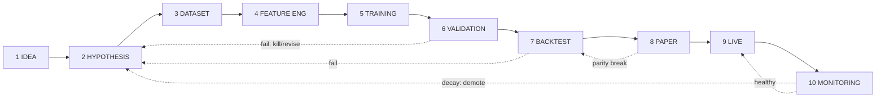

### Stage 1 — Idea
- **What:** the origin of a candidate edge — from economic reasoning, market observation, academic literature, a prior signal's residual, the brain's research agent, or a discovered anomaly.
- **Discipline:** every idea starts with a **mechanism hypothesis in one sentence** ("who loses and why"). Ideas without a mechanism are logged but deprioritized. Ideas are cheap; the funnel is wide here and narrows hard.
- **Output:** a one-paragraph idea with a proposed economic rationale and expected horizon/asset class.

### Stage 2 — Hypothesis
- **What:** sharpen the idea into a **falsifiable, testable** statement: the predicted effect, its direction, its expected regime-dependence, and — critically — **what would disprove it.**
- **Discipline:** pre-register the hypothesis and the *number of variants* you intend to test (multiple-testing budget, §1.2). Define success metrics *before* looking at results.
- **Output:** a hypothesis spec: prediction target, universe, horizon, expected effect size, success/kill criteria, statistical budget.

### Stage 3 — Dataset
- **What:** assemble the **point-in-time-correct** training/research dataset (per `claude_ROI.md` §17–19) — PIT universe (no survivorship), as-of feature joins, PIT labels, purge/embargo.
- **Discipline:** define the PIT universe first; freeze the dataset to an immutable, versioned manifest so the experiment is reproducible. Run the automated **leakage audit** before anything else.
- **Output:** a registered, immutable dataset artifact + a leakage-clearance certificate.

### Stage 4 — Feature Engineering
- **What:** construct predictive features from the data/graph/embeddings via the single-definition feature pipeline (`claude_ROI.md` §11–12), so training features exactly match future serving features.
- **Discipline:** features must be PIT-correct (compile-time enforced), economically motivated (not brute-forced), and cross-sectionally normalized within the PIT universe. Feature *selection* consumes multiple-testing budget too.
- **Output:** a registered feature set (versioned), with parity guaranteed to the online store.

### Stage 5 — Training
- **What:** fit the model(s) from the zoo (§4) to the labeled dataset, with regularization appropriate to low signal-to-noise.
- **Discipline:** **temporal splits only** (never random shuffle); heavy regularization (markets punish complexity); hyperparameter search is itself part of the multiple-testing budget (nested CV so tuning doesn't leak into evaluation). Log the exact code SHA + data manifest + hyperparameters to the model registry.
- **Output:** a trained, registered, lineage-linked model version with its training metrics.

### Stage 6 — Validation
- **What:** rigorous out-of-sample assessment: walk-forward, combinatorial purged cross-validation, deflated Sharpe ratio, probability of backtest overfitting (PBO), stability across sub-periods/regimes.
- **Discipline:** this is the **primary overfitting gate.** Evaluate *calibration* (not just accuracy), decay, and robustness. Apply multiple-testing corrections against the pre-registered trial count. Most candidates die here — by design.
- **Output:** a validation dossier (signed); pass → backtest, fail → kill (log the negative result) or revise hypothesis.

### Stage 7 — Backtesting
- **What:** simulate the *full strategy* (signal → risk → sizing → execution) through history using the platform's shared backtest engine and realistic fill/impact model — the same code that will run live.
- **Discipline:** model costs, slippage, market impact, and capacity honestly (optimism here is self-deception). Stress across regimes and tail scenarios. Check that the strategy survives *net of costs at realistic size*, not gross at zero cost.
- **Output:** a signed backtest report (Sharpe, drawdown, capacity curve, cost sensitivity, regime breakdown) → registry.

### Stage 8 — Paper Trading
- **What:** deploy on **live data with simulated fills** (zero capital) — the platform's paper simulator. Catches what backtests can't: real-time data quirks, latency, operational bugs, live-vs-historical microstructure differences.
- **Discipline:** require a minimum soak period and a **live-vs-backtest parity check** — paper behavior must track backtest expectations. Divergence = a bug or a fragile signal.
- **Output:** paper-trading track record; parity certification.

### Stage 9 — Live
- **What:** graduated deployment of real capital — **constrained-live** (tiny, kernel-capped budget, human-supervised) escalating to bounded autonomy only as live-vs-paper parity and calibration hold (the brain's autonomy ladder §26).
- **Discipline:** canary by *capital budget*, not just traffic; budget auto-scales only while parity + Sharpe + calibration gates hold; automatic demotion on breach. Everything four-eyes-gated and audited.
- **Output:** a live strategy with a real, attributable P&L track record.

### Stage 10 — Monitoring
- **What:** continuous surveillance of the live strategy — realized vs. expected performance, signal decay, drift (feature & concept), calibration health, regime-conditioned behavior, and capacity utilization.
- **Discipline:** **alpha decays** (§1.1) — monitoring detects it and triggers demotion/retirement via the brain's Meta-Learner. Data-quality scores (`claude_ROI.md` §14) flow into confidence. A strategy that decays is demoted to shadow, its lessons written to memory, and the cycle feeds back to Stage 1–2.
- **Output:** live health telemetry; demote/retire/retrain decisions; lessons → semantic & mistake memory.

> **The pipeline is a ratchet, not a conveyor.** Trust (and capital) only increases as a candidate clears later gates, and it can be revoked instantly at any stage. The vast majority of ideas die before Stage 6 — and *that is the pipeline working correctly.* A pipeline that promotes most of its candidates is not rigorous; it is a capital-destruction machine.

---

## 3. Prediction Problems

A mature quant platform does not solve *one* prediction problem — it maintains a **portfolio of prediction problems**, each capturing a different facet of market behavior, each feeding the decision layer and the brain's agents. Below, every problem is defined with its **formulation, target, inputs, why it exists, and consumer**, then **ranked** by leverage.

### 3.1 The catalogue

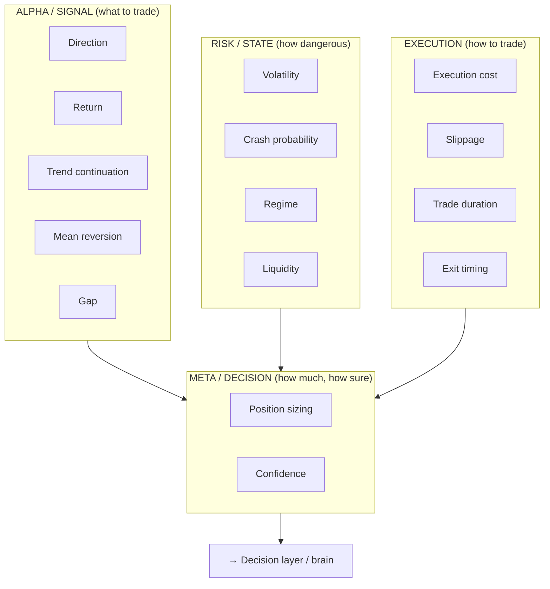

| # | Problem | Formulation | Target | Key inputs | Why it exists / who consumes |
|---|---|---|---|---|---|
| 1 | **Direction** | Classification | P[up/down/flat] over horizon h | Technical, flow, factor, event features | The atomic signal; feeds directional bets & meta-labeling. Robust because it discards noisy magnitude |
| 2 | **Return** | Regression / quantile | E[return], full return distribution | Same + fundamentals | Magnitude for EV optimization & sizing; quantiles for risk. The richest but noisiest signal |
| 3 | **Volatility** | Regression | Realized σ over horizon | Returns, implied vol, regime, volume | *Far more predictable than return* (volatility clusters); drives sizing, risk, options, regime. A foundational, high-value target |
| 4 | **Liquidity** | Regression | Executable size, depth, resilience | Order-book, volume, spread | Determines *capacity* and whether an edge is harvestable; feeds sizing & execution. Turns paper alpha into real alpha |
| 5 | **Gap** | Classification / regression | P[overnight gap], gap magnitude | Overnight news, prior close, events, global markets | Overnight risk is un-hedgeable intraday; critical for holding-period & stop design |
| 6 | **Crash probability** | Classification (rare-event) | P[large adverse move / tail] | Vol term structure, credit, correlation, flow, macro | Tail protection & de-risking trigger; feeds the brain's emergency behavior. Asymmetric value — being right once pays for many false alarms |
| 7 | **Regime** | Classification / state model | P[regime ∈ {bull,bear,side,highvol,crisis}] | Vol, breadth, spreads, macro, correlation | The master context switch (`claude_aiBrain.md` §7); re-conditions *every* other model and the whole firm's behavior |
| 8 | **Trend continuation** | Classification | P[trend persists vs. reverses] | Momentum, strength, volume confirmation, regime | Distinguishes "ride it" from "fade it"; core to momentum strategies & stop placement |
| 9 | **Mean reversion** | Classification / regression | P[revert], reversion magnitude & speed | Deviation from fair value, overextension, microstructure | The counterpart to trend; core to stat-arb & range strategies. Trend vs. MR is regime-dependent — both needed |
| 10 | **Execution cost** | Regression | Expected implementation shortfall (bps) | Size, liquidity, urgency, spread, volatility | The decision layer's veto input — *predicted edge must exceed predicted cost*. Kills naive signals honestly |
| 11 | **Slippage** | Regression | Expected fill vs. decision price | Order size vs. depth, volatility, participation rate | Realized-cost component; feeds execution strategy & backtest realism. The gap between backtest fantasy and live reality |
| 12 | **Trade duration** | Regression / survival | Expected holding time to target/stop | Setup type, vol, horizon, barriers | Capital-turnover & capacity planning; feeds sizing (Kelly needs frequency) and opportunity-cost reasoning |
| 13 | **Exit timing** | Classification / RL | When to close (hold/exit signal) | Position state, P&L path, decay of thesis, regime | Exits determine realized P&L as much as entries; a well-timed exit is pure alpha. Often under-modeled |
| 14 | **Position sizing** | Regression / RL / optimization | Optimal fraction of capital | Confidence, vol, edge, correlation, portfolio state | Converts signal → action (`claude_aiBrain.md` §sizing); fractional-Kelly under uncertainty. **Sizing errors dominate signal errors in practice** |
| 15 | **Confidence** | Meta / calibration | Calibrated P[this prediction is correct] | The prediction + its features + model-agreement + historical calibration | The meta-signal that governs sizing & abstention; propagates through the brain (§confidence propagation). *Knowing when you don't know* |

### 3.2 Ranking the prediction tasks by leverage

Ranked by **marginal contribution to risk-adjusted, net-of-cost, capacity-aware P&L** — not by how interesting they are to model. This ranking is deliberately *un-intuitive to newcomers*, who over-index on return prediction.

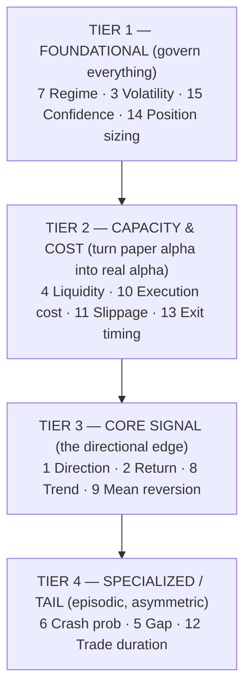

| Rank | Task(s) | Why this rank |
|---|---|---|
| **1 (highest)** | **Regime, Volatility, Confidence, Position sizing** | These *govern* every other prediction. Correct regime + calibrated confidence + right size makes a mediocre signal profitable; wrong sizing makes a great signal a blowup. **Sizing and calibration errors are the dominant P&L drivers** — getting these right is worth more than any single alpha signal. Volatility is uniquely predictable and feeds all of them |
| **2** | **Liquidity, Execution cost, Slippage, Exit timing** | The difference between backtest and reality. A signal you can't execute cheaply at size is worthless; exits determine realized P&L. These convert theoretical edge into banked edge — where most funds silently lose their alpha |
| **3** | **Direction, Return, Trend, Mean reversion** | The "alpha" everyone obsesses over — genuinely necessary, but *lower leverage than Tiers 1–2* because a good signal poorly sized/executed loses money, while a modest signal well-managed makes it. Direction (robust) generally > Return (noisy) for most uses |
| **4** | **Crash probability, Gap, Trade duration** | Specialized and episodic, but *asymmetrically valuable* — crash prediction is rarely "right" yet one correct crisis call justifies its existence (feeds the brain's survival-first emergency behavior). Lower average leverage, critical tail leverage |

> **The counterintuitive institutional truth:** newcomers rank Return prediction #1 and Sizing/Execution last. **Professionals invert this.** The edge in *return prediction* is small and crowded; the edge in *disciplined sizing, regime-awareness, and cheap execution* is large and durable. Renaissance's moat is as much in Tiers 1–2 as in Tier 3. Design research effort accordingly.

---

## 4. The Model Zoo

No single model class wins in finance — each has a regime where it dominates and a regime where it's dangerous. A mature framework maintains a **zoo** and matches model to problem, then ensembles across them (ensembling detail is Part II). For each: **when to use, advantages, weaknesses, computational cost, financial use cases.**

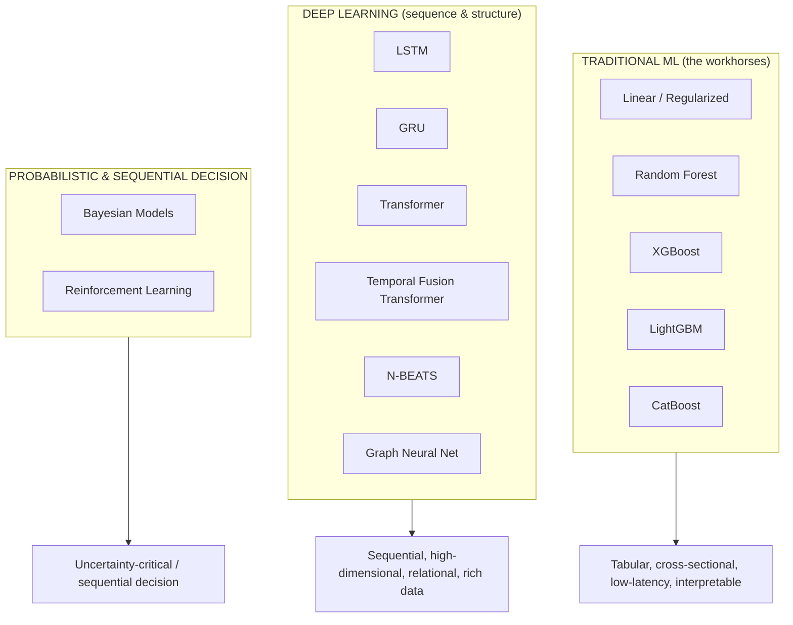

### 4.1 Traditional ML

#### Linear & Regularized Models (OLS, Ridge, Lasso, Elastic-Net, logistic)
- **When to use:** the **default first model, always.** Baseline before anything complex; when interpretability and stability matter; low signal-to-noise cross-sectional factor models; production signals needing auditability.
- **Advantages:** interpretable (coefficients = factor exposures); extremely robust to overfitting (especially with L1/L2); fast to train and serve; stable across regimes; naturally regularizable; the coefficients *mean* something economically.
- **Weaknesses:** captures only linear relationships (misses interactions/nonlinearity); can underfit genuinely complex structure; sensitive to multicollinearity without regularization.
- **Computational cost:** **Minimal** — trains in milliseconds–seconds, serves in microseconds. Negligible.
- **Financial use cases:** factor models (Fama-French style), cross-sectional return ranking, risk models, linear signal combination, meta-labeling logistic layer, any signal where "why" must be explainable to a risk committee. **Never skip the linear baseline — if a deep model can't beat regularized linear out-of-sample, the deep model is overfitting.**

#### Random Forest
- **When to use:** nonlinear tabular problems where robustness > peak accuracy; feature-importance exploration; when you want low-variance predictions without careful tuning.
- **Advantages:** captures nonlinearity & interactions automatically; very robust to overfitting (bagging averages out variance); minimal tuning; handles mixed feature types; gives feature importance; parallelizable.
- **Weaknesses:** less accurate than boosting on most structured tasks; large memory footprint; weaker at extrapolation; can be dominated by gradient boosting in practice.
- **Computational cost:** **Low–moderate** — embarrassingly parallel training; moderate memory; fast inference.
- **Financial use cases:** nonlinear signal combination, feature screening, regime classification, a robust ensemble member, quick nonlinear baseline above linear.

#### XGBoost
- **When to use:** the **workhorse for structured/tabular financial prediction** — cross-sectional return/direction problems with engineered features. Often the single best model class for tabular alpha.
- **Advantages:** state-of-the-art accuracy on tabular data; handles nonlinearity, interactions, missing values; strong regularization controls; feature importance; battle-tested; handles the low signal-to-noise regime well with proper regularization.
- **Weaknesses:** **overfits easily if untuned** (dangerous in low-SNR markets — needs strong regularization + early stopping); many hyperparameters; not for raw sequential/unstructured data; less interpretable than linear.
- **Computational cost:** **Moderate** — slower to train than LightGBM; GPU-accelerable; fast inference. Hyperparameter search is the real cost.
- **Financial use cases:** cross-sectional stock ranking (learning-to-rank objective), direction classification, volatility/cost regression, signal ensembling, the backbone of many production tabular strategies.

#### LightGBM
- **When to use:** when you have **large datasets and need speed** — the practical default for big tabular quant problems; high-cardinality features; rapid research iteration.
- **Advantages:** *much faster* than XGBoost (leaf-wise growth, histogram binning) with comparable accuracy; low memory; native categorical handling; scales to huge datasets; fast iteration accelerates research throughput.
- **Weaknesses:** leaf-wise growth can overfit on small datasets (needs `num_leaves`/depth control); slightly less robust default behavior than XGBoost; same low-SNR overfitting caution.
- **Computational cost:** **Low–moderate** — fastest of the boosters to train; excellent memory efficiency; fast inference. Best speed/accuracy trade-off for research velocity.
- **Financial use cases:** large-universe cross-sectional models, high-frequency feature sets, rapid signal prototyping, production tabular alpha where retraining cadence matters, most places XGBoost is used but at greater scale.

#### CatBoost
- **When to use:** datasets with **many categorical features** (sector, venue, event-type, country); when you want strong out-of-the-box performance with minimal tuning and less overfitting.
- **Advantages:** best-in-class native categorical handling (ordered target encoding avoids leakage); strong defaults (less tuning); **ordered boosting reduces overfitting/prediction-shift** — valuable in low-SNR finance; robust.
- **Weaknesses:** slower training than LightGBM; smaller ecosystem; can be overkill when features are purely numeric.
- **Computational cost:** **Moderate** — slower to train than LightGBM, GPU-accelerable; fast inference.
- **Financial use cases:** models heavy on categorical context (event-driven with event types, cross-venue microstructure, sector/country-tagged cross-sectional models), robust ensemble member, situations where reducing overfitting is paramount.

> **Traditional-ML verdict:** for **tabular, cross-sectional** financial prediction — which is *most* of institutional quant alpha — **gradient-boosted trees (LightGBM/XGBoost/CatBoost) are usually the best models**, above a mandatory regularized-linear baseline. Deep learning earns its place on *sequential, high-dimensional, relational, or unstructured* data, not on engineered tabular features, where it typically overfits and underperforms boosting.

### 4.2 Deep Learning

#### LSTM (Long Short-Term Memory)
- **When to use:** sequential prediction where **temporal order and memory matter** — raw time-series, path-dependent patterns, when you have enough data to justify it.
- **Advantages:** captures long-range temporal dependencies & nonlinear sequential dynamics; handles variable-length sequences; learns features from raw series (less manual engineering).
- **Weaknesses:** **data-hungry & overfit-prone** (dangerous in low-SNR finance); slow sequential training (no parallelism across time); can be beaten by simpler models on noisy financial series; harder to interpret; vanishing-gradient on very long sequences.
- **Computational cost:** **Moderate–high** — GPU-recommended; sequential nature limits parallelism; slower than trees.
- **Financial use cases:** intraday/HF sequential patterns, volatility forecasting from return paths, order-flow sequence modeling, multi-horizon return sequences — *where sequential structure genuinely dominates and data is abundant.*

#### GRU (Gated Recurrent Unit)
- **When to use:** same problems as LSTM but with **less data or a need for faster training** — often the better *practical* choice on financial series.
- **Advantages:** simpler than LSTM (fewer gates/params) → faster training, less overfitting, comparable performance on many tasks; better fit for the smaller effective sample sizes common in finance.
- **Weaknesses:** slightly less expressive than LSTM on the most complex long-memory tasks; shares RNNs' sequential-training and overfitting cautions.
- **Computational cost:** **Moderate** — cheaper than LSTM (fewer parameters); still sequential.
- **Financial use cases:** the same as LSTM, and frequently *preferred* in practice because finance's limited, noisy data rewards the simpler, more regularized architecture. Good default RNN for financial sequences.

#### Transformer
- **When to use:** long sequences with **complex, long-range, multi-variate dependencies**; when you have substantial data; cross-asset/cross-time attention; foundation-model approaches to markets.
- **Advantages:** attention captures long-range dependencies without recurrence; **fully parallelizable training** (unlike RNNs); models cross-series interactions; scales with data; attention weights offer some interpretability; state-of-the-art on large sequence problems.
- **Weaknesses:** **very data-hungry** (severe overfitting risk on limited financial data — the central danger); computationally expensive (quadratic attention in sequence length); many design choices; can memorize noise spectacularly.
- **Computational cost:** **High** — GPU/multi-GPU; quadratic memory in sequence length; expensive to train and tune. The most expensive workhorse here.
- **Financial use cases:** cross-sectional + temporal joint modeling, multi-asset attention, news/text + market fusion (leveraging the embedding stack), long-horizon multivariate forecasting, market-state encoders feeding the brain's vector memory. Use with heavy regularization and skepticism.

#### Temporal Fusion Transformer (TFT)
- **When to use:** **multi-horizon forecasting with heterogeneous inputs** (static covariates + known-future inputs like calendars + observed time-varying inputs) *and* a need for interpretability. Arguably the best-designed DL architecture *for finance specifically*.
- **Advantages:** purpose-built for multi-horizon (§1.5); **interpretable** (variable-selection networks + attention show which inputs matter when); handles static + known-future + observed inputs natively; produces **quantile forecasts** (uncertainty, not just point) — ideal for the decision layer; respects the structure of financial forecasting problems.
- **Weaknesses:** complex to implement/tune; data-hungry; heavier than boosting; needs careful input categorization.
- **Computational cost:** **High** — more than a plain Transformer for equivalent sequence; GPU-required; substantial tuning.
- **Financial use cases:** multi-horizon return/volatility term-structure prediction, incorporating known-future events (earnings dates, econ calendar) as inputs, quantile risk forecasting, any forecast where *interpretability + uncertainty + multi-horizon* are all required — a strong fit for institutional needs.

#### N-BEATS
- **When to use:** **pure univariate time-series forecasting** where you want a strong, interpretable deep model without recurrence or heavy feature engineering.
- **Advantages:** strong accuracy on time-series benchmarks; **interpretable variant** decomposes into trend + seasonality basis; no recurrence (fast, parallel); pure deep-learning (no manual features); good for ensembles of forecasters.
- **Weaknesses:** primarily univariate (weaker at leveraging rich cross-sectional/exogenous features that drive most equity alpha); can overfit noisy financial series; less flexible than TFT for heterogeneous inputs.
- **Computational cost:** **Moderate** — lighter than Transformers; GPU-helpful; efficient inference.
- **Financial use cases:** volatility forecasting, macro/economic series forecasting, index-level and univariate series, decomposition of a series into trend/cycle components, a diversifying member in a forecast ensemble. Less central where cross-sectional features dominate.

#### Graph Neural Networks (GNN)
- **When to use:** when **relationships between instruments carry signal** — leveraging the Knowledge Graph (`claude_ROI.md` §7, §23): supply chains, common ownership, correlation clusters, sector linkages, contagion.
- **Advantages:** explicitly models inter-entity relationships that tabular/sequential models miss; captures *second-order* effects (a supplier's shock → the customer); naturally fuses the graph substrate into prediction; can uncover latent relational structure; propagates information along economically-meaningful edges.
- **Weaknesses:** requires a high-quality, PIT-correct graph (garbage graph → garbage predictions); complex to train; **temporal graphs are hard** (relationships change — must avoid graph lookahead); data-hungry; over-smoothing on deep graphs; still-maturing tooling.
- **Computational cost:** **High** — graph construction + specialized training; scales with graph size/density; GPU-required for large graphs.
- **Financial use cases:** supply-chain contagion signals, common-ownership/crowding risk, relationship-aware return prediction, sector/theme propagation, systemic-risk and correlation-cluster modeling — the model class that turns the platform's knowledge graph into alpha. A genuine differentiator where the graph is proprietary and good.

### 4.3 Probabilistic & Sequential-Decision Models

#### Bayesian Models (Bayesian regression, Gaussian Processes, Bayesian NNs, hierarchical models)
- **When to use:** when **uncertainty quantification is first-class** (which, per §1.4 and the brain's confidence discipline, is *always* for the decision layer); small-data regimes; when you want to encode priors (economic beliefs) explicitly; regime/hierarchical structure.
- **Advantages:** **principled, calibrated uncertainty** (posterior distributions, not point estimates) — directly feeds sizing & confidence propagation; naturally regularized via priors (excellent in low-data/low-SNR finance); encodes domain knowledge as priors; hierarchical models share strength across related entities (e.g., stocks within a sector); updates gracefully as data arrives (online learning).
- **Weaknesses:** computationally expensive (MCMC) or approximation-dependent (variational); GPs scale poorly (cubically) with data; requires statistical sophistication; prior choice is subjective and consequential.
- **Computational cost:** **Moderate–very high** — MCMC is expensive; GPs cubic in samples; variational/approximate methods cheaper. Inference cost varies enormously by method.
- **Financial use cases:** **confidence/uncertainty prediction (task #15)**, position sizing under parameter uncertainty (Bayesian Kelly), regime modeling (Bayesian state-space/HMM), small-sample factor estimation, hierarchical cross-sectional models, any decision where *knowing what you don't know* is the point. Philosophically the best-aligned class with the platform's calibration-first ethos.

#### Reinforcement Learning (RL)
- **When to use:** **sequential decision problems** where actions affect future state and reward is delayed/path-dependent — pre-eminently **execution** (order placement) and **dynamic portfolio/exit management**, not raw return prediction.
- **Advantages:** optimizes *sequential decisions* directly for a long-horizon objective (not just next-step prediction); handles action → market-state feedback (impact); learns policies that trade off immediate vs. future reward; ideal where the *decision*, not the *forecast*, is the hard part (execution, sizing, exit timing).
- **Weaknesses:** **notoriously sample-inefficient & unstable**; requires a high-fidelity market simulator (real-market RL is dangerous/expensive); reward design is treacherous (misspecified reward → pathological policy); severe overfitting-to-simulator risk; non-stationarity breaks learned policies; hard to interpret/validate — a serious concern for capital. **The highest-risk, highest-skill model class.**
- **Computational cost:** **Very high** — massive simulation + training compute; extensive tuning; the most expensive class to develop and validate responsibly.
- **Financial use cases:** **optimal execution** (the canonical, best-justified use — slicing/routing to minimize impact, feeding the execution agent), dynamic **exit timing** (task #13), **position sizing** as a sequential policy (task #14), market-making, dynamic hedging. Deploy behind the platform's full validation gauntlet and hard risk-kernel ceilings — RL *proposes* actions, the kernel still *disposes*.

### 4.4 Model selection summary

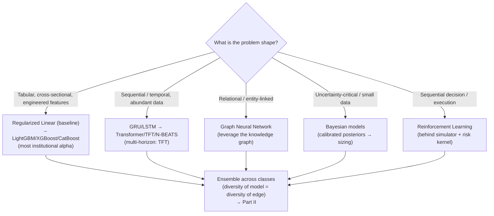

| Model class | Data shape | Interpretability | Overfit risk (finance) | Compute | Primary financial role |
|---|---|---|---|---|---|
| **Linear/Regularized** | Tabular | ★★★★★ | Low | Minimal | Baseline, factor models, explainable signals |
| **Random Forest** | Tabular | ★★★☆ | Low | Low–mod | Robust nonlinear baseline, feature screening |
| **XGBoost** | Tabular | ★★★ | Moderate | Moderate | Cross-sectional alpha workhorse |
| **LightGBM** | Tabular (large) | ★★★ | Moderate | Low–mod | Large-scale tabular alpha, fast iteration |
| **CatBoost** | Tabular (categorical) | ★★★ | Low–mod | Moderate | Categorical-heavy, robust ensembling |
| **LSTM/GRU** | Sequential | ★★ | High | Mod–high | Sequential/HF patterns, vol paths |
| **Transformer** | Sequential (large) | ★★ | Very high | High | Multivariate long-range, text+market fusion |
| **TFT** | Multi-horizon + hetero | ★★★★ | High | High | Multi-horizon + quantile + interpretable forecasting |
| **N-BEATS** | Univariate series | ★★★ | High | Moderate | Univariate/vol/macro forecasting, ensembles |
| **GNN** | Relational/graph | ★★ | High | High | Supply-chain/ownership/contagion alpha |
| **Bayesian** | Any (small-data) | ★★★★ | Low | Mod–very high | Uncertainty, sizing, confidence, hierarchical |
| **RL** | Sequential decision | ★ | Very high | Very high | Execution, exit timing, dynamic sizing |

> **The zoo doctrine:** no model wins alone. Traditional boosting dominates tabular alpha; deep learning earns sequential/relational/unstructured problems; Bayesian methods own uncertainty; RL owns sequential execution decisions. **The edge comes from combining diverse model classes** (whose errors are uncorrelated) — echoing §1.1's "portfolio of weak, diverse signals." A Transformer and a LightGBM disagreeing is *information*; their agreement is *conviction*. Ensembling strategy — how these combine into the single decision the brain acts on — is Part II.

---

## 5. Ensemble Architecture

No single model survives markets' non-stationarity. The edge (per §1.1) is a **portfolio of weak, diverse, low-correlation predictors** combined intelligently — and *how* they combine is itself a research problem as deep as any single model. The ensemble is where a fund's models become a firm's decision.

> **Governing principle:** ensembling reduces variance and hedges model risk *only when constituent errors are uncorrelated*. Ten overfit models that fail together are not an ensemble — they're one fragile model with a false sense of safety. **Diversity of error is the entire point**; we engineer for it explicitly (different model classes §4, different features §6, different horizons §1.5, different regimes).

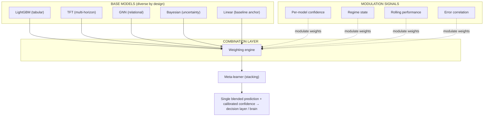

### 5.1 Weighted Ensemble
- **What:** combine base predictions as a weighted average (regression) or weighted probability blend (classification), `ŷ = Σ wᵢ ŷᵢ`.
- **How weights are set:** inverse-variance (weight ∝ 1/error-variance), performance-proportional, or optimization-derived (maximize OOS Sharpe of the blend subject to weight constraints). Weights are **regularized toward equal** — extreme weights are overfitting to noise.
- **Why it exists:** the simplest robust combiner; strong baseline that fancier schemes must beat OOS. Institutionally, a shrinkage-regularized weighted blend is often the production choice precisely because it's hard to overfit.

### 5.2 Voting
- **What:** each model "votes"; combine by **hard voting** (majority of directional calls) or **soft voting** (average predicted probabilities). Soft is generally preferred — it preserves confidence information.
- **Why it exists:** maximally robust for *direction* problems (§3, task #1); a single model's blow-up can't dominate. Maps directly onto the brain's consensus mechanism (`claude_aiBrain.md` §4) — but here at the *model* level, feeding one analyst's view.
- **Caution:** hard voting discards magnitude & confidence; use soft voting unless the downstream consumer only needs a discrete call.

### 5.3 Stacking (Stacked Generalization)
- **What:** a **meta-model** learns the optimal combination — base models' out-of-fold predictions become the meta-model's features. The meta-learner discovers *nonlinear, conditional* combination rules a fixed weighting can't (e.g., "trust the GNN when graph density is high").
- **Critical discipline:** base predictions must be generated **out-of-fold** (via the same purged/embargoed CV as §8) — training the meta-model on in-sample base predictions leaks catastrophically. This is the #1 way stacking is botched.
- **Why it exists:** the most powerful combiner *when done correctly*; can meaningfully beat static weighting. Keep the meta-model **simple** (regularized linear/logistic) — a complex meta-learner on top of complex base models is an overfitting machine.

### 5.4 Meta-Learner
- **What:** the model at the top of the stack (§5.3) — but conceptually broader: the component that *learns how to weight/combine/gate* the base models, potentially conditioning on context (regime, confidence, feature availability). This is the ensemble's brain, and it ties directly to `claude_aiBrain.md`'s Meta-Learner/Attribution agent, which recalibrates model trust over time.
- **Inputs:** base predictions + meta-features (regime, per-model recent performance, model-agreement, uncertainty, data-quality score from `claude_ROI.md` §14).
- **Why it exists:** encodes "which model to trust when" — the single highest-leverage ensembling decision. Kept deliberately parsimonious and heavily regularized.

### 5.5 Dynamic Weighting
- **What:** weights **adapt over time** based on rolling recent performance — models on a hot streak (in current conditions) get upweighted, decaying ones downweighted. Implemented via exponentially-weighted performance, or online-learning schemes (e.g., exponentiated-gradient / "learning from expert advice").
- **Why it exists:** markets are non-stationary; a static blend fitted on 2010–2020 is mis-weighted for 2024. Dynamic weighting tracks *which edges are currently working*.
- **Caution:** the adaptation window is a bias/variance knob — too fast chases noise and whipsaws; too slow lags regime change. The window is itself validated OOS.

### 5.6 Confidence Weighting
- **What:** weight each model by its **own calibrated confidence** on *this specific prediction*, not just its average skill. A model that's usually good but *uncertain right now* gets downweighted for this instance.
- **Why it exists:** per §1.4 and the brain's confidence-propagation (`claude_aiBrain.md` §6), confidence is a first-class signal. Instance-level confidence weighting means the ensemble leans on whichever model is *sure* about *this* case — and the blended confidence propagates to sizing.
- **Requires:** genuinely calibrated per-model uncertainties (§9.6) — Bayesian models (§4.3) shine here; tree/NN confidences must be post-hoc calibrated first.

### 5.7 Market-Regime Weighting
- **What:** weights **conditioned on the detected regime** (`claude_aiBrain.md` §7). Momentum models upweighted in trends, mean-reversion in ranges, defensive/uncertainty models dominant in crisis, and — crucially — **statistical models distrusted in black-swan/OOD regimes**.
- **Why it exists:** the same model has wildly different skill across regimes; regime is the master context switch. This is the ensemble expression of the firm's regime-conditioned behavior — arguably the most important dynamic-weighting axis in finance.
- **Design:** a weight matrix `W[regime × model]` learned per-regime (with enough per-regime samples, or hierarchical shrinkage when crisis data is scarce), blended by the regime *distribution* (not a hard label) so weight shifts smoothly as regime probabilities move.

### 5.8 Model Retirement
- **What:** the disciplined **removal** of a base model that has decayed (persistent OOS underperformance, drift, calibration breakdown, or its edge crowded out per §1.1).
- **Why it exists:** dead models add noise, consume weight budget, and create false diversity. Retirement is to the ensemble what strategy demotion is to the platform. Triggered by the monitoring stage (§2, Stage 10) and the brain's Meta-Learner.
- **Discipline:** retirement is *graduated* (downweight → shadow → retire) and *logged to memory* (why it died → semantic/mistake memory), so the firm learns what kinds of edges decay and doesn't resurrect them naively.

### 5.9 Adaptive Ensemble (the synthesis)
- **What:** the living system combining §5.5–5.8 — a self-adjusting ensemble that continuously re-weights by performance, confidence, and regime; adds candidate models (from the research pipeline §2) and retires dead ones; and recalibrates the meta-learner. It is never "trained once."
- **Why it exists:** it *is* the firm's continuously-learning decision core — the model-layer counterpart to the brain's self-improvement loops (`claude_aiBrain.md` §14).
- **Guardrails:** all adaptation happens **within validated bounds** — weight-change rate limits, minimum diversity constraints, and the mandatory linear-baseline anchor (§4.1) so the ensemble can never drift into pure noise-chasing. Every adaptation is logged and reproducible (`claude_ROI.md` §16).

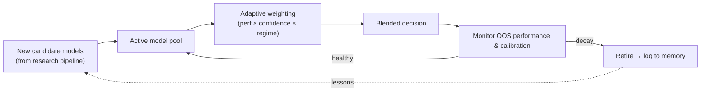

---

## 6. Feature Selection

In markets, **more features usually means worse models** — every added feature is another chance to overfit noise, another multiple-testing charge (§1.2), and another maintenance liability. Feature selection is not optional tidying; it is core alpha-preservation. The goal: the *smallest* set of *robust, economically-motivated, low-redundancy* features that carries the signal.

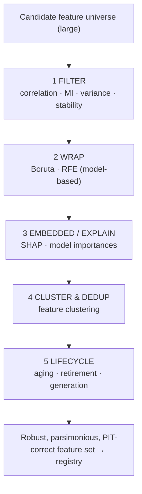

### 6.1 Automatic Feature Selection (the umbrella)
- **What:** a systematic, reproducible pipeline (filter → wrapper → embedded → cluster → lifecycle) replacing ad-hoc human picking. Every selection decision is logged and counts against the multiple-testing budget.
- **Why it exists:** human feature-picking is biased, unrepeatable, and leak-prone; automation makes selection auditable and PIT-honest. But automation *amplifies* multiple-testing risk — so it is coupled tightly to §8's validation and correction machinery.

### 6.2 Boruta
- **What:** an **all-relevant** wrapper method — creates randomized "shadow" copies of each feature and keeps only real features that consistently outperform the best shadow (in a Random Forest importance sense).
- **When to use:** discovering *every* feature with genuine signal (not just a minimal predictive subset); robust nonlinear relevance testing.
- **Strengths / weaknesses:** principled (statistical test against noise), captures nonlinearity; but **compute-heavy** (many RF fits) and finds *all-relevant* rather than *minimal-optimal* (may keep redundant features → pair with clustering §6.6).

### 6.3 Mutual Information
- **What:** a **filter** measuring nonlinear statistical dependence between each feature and the target (unlike correlation, captures nonlinear/non-monotonic relationships).
- **When to use:** fast first-pass screening of a large candidate universe; model-agnostic relevance ranking.
- **Strengths / weaknesses:** cheap, nonlinear, model-free; but **univariate** (blind to interactions and redundancy — two features can each have high MI yet be near-duplicates), and estimation is noisy on small samples. A screen, never the final word.

### 6.4 SHAP (SHapley Additive exPlanations)
- **What:** game-theoretic attribution of each prediction to each feature — a rigorous, consistent **importance and interaction** measure, computed on *out-of-sample* predictions.
- **When to use:** understanding *what a trained model actually uses*, detecting features that matter only via leakage/instability, feeding the brain's explainability (`claude_aiBrain.md` §12), and importance-based selection.
- **Strengths / weaknesses:** theoretically grounded, local + global, reveals interactions and direction of effect; but **computationally expensive** (esp. exact/kernel SHAP; TreeSHAP is fast for trees), and importance ≠ causation. Institutionally prized because it makes models *auditable to a risk committee*.

### 6.5 Recursive Feature Elimination (RFE)
- **What:** a **wrapper** that iteratively fits the model, ranks features, drops the weakest, and repeats — converging to a minimal high-performing subset (cross-validated to choose the count).
- **When to use:** finding a *minimal-optimal* set for a specific model class; when model performance (not just relevance) is the selection criterion.
- **Strengths / weaknesses:** directly optimizes predictive subset for the target model, accounts for multivariate effects; but **expensive** (repeated refits) and model-specific (a set optimal for XGBoost may not transfer). Must run *inside* CV folds to avoid selection leakage.

### 6.6 Feature Clustering
- **What:** group features by similarity (correlation/MI distance, hierarchical clustering) and keep one representative per cluster (or a cluster-aggregate).
- **When to use:** collapsing redundancy — financial features are notoriously collinear (fifty momentum variants). Complements all-relevant methods (§6.2) that ignore redundancy.
- **Why it exists:** redundant features destabilize models (multicollinearity), inflate importance-splitting, and waste degrees of freedom. Clustering yields a *diverse* feature set — the feature-level analog of ensemble diversity (§5). Also underpins honest importance (cluster-level, not split across correlated twins).

### 6.7 Correlation Filtering
- **What:** the simplest redundancy filter — drop features whose pairwise correlation exceeds a threshold, keeping the more predictive/stable of each pair.
- **When to use:** cheap first-pass deduplication before heavier methods.
- **Strengths / weaknesses:** trivial and fast; but only linear pairwise redundancy (misses nonlinear/multivariate redundancy — hence clustering §6.6 and MI §6.3 as complements). Threshold is a hyperparameter to validate.

### 6.8 Interaction Discovery
- **What:** find features predictive only in *combination* (e.g., "high momentum × low liquidity" behaves unlike either alone) — via SHAP interaction values, tree-split co-occurrence, or explicit interaction search.
- **When to use:** when linear/univariate screens miss signal that lives in interactions (common in markets — regime × signal, size × momentum).
- **Strengths / weaknesses:** unlocks nonlinear alpha and informs feature *generation* (§6.11); but the interaction space is combinatorial (huge multiple-testing charge — must be economically motivated and correction-guarded, not brute-forced).

### 6.9 Feature Aging
- **What:** tracking each feature's *predictive power over time* — rolling importance/IC (information coefficient) — to detect **decay** as its underlying inefficiency gets arbitraged (§1.1).
- **Why it exists:** features are not static assets; alpha decays. Aging surfaces *which* features are fading *before* they drag the model, feeding retirement (§6.10). The feature-level twin of strategy decay monitoring (§2, Stage 10).
- **Signals:** declining rolling IC, rising drift (`claude_ROI.md` §14), shrinking SHAP contribution, regime-narrowing relevance.

### 6.10 Feature Retirement
- **What:** disciplined removal of decayed, unstable, redundant, or leak-suspect features — graduated (downweight → shadow → remove) and **logged** (why it died → semantic/mistake memory).
- **Why it exists:** dead features add noise and overfitting surface; retirement keeps the set lean and honest. A feature once retired for leakage/instability becomes an institutional antibody (don't reintroduce naively).
- **Discipline:** retirement changes the feature set → triggers model revalidation (§8); never silently swapped under a live model (versioning, `claude_ROI.md` §16).

### 6.11 Automatic Feature Generation
- **What:** systematic *creation* of new candidate features — transformations (lags, rolling stats, ratios, cross-sectional ranks/z-scores), interactions (§6.8), graph-derived (§4.2 GNN, `claude_ROI.md` §23), and embedding-derived features — proposed, tested, and gated by the same pipeline.
- **Why it exists:** the feature frontier must keep expanding as old features decay; automated generation (guided by the research/brain agents) sustains the alpha pipeline. It is the *offense* to retirement's *defense*.
- **Critical guardrail:** generation *explodes* the multiple-testing problem — thousands of auto-generated features guarantee false discoveries. **Every generated feature must be economically motivated (or from a motivated family), PIT-correct by construction (`claude_ROI.md` §11), and survive §8's correction-aware validation.** Unconstrained feature factories are the fastest known route to a beautiful, worthless backtest.

---

## 7. Hyperparameter Optimization

Hyperparameter search is a double-edged sword in finance: it improves fit, but **every evaluated configuration is another draw from the multiple-testing urn** (§1.2). Search too hard and you overfit the *validation set itself*. The framework's stance: optimize *efficiently and honestly* — few, well-chosen evaluations under nested validation — not exhaustively.

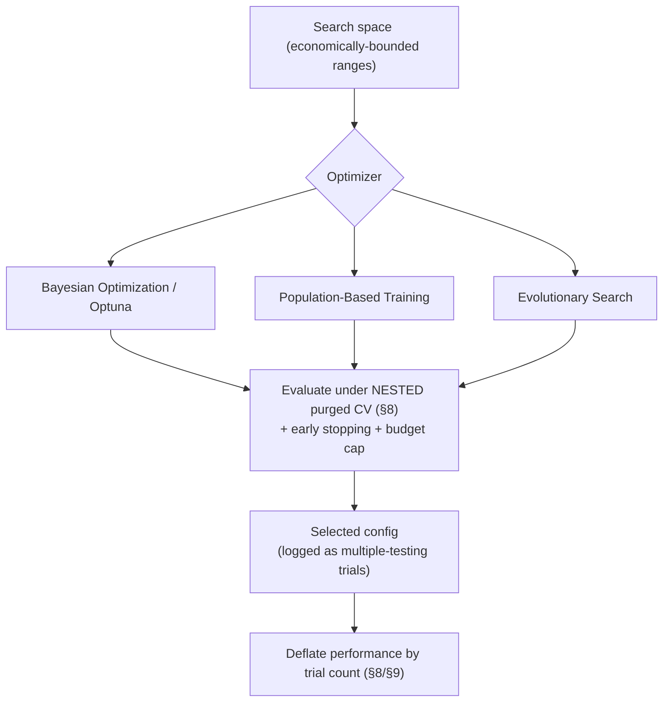

### 7.1 Bayesian Optimization
- **What:** builds a probabilistic surrogate (e.g., Gaussian Process / TPE) of the objective over hyperparameters and picks the next config to maximize *expected improvement* — sample-efficient search that learns from each evaluation.
- **When to use:** the **default** when each evaluation is expensive (typical in finance — a full purged-CV backtest per config) and the space is moderate-dimensional.
- **Strengths / weaknesses:** far fewer evaluations than grid/random (crucial for controlling multiple-testing *and* compute); but sequential (harder to parallelize than random), and surrogate assumptions can mislead on rugged spaces.

### 7.2 Optuna
- **What:** the practical **framework** implementing efficient search (TPE-based Bayesian by default) with define-by-run search spaces, built-in **pruning** (early-stop unpromising trials), and native parallel/distributed execution.
- **When to use:** the workhorse tooling for most HPO here — combines Bayesian efficiency, pruning (§7.7), and parallelism (§7.6) in one.
- **Strengths / weaknesses:** flexible, mature, integrates with the compute cluster and experiment tracking; the caveat is *governance* — its ease makes it tempting to run thousands of trials, which *must* be counted and deflated (§9). Tooling doesn't excuse the statistics.

### 7.3 Population-Based Training (PBT)
- **What:** trains a *population* of models in parallel; periodically the poor performers **copy the weights of and perturb the hyperparameters of** the good ones — jointly optimizing weights *and* hyperparameters, including on **schedules** (hyperparameters that change during training).
- **When to use:** expensive deep models (§4.2) where retraining per config is prohibitive and where *time-varying* hyperparameters (e.g., learning-rate/regularization schedules) matter.
- **Strengths / weaknesses:** discovers schedules static search can't; amortizes cost (no full restart per config); but compute-heavy (whole population) and complex to operate — reserved for high-value deep models.

### 7.4 Evolutionary Search
- **What:** population-based **genetic** optimization — mutate/crossover/select over generations — for large, non-differentiable, discrete, or rugged search spaces (architecture choices, feature-set + hyperparameter joint search).
- **When to use:** high-dimensional or combinatorial spaces where gradients/surrogates struggle (e.g., co-evolving feature subsets *and* model configs).
- **Strengths / weaknesses:** flexible, global, parallelizable, no smoothness assumptions; but **sample-inefficient** (many evaluations → serious multiple-testing and compute cost) — use only when the space genuinely demands it, and guard hard against overfitting the validation set.

### 7.5 Budget-Aware Optimization
- **What:** HPO under an **explicit compute/time/statistical budget** — allocate more evaluations to promising regions and cheaper fidelities to weak ones (multi-fidelity: Successive Halving / Hyperband; train on data-subsets/fewer-epochs first, promote survivors to full fidelity).
- **Why it exists:** research compute is finite and shared with live trading (`AI_QUANT_PLATFORM_BLUEPRINT.md` scaling); and the *statistical* budget (number of trials) is finite too. Budget-awareness maximizes signal found per unit of both. This is how a research team stays productive *and* honest.
- **Discipline:** the budget (trial count) is **pre-registered** and feeds the deflated-Sharpe correction (§9) — you cannot decide "how many trials" after seeing results.

### 7.6 Parallel Optimization
- **What:** distributing trials across the cluster (Optuna distributed, Ray Tune) — evaluating many configs concurrently to compress wall-clock research time.
- **When to use:** always, when the optimizer supports it (random, evolutionary, PBT are naturally parallel; Bayesian needs async/batch variants).
- **Strengths / weaknesses:** dramatic wall-clock speedup → faster research iteration; but parallel Bayesian is less sample-efficient (evaluations can't fully learn from each other), and it runs on the platform's *research* node pool (spot/checkpointed), strictly isolated from live-trading nodes (`AI_QUANT_PLATFORM_BLUEPRINT.md` §8).

### 7.7 Early Stopping
- **What:** terminate a trial (or a training run) once it's clearly unpromising or once validation performance stops improving — pruning (across trials) and per-run early stopping (within a trial).
- **Why it exists:** massive efficiency gain (don't finish training obvious losers) *and* a **regularizer** (stopping at best-validation prevents overfitting the training set).
- **Discipline:** the early-stopping criterion uses a properly-held-out, purged validation slice (§8) — stopping on leaked/in-sample signal reintroduces the very bias we're fighting. Aggressive pruning also slightly biases optimizer selection, accounted for in evaluation.

> **HPO doctrine:** the objective is not "best validation score" — it's "best *deflated, out-of-sample-robust* configuration found within a pre-registered budget." Prefer few, efficient, budget-capped, early-stopped evaluations under **nested** validation, and always **deflate the final result by the trial count**. A model tuned over 10,000 configs and a model tuned over 30 are not comparable at the same Sharpe — the former is far more likely to be noise.

---

## 8. Validation Framework

This is the **beating heart of quant research integrity.** Standard ML validation (random k-fold, IID assumptions) is not merely suboptimal in finance — it is *actively dangerous*, silently leaking the future into the past and producing gorgeous backtests that lose money. Every technique below exists to answer one question honestly: **"would this have worked on data it truly never saw?"**

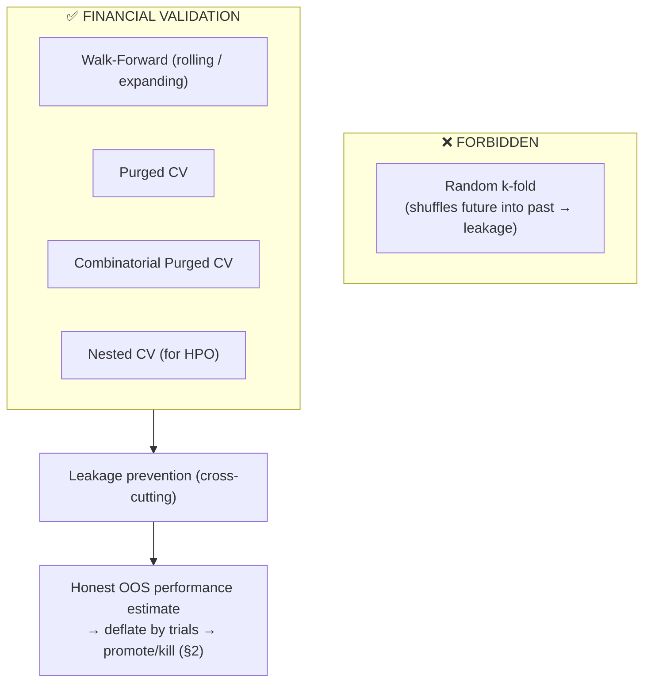

### 8.1 Walk-Forward Validation
- **What:** the foundational financial validation — train on a past window, test on the *immediately following* unseen window, then roll forward, repeating. Time always flows one way; the model is only ever tested on its future.
- **Why it exists:** it *simulates live deployment* — exactly how the model would have been retrained and used through history. The most intuitively honest estimate of real performance.
- **Consumer:** produces the OOS track record that feeds the backtest gate (§2, Stage 7).

### 8.2 Rolling Window
- **What:** a walk-forward variant with a **fixed-size** training window that slides forward (old data drops off as new data enters).
- **When to use:** **non-stationary** markets where distant history is misleading — you want the model trained only on *recent, relevant* regime data.
- **Trade-off:** adapts fast to regime change but uses less data (higher variance, can't learn rare/slow patterns). Window length is a bias/variance hyperparameter — validated, not guessed.

### 8.3 Expanding Window
- **What:** a walk-forward variant where the training window **grows** — always trains on *all* history up to the test point.
- **When to use:** when more data genuinely helps and the relationship is relatively stable, or for slow-moving fundamental signals where long history adds value.
- **Trade-off:** maximal data (lower variance) but slower to adapt and can be anchored by stale regimes. **Rolling vs. expanding is itself an experiment** — often both are run, and the choice reveals how stationary the signal is.

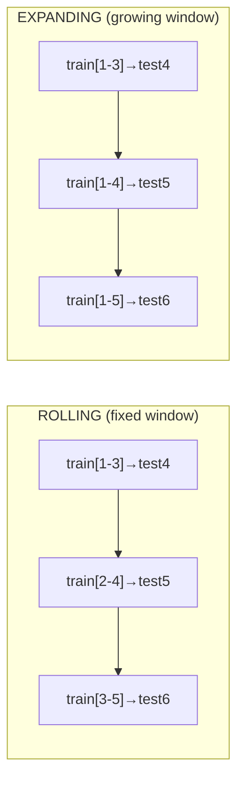

### 8.4 Purged Cross-Validation
- **What:** cross-validation adapted for the reality that **financial labels overlap in time** (a 5-day-forward label at *t* shares information with one at *t+1*). **Purging** removes training samples whose label windows overlap the test set; **embargo** adds a gap after each test set so no leakage bleeds across the boundary (López de Prado).
- **Why it exists:** without purging, overlapping labels leak test information into training even in a "proper" time split — a subtle, near-universal, backtest-inflating bug. This is *the* correction most naive quant ML omits.
- **Consumer:** the correct CV scheme for any model whose labels span time (nearly all of them, §1.6/§18).

### 8.5 Combinatorial Purged Cross-Validation (CPCV)
- **What:** the gold standard. Rather than one train/test path, CPCV forms **many** train/test combinations from purged, embargoed blocks — yielding a *distribution* of OOS performance across *multiple backtest paths*, not a single fragile number.
- **Why it exists:** a single walk-forward path is one sample — you might have gotten lucky/unlucky on that particular history. CPCV's distribution enables the **Probability of Backtest Overfitting (PBO)** and a robust **Deflated Sharpe** — directly measuring *how likely this edge is a fluke*.
- **Cost / payoff:** computationally heavy (many fits), but it is the most rigorous defense against the overfitting that destroys funds. Reserved for candidates that clear cheaper gates — the final, expensive tribunal before capital.

### 8.6 Nested Cross-Validation
- **What:** two loops — an **inner** loop selects hyperparameters/features (§6–7), an **outer** loop evaluates the *entire selection procedure* on data the inner loop never touched.
- **Why it exists:** if you tune hyperparameters on the same data you report performance on, that performance is **optimistically biased** — you've overfit the validation set (§7). Nesting quarantines model *selection* from model *evaluation*, giving an honest estimate of the whole pipeline.
- **Non-negotiable:** any result involving HPO or feature selection (i.e., essentially all of them) *must* be nested, or the reported Sharpe is inflated by the selection process itself. This is where "great in research, dead live" is most often born.

### 8.7 Leakage Prevention (the cross-cutting obsession)
Leakage — any way information unavailable at decision time contaminates training — is the **single deadliest failure mode** in quant ML. It doesn't produce errors; it produces *profits* that evaporate live. The framework defends structurally on every axis:

| Leakage type | How it sneaks in | Structural defense |
|---|---|---|
| **Lookahead** | Using data timestamped after the decision | PIT enforcement by construction (`claude_ROI.md` §17) |
| **Label overlap** | Overlapping forward-label windows | Purging + embargo (§8.4–8.5) |
| **Selection/tuning** | Tuning on the evaluation data | Nested CV (§8.6) |
| **Survivorship** | Universe = today's survivors | PIT universe (`claude_ROI.md` §19) |
| **Restatement/vintage** | Using revised fundamentals/macro | As-first-reported + vintages (`claude_ROI.md` §4, §6) |
| **Feature/target contamination** | Target leaks into a feature | Lineage audit + automated leak scan (§2 Stage 3, `claude_ROI.md` §19) |
| **Train/serve skew** | Features differ live vs. train | Single-definition parity (`claude_ROI.md` §21) |
| **Multiple testing** | Many trials, report the best | Trial-count registration + deflation (§1.2, §9) |

> **Validation doctrine:** the framework assumes **every impressive result is leakage or overfitting until proven otherwise.** Validation's job is not to *confirm* an edge — it is to *destroy* fragile ones as cheaply and early as possible, so only genuinely robust edges survive to touch capital. A research team measured by "backtests promoted" will destroy the fund; a team measured by "fragile ideas correctly killed" will compound it.

---

## 9. Model Evaluation

A model must be judged on **many axes simultaneously** — a great predictor can be a terrible strategy (§1.4), and a single metric always hides a fatal flaw. The framework evaluates across seven metric families, and a candidate must satisfy *all* the relevant ones, not cherry-pick a flattering one.

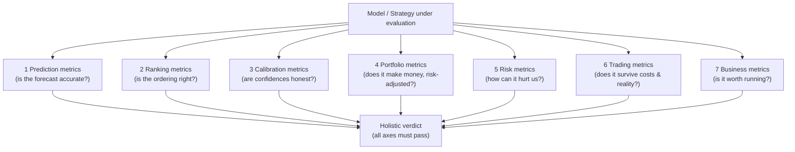

### 9.1 Prediction Metrics — *is the forecast accurate?*
| Metric | Meaning | Note for finance |
|---|---|---|
| **MSE / RMSE** | Mean/root squared error | Penalizes large misses; sensitive to fat-tailed return outliers |
| **MAE** | Mean absolute error | More robust to outliers than RMSE |
| **R² / Out-of-sample R²** | Variance explained | In finance, **OOS R² of a few percent is genuinely good** — return prediction is near-noise; don't expect 0.9 |
| **Accuracy** | % correct (classification) | Misleading under class imbalance; pair with precision/recall |
| **Precision / Recall / F1** | Positive-call correctness / coverage / balance | Crucial for rare events (§3 crash, gap); which matters depends on cost asymmetry |
| **AUC-ROC / AUC-PR** | Ranking quality of a classifier / precision-recall area | AUC-PR preferred for **imbalanced** rare-event tasks (crashes) |
| **Information Coefficient (IC)** | Rank/linear correlation of prediction vs. realized return | **The quant staple** — an IC of 0.03–0.05 sustained is a real edge; measured per-period and averaged (IC mean/IR of IC) |

### 9.2 Ranking Metrics — *is the cross-sectional ordering right?*
For cross-sectional/long-short strategies (§1.6), *relative order* is what matters, not absolute accuracy.
| Metric | Meaning |
|---|---|
| **Rank IC (Spearman)** | Correlation of predicted vs. realized *ranks* — the core cross-sectional skill metric |
| **NDCG** | Normalized Discounted Cumulative Gain — rewards getting the *top* names right (where you actually trade), discounts the middle |
| **Quantile/decile spread** | Return of top-decile minus bottom-decile portfolio — does the ranking *monetize*? Monotonic decile returns = a healthy signal |
| **Top-k precision / hit rate** | Fraction of top-ranked names that outperform — directly relevant to a concentrated long book |

### 9.3 Calibration Metrics — *are the confidences honest?*
Per §1.4 and the brain's confidence discipline, **calibration governs sizing** — miscalibration is more dangerous than inaccuracy.
| Metric | Meaning |
|---|---|
| **Brier score** | Mean squared error of probabilistic predictions — accuracy + calibration combined |
| **Log loss** | Penalizes confident wrong predictions harshly — the sizing-relevant loss |
| **Expected Calibration Error (ECE)** | Average gap between predicted confidence and actual frequency across bins |
| **Reliability diagram** | Plot of predicted vs. observed frequency — the visual calibration check (perfect = diagonal) |
| **Calibration slope/intercept** | Regression of outcomes on predictions — detects systematic over/under-confidence to correct (temperature/isotonic) |

### 9.4 Portfolio Metrics — *does it make money, risk-adjusted?*
| Metric | Meaning | Note |
|---|---|---|
| **Sharpe ratio** | Excess return per unit of total volatility | The headline — but **must be deflated** for trials (§9.8) and reported net of costs |
| **Sortino ratio** | Return per unit of *downside* volatility | Doesn't penalize upside vol; better for asymmetric strategies |
| **Calmar / MAR** | Annualized return ÷ max drawdown | Return per unit of worst-case pain — capital-allocator favorite |
| **Information ratio** | Active return ÷ tracking error vs. benchmark | Skill relative to a benchmark |
| **CAGR** | Compound annual growth rate | Raw growth; meaningless without the risk metrics beside it |
| **Alpha / Beta** | Return unexplained by / exposure to factors (§1.1) | Confirms the edge is *alpha*, not disguised factor beta |

### 9.5 Risk Metrics — *how can it hurt us?*
Survival-first (`claude_aiBrain.md` §emergency): the fund lives or dies here.
| Metric | Meaning |
|---|---|
| **Maximum drawdown** | Largest peak-to-trough loss — the number that gets funds shut down |
| **VaR (Value at Risk)** | Loss threshold at a confidence level (e.g., 99%) over a horizon |
| **CVaR / Expected Shortfall** | *Average* loss beyond VaR — captures **tail severity** VaR ignores; the better tail metric |
| **Volatility / downside deviation** | Dispersion of returns / downside-only dispersion |
| **Tail ratio & skew/kurtosis** | Shape of the return distribution — fat left tails are the killer |
| **Drawdown duration** | *How long* underwater — tests investor/committee patience as much as depth |
| **Factor & concentration exposures** | Hidden bets (sector, factor, single-name) — the risks you didn't know you had |

### 9.6 Trading Metrics — *does it survive costs and reality?*
Where paper alpha meets real alpha (§3 Tier-2).
| Metric | Meaning |
|---|---|
| **Turnover** | How much you trade — drives cost and capacity; high turnover needs a high gross edge to survive |
| **Transaction costs / slippage (realized)** | Actual implementation shortfall vs. decision price — the alpha-killer (§3 tasks 10–11) |
| **Net-vs-gross Sharpe** | Performance *after* costs vs. before — the gap reveals cost fragility; only net matters |
| **Break-even cost** | The cost level at which the edge vanishes — a robustness margin (small margin = fragile) |
| **Win rate / payoff ratio** | Fraction of winners / avg-win÷avg-loss — a low win rate is fine *if* payoff is high (and vice versa) |
| **Capacity** | AUM the strategy absorbs before impact erodes the edge (§1.1) — **alpha × capacity is the real objective** |
| **Fill ratio / market-impact realized** | Did we actually get executed at modeled prices? Backtest honesty check |

### 9.7 Business Metrics — *is it worth running?*
The CRO/CTO lens — a statistically-valid strategy can still be a poor *business* decision.
| Metric | Meaning |
|---|---|
| **Correlation to existing book** | Marginal diversification — a modest strategy *uncorrelated* to the portfolio beats a great one that's redundant (§5 diversity logic at the strategy level) |
| **Marginal contribution to portfolio Sharpe** | Does adding it improve the *whole firm's* risk-adjusted return? The only return metric that ultimately matters |
| **Capacity × edge (\$ P&L potential)** | Absolute dollar opportunity — small-capacity brilliance may not clear operational overhead |
| **Operational cost & complexity** | Data/compute/maintenance burden vs. P&L — does it earn its infrastructure footprint? |
| **Robustness / decay rate** | Expected edge half-life (§6.9) — how much research upkeep it will demand |
| **Regime dependence** | Does it only work in one regime? Concentrated regime-risk is a business risk |
| **Explainability** | Can it justify itself to the risk committee & regulators (`claude_aiBrain.md` §12)? Unexplainable ≠ deployable in autonomy |

### 9.8 The evaluation doctrine — deflate, then decide
No metric is trusted in isolation, and the headline Sharpe is *always* discounted for the search that produced it:
- **Deflated Sharpe Ratio (DSR):** adjusts the observed Sharpe downward for the **number of trials**, sample length, and non-normality — the direct antidote to §1.2's multiple-testing tax. A Sharpe of 2.0 from 1,000 trials may have a DSR below 1.0.
- **Probability of Backtest Overfitting (PBO):** from CPCV (§8.5) — the probability the selected config underperforms the median OOS. High PBO = the "edge" is likely a selection artifact.
- **Holistic gate:** a candidate must clear prediction *and* ranking *and* calibration *and* portfolio *and* risk *and* trading *and* business thresholds — after deflation — to advance (§2). A model that aces prediction but fails calibration, or portfolio-Sharpe but fails capacity/costs, is **killed.** The seven families are a *conjunction*, not a menu.

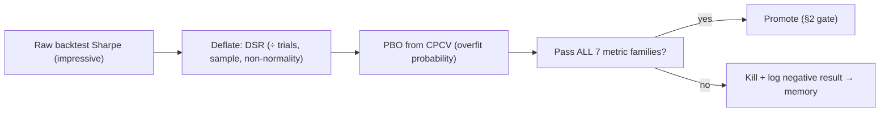

---

## 10. Overfitting Prevention

Overfitting is not one failure mode — it is the *entire adversary* of quant ML (§1.2, §8). Sections 8–9 built the detection machinery; this section catalogs the specific **failure mechanisms** and the structural defense for each. The governing stance: overfitting rarely announces itself as bad results — it disguises itself as *excellent* ones. Every impressive backtest is treated as guilty until proven innocent.

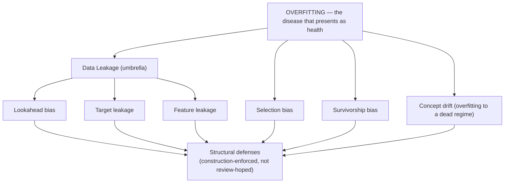

### 10.1 Data Leakage (the umbrella)
- **What:** any pathway by which information *unavailable at decision time* contaminates training. It doesn't produce errors — it produces **profits that evaporate live**. The deadliest, subtlest class.
- **Defense doctrine:** enforced by *construction* across the stack — bitemporal storage (`claude_ROI.md` §17), automated leak scans in dataset generation (`claude_ROI.md` §19), lineage audit (`claude_ROI.md` §15), and the validation gates (§8). A researcher *cannot* accidentally cheat; the infrastructure refuses.

### 10.2 Lookahead Bias
- **What:** using data timestamped *after* the moment a decision would have been made — the archetypal leak (using a day's close to "predict" that day, using revised figures, aligning a feature to the wrong timestamp).
- **Defense:** the **point-in-time / `knowledge_time ≤ as_of`** gate on *every* datum (`claude_ROI.md` §17) — market, fundamental (as-first-reported), macro (vintages), graph edges, embeddings, features, and memory recall. Feature windows are PIT by compile-time enforcement (`claude_ROI.md` §11). Lookahead is structurally impossible, not merely discouraged.

### 10.3 Target Leakage
- **What:** a feature that encodes the label itself — directly (a column derived from the future outcome) or indirectly (a feature computed using information that only exists *because* of the outcome). Produces near-perfect backtests that are pure fantasy.
- **Defense:** automated **target-leakage scan** at dataset generation (correlation-with-target anomalies, importance red-flags), lineage tracing of every feature to its raw sources (`claude_ROI.md` §15), and the label/feature **time asymmetry** discipline (§18: labels may use future *prices*, features may not). A feature with suspiciously high standalone predictive power is *presumed leaky* until its provenance is verified.

### 10.4 Feature Leakage
- **What:** the broader family — a feature that inadvertently carries future or otherwise-unavailable information: improper cross-sectional normalization (using the full-period distribution to z-score a point-in-time value), global scaling fit on all data, imputation using future values, or a feature whose vendor *backfilled* history that never existed live.
- **Defense:** cross-sectional statistics computed **within the PIT universe at each t** (`claude_ROI.md` §11), scalers/imputers fit **only on training-fold data inside CV** (never globally), `knowledge_time` = actual vendor delivery (backfill flagged non-PIT, `claude_ROI.md` §5), and single-definition train/serve parity (`claude_ROI.md` §21) so no leakage enters via a train-only transform.

### 10.5 Selection Bias
- **What:** the multiple-testing tax (§1.2) — test enough signals, features, or configs and some look brilliant by pure chance. Also *reporting* bias (showing the best of many runs) and *dataset* selection (cherry-picking the period/universe where it works).
- **Defense:** **pre-registration** of trial counts, multiple-testing corrections (BH-FDR/Bonferroni), the **Deflated Sharpe Ratio** and **PBO** (§8.5, §9.8), **nested CV** so tuning can't inflate reported performance (§8.6), and replication across independent periods/assets/regimes (§1.3). The rule: *a result's credibility is discounted by the size of the search that found it.*

### 10.6 Concept Drift (overfitting to a dead regime)
- **What:** the relationship the model learned *was* real but has **changed** — the model is now overfit not to noise but to a *bygone regime*. Non-stationarity means every model is decaying from the moment it's trained (§1.1).
- **Defense:** walk-forward/rolling validation that *simulates* re-deployment through changing regimes (§8.1–8.3), regime-conditioned evaluation (§9), continuous **drift detection** (§12), and scheduled/triggered retraining. Concept drift is the bridge between "overfitting prevention" (static) and "drift detection" (dynamic, §12) — the same enemy viewed across time.

### 10.7 Survivorship Bias
- **What:** constructing the universe from instruments that *survived* to today — silently excluding the delisted, bankrupt, and merged, which biases every backtest upward (you only studied the winners).
- **Defense:** the **point-in-time universe** (`claude_ROI.md` §19) — the eligible set is reconstructed *as of each date* (listed, tradable, then-known), with delisted names and their delisting returns retained. Survivorship is excluded at the *universe* level, not patched afterward — and the bitemporal identifier crosswalk (`claude_ROI.md` §2.1) prevents reused-ticker contamination.

> **Overfitting-prevention doctrine:** these seven mechanisms are defended **structurally** — by point-in-time data, automated leak scans, nested validation, deflation, and PIT universes — not by researcher diligence, which always eventually fails. The research team's cultural KPI is *fragile ideas correctly killed*, not backtests promoted (§8 doctrine restated). This is the deepest expression of §1.2's multiple-testing tax and the reason the whole data foundation (`claude_ROI.md`) exists.

---

## 11. Model Registry

The model registry is the **governed gate between research and capital** — the single authoritative record of every model, its lineage, its validation dossier, its deployment stage, and its full audit trail. It is where a validated model becomes a *governed asset* rather than a researcher's artifact. (This is the ML-layer counterpart to the platform's registry service in `AI_QUANT_PLATFORM_BLUEPRINT.md`; here we specify its *research/deployment semantics*.)

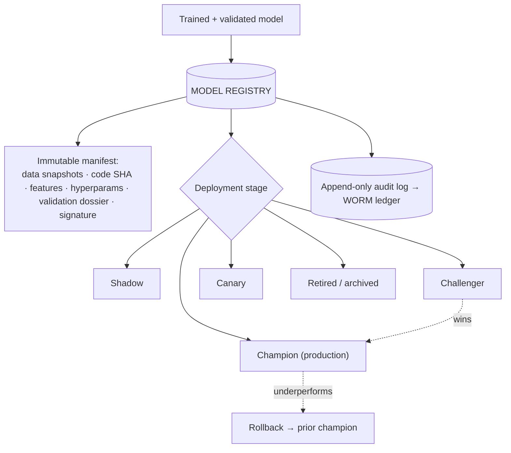

### 11.1 Versioning
- **What:** every model is an **immutable, content-addressed version** pinned to its full manifest (data snapshot IDs, code SHA, feature versions, hyperparameters, training window, validation results) per `claude_ROI.md` §16 — reproducible bit-for-bit years later.
- **Why it exists:** you cannot govern, roll back, or defend to a regulator a model you can't exactly reconstruct. Versioning links each model to the *precise* dataset and code that produced it, closing the lineage chain from vendor byte → feature → model → trade.

### 11.2 Champion / Challenger
- **What:** the **champion** is the live production model; **challengers** are candidate models evaluated *against* it — either offline (on the same OOS data) or online (in shadow/canary) — competing to dethrone it on the seven-family metrics (§9), after deflation.
- **Why it exists:** models should be replaced by *evidence*, not by novelty or a researcher's enthusiasm. Champion/challenger institutionalizes continuous, fair, measured competition — a challenger is promoted only when it beats the champion *out-of-sample and net of costs* by a margin exceeding noise.

### 11.3 Shadow Deployment
- **What:** a model runs on **live data, producing predictions that are logged but not traded** — a real-time paper test at the model level. Its would-be P&L, calibration, and latency are measured against reality with zero capital risk.
- **Why it exists:** catches live-vs-backtest divergence (data quirks, latency, parity breaks) *before* any capital is exposed — the model-level analog of paper trading (§2 Stage 8). Mandatory before a challenger can canary.

### 11.4 Canary Deployment
- **What:** a validated challenger takes a **small slice of real capital** (kernel-capped budget), running alongside the champion; its live performance is compared to both its shadow record (parity) and the champion.
- **Why it exists:** progressive delivery for *capital*, not just code (`AI_QUANT_PLATFORM_BLUEPRINT.md` CI/CD) — the budget auto-scales only while live parity + Sharpe + calibration gates hold, and auto-rolls-back on breach. The controlled bridge from shadow to champion.

### 11.5 Rollback
- **What:** instant reversion to the previous champion (or to a safe baseline) on performance breach, drift alarm, calibration failure, or operational fault — automated *and* human-triggerable.
- **Why it exists:** the money-path is fail-closed (`AI_QUANT_PLATFORM_BLUEPRINT.md` failure doctrine). Because every model is an immutable version (§11.1), rollback is deterministic and near-instant — a git-revert for capital. A deployment without a tested rollback path doesn't ship.

### 11.6 Audit Logs
- **What:** an **append-only, tamper-evident record** of every registry action — registration, stage transition, promotion/demotion, weight change, rollback, and *who/what authorized it* (four-eyes for promotions) — anchored to the platform's WORM ledger.
- **Why it exists:** regulatory necessity and the foundation of trust — every model that ever touched capital, and every decision to trust it, is permanently reconstructable for compliance, post-mortems, and the brain's learning loop. No model reaches production without a complete, signed provenance and approval trail.

---

## 12. Drift Detection

Overfitting prevention (§10) is *static* — validated at build time. **Drift detection is its dynamic twin:** the continuous surveillance that catches the world *changing out from under* a deployed model. Because alpha decays (§1.1) and markets are non-stationary, *every* live model is silently degrading; drift detection makes that degradation *visible and actionable* before it costs money.

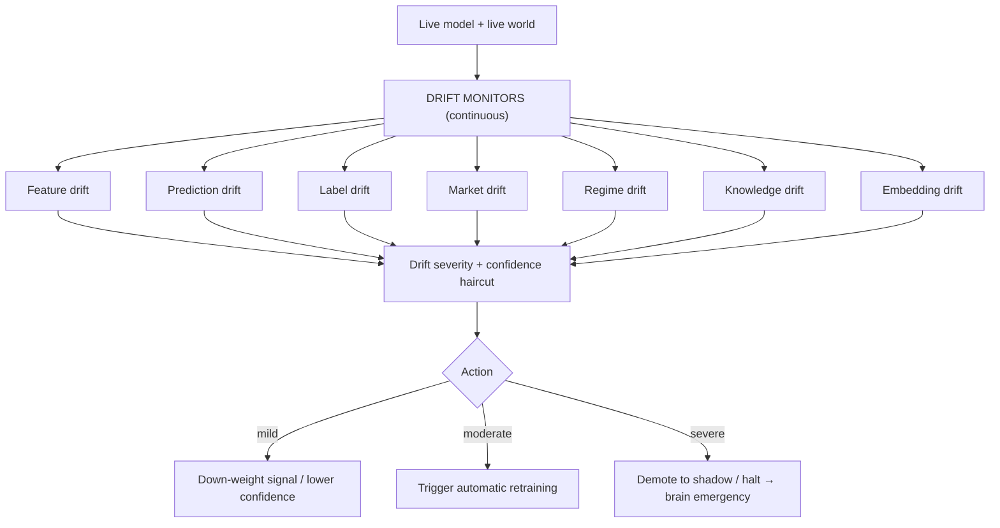

### 12.1 Feature Drift
- **What:** the input distribution shifts — a feature's mean/variance/shape moves from what the model trained on (measured by PSI, KL divergence, KS test, per `claude_ROI.md` §14).
- **Why it matters:** the model is now extrapolating outside its training domain → predictions become unreliable even if the *learned relationship* still holds. Often the *earliest* warning of trouble.

### 12.2 Prediction Drift
- **What:** the *output* distribution shifts — the model starts predicting systematically differently (e.g., persistently more bullish) without a corresponding input reason.
- **Why it matters:** signals a broken input pipeline, a data-quality collapse, or the model reacting to a novel regime. Monitored even when labels aren't yet available (predictions are immediate; outcomes lag).

### 12.3 Label Drift
- **What:** the *target* distribution changes — the statistical properties of realized returns/outcomes shift (e.g., volatility regime change alters the return distribution the model was fit to).
- **Why it matters:** the relationship the model learned may no longer map to current outcomes — the leading edge of **concept drift** (§10.6). Detectable only as outcomes arrive, so it *confirms* what feature/prediction drift *forewarned*.

### 12.4 Market Drift
- **What:** structural change in the market itself — microstructure shifts (tick-size/venue changes), liquidity regime changes, new participants, or crowding that arbitrages the edge away (§1.1).
- **Why it matters:** the *mechanism* behind the alpha may be dying. This is drift of the **economic cause**, not just the statistics — the most fundamental and least recoverable form. Ties to capacity/decay monitoring (§9.6).

### 12.5 Regime Drift
- **What:** a transition in the market regime (`claude_aiBrain.md` §7) — bull→bear, low→high vol, onset of crisis — detected by the regime agent and propagated here.
- **Why it matters:** a model excellent in one regime can be lethal in another; regime drift triggers **regime-conditioned re-weighting** (§5.7) and, in crisis/OOD, deliberate *distrust* of statistical models (`claude_aiBrain.md` §9). The master drift signal that conditions all others.

### 12.6 Knowledge Drift
- **What:** staleness/change in the **knowledge layer** — the graph's relationships evolve (supply chains rewire, ownership shifts), ontologies extend, or semantic memory's principles need updating (`claude_ROI.md` §7, §23; `claude_aiBrain.md` §8).
- **Why it matters:** GNN and knowledge-grounded models depend on a *current, correct* graph; a stale relationship silently corrupts relational predictions. Ensures the knowledge substrate stays live, not fossilized.

### 12.7 Embedding Drift
- **What:** the meaning captured by embeddings shifts — vocabulary/topic evolution in text, market-state encoder outputs moving, or the embedding model itself becoming outdated (`claude_ROI.md` §22).
- **Why it matters:** embedding-based recall (episodic/semantic memory, RAG grounding) degrades if today's embeddings drift from the historical corpus's — threatening the brain's ability to recall analogous past setups. Triggers controlled re-embedding (versioned dual-index migration, `claude_ROI.md` §22), *never* a silent swap.

### 12.8 Automatic Retraining
- **What:** a **triggered** (not merely scheduled) retraining loop — drift severity, decay, or calibration breach fires a retrain on fresh PIT data, which runs the *full* validation gauntlet (§8) and champion/challenger evaluation (§11.2) before any promotion.
- **Why it exists:** keeps models current against non-stationarity without human latency — *but with full rigor.* Critical guardrails: (a) retraining **never auto-promotes** — a retrained model is a *challenger* that must beat the champion OOS after deflation; (b) trigger-based (not blind schedule) avoids needless retraining that just re-overfits recent noise; (c) every retrain is versioned, lineage-linked, and audited (§11). Automatic retraining is the model-layer engine of the brain's self-improvement loops (`claude_aiBrain.md` §14) — closing the loop from live drift → fresh model → re-validated → promoted or killed.

---

## 13. Explainability

In autonomous capital management, **an unexplainable prediction is a blocked prediction** (`claude_aiBrain.md` §12). Explainability here is not post-hoc decoration — it is a *gate*, a *debugging tool*, a *drift/leakage detector*, and *training data for the reflection loop*. This section specifies the ML techniques that produce the causal chain the brain's Narrator agent turns into a human-readable justification.

```mermaid
flowchart TB
    MODEL13["Model prediction"] --> LOCAL13["LOCAL (this prediction)<br/>SHAP · LIME · attention · counterfactual"]
    MODEL13 --> GLOBAL13["GLOBAL (model behavior)<br/>SHAP aggregate · feature importance · interaction maps"]
    LOCAL13 & GLOBAL13 --> CONF13["Confidence estimation (calibrated)"]
    CONF13 --> NARR13["→ Narrator agent → DecisionNarrative"]
    NARR13 --> LEDGER13["→ WORM audit ledger (per-trade justification)"]
    LOCAL13 -.anomalous attribution.-> LEAK13["Leakage / drift alarm"]
```

### 13.1 SHAP
- **What:** game-theoretic per-prediction attribution (§6.4) — decomposes each forecast into additive, consistent feature contributions; aggregates to global importance and interactions.
- **Role here:** the **primary** explainability engine — answers "*which features drove this specific trade, and in which direction?*" for the ledger, and doubles as a **leakage/drift detector** (a feature suddenly dominating, or attribution shifting, flags trouble). TreeSHAP makes it fast for the boosting workhorses (§4.1).

### 13.2 LIME
- **What:** fits a simple, interpretable local surrogate around a single prediction to approximate *why* the model decided as it did in that neighborhood.
- **Role here:** a fast, model-agnostic **complement** to SHAP — useful for quick local sanity checks and for model classes where SHAP is expensive. Weaker theoretical guarantees than SHAP (local approximation, sampling-sensitive), so it corroborates rather than replaces.

### 13.3 Attention
- **What:** for Transformer/TFT models (§4.2), attention weights reveal *which inputs (which time steps, which series, which features) the model focused on* — TFT's variable-selection networks make this explicitly interpretable.
- **Role here:** native interpretability for sequence/multi-horizon models — "the model weighted the earnings event and the last 3 days of flow." Caveat: attention is *indicative*, not a guaranteed causal explanation (attention ≠ attribution), so it's cross-checked against SHAP for high-stakes decisions.

### 13.4 Counterfactuals
- **What:** "what minimal change to the inputs would flip this decision?" — the smallest perturbation (e.g., "had liquidity been 20% lower, the trade would have been rejected") that changes the outcome.
- **Role here:** the most *human-intuitive* explanation and a powerful **robustness probe** — a decision that flips under a tiny, plausible change is *fragile* and should be sized down or abstained (feeds the brain's red-team and confidence haircut). Directly answers a risk committee's "how sensitive is this bet?"

### 13.5 Trade Explanations
- **What:** the synthesis — the model-level attributions (SHAP/LIME/attention/counterfactual) composed with the decision-layer reasoning into the **DecisionNarrative** the brain's Narrator produces (`claude_aiBrain.md` §12): the causal chain from features → prediction → confidence → sizing → execution, layered (one-liner → rationale → full DAG).
- **Role here:** the **gate** — in supervised/autonomous modes, a trade whose explanation is incoherent or missing is *blocked*. It is also *reflection fuel*: a decision you can't explain is one you can't learn from (§15). Written immutably to the ledger for every trade.

### 13.6 Confidence Estimation
- **What:** producing a **calibrated** probability that a given prediction is correct (§9.3) — from Bayesian posteriors (§4.3), conformal prediction (distribution-free prediction intervals with coverage guarantees), model-agreement across the ensemble (§5), and post-hoc calibration (temperature/isotonic).
- **Role here:** confidence is the **meta-explanation** — "here is the decision, *and here is how much to trust it*" — and it governs sizing and abstention (§1.4) and propagates through the brain (`claude_aiBrain.md` §6). Separating *aleatoric* (irreducible market noise → size down) from *epistemic* uncertainty (we-don't-know-enough → gather more / abstain) turns confidence into an *action*, not just a number. **Explainability without calibrated confidence is only half the picture.**

---

## 14. Risk-Aware Machine Learning

The models do not decide alone. Every prediction passes through the **risk boundary** — the point where a forecast becomes a *bounded, sized, risk-checked action* under the sovereign risk kernel (`AI_QUANT_PLATFORM_BLUEPRINT.md`, `claude_aiBrain.md` §governance). The ML layer is designed to *propose within limits it can never raise.* This section specifies how the model layer interfaces with risk.

```mermaid
flowchart LR
    PRED14["Model prediction + calibrated confidence"] --> RA14{{"Risk Agent / Risk Kernel<br/>(sovereign, un-overridable by ML)"}}
    RA14 --> ALLOC14["Capital allocation<br/>(portfolio-level budget)"]
    ALLOC14 --> SIZE14["Position sizing<br/>(confidence → fractional Kelly)"]
    SIZE14 --> EXP14["Maximum exposure caps<br/>(name · sector · factor · gross)"]
    EXP14 --> GATE14{Within all limits?}
    GATE14 -->|yes| ACT14["Sized order → execution"]
    GATE14 -->|no| REJ14["Trade rejection (fail-closed) + reason code"]
    REJ14 -.logged + reflection.-> MEM14["→ memory / learning"]
```

### 14.1 Interaction with the Risk Agent
- **What:** the model's output (direction, magnitude, calibrated confidence, uncertainty decomposition) is *evidence* the Risk Agent weighs — never a command. The Risk Agent holds **veto power** and can only *attenuate*, never amplify beyond the kernel's hard ceilings (`claude_aiBrain.md` §governance, §6 confidence-only-lowers-through-governance).
- **Why it exists:** separation of powers — the model that *proposes* is never the authority that *approves*. This is the ML-layer expression of "the AI proposes; the risk kernel disposes." A miscalibrated or drifting model is contained by a risk boundary it cannot influence.

### 14.2 Capital Allocation
- **What:** how much *total* capital budget a model/strategy receives — a function of its *demonstrated, calibrated, out-of-sample* performance, its **marginal contribution to portfolio Sharpe** and diversification (§9.7), its capacity (§9.6), and its current autonomy level (§16).
- **Why it exists:** allocation is portfolio-level, not per-signal-greedy — a modest strategy *uncorrelated* to the book earns more capital than a great one that's redundant. Budgets scale with *trust earned* (the autonomy ladder) and shrink instantly on drift/decay.

### 14.3 Position Sizing
- **What:** translating an approved directional view + calibrated confidence into a specific notional — **fractional Kelly under model uncertainty**, scaled by predicted volatility (§3 task 3), regime (§5.7), and correlation to existing positions (`claude_aiBrain.md` §sizing).
- **Why it exists:** *sizing errors dominate signal errors* (§3.2 ranking) — this is where confidence *becomes* capital-at-risk. Deliberately fractional (not full-Kelly) because our edge estimates are themselves uncertain; epistemic uncertainty *shrinks* size, aleatoric uncertainty *caps* it.

### 14.4 Maximum Exposure
- **What:** **hard, un-overridable ceilings** — per-name, per-sector, per-factor, gross/net, and drawdown-budget limits enforced in the risk kernel, *outside* the ML layer's reach.
- **Why it exists:** the last line between a model's error and an existential loss. No model, no ensemble, no consensus, no confidence score can breach these — they are human-owned and four-eyes-changed only (`claude_aiBrain.md` §16, §17). Concentration exposures the model *didn't know it was taking* (§9.5) are caught here.

### 14.5 Trade Rejection
- **What:** the **fail-closed** outcome — when a proposed trade violates any limit, fails compliance, lacks a coherent explanation (§13.5), carries high epistemic uncertainty (§13.6), or arrives during an emergency/high-uncertainty state (`claude_aiBrain.md` §24), it is **rejected with a reason code**, not forced through.
- **Why it exists:** *not trading is a valid, first-class decision* (§1.4). Rejection protects capital when the model is uncertain, drifting, or out-of-distribution — and every rejection is logged and reflected upon (§15), so the system *learns from what it chose not to do*, not just from what it did. Fail-closed on the money path is the whole risk philosophy in one behavior.

---

## 15. Continuous Learning

The system is never "trained once." It learns continuously — from fresh data, from its own outcomes, from its mistakes, and from humans — closing the loop between the ML layer and the brain's self-improvement architecture (`claude_aiBrain.md` §13–14). The discipline: **learn continuously, but promote nothing without the full validation gauntlet.** Continuous learning is a *candidate generator*, never an auto-deployer.

```mermaid
flowchart TB
    subgraph SIGNALS15["LEARNING SIGNALS"]
        ON15["Online (fresh live data)"]
        OFF15["Offline (batch retrain)"]
        REF15["Reflection agent feedback"]
        MIS15["Mistake memory"]
        ACT15["Active learning (query hard cases)"]
        HUM15["Human feedback"]
    end
    SIGNALS15 --> CAND15["Candidate model / weight / feature update"]
    CAND15 --> GAUNT15["FULL validation gauntlet (§8) + champion/challenger (§11)"]
    GAUNT15 --> PROMO15{Beats champion OOS, deflated?}
    PROMO15 -->|yes| DEPLOY15["Promote (graduated, §16)"]
    PROMO15 -->|no| KILL15["Reject → log lesson → memory"]
    DEPLOY15 -.outcomes.-> REF15
```

### 15.1 Online Learning
- **What:** incremental updates from streaming live data — adaptive ensemble re-weighting (§5.5), online calibration refresh, and light parameter updates for models that support it.
- **Why / caution:** tracks non-stationarity fast; but online updates are the *most* dangerous (they can chase noise or be poisoned by a bad-data burst) — so they're **bounded** (rate-limited, within validated envelopes) and confined to *low-risk adaptations* (weights, calibration), never unbounded structural change. Anchored by the linear baseline (§4.1).

### 15.2 Offline Learning
- **What:** periodic/triggered full batch retraining on fresh PIT data through the complete pipeline (§2) — the *primary* learning mode for anything structural (new model versions, feature-set changes).
- **Why:** rigor over speed — offline learning gets the full validation gauntlet (§8), nested CV, deflation, and champion/challenger review (§11) before promotion. Most durable learning happens here; online learning handles only the fast, bounded edge.

### 15.3 Reflection Agent Feedback
- **What:** the brain's Reflection agent (`claude_aiBrain.md` §13) post-mortems every closed trade — separating **skill from luck** — and feeds structured lessons back: which models/features were right/wrong *and why*, recalibrating agent/model trust weights (the Meta-Learner, §5.4).
- **Why it exists:** raw P&L is a noisy teacher; reflection extracts the *reasoning-quality* signal. A lucky win is *not* reinforced; a sound-but-unlucky loss is *not* punished — this discipline is what prevents the system from learning exactly the wrong lessons from noise.

### 15.4 Mistake Memory
- **What:** the dedicated catalog of *reasoning failures* (`claude_aiBrain.md` §8.5, §14) — each with root cause, lesson, and installed guardrail — **actively queried before new decisions** to check "have we made this class of error here before?"
- **Why it exists:** the system's *immune system* — a mistake once made becomes a permanent antibody. Continuous learning that doesn't remember failures repeats them; mistake memory makes each error a one-time cost. The single biggest driver of long-run robustness.

### 15.5 Active Learning
- **What:** the system **queries for labels/attention on the cases it's most uncertain about** — high-epistemic-uncertainty predictions, novel regimes with no memory analogue, or disagreement between model classes — directing scarce human/research effort where it most reduces uncertainty.
- **Why it exists:** label and attention budgets are finite; active learning spends them on the *informative* cases (the boundary, the novel), not the easy ones. Especially valuable for rare events (§3 crash/gap) where informative examples are scarce.

### 15.6 Human Feedback
- **What:** structured incorporation of human judgment — analysts overriding/confirming/nudging decisions (`claude_aiBrain.md` §16), risk officers tightening limits, committee promotion decisions, and expert labeling of ambiguous cases — captured as data, not just one-off interventions.
- **Why it exists:** humans remain sovereign and carry contextual/novel-situation judgment the models lack; capturing their feedback as a learning signal (RLHF-style for the reasoning layer, expert labels for the model layer) compounds human expertise into the system over time. Human feedback also grounds the system against silent drift into pathological behavior.

### 15.7 Automatic Improvement
- **What:** the **closed loop** synthesizing all of the above — the meta-learner (§5.4, `claude_aiBrain.md` §14) continuously re-weights models, retires decayed ones (§5.8), promotes validated challengers (§11), generates and tests new features (§6.11), and adjusts regime behavior — *within validated bounds and human-set guardrails.*
- **Why it exists:** it *is* the self-improving research factory — the ML-layer engine of the brain's autonomy. **Guardrails are absolute:** every automatic change is validated (§8), deflated (§9.8), versioned/audited (§11.6), reversible (§11.5), and bounded by the risk kernel (§14). The system improves itself, but it can *never* expand its own authority or bypass its own validation — automation accelerates the *research loop*, not the *trust escalation*, which remains human-gated (§16).

---

## 16. Model Lifecycle

Every model traverses a single, disciplined lifecycle from research idea to retirement — a **trust ratchet** where capital and autonomy increase only as the model clears each gate, and can be revoked instantly at any stage. This unifies the research pipeline (§2), the registry stages (§11), and the brain's autonomy ladder (`claude_aiBrain.md` §26) into one model-centric view.

```mermaid
flowchart LR
    RES16["1 RESEARCH<br/>idea + hypothesis"] --> TRN16["2 TRAINING"] --> VAL16["3 VALIDATION<br/>(gauntlet §8)"] --> BT16["4 BACKTESTING<br/>(net of costs)"] --> PT16["5 PAPER TRADING<br/>(live data, sim fills)"] --> SH16["6 SHADOW MODE<br/>(live, logged, no capital)"] --> PROD16["7 PRODUCTION<br/>(canary → champion)"] --> MON16["8 MONITORING<br/>(drift §12)"] --> RET16["9 RETIREMENT"]
    VAL16 -.fail.-> RES16
    BT16 -.fail.-> RES16
    PT16 -.parity break.-> BT16
    MON16 -.decay/drift.-> RET16
    MON16 -.healthy.-> PROD16
    RET16 -.lessons.-> RES16
```

| Stage | What happens | Gate to advance | Capital | Cross-ref |
|---|---|---|---|---|
| **1 Research** | Idea → falsifiable hypothesis with economic mechanism | Mechanism + pre-registered plan | None | §2 S1–2 |
| **2 Training** | Fit on PIT data, temporal splits, regularized | Registered, lineage-linked, logged | None | §2 S5, §11.1 |
| **3 Validation** | Walk-forward, CPCV, nested CV, calibration | Pass **deflated** gauntlet (primary overfit gate) | None | §8, §9 |
| **4 Backtesting** | Full strategy through history, realistic costs/impact | Survives *net of costs at realistic size* | None | §2 S7 |
| **5 Paper Trading** | Live data, simulated fills | Min soak + live-vs-backtest parity | None | §2 S8 |
| **6 Shadow Mode** | Live predictions logged, not traded | Live parity + calibration hold | None | §11.3 |
| **7 Production** | Canary (tiny budget) → champion, four-eyes | Beats champion OOS after deflation | Graduated, kernel-capped | §11.2–11.4 |
| **8 Monitoring** | Continuous drift, decay, calibration surveillance | Stays healthy → capital auto-scales | Scales with trust | §12, §9 |
| **9 Retirement** | Graduated demotion; lessons → memory | Decay/drift/crowding detected | Withdrawn | §5.8, §15 |

> **Lifecycle doctrine:** the vast majority of models die before Stage 4 — *by design* (§8 doctrine). Promotion is deliberate, evidence-based, deflated, and human-gated at the capital boundary; demotion is automatic and instant on any breach. A model's autonomy is a *revocable dial tied to sustained, calibrated, out-of-sample performance* — never to recent profit or researcher conviction (`claude_aiBrain.md` §17, §26). Retirement is not failure — it is the natural end of a decayed edge, and its lessons feed the next research cycle. The lifecycle is a **ratchet, not a conveyor.**

---

## 17. Future Research

A 10-year research agenda. Each frontier is assessed for **what it unlocks, its maturity for capital, and the honest obstacles.** The through-line: finance is uniquely hostile to techniques that assume stationarity, abundant labels, or i.i.d. data — so the winners will be those that respect *non-stationarity, causality, uncertainty, and data scarcity.* Hype that ignores these will lose money regardless of benchmark performance.

```mermaid
flowchart TB
    subgraph HIGH["HIGHEST CONVICTION (next 3–5 yrs)"]
        FFM17["Financial Foundation Models"]
        CAUSAL17["Causal AI"]
        AGENT17["Agentic Learning"]
        GNN17["Graph Neural Networks (maturing)"]
    end
    subgraph MED["PROMISING (5–8 yrs)"]
        WORLD17["World Models"]
        SYNTH17["Synthetic Data"]
        NMEM17["Neural Memory"]
    end
    subgraph SPEC["SPECULATIVE / WATCH (8–10+ yrs)"]
        DIFF17["Diffusion Models"]
        QML17["Quantum ML"]
    end
    HIGH --> IMPACT17["High near-term P&L leverage"]
    MED --> IMPACT18["Structural capability bets"]
    SPEC --> IMPACT19["Optionality / monitor"]
```

### 17.1 Graph Neural Networks — *maturing, high conviction*
- **Unlocks:** relational alpha — supply-chain contagion, common-ownership crowding, second-order exposure — turning the proprietary Knowledge Graph (`claude_ROI.md` §7, §23) into signal no tabular model can see.
- **Maturity:** already deployable (§4.2); the frontier is *temporal* GNNs (relationships that evolve without lookahead) and graph-transformer hybrids.
- **Obstacle:** requires a genuinely proprietary, PIT-correct graph — which is precisely the moat, and precisely what most funds lack.

### 17.2 Financial Foundation Models — *highest conviction*
- **Unlocks:** large models pre-trained on vast multi-modal market history (prices, filings, news, cross-asset) that **transfer** to many downstream tasks with little task-specific data — attacking finance's core label-scarcity problem via representation learning.
- **Maturity:** the most consequential bet of the next 5 years; early forms exist (time-series foundation models, market-state encoders feeding the brain's memory).
- **Obstacle:** finance's low signal-to-noise and non-stationarity make naive "scale solves it" *false* — a foundation model that memorizes a bygone regime is dangerous. The winners will pair scale with the *validation and PIT discipline* of this entire framework. **Scale is necessary, not sufficient.**

### 17.3 Agentic Learning — *high conviction (already core)*
- **Unlocks:** the multi-agent research/decision system (`claude_aiBrain.md`) that *learns to learn* — agents that autonomously generate hypotheses, run the research pipeline, critique each other, and improve the firm's own process (§15.7).
- **Maturity:** foundational to this platform *now*; the frontier is deeper autonomy in *research generation* (agents proposing genuinely novel strategies) under human-set guardrails.
- **Obstacle:** keeping autonomous research *honest* (agents can overfit and rationalize as easily as humans) — which is why the whole validation/deflation apparatus (§8–10) is the enabling technology, not a constraint.

### 17.4 Causal AI — *high conviction, structurally essential*
- **Unlocks:** moving from *correlation* to *causation* — identifying the **mechanism** behind an edge (§1.1's "who loses and why"), enabling models that survive regime change because they capture *why*, not just *what*. Directly attacks the non-stationarity that kills correlational models.
- **Maturity:** early but strategically vital; causal discovery, do-calculus, and causal representation learning are advancing.
- **Obstacle:** causal inference from observational financial data (no controlled experiments) is genuinely hard — but even *partial* causal structure is a robustness superpower. Likely the highest-*leverage* frontier for *durable* alpha.

### 17.5 World Models — *promising*
- **Unlocks:** learned generative models of market dynamics that enable *planning* and *counterfactual simulation* ("what happens to the book if rates gap 50bp?") — a high-fidelity simulator for RL execution (§4.3) and stress testing beyond historical scenarios.
- **Maturity:** 5–8 years for capital-grade fidelity; promising for execution/risk, not yet for alpha.
- **Obstacle:** a world model of markets that is *wrong in the tails* is worse than none (false confidence in crisis) — validating generative market fidelity is an open problem.

### 17.6 Synthetic Data — *promising, with sharp caveats*
- **Unlocks:** augmenting scarce data — especially **rare events** (crashes, §3 task 6) — and stress-scenario generation, mitigating finance's fundamental shortage of independent samples.
- **Maturity:** useful *now* for robustness testing and augmentation; the frontier is realistic regime/tail generation.
- **Obstacle:** the deepest risk in the field — a model trained on synthetic data learns the *generator's* assumptions, not the market's. Synthetic data is powerful for **stress-testing and robustness**, dangerous for **alpha discovery** (you can only synthesize patterns you already believe). Used for defense, not offense.

### 17.7 Neural Memory — *promising (already emerging)*
- **Unlocks:** differentiable, learnable memory architectures that let models *store and retrieve* market experience natively — deepening the brain's episodic/semantic memory (`claude_aiBrain.md` §8) beyond retrieval into learned recall.
- **Maturity:** emerging; retrieval-augmented and memory-augmented models are practical today, richer neural memory is 5–8 years out.
- **Obstacle:** point-in-time correctness of learned memory (no lookahead in what's "remembered," `claude_ROI.md` §22) and avoiding memorization of noise.

### 17.8 Diffusion Models — *speculative / watch*
- **Unlocks:** high-quality generative modeling of *distributions* — probabilistic scenario generation, return-distribution modeling, and richer synthetic/stress data (§17.6) with better tail behavior than GANs.
- **Maturity:** 8+ years for a core financial role; currently more promising for scenario/synthetic generation than direct prediction.
- **Obstacle:** unproven edge in *prediction* vs. established methods; compute-heavy; the same synthetic-data caveats (§17.6) apply.

### 17.9 Quantum Machine Learning — *speculative / long-horizon watch*
- **Unlocks:** *potential* speedups for specific problems — portfolio optimization (combinatorial), Monte Carlo/risk simulation, and certain sampling/optimization kernels.
- **Maturity:** 10+ years and hardware-gated; genuine advantage for *practical* finance remains unproven.
- **Obstacle:** current quantum hardware (noise, qubit count) is far from useful scale; most claimed advantages are theoretical. **Correct posture: monitor, maintain optionality, invest minimally** — do not bet the research program on it, but don't be blindsided if hardware inflects.

### 17.10 The 10-year forecast (honest ranking)

```mermaid
flowchart LR
    T17["TIER 1 — bet on these<br/>Foundation Models · Causal AI · Agentic Learning · GNNs"] --> T18["TIER 2 — build toward<br/>World Models · Neural Memory · Synthetic (defense)"] --> T19["TIER 3 — monitor<br/>Diffusion · Quantum ML"]
```

| Conviction | Technologies | Rationale |
|---|---|---|
| **Highest (bet on these)** | **Financial Foundation Models, Causal AI, Agentic Learning, GNNs** | They attack finance's *actual* hard problems — label scarcity (foundation models), non-stationarity (causal), research scale (agentic), and relational structure (GNN). Highest P&L leverage over 10 years. |
| **Build toward** | **World Models, Neural Memory, Synthetic Data (defensive)** | Structural capability bets — better simulation, richer memory, robustness — valuable but longer-horizon or defense-only. |
| **Monitor / optionality** | **Diffusion Models, Quantum ML** | Real potential but unproven-for-capital or hardware-gated; maintain awareness and small options, don't over-invest. |

> **The meta-prediction:** the biggest 10-year gains come *not* from any single exotic technique, but from **combining foundation-scale representation learning with causal structure, agentic research automation, and the rigorous validation/PIT/calibration discipline this framework enforces.** The fund that wins is not the one with the fanciest model — it is the one whose *research process* can safely and continuously harness each new technique without ever relaxing its defenses against overfitting, leakage, and non-stationarity. **Discipline is the durable edge; models are the depreciating one.**

---

## Recommendations for Future Expansion

Concrete priorities to evolve this framework into the next decade, in order of leverage:

1. **Invest first in the research *process*, not exotic models.** The defenses (PIT correctness, nested validation, deflation, leakage prevention, calibration) are the durable moat. A disciplined process with boosting-and-linear models beats a sloppy process with foundation models — every time. Harden §8–§10 before chasing §17.

2. **Build the Financial Foundation Model — but on this framework's rails.** Pre-train a multi-modal market representation for transfer learning to attack label scarcity — and gate it through the *same* validation/PIT/deflation apparatus. Scale amplifies both signal and overfitting; the discipline is what makes scale safe.

3. **Prioritize Causal AI as the durability play.** Every strategy already requires an economic mechanism (§1.1); formalize this into causal models that survive regime change. This is the highest-leverage bet for *durable* (not decaying) alpha.

4. **Deepen agentic research automation under hard guardrails.** Let the agent system generate and pre-screen hypotheses at scale (§15.7, `claude_aiBrain.md`) — but the validation gauntlet remains sovereign and human-gated at the capital boundary. Automate the *research loop*, never the *trust escalation*.

5. **Turn the Knowledge Graph into a first-class alpha source via temporal GNNs.** The proprietary graph (`claude_ROI.md` §7, §23) is a moat few competitors have; temporal GNNs (§17.1) are the key to monetizing it while respecting no-lookahead.

6. **Make calibration and uncertainty the organizing principle of every model.** Expand Bayesian/conformal methods (§13.6) so *every* prediction ships with honest, decomposed uncertainty — because sizing and abstention (the real P&L drivers, §3.2) depend on it more than on point accuracy.

7. **Institutionalize continuous learning with immune memory.** Scale the reflection → mistake-memory → guardrail loop (§15) so the firm's errors become permanent antibodies. The compounding advantage of a system that *never repeats a mistake* exceeds any single model improvement.

8. **Maintain optionality on the frontier (world models, neural memory, diffusion, quantum) without betting the program on it.** Small, monitored investments; be ready to inflect when maturity arrives, never dependent on it.

9. **Expand capacity and asset-class breadth on the same spine.** The asset-agnostic ontologies (`claude_ROI.md` §26) and plugin architecture (`AI_QUANT_PLATFORM_BLUEPRINT.md`) mean new markets are adapters, not rewrites — grow capacity (the real objective, §1.1) without re-architecting.

10. **Never relax the core invariant.** As models grow more autonomous and powerful, the risk kernel's hard ceilings, the WORM audit trail, point-in-time correctness, and human sovereignty at the capital boundary *expand in scope but never weaken.* Autonomy grows only as validated, calibrated trust grows — capital-at-risk is always a function of demonstrated reliability, never of ambition or model sophistication.

> **Closing principle.** Across all four documents — the body (`AI_QUANT_PLATFORM_BLUEPRINT.md`), the mind (`claude_aiBrain.md`), the foundation (`claude_ROI.md`), and this research discipline — one idea recurs: **the edge is not the model; the edge is the disciplined system that safely produces, validates, sizes, executes, explains, and learns from a portfolio of weak, diverse, decaying signals — faster and more honestly than anyone else, without ever fooling itself.** Models depreciate. Data commoditizes. *The disciplined research process compounds.* That is what a ten-billion-dollar research program is truly built to protect.

---

## Document complete — ML & Quant Research Framework, Sections 1–17 delivered.

**Full coverage:** research philosophy (1) · research pipeline (2) · prediction problems (3) · model zoo (4) · ensemble architecture (5) · feature selection (6) · hyperparameter optimization (7) · validation framework (8) · model evaluation (9) · overfitting prevention (10) · model registry (11) · drift detection (12) · explainability (13) · risk-aware ML (14) · continuous learning (15) · model lifecycle (16) · future research + expansion recommendations (17). **30+ Mermaid diagrams throughout.**

**The complete document set for the AI Quant Research Platform:**
- `AI_QUANT_PLATFORM_BLUEPRINT.md` — **the body** (distributed system architecture)
- `claude_aiBrain.md` — **the mind** (autonomous cognitive/agent architecture)
- `claude_ROI.md` — **the foundation** (knowledge & data layer)
- `claude_MLResearchFramework.md` — **the discipline** (this — ML & quant research framework)
