# Production-Grade AI Quant Research Platform
## Engineering Blueprint v1.0

**Classification:** Architecture Blueprint  
**Target Scale:** $10B+ AUM, millions of market events/second  
**Philosophy:** Zero-trust, event-driven, deterministic, auditable, self-healing

---

## Table of Contents
1. [Architectural Principles](#architectural-principles)
2. [High-Level System Architecture](#high-level-system-architecture)
3. [Service Catalog](#service-catalog)
4. [Multi-Agent AI Architecture](#multi-agent-ai-architecture)
5. [Communication Patterns](#communication-patterns)
6. [Data Architecture](#data-architecture)
7. [Sequence Diagrams](#sequence-diagrams)
8. [API Gateway Design](#api-gateway-design)
9. [Security Architecture](#security-architecture)
10. [Failure Recovery & Resilience](#failure-recovery--resilience)
11. [Scaling Strategy](#scaling-strategy)
12. [Deployment Architecture](#deployment-architecture)
13. [CI/CD Pipeline](#cicd-pipeline)
14. [Folder Structure](#folder-structure)
15. [Future Expansion Plan](#future-expansion-plan)

---

## Architectural Principles

| Principle | Rationale |
|-----------|-----------|
| **Event Sourcing** | Every market tick, feature, prediction, and trade is an immutable event. The system state is a left-fold over events. This makes backtesting, audit, and replay trivial. |
| **Deterministic Simulation** | Paper trading and backtesting must use *identical* code paths as live trading. Only the broker adapter changes. |
| **Zero-Trust** | No service trusts any other. mTLS, SPIFFE identities, and signed JWTs everywhere. |
| **Fail-Static** | If the ML pipeline fails, the system halts or falls back to the last validated model. Never fail-open in trading. |
| **Latency Budgeting** | End-to-end inference-to-order latency must be budgeted per asset class. Critical path services are colocated in the same availability zone. |
| **Immutable Infrastructure** | No SSH into production. Everything is a container. Everything is GitOps. |

---

## High-Level System Architecture

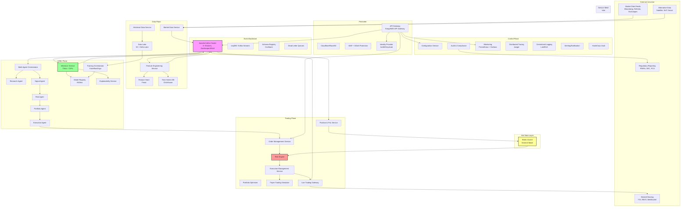

---

## Service Catalog

### 1. API Gateway
**Why it exists:** The single entry point for all external and internal client traffic. Enforces rate limiting, authentication, request validation, and routing. Prevents direct service exposure.

**Responsibilities:**
- OAuth2/OIDC token validation
- Rate limiting per client (researcher, trading desk, system)
- Request/response transformation
- API versioning (`/v1/`, `/v2/`)
- WebSocket termination for real-time dashboards
- DDoS protection and WAF integration

---

### 2. Authentication & Authorization Service (AuthZ)
**Why it exists:** Trading systems are regulated. Every action must be attributable to a principal with specific entitlements.

**Responsibilities:**
- Identity federation (SAML, OIDC, LDAP)
- RBAC + ABAC (Attribute-Based Access Control)
- Entitlement matrix: Who can trade what, how much, in which markets
- Service-to-service identity (SPIFFE/SPIRE)
- Token issuance and rotation

---

### 3. Configuration Service
**Why it exists:** In a distributed system, configuration drift kills. Centralized, versioned, audited configuration is non-negotiable.

**Responsibilities:**
- Feature flags (launch darkly style)
- Strategy parameters (thresholds, lookback windows)
- Market hours and holiday calendars
- Broker connection parameters
- Dynamic reconfiguration without restarts
- Config audit trail (who changed what, when)

---

### 4. Market Data Service (MDS)
**Why it exists:** The system ingests millions of ticks/second from heterogeneous sources (L1, L2, L3, options chains, futures term structures). Normalization must happen at the edge.

**Responsibilities:**
- Multi-adapter ingestion (Bloomberg B-PIPE, Refinitiv Elektron, WebSocket feeds, multicast ITCH)
- Normalization to internal canonical format (protobuf)
- Data quality validation (gap detection, stale price filtering, NBBO compliance)
- Real-time and delayed feed handling
- Entitlement checking (exchange agreements)

---

### 5. Feature Engineering Service
**Why it exists:** Raw market data is not model-ready. Features must be computed consistently across backtesting, paper, and live.

**Responsibilities:**
- Stream processing of ticks to features (momentum, volatility, order imbalance, microstructure)
- Windowed aggregations (time bars, tick bars, volume bars, dollar bars)
- Cross-sectional features (rankings, z-scores within sector)
- Feature versioning (v1.2 of "momentum_20d" vs v1.3)
- Point-in-time correctness (no lookahead bias)

---

### 6. Feature Store (Feast)
**Why it exists:** Training/serving skew is the silent killer of quant strategies. The Feature Store guarantees that the features used in training are *identical* to those used in inference.

**Responsibilities:**
- Online store (Redis) for real-time serving
- Offline store (S3 + Delta Lake) for batch training
- Feature metadata and lineage
- Feature monitoring (drift detection)
- Time-travel queries for backtesting

---

### 7. Time-Series Database (ClickHouse)
**Why it exists:** Market data and tick-level features require columnar OLAP with sub-second aggregation. Traditional relational databases cannot handle this.

**Responsibilities:**
- Tick storage with compression (billions of rows)
- Materialized views for OHLCV aggregation
- Analytical queries (correlation matrices, cross-asset regression)
- Data retention policies (hot/warm/cold tiers)
- Replication and sharding by symbol/date

---

### 8. Historical Data Service
**Why it exists:** Backtesting and research need curated, cleaned, point-in-time datasets. Raw tick data is insufficient.

**Responsibilities:**
- Corporate action adjustments (splits, dividends, spin-offs)
- Survivorship-bias-free datasets
- Point-in-time sector/industry classifications
- Fundamental data alignment (earnings, filings)
- Dataset versioning and immutability

---

### 9. Inference Service (NVIDIA Triton)
**Why it exists:** GPU inference must be optimized (batching, TensorRT, ONNX) and isolated from the CPU-bound trading logic.

**Responsibilities:**
- Multi-framework model serving (PyTorch, TensorRT, ONNX, XGBoost)
- Dynamic batching to maximize GPU utilization
- Model warm-up and health checks
- A/B testing of model versions (canary deployments)
- GPU memory management and sharing
- Latency percentiles (p50, p99, p99.9) monitoring

---

### 10. Model Registry (MLflow)
**Why it exists:** Models are assets. They must be versioned, staged, signed, and auditable. A model in production must have a clear lineage to training data and hyperparameters.

**Responsibilities:**
- Model versioning with semantic versioning
- Stage transitions (Development -> Staging -> Production -> Archived)
- Model signatures (input/output schema enforcement)
- Artifact storage (S3 with encryption)
- Model cards (documentation, performance metrics, limitations)
- Approval workflows (quant committee sign-off)

---

### 11. Explainability Service (XAI)
**Why it exists:** Regulators (and PMs) will not accept black-box decisions. Every significant trade must be explainable.

**Responsibilities:**
- SHAP value computation at inference time
- Attention weight extraction for transformer architectures
- Counterfactual generation ("What would change this signal?")
- Feature importance over time
- Regulatory report generation (XRL - eXplainable Regulatory Language)
- Model drift explanation (why did accuracy degrade?)

---

### 12. Training Orchestrator (Kubeflow/Argo)
**Why it exists:** Training is not a one-off script. It is a scheduled, resource-intensive pipeline that must be reproducible.

**Responsibilities:**
- Pipeline DAG execution (data prep -> training -> validation -> registration)
- Hyperparameter tuning (Optuna/Hyperopt) with distributed workers
- Resource scheduling (GPU node allocation, spot instance handling)
- Experiment tracking (metrics, artifacts, parameters)
- Automatic retraining triggers (schedule, performance decay, data drift)

---

### 13. Multi-Agent Orchestrator
**Why it exists:** A single monolithic model is fragile. A multi-agent system allows specialization, redundancy, and meta-cognition.

**Responsibilities:**
- Workflow orchestration (which agents run, in what order)
- Consensus mechanisms (voting, weighted averaging)
- Agent lifecycle management (spawn, monitor, kill)
- Conflict resolution (when agents disagree)
- Meta-learning feedback (agent performance tracking)

---

### 14. Research Agent
**Why it exists:** Continuous discovery of new alpha is required. This agent operates in a sandbox, never touching live trading.

**Responsibilities:**
- Hypothesis generation from alternative data
- Automated backtesting of new strategies
- Strategy ranking by Sharpe, Sortino, max drawdown
- Paper trading recommendation (promote to production?)
- Research notebook governance (convert research to production pipelines)

---

### 15. Signal Agent (Alpha Generation)
**Why it exists:** The core prediction engine. Transforms features into alpha signals (expected returns, probabilities, rankings).

**Responsibilities:**
- Model inference orchestration (which model for which universe)
- Signal combination (ensemble methods)
- Signal decay modeling (how long is an alpha valid?)
- Confidence scoring
- Adversarial robustness checks

---

### 16. Risk Agent
**Why it exists:** Pre-trade risk must be evaluated by an independent agent with no incentive to trade.

**Responsibilities:**
- Position limit validation
- Sector/industry concentration checks
- Beta/neutrality verification
- VaR and CVaR estimation
- Stress scenario simulation
- Kill switch recommendation

---

### 17. Execution Agent
**Why it exists:** A good signal is worthless with bad execution. Market impact and slippage erode alpha.

**Responsibilities:**
- Order slicing strategy (TWAP, VWAP, Implementation Shortfall, Adaptive)
- Venue selection (dark pools, lit markets, internal crossing)
- Urgency detection (trade now vs. over 4 hours)
- Market impact modeling
- Real-time execution quality analysis (arrival price, slippage)

---

### 18. Portfolio Agent
**Why it exists:** Individual signals are greedy. Portfolio construction optimizes the *combination* of positions considering covariance and constraints.

**Responsibilities:**
- Mean-variance optimization (MVO)
- Black-Litterman with views from Signal Agent
- Risk parity and equal risk contribution
- Constraint handling (turnover, leverage, long-only, ESG)
- Tax-aware optimization (for taxable accounts)

---

### 19. Order Management Service (OMS)
**Why it exists:** The canonical system of record for all orders. Every order has a lifecycle that must be tracked.

**Responsibilities:**
- Order creation, modification, cancellation
- State machine management (New -> Pending -> PartiallyFilled -> Filled -> Cancelled)
- Order validation (symbol, quantity, price limits)
- Parent-child order tracking (OMS orders -> EMS slices)
- Audit trail generation

---

### 20. Execution Management Service (EMS)
**Why it exists:** The OMS decides *what* to trade; the EMS decides *how* to execute it.

**Responsibilities:**
- Smart order routing (SOR)
- Algorithmic execution strategies
- Real-time market data integration for execution
- Fill reporting
- Transaction cost analysis (TCA)

---

### 21. Risk Engine (Standalone)
**Why it exists:** Risk cannot be a subroutine inside another service. It must be independently deployable, auditable, and fault-tolerant.

**Responsibilities:**
- **Pre-trade:** Block orders exceeding limits
- **Intra-trade:** Monitor open orders against real-time P&L
- **Post-trade:** Reconciliation and settlement risk
- **Cross-portfolio:** Firm-wide exposure aggregation
- **Kill switch:** Automatic trading halt with circuit breaker logic

---

### 22. Portfolio Optimizer
**Why it exists:** Mathematical optimization is CPU-intensive and requires specialized solvers (Gurobi, CPLEX, OSQP). It must scale independently.

**Responsibilities:**
- Quadratic programming (covariance matrix optimization)
- Mixed-integer programming (discrete constraints)
- Second-order cone programming (robust optimization)
- Warm-start optimization (incremental updates)
- Sensitivity analysis (shadow prices of constraints)

---

### 23. Paper Trading Simulator
**Why it exists:** Validation in production-like conditions without capital risk. Uses identical code paths to live trading.

**Responsibilities:**
- Market replay at realistic speeds
- Simulated market impact (based on historical models)
- Fill probability modeling
- Slippage simulation
- Identical broker API interface (swappable with live gateway)

---

### 24. Live Trading Gateway
**Why it exists:** The final interface to the external world. Must be minimal, fast, and resilient.

**Responsibilities:**
- Broker protocol translation (FIX 4.4/5.0, FIXatdl, REST, WebSocket)
- Order submission and acknowledgement handling
- Execution report processing
- Connection health monitoring and failover
- Rate limiting per broker

---

### 25. Position & PnL Service
**Why it exists:** Real-time P&L is the lifeblood of trading. It must be accurate to the penny and available in milliseconds.

**Responsibilities:**
- Real-time position tracking
- Mark-to-market P&L calculation
- Cash balance management
- Realized and unrealized P&L
- Exposure reporting (gross, net, delta-adjusted)

---

### 26. Backtesting Engine
**Why it exists:** Strategy validation requires historical simulation with no lookahead bias, identical execution logic, and reproducible results.

**Responsibilities:**
- Event-driven backtesting (tick-by-tick or bar-by-bar)
- Vectorized backtesting for research (faster, less realistic)
- Transaction cost modeling
- Benchmark comparison (alpha, beta, information ratio)
- Walk-forward analysis
- Parallel backtest execution (Monte Carlo)

---

### 27. Strategy Plugin Manager
**Why it exists:** The platform must support proprietary strategies without core platform redeployment.

**Responsibilities:**
- Plugin lifecycle (load, validate, hot-swap, unload)
- gRPC-based plugin interface (standardized contract)
- Resource isolation (CPU/memory limits per plugin)
- Plugin signing and verification
- Sandboxed execution (gVisor or WASM for untrusted code)

---

### 28. Audit & Compliance Service
**Why it exists:** Regulatory requirements (MiFID II, SEC Rule 613 CAT) mandate comprehensive recording of all trading activity.

**Responsibilities:**
- Immutable audit logging (WORM storage - Write Once Read Many)
- Trade reconstruction
- Market abuse detection patterns
- Regulatory report generation
- eDiscovery support

---

### 29. Monitoring & Alerting
**Why it exists:** You cannot manage what you cannot measure. Trading systems fail silently.

**Responsibilities:**
- Infrastructure metrics (CPU, memory, GPU utilization, network)
- Business metrics (orders/second, fill rates, slippage, Sharpe ratio)
- Alerting (PagerDuty, Slack, phone)
- Custom dashboards per role (trader, quant, ops, compliance)
- Anomaly detection (unusual trading patterns, system behavior)

---

### 30. Notification Service
**Why it exists:** Humans need to be informed of system state changes, especially failures.

**Responsibilities:**
- Multi-channel delivery (email, SMS, Slack, PagerDuty)
- Alert routing (severity-based escalation)
- On-call rotation integration
- Scheduled reporting (daily P&L, risk summaries)

---

## Multi-Agent AI Architecture

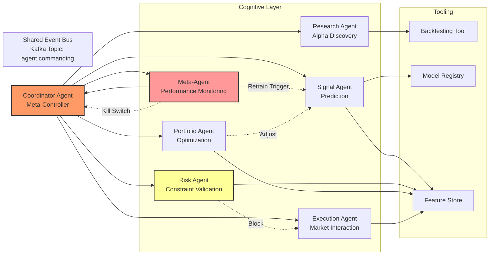

**Agent Communication Protocol:**
- **Protocol:** Protobuf over Kafka (async) + gRPC (sync for consensus)
- **Message Types:**
  - `Intent` (Signal Agent -> Portfolio Agent: "I believe AAPL will outperform by 2%")
  - `Constraint` (Risk Agent -> Portfolio Agent: "Max position 5% of NAV")
  - `Plan` (Portfolio Agent -> Execution Agent: "Buy 10,000 AAPL over 2 hours")
  - `Action` (Execution Agent -> OMS: "Slice 1: Buy 1,000 AAPL at 10:00")
  - `Observation` (OMS -> Meta-Agent: "Order filled at $150.25")
  - `Reward` (PnL Service -> Meta-Agent: "Strategy X returned +3bps today")

**Why Multi-Agent?**
- **Separation of Concerns:** Risk is independent of profit motive.
- **Redundancy:** If Signal Agent fails, Risk Agent can halt trading.
- **Specialization:** Research Agent uses heavy compute; Execution Agent needs low latency.
- **Emergent Behavior:** Meta-Agent learns which agent combinations perform best in different market regimes.

---

## Communication Patterns

### Synchronous (Control Plane)
- **gRPC with Protocol Buffers:** Service-to-service RPC for control operations (configuration, status checks, manual overrides)
- **When to use:** Human-initiated actions, configuration retrieval, health checks
- **Timeout:** 500ms for critical path, 5s for non-critical
- **Retry:** Exponential backoff with jitter

### Asynchronous (Data Plane)
- **Apache Kafka:** Event streaming backbone
- **Topics Design:**
  - `marketdata.raw.{exchange}.{symbol}` (partitioned by symbol)
  - `marketdata.normalized` (single topic, partitioned by symbol hash)
  - `features.{version}.{name}` (feature events)
  - `predictions.{model_id}` (inference outputs)
  - `signals.{strategy_id}` (alpha signals)
  - `orders.{broker_id}` (order lifecycle)
  - `executions.{broker_id}` (fill reports)
  - `risk.violations` (risk events)
  - `pnl.realtime` (P&L updates)
- **Semantic:** Exactly-once processing with idempotent producers
- **Schema:** Enforced by Confluent Schema Registry (Avro/Protobuf)

### Hot State (Caching)
- **Redis Cluster:** Sub-millisecond access for positions, risk limits, market state
- **Use Cases:** Latest price, open orders, daily P&L, circuit breaker status
- **Consistency:** Eventual consistency with Kafka as source of truth. Redis is a cache, not a database.

### CQRS (Command Query Responsibility Segregation)
- **Commands** (trades, config changes) go through Kafka -> Services
- **Queries** (dashboards, reports) read from read-optimized stores (ClickHouse, PostgreSQL replicas)
- **Why:** Prevents analytical queries from impacting trading latency.

---

## Data Architecture

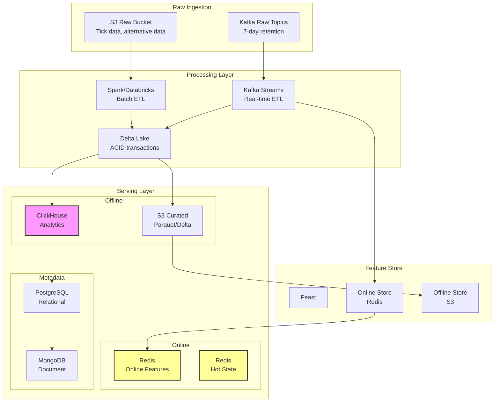

**Database Selection Rationale:**

| Store | Technology | Purpose | Why |
|-------|-----------|---------|-----|
| **Time-Series Primary** | ClickHouse | Tick storage, OHLCV, analytics | Columnar, vectorized, MPP, excellent compression |
| **Hot State** | Redis Cluster | Positions, open orders, limits | Sub-millisecond, pub/sub for real-time updates |
| **Relational** | PostgreSQL (Citus) | OMS state, users, config, audit | ACID, mature, JSONB for flexibility |
| **Document** | MongoDB | Model metadata, experiment logs | Schema flexibility for research artifacts |
| **Data Lake** | S3 + Delta Lake | Historical data, training datasets | Cheap, versioned, time-travel |
| **Search** | Elasticsearch | Log search, compliance queries | Full-text, fast aggregation |
| **Feature Store** | Feast | Feature serving | Training/serving consistency |

**Sharding Strategy:**
- **ClickHouse:** Sharded by `symbol` + `date`. Partitioned by `toYYYYMMDD(timestamp)`.
- **PostgreSQL:** Sharded by `fund_id` (Citus extension).
- **Kafka:** Partitioned by `symbol` hash for market data; by `order_id` for order events.

**Data Retention:**
- **Hot:** 7 days in Redis/ClickHouse hot tier
- **Warm:** 90 days in ClickHouse warm tier
- **Cold:** 7 years in S3 Glacier (regulatory requirement)

---

## Sequence Diagrams

### Diagram 1: Market Event to Trade Execution (Happy Path)

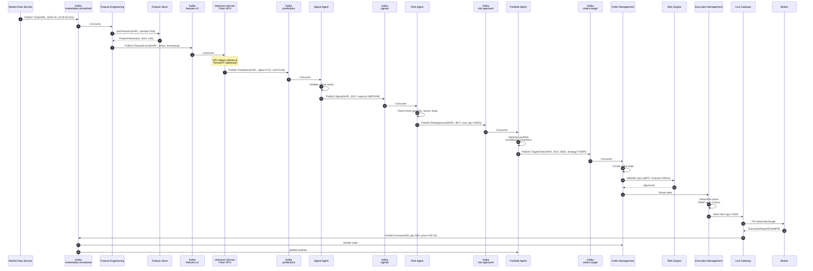

### Diagram 2: Backtesting Pipeline

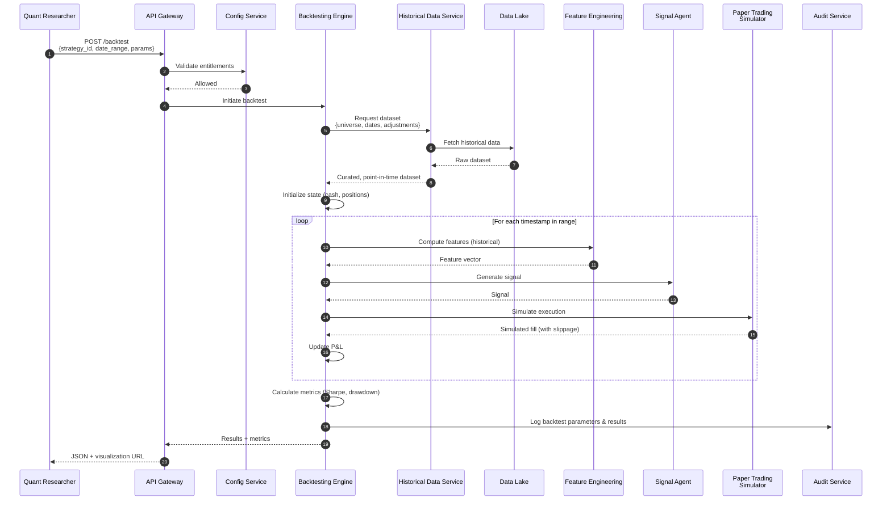

### Diagram 3: Kill Switch / Failure Recovery

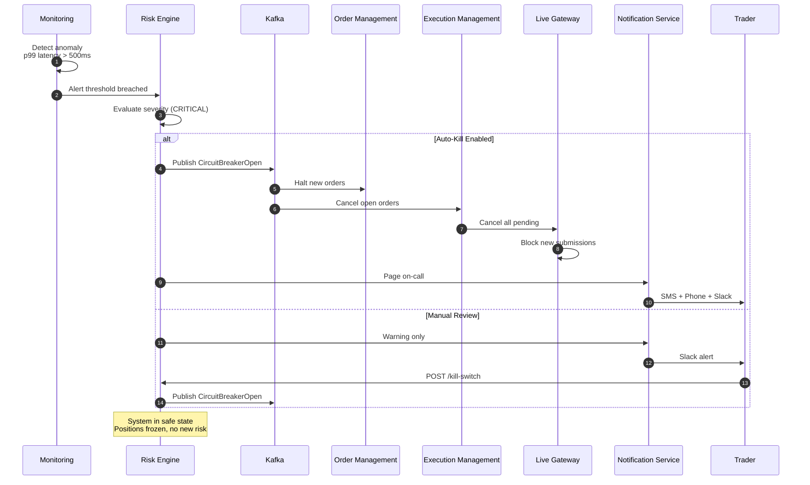

---

## API Gateway Design

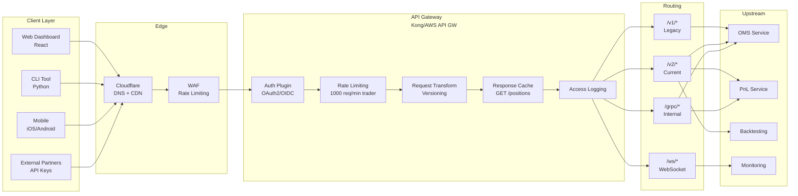

**Gateway Configuration:**

| Route | Method | Auth | Rate Limit | Cache | Target |
|-------|--------|------|------------|-------|--------|
| `/v2/orders` | POST | OAuth2 + mTLS | 100/min | No | OMS |
| `/v2/orders/{id}` | GET | OAuth2 | 1000/min | 5s | OMS |
| `/v2/positions` | GET | OAuth2 | 1000/min | 1s | PnL |
| `/v2/backtest` | POST | OAuth2 + Role | 10/min | No | Backtesting |
| `/v2/marketdata/stream` | WS | OAuth2 | 1 conn/user | No | Kafka proxy |
| `/health` | GET | None | No limit | No | Gateway itself |

**WebSocket Design:**
- Single persistent connection per client
- Protocol: JSON over WebSocket with heartbeat (ping/pong every 30s)
- Topics: `positions`, `orders`, `pnl`, `alerts`
- Authorization: JWT in subprotocol header
- Backpressure: Server drops stale messages if client is slow (max queue: 100)

---

## Security Architecture

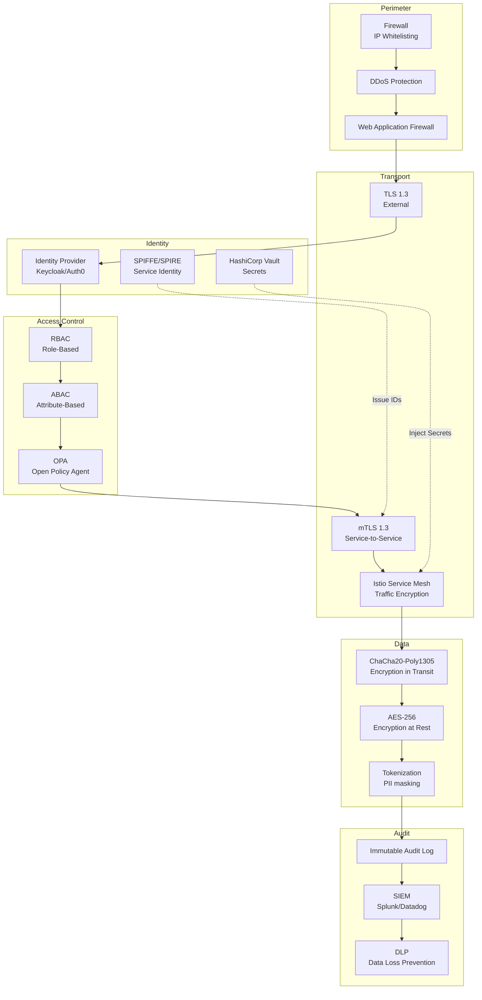

**Security Controls:**

1. **Network Segmentation:**
   - Kubernetes NetworkPolicies isolate namespaces
   - Trading services in `trading-critical` namespace; research in `research-sandbox`
   - No direct internet access for trading plane services (egress proxy required)

2. **Secrets Management:**
   - HashiCorp Vault with Kubernetes auth
   - Dynamic database credentials (leased, auto-rotated)
   - Broker API keys injected as tmpfs volumes, never in env vars
   - Encryption keys in HSM (AWS CloudHSM/Azure Dedicated HSM)

3. **Data Protection:**
   - S3 buckets with SSE-KMS (customer-managed keys)
   - Database encryption at rest (TDE for PostgreSQL)
   - PII tokenization for client data
   - Field-level encryption for sensitive strategy parameters

4. **Access Control:**
   - **Traders:** Can view positions, P&L, submit manual orders (with limits)
   - **Quants:** Can run backtests, view features, cannot trade live
   - **Ops:** Can view metrics, cannot view strategies
   - **Compliance:** Read-only everything, can halt trading
   - **Services:** SPIFFE identities with fine-grained authorization

5. **Application Security:**
   - Input validation at gateway (JSON Schema)
   - SQL injection prevention (ORM + parameterized queries)
   - Dependency scanning (Snyk/Trivy) in CI/CD
   - Container image signing (Cosign)
   - Runtime security (Falco for anomaly detection)

6. **Compliance:**
   - SOC 2 Type II controls
   - GDPR data handling (right to erasure for non-trading data)
   - SEC Rule 613 (CAT) reporting
   - MiFID II best execution reporting

---

## Failure Recovery & Resilience

### Resilience Patterns

| Pattern | Implementation | Service Applied |
|---------|---------------|-----------------|
| **Circuit Breaker** | Resilience4j / Istio outlier detection | OMS -> EMS, EMS -> Broker |
| **Bulkhead** | K8s resource limits + thread pools | Inference Service, Portfolio Optimizer |
| **Retry with Backoff** | Exponential backoff + jitter | Feature Store reads |
| **Dead Letter Queue** | Kafka DLQ topics | All consumers |
| **Graceful Degradation** | Fallback to cached model / last signal | Inference Service |
| **Timeout** | gRPC deadlines (100ms critical, 5s non-critical) | All sync calls |
| **Idempotency** | Idempotency keys for orders | OMS, EMS |

### Failure Scenarios

**Scenario 1: Kafka Broker Unavailable**
- **Detection:** Producer metrics (record-error-rate) spike
- **Mitigation:** Producer retries with exponential backoff; buffer in local disk queue (Kafka client)
- **Failover:** MirrorMaker 2 replicates to secondary cluster; consumers failover
- **Recovery:** Automatic once brokers recover; replay from last committed offset

**Scenario 2: GPU Inference Service Crash**
- **Detection:** Kubernetes health checks (liveness probe) fail
- **Mitigation:** HPA spins up new pod; traffic routed via Istio
- **Fallback:** If no healthy pods, Circuit Breaker opens; Signal Agent uses last cached prediction or halts
- **Recovery:** Pod restarts, warms up model from Model Registry, rejoins pool

**Scenario 3: Database Corruption**
- **Detection:** Checksum validation, ClickHouse replication lag
- **Mitigation:** Automatic failover to replica; corrupted node isolated
- **Recovery:** Point-in-time restore from S3 backups; re-ingest from Kafka (event sourcing advantage)

**Scenario 4: Rogue Strategy / Model Drift**
- **Detection:** Meta-Agent monitors Sharpe decay; Monitoring alerts on abnormal P&L
- **Mitigation:** Kill switch via Risk Engine; strategy automatically moved to paper trading
- **Recovery:** Quant team investigates; rollback to previous model version in Model Registry

**Scenario 5: Broker Connection Drop**
- **Detection:** Heartbeat timeout on FIX session
- **Mitigation:** FIX sequence number recovery; orders queued in OMS
- **Failover:** Secondary broker gateway activated (if configured)
- **Recovery:** FIX session re-established; queued orders submitted with idempotency checks

### Disaster Recovery

| Metric | Target | Implementation |
|--------|--------|---------------|
| **RPO** (Recovery Point Objective) | < 5 seconds | Kafka replication factor 3, sync replication for critical topics |
| **RTO** (Recovery Time Objective) | < 2 minutes | Kubernetes multi-AZ, auto-failover, pre-warmed standby |
| **Backup** | Continuous | S3 cross-region replication, ClickHouse backups every 6 hours |
| **Site DR** | Active-Passive | Secondary region with read replicas; manual promotion for trading |

---

## Scaling Strategy

### Horizontal Scaling

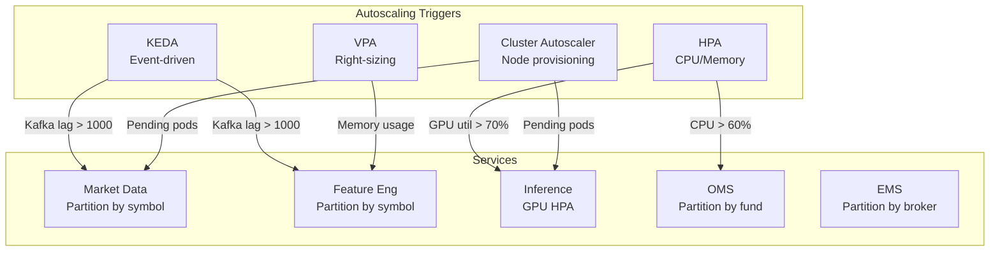

**Scaling Dimensions:**

| Service | Scaling Metric | Max Replicas | Strategy |
|---------|---------------|--------------|----------|
| Market Data Service | CPU + Kafka lag | 50 | Partition by symbol hash |
| Feature Engineering | Kafka lag | 100 | Partition by symbol hash |
| Inference Service | GPU utilization + queue depth | 20 | GPU node pool autoscaling |
| Signal Agent | Kafka lag | 30 | Stateless, easy to scale |
| OMS | Order throughput | 20 | Sharded by fund_id |
| Risk Engine | Latency (p99) | 10 | Stateful, careful scaling |
| ClickHouse | Query load | 10 nodes | Add shards |

### Database Scaling

- **ClickHouse:** Add shards for write scaling; add replicas for read scaling. Distributed table engine handles routing.
- **PostgreSQL:** Citus extension for horizontal sharding by `fund_id`. Read replicas for analytical queries.
- **Redis:** Redis Cluster with 3 master + 3 replica minimum. Hash slots for key distribution.
- **Kafka:** Add brokers; increase partitions (plan ahead, partitions are costly to change).

### Network Scaling
- **Service Mesh:** Istio with sidecar proxy resource limits tuned. Sidecarless mode (ambient mesh) considered for ultra-low latency paths.
- **Load Balancing:** Layer 4 (MetalLB/NLB) for TCP; Layer 7 (Ingress/ALB) for HTTP/gRPC.

---

## Deployment Architecture

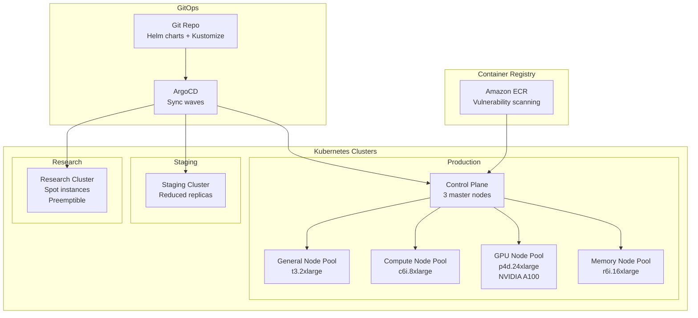

**Node Pool Strategy:**

| Pool | Instance Type | Taints | Workloads |
|------|--------------|--------|-----------|
| **General** | c6i.2xlarge | None | API Gateway, Auth, Config |
| **Compute** | c6i.8xlarge | `compute=true` | Feature Engineering, Backtesting |
| **GPU** | p4d.24xlarge | `nvidia.com/gpu=true` | Inference, Training |
| **High-Memory** | r6i.16xlarge | `memory=true` | ClickHouse, Portfolio Optimizer |
| **Critical** | c6i.4xlarge + dedicated | `critical=true` | Risk Engine, OMS |

**Pod Scheduling:**
- **Anti-affinity:** Critical pods spread across AZs
- **PriorityClasses:** `system-critical` (Risk Engine), `high` (Trading), `normal` (Research), `low` (Batch jobs)
- **Resource quotas:** Per-namespace limits to prevent research from starving trading

**Docker Standards:**
- Base images from `distroless` or `chainguard` (minimal attack surface)
- Multi-stage builds (separate build and runtime)
- Non-root user execution
- Read-only root filesystem
- Images scanned with Trivy before deployment

---

## CI/CD Pipeline

```mermaid
graph LR
    subgraph "Developer"
        DEV[IDE<br/>VSCode/JetBrains]
        GIT[Git Push<br/>Feature Branch]
    end

    subgraph "CI Pipeline<br/>GitHub Actions/GitLab CI"
        LINT[Lint<br/>black, ruff, mypy]
        TEST[Unit Tests<br/>pytest]
        SAST[SAST<br/>SonarQube/Semgrep]
        BUILD[Docker Build<br/>Multi-stage]
        SCAN[Container Scan<br/>Trivy]
        INT[Integration Tests<br/>Docker Compose]
    end

    subgraph "Artifact Store"
        REG[Container Registry<br/>ECR]
        MR[Model Registry<br/>MLflow]
    end

    subgraph "CD Pipeline<br/>ArgoCD"
        STG[Deploy Staging<br/>Helm]
        E2E[E2E Tests<br/>Cypress/k6]
        CANARY[Canary Deploy<br/>10% Traffic]
        PROMOTE[Promote<br/>100% Traffic]
        ROLL[Automatic Rollback<br/>If error rate > 1%]
    end

    subgraph "Production"
        PROD[Production K8s]
    end

    DEV --> GIT
    GIT --> LINT
    LINT --> TEST
    TEST --> SAST
    SAST --> BUILD
    BUILD --> SCAN
    SCAN --> INT
    INT --> REG
    REG --> STG
    STG --> E2E
    E2E --> CANARY
    CANARY --> PROMOTE
    PROMOTE --> PROD
    CANARY -.->|Metrics fail| ROLL
    ROLL -.->|Git revert| GIT
```

**Pipeline Stages:**

1. **Pre-commit:** `pre-commit` hooks (linting, formatting, secrets detection)
2. **Build:** Parallel service builds; layer caching enabled
3. **Unit Test:** >80% coverage required for trading services; mocked external dependencies
4. **SAST:** Static analysis for vulnerabilities and anti-patterns
5. **Integration:** Docker Compose environment with Kafka, Redis, PostgreSQL
6. **Contract Test:** Pact testing for API compatibility between services
7. **Staging:** Deploy to staging cluster; run smoke tests
8. **Canary:** Istio traffic splitting (10% -> 50% -> 100%) with automated promotion based on error rate and latency
9. **Production:** Full deployment with ArgoCD sync wave ordering (infrastructure -> data -> services -> trading)

**Model Deployment (MLOps):**
- Models promoted via MLflow stage transitions
- ArgoCD deploys new Inference Service version with updated model artifact
- Canary model A/B testing (old vs. new) via Istio traffic split
- Automatic rollback if prediction latency increases or accuracy drops

---

## Folder Structure

```
quant-platform/
|-- README.md
|-- LICENSE
|-- SECURITY.md
|-- Makefile
|
|-- .github/                          # CI/CD workflows
|   |-- workflows/
|   |   |-- ci.yaml                   # Lint, test, build
|   |   |-- cd-staging.yaml
|   |   |-- cd-production.yaml
|   |   |-- security-scan.yaml
|   |-- CODEOWNERS
|
|-- docs/                             # Documentation
|   |-- adr/                          # Architecture Decision Records
|   |   |-- 001-event-driven.md
|   |   |-- 002-kafka-vs-pulsar.md
|   |   |-- 003-clickhouse-for-tsdb.md
|   |   |-- 004-multi-agent-design.md
|   |-- runbooks/                     # Operational runbooks
|   |-- api/                          # OpenAPI specs
|   |-- compliance/                 # Regulatory docs
|
|-- proto/                            # Shared protobuf definitions
|   |-- marketdata/
|   |   |-- tick.proto
|   |   |-- bar.proto
|   |-- features/
|   |   |-- feature_vector.proto
|   |-- predictions/
|   |   |-- prediction.proto
|   |-- signals/
|   |   |-- alpha_signal.proto
|   |-- orders/
|   |   |-- order.proto
|   |   |-- execution.proto
|   |-- risk/
|   |   |-- risk_check.proto
|   |-- common/
|   |   |-- timestamp.proto
|   |   |-- error.proto
|
|-- libs/                             # Shared libraries
|   |-- python-sdk/                   # Internal Python SDK
|   |-- go-common/                    # Go utilities
|   |-- rust-core/                    # Rust performance-critical libs
|   |-- schemas/                      # Avro/JSON schemas
|
|-- services/                         # Microservices (mono-repo)
|   |-- api-gateway/
|   |   |-- Dockerfile
|   |   |-- k8s/
|   |   |-- src/
|   |   |-- tests/
|   |
|   |-- auth-service/
|   |-- config-service/
|   |
|   |-- market-data-service/
|   |   |-- adapters/                 # Bloomberg, Refinitiv, etc.
|   |   |-- normalizer/
|   |   |-- publisher/
|   |
|   |-- feature-engineering/
|   |-- feature-store/
|   |   |-- online/                   # Redis client
|   |   |-- offline/                  # S3/Delta Lake client
|   |
|   |-- inference-service/
|   |   |-- models/                   # Model artifacts (git-lfs or S3 refs)
|   |   |-- triton-config/            # Triton model repository
|   |   |-- src/
|   |
|   |-- model-registry/
|   |-- explainability-service/
|   |-- training-orchestrator/
|   |   |-- pipelines/                # Kubeflow/Argo pipeline defs
|   |   |-- experiments/
|   |
|   |-- multi-agent-orchestrator/
|   |-- research-agent/
|   |-- signal-agent/
|   |-- risk-agent/
|   |-- execution-agent/
|   |-- portfolio-agent/
|   |
|   |-- order-management-service/
|   |-- execution-management-service/
|   |-- risk-engine/
|   |-- portfolio-optimizer/
|   |   |-- solvers/                  # OR-Tools, OSQP configs
|   |
|   |-- paper-trading/
|   |-- live-trading-gateway/
|   |   |-- fix/                      # FIX protocol handlers
|   |   |-- rest/                     # REST broker adapters
|   |
|   |-- position-pnl-service/
|   |-- backtesting-engine/
|   |-- strategy-plugin-manager/
|   |   |-- registry/                 # Plugin registry
|   |   |-- sandbox/                  # gVisor/WASM configs
|   |
|   |-- audit-service/
|   |-- monitoring-service/
|   |-- notification-service/
|
|-- infra/                            # Infrastructure as Code
|   |-- terraform/
|   |   |-- modules/
|   |   |   |-- kafka/
|   |   |   |-- kubernetes/
|   |   |   |-- clickhouse/
|   |   |   |-- redis/
|   |   |   |-- vpc/
|   |   |-- environments/
|   |   |   |-- production/
|   |   |   |-- staging/
|   |   |   |-- research/
|   |   |-- global/
|   |
|   |-- helm/
|   |   |-- base/                     # Base Helm chart template
|   |   |-- services/                 # Per-service values
|   |
|   |-- kustomize/
|   |   |-- overlays/
|   |
|   |-- docker/
|   |   |-- base-images/
|   |   |   |-- python-distroless/
|   |   |   |-- go-distroless/
|   |   |   |-- rust-distroless/
|   |   |-- docker-compose/
|   |   |   |-- local-dev.yaml
|   |   |   |-- integration-test.yaml
|
|-- research/                         # Research environment
|   |-- notebooks/
|   |   |-- exploratory/              # Unregulated sandbox
|   |   |-- productionized/             # Reviewed, versioned
|   |-- experiments/
|   |   |-- mlflow-tracking/
|   |-- strategies/
|   |   |-- template/                   # Strategy template
|   |   |-- momentum/
|   |   |-- mean_reversion/
|   |   |-- statistical_arbitrage/
|
|-- tests/
|   |-- e2e/                          # End-to-end tests
|   |-- load/                         # k6/Locust load tests
|   |-- chaos/                        # Chaos engineering (Litmus)
|   |-- fixtures/                     # Test data
|
|-- scripts/
    |-- setup/
    |-- migration/
    |-- operational/
```

---

## Future Expansion Plan

### Phase 1: Foundation (Months 1-6)
- Core event backbone (Kafka)
- Market data ingestion (equities)
- Feature store and basic feature engineering
- OMS/EMS with paper trading
- Risk engine with basic limits
- Backtesting engine (event-driven)
- CI/CD and basic monitoring

### Phase 2: AI Integration (Months 7-12)
- Multi-agent architecture deployment
- Model registry and training pipelines
- GPU inference cluster
- Explainability service
- Portfolio optimizer (mean-variance)
- Strategy plugin architecture

### Phase 3: Scale & Harden (Months 13-18)
- Multi-asset expansion (FX, futures, ETFs)
- Cross-region deployment
- Advanced risk (VaR, CVaR, stress testing)
- Self-learning feedback loops
- Regulatory reporting automation
- Chaos engineering program

### Phase 4: Advanced Capabilities (Months 19-24)
- Alternative data integration (satellite, NLP, credit card)
- Reinforcement learning for execution
- HPC cluster for complex simulations
- Multi-broker smart order routing
- Tax-aware optimization
- ESG integration

### Phase 5: Next-Generation (Year 3+)
- **Quantum Computing:** Portfolio optimization for large universes (QAOA/VQE algorithms)
- **Federated Learning:** Train models across funds without centralizing data
- **Decentralized Finance (DeFi):** On-chain trading strategies, smart contract integration
- **Neuromorphic Hardware:** Ultra-low latency inference for HFT strategies
- **Causal AI:** Move beyond correlation to causal inference for regime detection
- **Generative AI:** Synthetic data generation for rare event simulation
- **Autonomous Research:** Fully automated hypothesis generation, testing, and deployment with human-in-the-loop approval

### Capacity Planning
- **Year 1:** 10,000 events/sec, 100 symbols, 5 strategies
- **Year 2:** 100,000 events/sec, 5,000 symbols, 50 strategies
- **Year 3:** 1,000,000 events/sec, 50,000 symbols, 500 strategies
- **Year 5:** 10,000,000 events/sec, global multi-asset, autonomous operation

---

## Technology Stack Summary

| Layer | Technology | Justification |
|-------|-----------|---------------|
| **Orchestration** | Kubernetes (EKS/GKE) | Industry standard, GPU support, auto-scaling |
| **Service Mesh** | Istio | mTLS, traffic management, observability |
| **Event Streaming** | Apache Kafka | Exactly-once, proven at scale, ecosystem |
| **Stream Processing** | Kafka Streams / Flink | Native Kafka integration, stateful processing |
| **Time-Series DB** | ClickHouse | Columnar, fast aggregations, hedge fund proven |
| **Cache** | Redis Cluster | Sub-millisecond, pub/sub, high availability |
| **Feature Store** | Feast | Training/serving consistency, lineage |
| **Model Serving** | NVIDIA Triton | Multi-framework, GPU optimization, batching |
| **Model Registry** | MLflow | Versioning, staging, experiment tracking |
| **Training** | Kubeflow / Argo Workflows | Pipeline orchestration, resource management |
| **Relational DB** | PostgreSQL + Citus | ACID, horizontal scaling |
| **Data Lake** | S3 + Delta Lake | Cheap, versioned, ACID transactions |
| **Observability** | Prometheus + Grafana + Jaeger | Metrics, logs, traces |
| **Secrets** | HashiCorp Vault | Dynamic secrets, encryption as a service |
| **CI/CD** | GitHub Actions + ArgoCD | GitOps, progressive delivery |
| **API Gateway** | Kong / AWS API Gateway | Plugin ecosystem, rate limiting, auth |
| **Container** | Distroless / Chainguard | Minimal attack surface |

---

## Closing Principles

1. **Determinism is sacred.** The same sequence of events must produce the same result in backtest, paper, and live.
2. **Risk is not a feature; it is the foundation.** The Risk Engine has veto power over every other component.
3. **Observability is not optional.** If you cannot explain why a trade happened, you cannot make that trade.
4. **Scale horizontally, not vertically.** Every component must be capable of running on commodity hardware.
5. **Automation with human oversight.** The system can propose, but critical decisions (kill switches, model promotions) require human approval until fully validated.
6. **Security is architecture, not an afterthought.** Zero-trust from day one.

This blueprint represents the architecture of a platform capable of managing $10B+ with millions of events per second, full auditability, and autonomous operation under human supervision.
